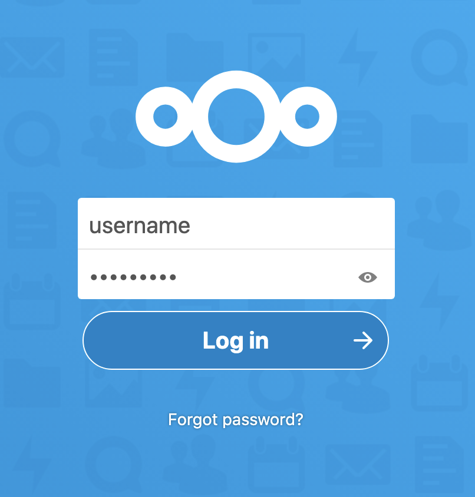
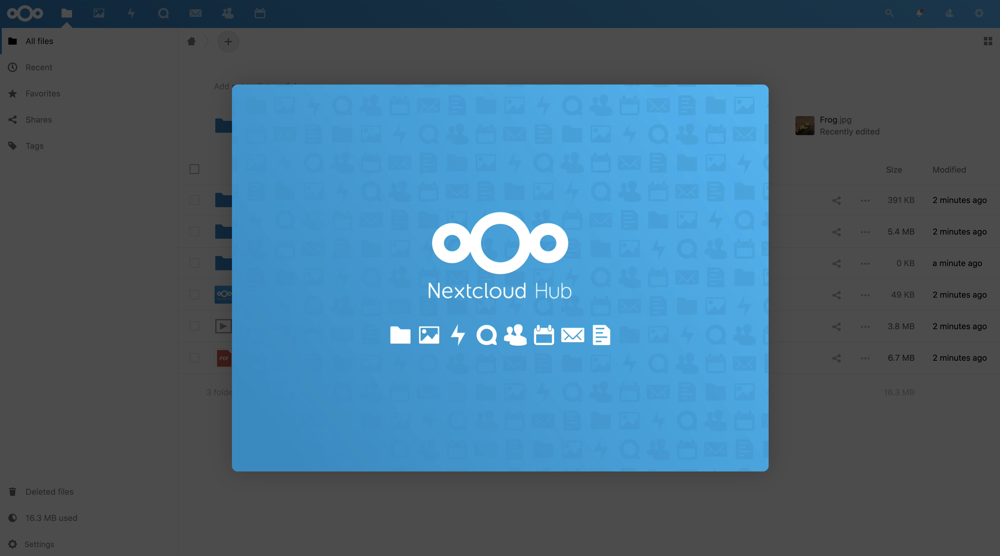

[Nextcloud](https://nextcloud.com/) is an open source solution to file hosting and sharing. With Nextcloud, you can synchronize files from a local computer to the Linode server and share them with collaborators. Nextcloud’s customizable security features and intuitive user interface help to keep files safe and easy to manage.

## Before You Begin

While a Domain Name is not strictly required, it is recommended. If you plan to use a domain name for the deployment, complete the following steps:

1. [Create a Linode API v4 access token](/docs/platform/api/getting-started-with-the-linode-api/#get-an-access-token). The Nextcloud Marketplace App needs a Linode API v4 token to create a domain name system (DNS) record for the Nextcloud instance.

1. Register (purchase) a domain name.

1. Set the domain name to [use Linode’s name servers](/docs/guides/dns-manager/#use-linodes-name-servers-with-your-domain). You need to do this on the domain registrar’s website and then wait up to 24 hours for the change to take effect.

## Deploying the NextCloud Marketplace App



**Software installation should complete within 5-7 minutes after the Linode has finished provisioning.**

## Configuration Options

### NextCloud Options

| **Field** | **Description** |
|-----------|-----------------|
| **The name of the admin user for NextCloud** | The administrator username for nextcloud. This will be used to log in to the application. *Required*. |
| **The password for NextCloud's admin user** | The administrator password. This will be used to log in to the application. *Required*. |
| **MySQL database root password** | The root user's password for the Nextcloud database. *Required*. |
| **MySQL user password** | Your new MySQL user's password. *Required*. |

#### Advanced Options
| **Field** | **Description** |
|-----------|-----------------|
| **The name of the MySQL database** | The name to assign to the Nextcloud instance's MySQL database. If no value is provided, the database is named `nextcloud`. *Required*.|
| **The name of the MySQL user to create** | The name of a new MySQL user to create. If no value is provided, the user is named `nextcloud`. *Required*.|
| **The limited sudo user to be created for the Linode** | The username for a new limited user account with sudo privileges. |
| **The password for the limited sudo user** | The password for the new limited user account. |
| **The SSH Public Key that will be used to access the Linode** | A public key belonging to the user that accesses the Linode. If you do not have an authentication key-pair see the [Securing Your Server](/docs/security/securing-your-server/#create-an-authentication-key-pair) guide for steps on creating one. |
| **Disable root access over SSH** | Disable root user access for the Linode server. |
| **Your Linode API token** | The [Linode API v4](https://developers.linode.com/api/v4) token is required to create a domain name system (DNS) record for the Nextcloud instance. See the [Getting Started with the Linode API](/docs/platform/api/getting-started-with-the-linode-api/#get-an-access-token) guide to learn how to generate an API token. |
| **The domain for the Linode's DNS record (Requires API token)** | The hostname to assign to the Linode server. If no value is provided, the hostname is set as `nextcloud`.|
| **The subdomain for the Linode's DNS record (Requires API token)** | The domain name to use when creating a DNS record for the Linode. The Marketplace app creates a subdomain named `nextcloud`. You can access the Nextcloud instance using the `nextcloud` subdomain; for example, `www.nextcloud.example.com`. |
| **Admin email for the NextCLoud server** | The email address to use for the Nextcloud instance's admin user. |
| **Would you like to use a free Let's Encrypt SSL certificate? (Requires domain)** |  Enable a free [HTTPS CertBot SSL certificate](https://certbot.eff.org/) on the Nextcloud domain. If you do not provide a value, `no` is set by default. |

### General Options

For advice on filling out the remaining options on the **Create a Linode** form, see [Getting Started > Create a Linode](/docs/guides/getting-started/#create-a-linode). That said, some options may be limited or recommended based on this Marketplace App:

- **Supported distributions:** Debian 10
- **Recommended minimum plan:** All plan types and sizes can be used.

## Getting Started after Deployment

### Log Into Your Nextcloud Instance

1. Open a browser window and navigate to the NextCloud instance's domain. For example, enter `nextcloud.example.com` into the browser, replacing `example.com` with the value of your own domain. If you do not install the App with a domain name, the domain is the public IP address of the Linode appended with a forward slash and "nextcloud. For example, `192.168.17.43/nextcloud/`.

1. Enter the administrator username and password set during initial app creation in the presented form.

      

1. Once you have successfully logged in, the Nextcloud Hub page appears where you can upload files to the Nextcloud server.

      

## Next Steps



- [Configure Nextcloud to use Linode Object Storage as an External Storage Mount](/docs/platform/object-storage/how-to-configure-nextcloud-to-use-linode-object-storage-as-an-external-storage-mount/).  You can use Object Storage as a secondary place to store your Nextcloud files. Using Linode Object Storage to store files prevents you from running out of storage space that is limited by your Linode's plan size.
- Install the [Nextcloud desktop synchronization client](https://docs.nextcloud.com/desktop/2.3/installing.html) on a local computer to easily synchronize the desktop files to the Nextcloud server.

