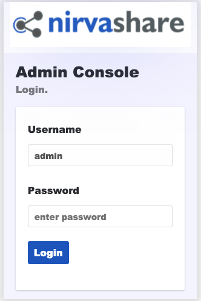
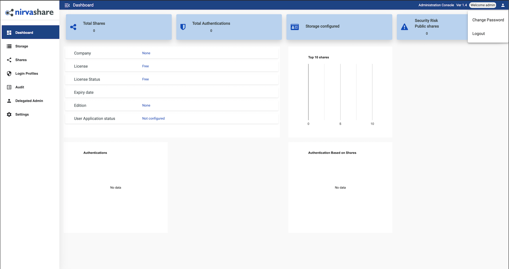

NirvaShare is a simplified and secure enterprise file sharing solution built on top of your existing file storage. Use NirvaShare with SFTP, local storage, or even S3-compatible storage like Linode's [Object Storage](https://www.linode.com/products/object-storage/). Collaborate with your internal or external users such as customers, partners, and vendors. NirvaShare provides fine-tuned access control in a very simplified manner. NirvaShare integrates with multiple many external identity providers such as Active Directory, GSuite, AWS SSO, KeyClock, and others.

## Deploying the NirvaShare Marketplace App



**Software installation should complete within 5-10 minutes after the Linode has finished provisioning.**

## Configuration Options

### NirvaShare Configuration Options

You can configure your NirvaShare App by providing values for the following fields:

| **Field** | **Description** |
|:--------------|:------------|
| **Database Password** | The database password for NirvaShare. *Required*. |

### General Options

For advice on filling out the remaining options on the **Create a Linode** form, see [Getting Started > Create a Linode](/docs/guides/getting-started/#create-a-linode). That said, some options may be limited or recommended based on this Marketplace App:

- **Supported distributions:** Ubuntu 20.04 LTS
- **Recommended minimum plan:** All plan types and sizes can be used.

## Getting Started after Deployment

After NirvaShare has finished installing, you can access your NirvaShare instance by visiting your [Linode's IP address](/docs/quick-answers/linode-platform/find-your-linodes-ip-address/) at port 8080. (for example, `http://192.0.2.0:8080`)

Once you visit the NirvaShare IP address you will be prompted with a Login page, you can enter `admin` as the *username* and `admin` as the *password*.

From here, you will want to change the default admin password, you can do so clicking the icon at the top right of the dashboard and select *Change Password* option as shown in the image below:

Now that you’ve accessed your dashboard, checkout [the official NirvaShare documentation](https://nirvashare.com/setup-guide/) to learn how to further configure your instance.

