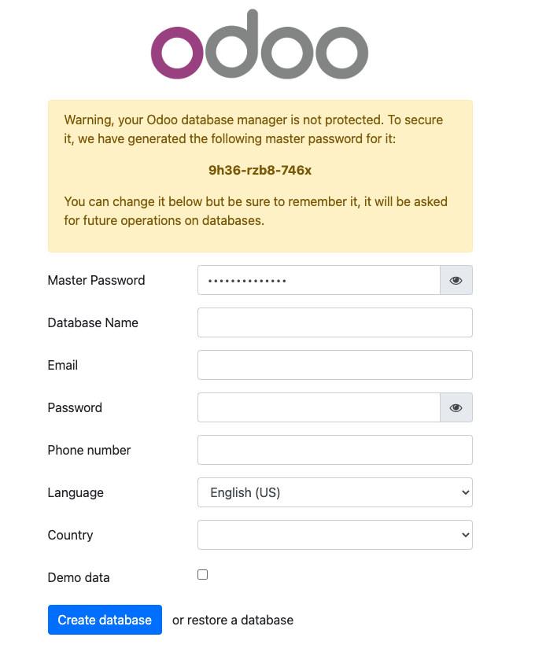

[Odoo](https://www.odoo.com/) (formerly known as OpenERP) is a self-hosted suite of over 10,000 open source applications for a variety of business needs, including CRM, eCommerce, accounting, inventory, point of sale, and project management. These applications are all fully integrated and can be installed and accessed through a web interface, making it easy to automate and manage your company’s processes.

## Deploying the Odoo Marketplace App



**Software installation should complete within 5-10 minutes after the Linode has finished provisioning.**

## Configuration Options

### Odoo Options

Here are the additional options available for this Marketplace App:

| **Field** | **Description** |
|:--------------|:------------|
| **Admin Email for the server** | This email is require to generate the SSL certificates. *Required* |
| **Postgres Password for the Odoo user** | This is the password for the Odoo database user. *Required* |
| **Your Linode API Token** | Your Linode `API Token` is needed to create DNS records. If this is provided along with the `subdomain` and `domain` fields, the installation attempts to create DNS records via the Linode API. If you don't have a token, but you want the installation to create DNS records, you must [create one](/docs/platform/api/getting-started-with-the-linode-api/#get-an-access-token) before continuing. |
| **Subdomain** | The subdomain you wish the installer to create a DNS record for during setup. The suggestion given is `www`. The subdomain should only be provided if you also provide a `domain` and `API Token`. |
| **Domain** | The domain name where you wish to host your Odoo instance. The installer creates a DNS record for this domain during setup if you provide this field along with your `API Token`. |
| **The limited sudo user to be created for the Linode** | This is the limited user account to be created for the Linode. This account has sudo user privileges. |
| **The password for the limited sudo user** | Set a password for the limited sudo user. The password must meet the complexity strength validation requirements for a strong password. This password can be used to perform any action on your server, similar to root, so make it long, complex, and unique. |
| **The SSH Public Key that will be used to access the Linode** | If you wish to access [SSH via Public Key](/docs/security/authentication/use-public-key-authentication-with-ssh/) (recommended) rather than by password, enter the public key here. |
| **Disable root access over SSH?** | Select `Yes` to block the root account from logging into the server via SSH. Select `No` to allow the root account to login via SSH. |

### General Options

For advice on filling out the remaining options on the **Create a Linode** form, see [Getting Started > Create a Linode](/docs/guides/getting-started/#create-a-linode). That said, some options may be limited or recommended based on this Marketplace App:

- **Supported distributions:** Ubuntu 20.04 LTS
- **Recommended plan:** All plan types and sizes can be used.

## Getting Started after Deployment

### Accessing the Odoo App

1.  Open a browser and navigate to the domain you created in the beginning of your deployment. You can also use your Compute Instance's rDNS, which may look like `123-0-123-0.ip.linodeusercontent.com`. See the [Managing IP Addresses](/docs/guides/managing-ip-addresses/) guide for information on viewing and setting the rDNS value.

1.  The Odoo setup page will appear, you will need to fill out the requested fields with your information. Please note that the Database will be 'odoo' 

    

Now that you’ve accessed your dashboard, check out [the official Odoo documentation](https://www.odoo.com/page/docs) to learn how to further utilize your Odoo instance.

