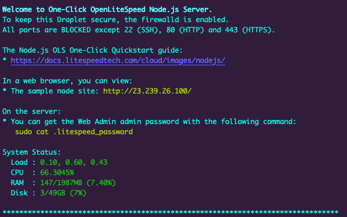

The OpenLiteSpeed Node.js One-Click app automatically installs performance web server OpenLiteSpeed, and Node.js. This image tends to be more than 4 times faster than Node.js with Nginx! OpenLiteSpeed features easy setup for SSL and RewriteRules. OLS is flexible and also supports Python and Ruby apps, as well as CMSs like WordPress.

## Deploying the Node.js OpenLiteSpeed Marketplace App



**Software installation should complete within 10-15 minutes after the Linode has finished provisioning.**

## Configuration Options

For advice on filling out the remaining options on the **Create a Linode** form, see [Getting Started > Create a Linode](/docs/guides/getting-started/#create-a-linode). That said, some options may be limited or recommended based on this Marketplace App:

- **Supported distributions:** CentOS 7, CentOS 8, Ubuntu 18.04 LTS, Ubuntu 20.04 LTS
- **Recommended plan:** All plan types and sizes can be used.

## Getting Started after Deployment

### Accessing the NodeJS OpenLiteSpeed App

1. Once your OpenLiteSpeed NodeJS app has finished its installation, open a terminal and you will see a prompt as shown in the image below:

    

2. You will be prompted to enter the domain you'd like to use for this instance. You will want to ensure that you have assigned the domain to your Linode. If you would like to utilize the IP address or default RDNS of the Linode, you can skip this by pressing *CTRL+C* in the terminal.
       
    For more documentation on how to assign a domain to your Linode, please review the [DNS Manager](/docs/guides/dns-manager/) guide for instructions on setting up your DNS records in the Cloud Manager, and read through [DNS Records: An Introduction](/docs/guides/dns-records-an-introduction/) for general information about how DNS works.
       

Now that you’ve accessed your Node.js OpenLiteSpeed instance, checkout [the official Node.js OpenLiteSpeed documentation](https://docs.litespeedtech.com/cloud/images/nodejs/) to learn how to further configure your Node.js OpenLiteSpeed instance.

