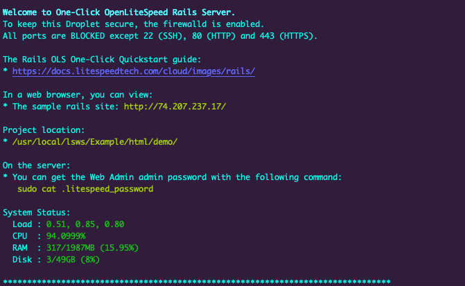

The OpenLiteSpeed Rails app automatically installs the performance web server OpenLiteSpeed, Ruby, and Rails. OpenLiteSpeed features easy setup for SSL and RewriteRules. It is flexible and also supports Python and Node.js apps, as well as CMS software like WordPress.

## Deploying the OpenLiteSpeed Rails Marketplace App



**Software installation should complete within 20-25 minutes after the Linode has finished provisioning.**

## Configuration Options

For advice on filling out the remaining options on the **Create a Linode** form, see [Getting Started > Create a Linode](/docs/guides/getting-started/#create-a-linode). That said, some options may be limited or recommended based on this Marketplace App:

- **Supported distributions:** CentOS 7, Ubuntu 18.04 LTS, Ubuntu 20.04 LTS
- **Recommended plan:** All plan types and sizes can be used.

## Getting Started after Deployment

### Accessing the OpenLiteSpeed Rails App

1.  Log in to your Compute Instance over SSH. See [Connecting to a Remote Server Over SSH
](/docs/guides/connect-to-server-over-ssh/) for assistance. You should see output similar to the following:

    

1.  You are then prompted to enter the domain you'd like to use for this instance. You can optionally use a custom domain provided you've already configured the *A Records* to point to this server's IPv4 and IPv6 addresses. Otherwise, you can skip this by pressing *CTRL+C* which will use the IP address or default RDNS of the Compute Instance.

    
For more documentation on how to assign a domain to your Linode, please review the [DNS Manager](/docs/guides/dns-manager/) guide for instructions on setting up your DNS records in the Cloud Manager, and read through [DNS Records: An Introduction](/docs/guides/dns-records-an-introduction/) for general information about how DNS works.
    

Now that you’ve accessed your OpenLiteSpeed Rails instance, check out [the official OpenLiteSpeed Rails documentation](https://docs.litespeedtech.com/cloud/images/rails/) to learn how to further configure your OpenLiteSpeed Rails instance.

