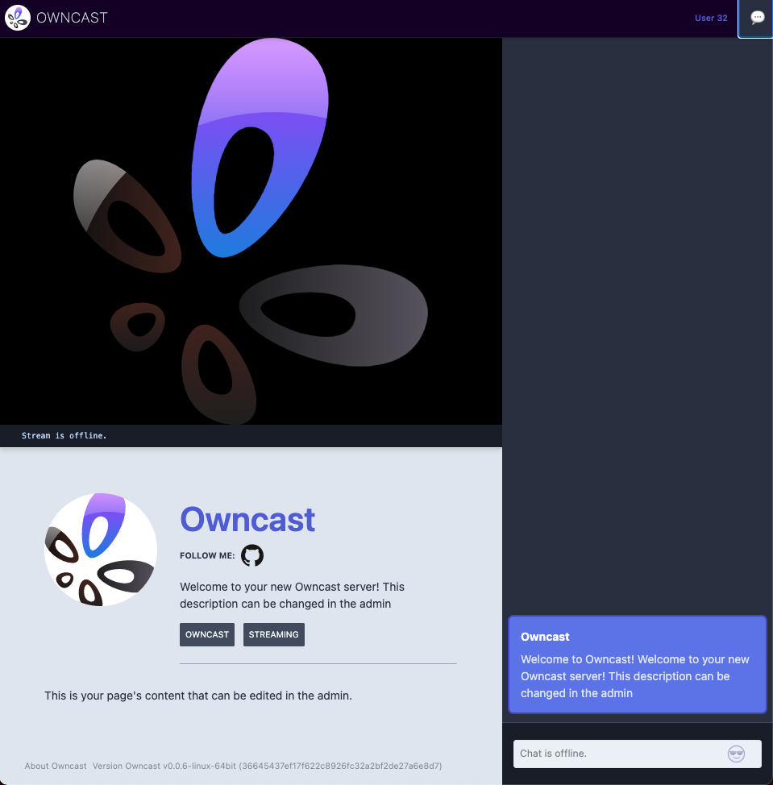

Owncast is a self-hosted, "Twitch in a box" live streaming and chat server for use with popular broadcasting software such as OBS. You can use Owncast to live stream anything from gaming with your friends to live events for you and your clients. Like other popular streaming platforms, you can use Owncast's APIs to build things such as chat bots and and stream overlays to drive further audience engagement.

## Deploying the Owncast Marketplace App



**Software installation should complete within 2-5 minutes after the Linode has finished provisioning.**

## Configuration Options

### Owncast Options

Here are the additional options available for this Marketplace App:

- **Hostname** *(optional)*: Your public hostname for your Owncast server. Required for SSL.
- **Email** *(optional)*: Your email address for configuring SSL. *Advanced Configuration*.

### General Options

For advice on filling out the remaining options on the **Create a Linode** form, see [Getting Started > Create a Linode](/docs/guides/getting-started/#create-a-linode). That said, some options may be limited or recommended based on this Marketplace App:

- **Supported distributions:** Debian 10
- **Recommended plan:** All plan types and sizes can be used with Owncast.

## Getting Started after Deployment

### Access your Owncast App

After Owncast has finished installing, you can access your server with your Linode's IPv4 address. Copy your Linode’s IPv4 address from the [Linode Cloud Manager](https://cloud.linode.com), and then connect to the server from your browser using your Linode's IPv4 address and port `8080`(for example `192.0.2.0:8080`).

With Owncast running, you can begin to configure your new server. Visit the Admin settings, located at `/admin` (for example `192.0.2.0:8080/admin`). Visit the [Configuration Instructions](https://owncast.online/docs/configuration/?source=linodemarketplace) to learn how you can change your video settings, web page content, and more.

On the server, Owncast is installed in the  `/opt/owncast` directory. You'll find all your data files there. This is also where you can upgrade your Owncast server in the future.


