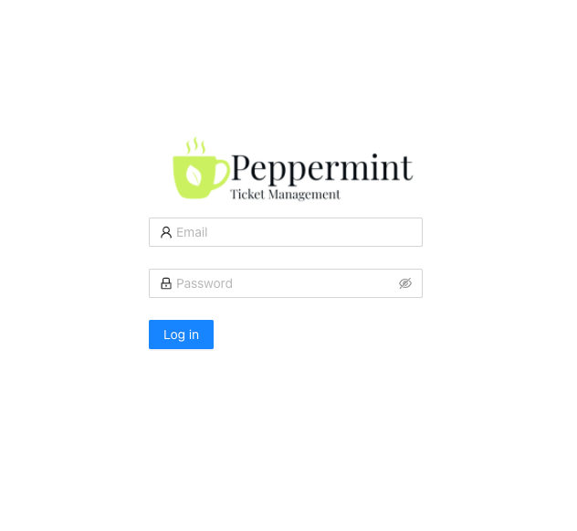
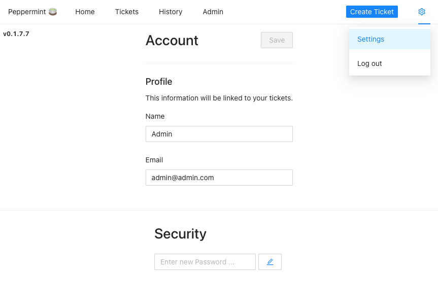

Peppermint Ticket Management is a ticket management system that allows teams and solo users the ability create & track tickets, todo items, and more. The project is meant to provide help desks and services desks manage internal and customer requests, but Peppermint is a good solution for anyone looking for a ticket management system that is free and easy to use.


Peppermint is still in Alpha and is not recommended for production use yet.


## Deploying the Peppermint Marketplace App



**Software installation should complete within 2-5 minutes after the Linode has finished provisioning.**

## Configuration Options

For advice on filling out the remaining options on the **Create a Linode** form, see [Getting Started > Create a Linode](/docs/guides/getting-started/#create-a-linode). That said, some options may be limited or recommended based on this Marketplace App:

- **Supported distributions:** Debian 10
- **Recommended plan:** All plan types and sizes can be used.

## Getting Started after Deployment

### Access your Peppermint App

After Peppermint has finished installing, you can access your Peppermint server with your Linode's IPv4 address. Copy your Linode’s IPv4 address from the [Linode Cloud Manager](https://cloud.linode.com), and then connect to the server in your browser using your Linode's IPv4 address and port `5000`(for example `192.0.2.0:5000`).

The default credentials to login to your Peppermint Peppermint Ticket Management Panel are:

    email: admin@admin.com
    password: 1234

Once you login to the Peppermint Ticket Management Panel, you need to update the email and password you used to log in. You can do so by clicking the settings gear logo in the top right corner.

For more on Peppermint, consult the following resources:

- [Peppermint Github](https://github.com/Peppermint-Lab/Peppermint/blob/master/README.md)
- [Peppermint Documentation](https://docs.peppermint.sh/)

