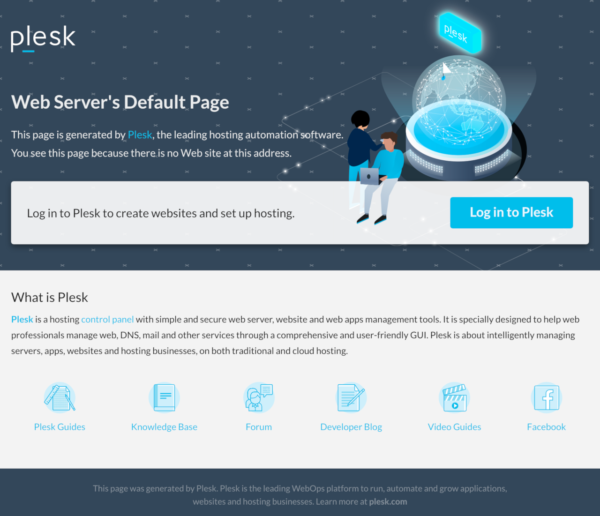
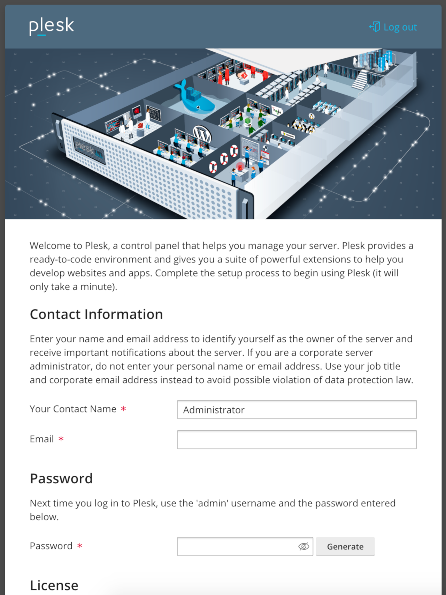
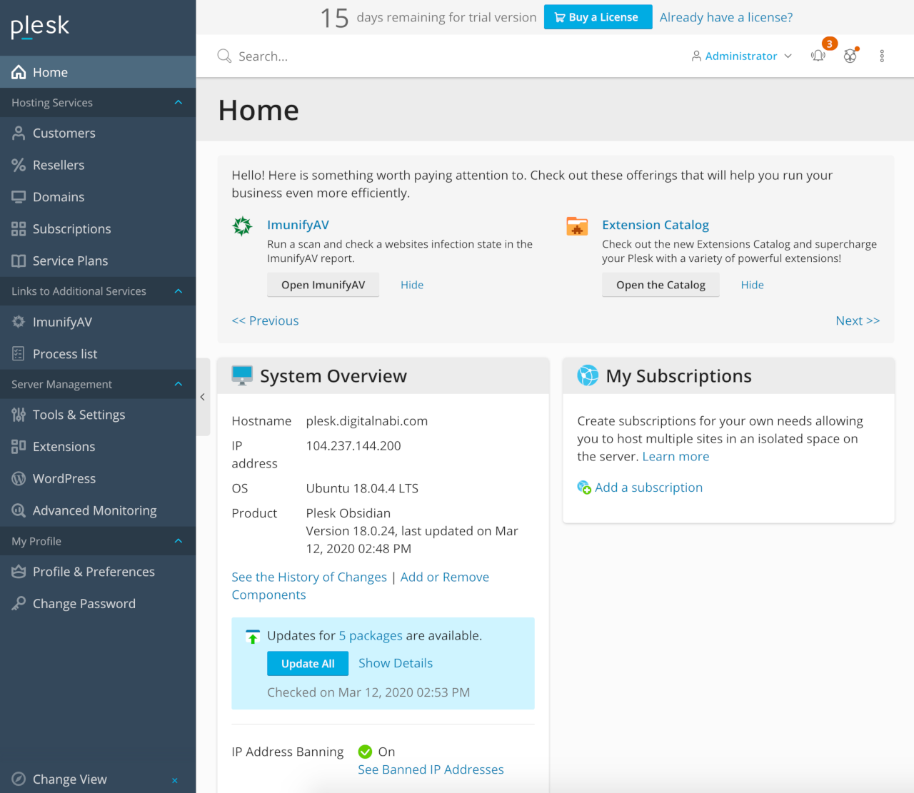

[Plesk](https://www.plesk.com) is a leading WordPress and website management platform and control panel. Plesk lets you build and manage multiple websites from a single dashboard to configure web services, email, and other applications. Plesk features hundreds of extensions, plus a complete WordPress toolkit. Use the Plesk Marketplace App to manage websites hosted on your Linode.

## Deploying the Plesk Marketplace App



**Software installation should complete within 15 minutes after the Linode has finished provisioning.**

## Configuration Options

### Plesk Options

You can configure your Plesk App by providing values for the following fields:

| **Field** | **Description** |
|:----------------|:------------|
| **Server Name** | Domain name for your server in the format servername.domain.com. Setting a value in this field will not also enable DNS for your app, which you should do as well. Read our [DNS Manager](/docs/guides/dns-manager/) guide for instructions on creating DNS records in the Linode Cloud Manager. *Required*. |

### General Options

For advice on filling out the remaining options on the **Create a Linode** form, see [Getting Started > Create a Linode](/docs/guides/getting-started/#create-a-linode). That said, some options may be limited or recommended based on this Marketplace App:

- **Supported distributions:** CentOS 7, Ubuntu 18.04 LTS, and Ubuntu 16.04 LTS
- **Recommended minimum plan:** All plan types and sizes can be used.

## Getting Started after Deployment

### Access your Plesk Site

After Plesk has finished installing, you will be able to access your Plesk site over `https://` with your Linode's IPv4 address, or the domain name entered when deploying your Marketplace App:


Plesk is installed with a self-signed certificate which may result in an warning in some browsers. While this certificate stills provides TLS encryption, and is therefore recommended in favor of accessing Plesk over port 80, it will not be trusted by external resources as it is not verified by an external Certificate Authority.


1.  Access your Plesk app:

    **With your Linode's IP Address**

    You will be able to access your Plesk app by copying your Linode's IPv4 address and entering it in the browser of your choice. To find your Linode's IPv4 address:

    1. Click on the **Linodes** link in the sidebar. You will see a list of all your Linodes.

    1. Find the Linode you just created when deploying your app and select it.

    1. Navigate to the **Networking** tab.

    1. The IP address will be displayed under the **Address** column in the **IPv4** table.

    1. Copy and paste the IPv4 address into a browser window. You should see the Plesk welcome page appear.

        

    **With a Domain Name**

    If you deployed your Plesk Marketplace App with a domain name and it is pointing to the Linode's IP address that is hosting your Plesk instance, then you can enter the domain name in a browser window to access your Plesk site. Ensure you are using `http://`.

    For more details on registering your domain, see the [DNS Manager](/docs/guides/dns-manager/) guide.

1.  Once you have accessed your Plesk app via the browser, you can log in using the admin credentials you created when deploying your app. This will be `root` for the username and the root password for the server. Then, begin configuring your site.

    

1.  After logging in you will be asked to setup an account. Here you will enter your `Contact Name`, `Email address`, `Password`, and choose a license agreement.

    

1.  After your account is setup you'll be signed into your dashboard and can get started.

    


