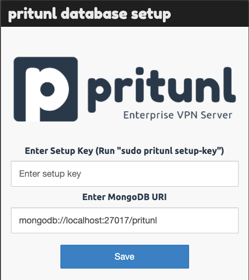
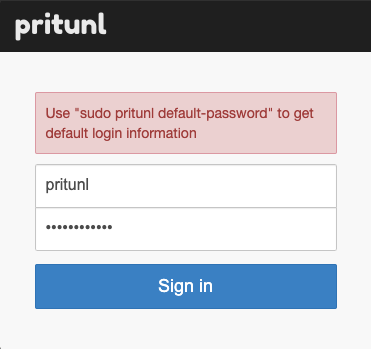
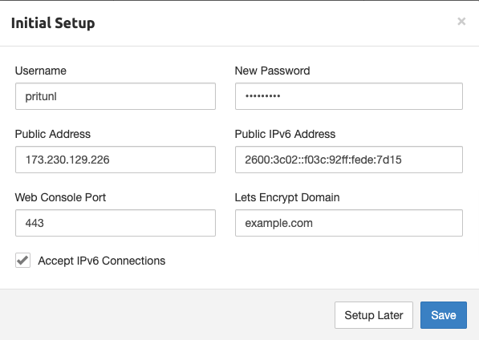

Pritunl is an open source VPN server and management panel. It gives the user the power of the OpenVPN protocol while using an intuitive web interface. This tutorial will show you how to install, configure, and connect to Pritunl VPN.

## Deploying the Pritunl Marketplace App



**Software installation should complete within 2-5 minutes after the Linode has finished provisioning.**

## Configuration Options

### Pritunl Options

Here are the additional options available for this Marketplace App:

| **Field** | **Description** |
|:--------------|:------------|
| **The limited sudo user to be created for the Linode** | This is the limited user account to be created for the Linode. This account has sudo user privileges. |
| **The password for the limited sudo user** | Set a password for the limited sudo user. The password must meet the complexity strength validation requirements for a strong password. This password can be used to perform any action on your server, similar to root, so make it long, complex, and unique. |
| **The SSH Public Key that will be used to access the Linode** | If you wish to access [SSH via Public Key](/docs/security/authentication/use-public-key-authentication-with-ssh/) (recommended) rather than by password, enter the public key here. |
| **Disable root access over SSH?** | Select `Yes` to block the root account from logging into the server via SSH. Select `No` to allow the root account to login via SSH. |
| **Your Linode API Token** | Your Linode `API Token` is needed to create DNS records. If this is provided along with the `subdomain` and `domain` fields, the installation attempts to create DNS records via the Linode API. If you don't have a token, but you want the installation to create DNS records, you must [create one](/docs/platform/api/getting-started-with-the-linode-api/#get-an-access-token) before continuing. |
| **Subdomain** | The subdomain you wish the installer to create a DNS record for during setup. The suggestion given is `www`. The subdomain should only be provided if you also provide a `domain` and `API Token`. |
| **Domain** | The domain name where you wish to host your Pritunl instance. The installer creates a DNS record for this domain during setup if you provide this field along with your `API Token`. |
| **Admin Email for the server** | The start of authority (SOA) email address for this server. This email address will be added to the SOA record for the domain. This is a required field if you want the installer to create DNS records. |

### General Options

For advice on filling out the remaining options on the **Create a Linode** form, see [Getting Started > Create a Linode](/docs/guides/getting-started/#create-a-linode). That said, some options may be limited or recommended based on this Marketplace App:

- **Supported distributions:** Ubuntu 20.04 LTS, Debian 10
- **Recommended plan:** All plan types and sizes can be used.

## Getting Started after Deployment

### Accessing the Pritunl App

To access your Pritunl instance, Open a browser and navigate to the domain you created in the beginning of your deployment or the IP address of the Linode server. For example, `https://203.0.113.0 `, replacing the IP address with values for the Linode server and accept the self-signed certificate.


In Chrome, you can accept the self-signed certificate by clicking on Advanced and then click Proceed to <ip> (unsafe). In Firefox, click on Advanced, then Add Exception and then Confirm Security Exception. 

From there you will see the Pritunl Database Setup screen where you can run the command below to obtain your setup key:

     sudo pritunl setup-key

Once the setup key has been entered, you can run the command below to obtain the default login information:

    sudo pritunl default-password

Now that you're logged in, you can change the default password and enter the domain information so Pritunl can setup the SSL certificates automatically:

Now that you’ve accessed your dashboard, checkout [the official Pritunl documentation](https://docs.pritunl.com/docs/connecting) to learn how to add users and further utilize your Pritunl instance.

