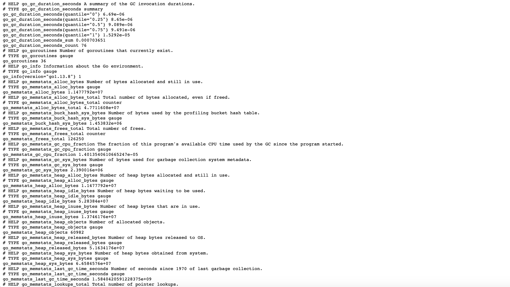

Use [Prometheus](https://prometheus.io/docs/introduction/overview/) to collect metrics and receive alerts with this open-source monitoring tool. Prometheus monitors targets that you define at given intervals by scraping their metrics HTTP endpoints. This tool is particularly well-suited for numeric time series data, which makes it ideal for machine-centric monitoring as well as monitoring of highly dynamic service-oriented architectures.

## Deploying the Prometheus Marketplace App



**Software installation should complete within 2-5 minutes after the Linode has finished provisioning.**

## Configuration Options

For advice on filling out the remaining options on the **Create a Linode** form, see [Getting Started > Create a Linode](/docs/guides/getting-started/#create-a-linode). That said, some options may be limited or recommended based on this Marketplace App:

- **Supported distributions:** Debian 9
- **Recommended minimum plan:** 4GB Dedicated CPU or Shared Compute Instance

## Getting Started after Deployment

## Access Your Prometheus Instance

Now that your Prometheus Marketplace App is deployed, you can log into Prometheus to access its [expression browser](https://prometheus.io/docs/prometheus/latest/getting_started/#using-the-graphing-interface), alerts, status, and more.

1. Open a browser and navigate to `http://192.0.2.0:9090/`. Replace `192.0.2.0` with your [Linode's IP address](/docs/quick-answers/linode-platform/find-your-linodes-ip-address/). This will bring you to your Prometheus instance's expression browser.

1. Verify that Prometheus is serving metrics by navigating to `http://192.0.2.0:9090/metrics`. Replace `192.0.2.0` with your [Linode's IP address](/docs/quick-answers/linode-platform/find-your-linodes-ip-address/). You should see a page of metrics similar to the example below.

    

1. [Grafana](https://grafana.com/), the open source analytics and metric visualization tool, supports querying Prometheus. Consider [deploying a Grafana instance with Marketplace Apps](/docs/platform/marketplace/how-to-deploy-grafana-with-marketplace-apps/) to [create visualizations for your Prometheus metrics](https://prometheus.io/docs/visualization/grafana/#using).

### Prometheus Default Settings

- Prometheus' main configuration is located in the `/etc/prometheus/prometheus.yml` file.
- This file includes a scrape configuration for Prometheus itself.
- The [scraping interval](https://prometheus.io/docs/prometheus/latest/configuration/configuration/#scrape_config) and evaluation interval are configured globally to be `15s`. The `scrape_interval` parameter defines the time between each Prometheus scrape, while the `evaluation_interval` parameter is the time between each evaluation of [Prometheus' alerting rules](https://prometheus.io/docs/prometheus/latest/configuration/alerting_rules/).
- The [Prometheus Node Exporter](https://github.com/prometheus/node_exporter) is added and enabled. This [third-party system exporter](https://prometheus.io/docs/instrumenting/exporters/) is used to collect hardware and OS metrics. Your Node Exporter metrics are sent to port `9100` of your Linode.


