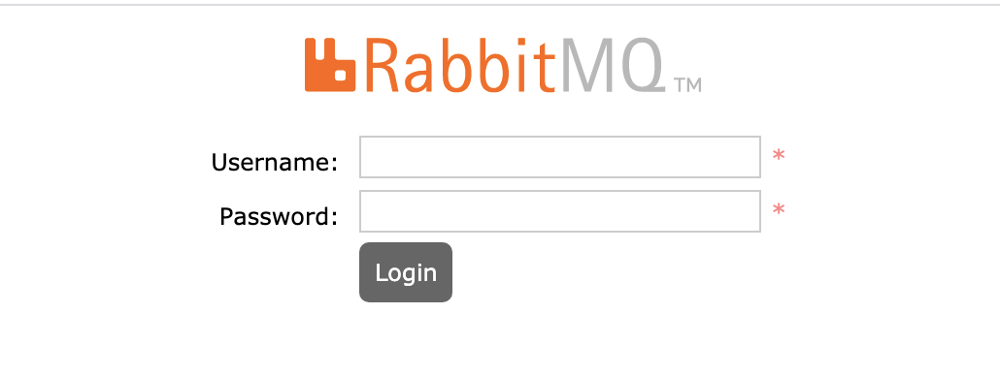
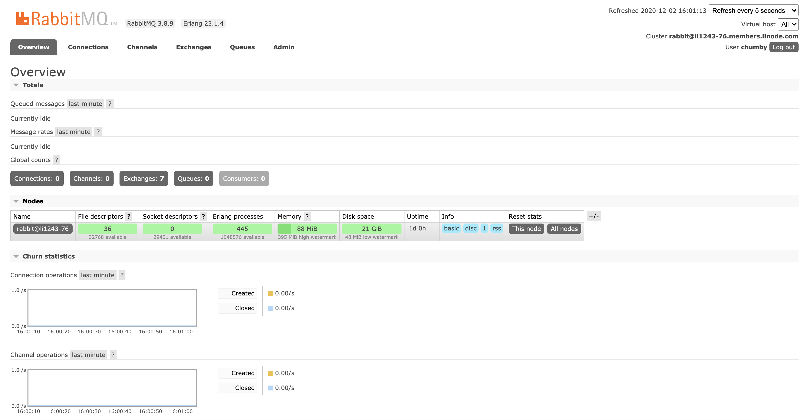

RabbitMQ is a popular open source **message broker**, or a tool that enables and empowers components of a system to communicate from a centralized source or application. By "translating" data from a number of different sources into a unified language, RabbitMQ allows component services to interact with each other through a centralized method.

The RabbitMQ Marketplace App installs a RabbitMQ server and a basic default configuration to assist with messaging tasks. By accessing The RabbitMQ Management console, you can further configure RabbitMQ and view important analytics at any time.

## Deploying the RabbitMQ Marketplace App



**Software installation should complete within 1-3 minutes after the Linode has finished provisioning.**

## Configuration Options

### RabbitMQ Options

The following configuration options create a secure [Limited User](/docs/security/basics/securing-your-server/#add-a-limited-user-account) to run the RabbitMQ Media Server.

| **Configuration** | **Description** |
|--------------|------------|
| **RabbitMQ Username** | The [username](/docs/security/basics/securing-your-server/#add-a-limited-user-account) for accessing the rabbitMQ management console. *Required*. |
| **RabbitMQ Password** | The user password for SSH access to the Linode. *Required*. |

### General Options

For advice on filling out the remaining options on the **Create a Linode** form, see [Getting Started > Create a Linode](/docs/guides/getting-started/#create-a-linode). That said, some options may be limited or recommended based on this Marketplace App:

- **Supported distributions:** Debian 10
- **Recommended minimum plan:** All plan types and sizes can be used.

## Getting Started After Deployment

After the RabbitMQ Server has been deployed, you can access the management console by entering the [public IPv4 address](/docs/guides/find-your-linodes-ip-address/) of the Linode followed by port `15672`:

        https://203.0.113.0:15672

The following login page appears:

To log in, enter the `RabbitMQ username` and `RabbitMQ Password` set as a [configuration option](#RabbitMQ-Marketplace-App-Options) before you created the server. After you login successfully, you have full access to the RabbitMQ Management Console.

## Software Included

The RabbitMQ Marketplace App installs the following required software on the Linode:

| **Software** | **Description** |
|:--------------|:------------|
| [**RabbitMQ Server**](https://www.rabbitmq.com/download.html) | The RabbitMQ server software is an Open Source Message broker, used to assist component services to communicate. |



