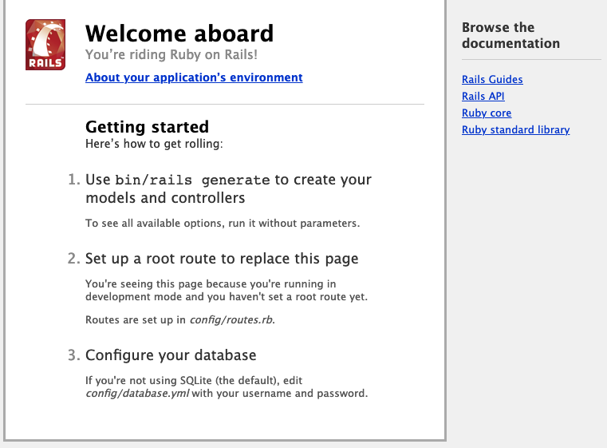

[Ruby on Rails](http://rubyonrails.org/) is a server-side web application framework that allows web designers and developers to implement dynamic, fully featured web applications.

## Deploying the Ruby on Rails Marketplace App



**Software installation should complete within 2-5 minutes after the Linode has finished provisioning.**

## Configuration Options

### Ruby on Rails Options

You can configure your Ruby on Rails App by providing values for the following fields:

| **Field** | **Description** |
|:--------------|:------------|
| **Rails Application name** | The name for your rails application. *Required*. |

### General Options

For advice on filling out the remaining options on the **Create a Linode** form, see [Getting Started > Create a Linode](/docs/guides/getting-started/#create-a-linode). That said, some options may be limited or recommended based on this Marketplace App:

- **Supported distributions:** Debian 9
- **Recommended minimum plan:** All plan types and sizes can be used.

## Getting Started after Deployment

### Access Ruby on Rails

After Ruby on Rails has finished installing, you will be able to access Ruby on Rails from the console via ssh with your Linode's IPv4 address:

1.  [SSH into your Linode](/docs/getting-started/#connect-to-your-linode-via-ssh) and [create a limited user account](/docs/security/securing-your-server/#add-a-limited-user-account).

1.  Log out and log back in as your limited user account.

1.  Update your server:

        sudo apt-get update && apt-get upgrade

1.  Ruby comes with some pre-made scripts to get you started. One of these is a blog. To begin with the blog example, use the following command:

        rails new blog

    This creates a new Rails application called Blog in the `blog` directory.

1.  Move into the `blog` directory:

        cd blog

1.  Start the built in server with the following command, replacing the IP address with your Linode's IP address:

        rails server --binding=198.51.100.0

    
Warning: Running `gem pristine --all` to regenerate your installed gemspecs (and deleting then reinstalling your bundle if you use bundle --path) will improve the startup performance of Spring.
=> Booting WEBrick
=> Rails 4.2.7.1 application starting in development on http://198.51.100.0:3000
=> Run `rails server -h` for more startup options
=> Ctrl-C to shutdown server
[2020-03-11 14:17:16] INFO  WEBrick 1.3.1
[2020-03-11 14:17:16] INFO  ruby 2.3.3 (2016-11-21) [x86_64-linux-gnu]
[2020-03-11 14:17:16] INFO  WEBrick::HTTPServer#start: pid=3089 port=3000


1.  You can visit your application by visiting the address in the browser.

    

1.  Exit the server process with **Ctrl+C**.

## Create a Controller and View

A controller will receive requests which are then routed and served by various actions. A view displays information.

1.  Create a controller called `Welcome` and an action called `index`:

        rails generate controller Welcome index

    
create  app/controllers/welcome_controller.rb
route   get 'welcome/index'
invoke  erb
create    app/views/welcome
create    app/views/welcome/index.html.erb
invoke  test_unit
create    test/controllers/welcome_controller_test.rb
invoke  helper
create    app/helpers/welcome_helper.rb
invoke    test_unit
invoke  assets
invoke    coffee
create      app/assets/javascripts/welcome.coffee
invoke    scss
create      app/assets/stylesheets/welcome.scss


1.  With the text editor of your choice, edit the file `app/views/welcome/index.html.erb` and replace the contents with the following:

    
<h1>Hello, World! This is Ruby on Rails!</h1>


1.  Tell Rails where to find the document root. Edit the file `config/routes.rb`, find and uncomment the line root as shown:

    
Rails.application.routes.draw do
  get 'welcome/index'

...

  root 'welcome#index'

...
end


1.  Start the server again:

        rails server --binding=198.51.100.0

    You should see your new welcome page in the web browser.

For more information on setting up a more substantial application, refer to the [Ruby on Rails Getting Started Guide](https://guides.rubyonrails.org/getting_started.html).

## Next Steps



For more on Ruby on Rails, checkout the following guides:

- [Ruby on Rails with NGINX on Debian](/docs/development/ror/ruby-on-rails-nginx-debian/)
- [Ruby on Rails with Apache on Debian](/docs/development/ror/ruby-on-rails-apache-debian/)
- [Use Unicorn and NGINX to Configure Ruby on Rails Applications on Ubuntu](/docs/development/ror/use-unicorn-and-nginx-on-ubuntu-18-04/)
