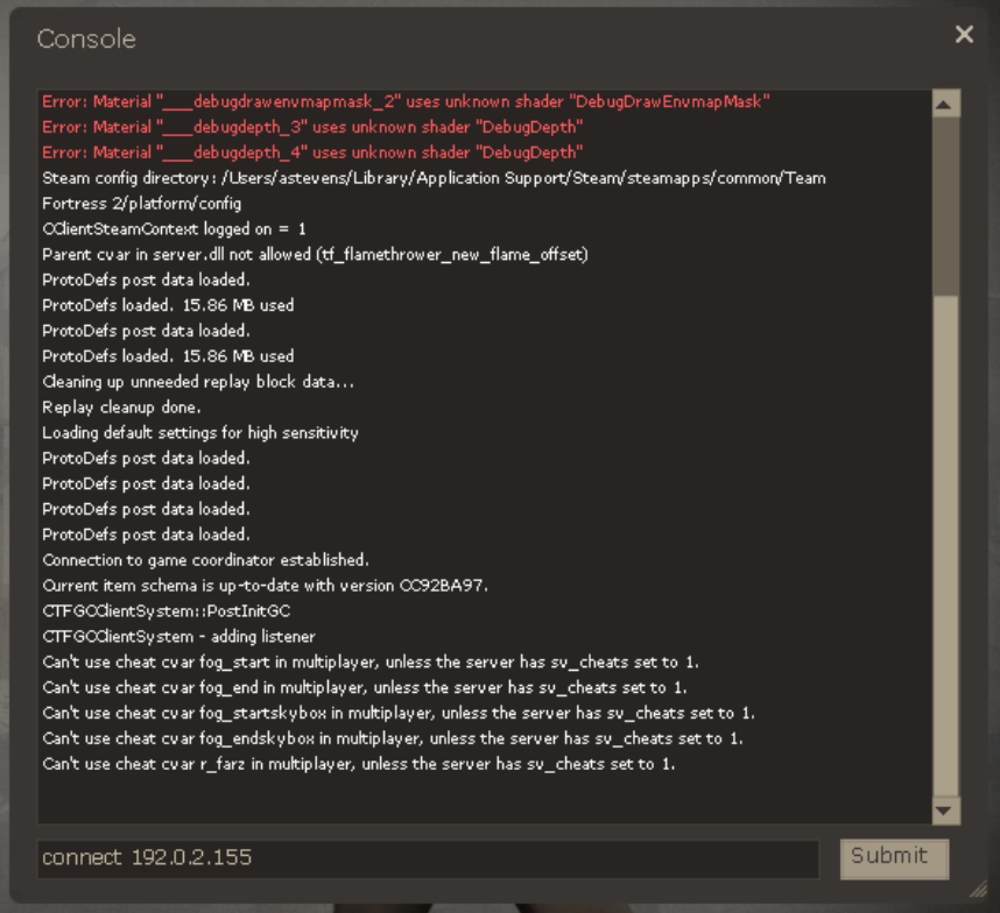

Team Fortress 2 (TF2) is a team-based multiplayer first-person shooter game. In TF2, you and your team choose from 9 unique classes and play against an enemy team in a variety of game modes. These modes include capture the flag, king of the hill, and even a battle pitting your team against a robotic horde.

Setting up a personal game server puts you in control of the game modes and maps you use, as well as a variety of other settings to customize your experience.

## Deploying the Team Fortress 2 Marketplace App



**Software installation should complete within 5-15 minutes after the Linode has finished provisioning.**

## Configuration Options

### Team Fortress 2 Options

You can configure your Team Fortress 2 App by providing values for the following fields:

| **Field** | **Description** |
|:--------------|:------------|
| **RCON Password** | The password for the remote console, which allows you to issue commands on the TF2 server. *Required*. |
| **Server Name** | Your Team Fortress 2 server's name. *Advanced Options*. |
| **Message of the Day** | Message of the day. Text displayed whenever a player logs on to the server. *Advanced Options* |
| **Server Password** | The password for the TF2 server. Configuring a TF2 server password will require users of your game server to provide this password. *Advanced Options* |
| **Game Server Login Token** | A Steam game server login token. This is required to publicly list your server. To get a Steam Token, visit the [Steam Game Server Account Management](https://steamcommunity.com/dev/managegameservers) page. *Advanced Options* |
| **Team Balance Enabled** | Automatically balance the number of players on a team. *Advanced Options* |
| **Maximum Rounds** | The maximum amount of rounds before the map changes. *Advanced Options* |
| **Round Time Limit** | The time per round, in minutes. *Advanced Options* |

### General Options

For advice on filling out the remaining options on the **Create a Linode** form, see [Getting Started > Create a Linode](/docs/guides/getting-started/#create-a-linode). That said, some options may be limited or recommended based on this Marketplace App:

- **Supported distributions:** Debian 9
- **Recommended minimum plan:** 4GB Dedicated CPU or Shared Compute Instance

## Getting Started after Deployment

Ensure that you have installed Team Fortress 2 to your computer before getting started with this section. You can install Team Fortress 2 from [Steam's Web Store](https://store.steampowered.com/app/440/Team_Fortress_2/).

After the Team Fortress 2 Server Marketplace App has finished deploying to your Linode, you will be able to access your server by copying your Linode's IPv4 address and connecting to it within the game installed on your computer. To find your Linode's IPv4 address and connect to it:

1. Click on the **Linodes** link in the sidebar. You will see a list of all your Linodes.

2. Find the Linode you just created when deploying your app and select it.

3. Navigate to the **Networking** tab.

4. Under the **IPv4** heading, you will find your IPv4 address listed under the **Address** column.

5. Copy the IPv4 address.

6. Open Team Fortress 2 on your computer, then open the developer's console by pressing the back tick key (**`**).

7. Type `connect 192.0.2.155`. Replace 192.0.2.155 with the IP address of your Linode, and then click **Submit**.

    

    This connects you to the server.

## Software Included

The Team Fortress 2 Marketplace App will install the following required software on your Linode:

| **Software** | **Description** |
|:--------------|:------------|
| [**Team Fortress 2**](http://www.teamfortress.com/) | Game server. |
| [**LinuxGSM**](https://linuxgsm.com) | A command line tool for the deployment and management of Linux game servers. |
| [**UFW**](https://wiki.ubuntu.com/UncomplicatedFirewall) | Firewall utility. Ports 27014:27050/tcp, 3478:4380/udp, 27000:27030/udp, and 26901 will allow outgoing and incoming traffic. |
| [**Fail2ban**](https://www.fail2ban.org/wiki/index.php/Main_Page) | Fail2Ban is an intrusion prevention software framework that protects computer servers from brute-force attacks. |


