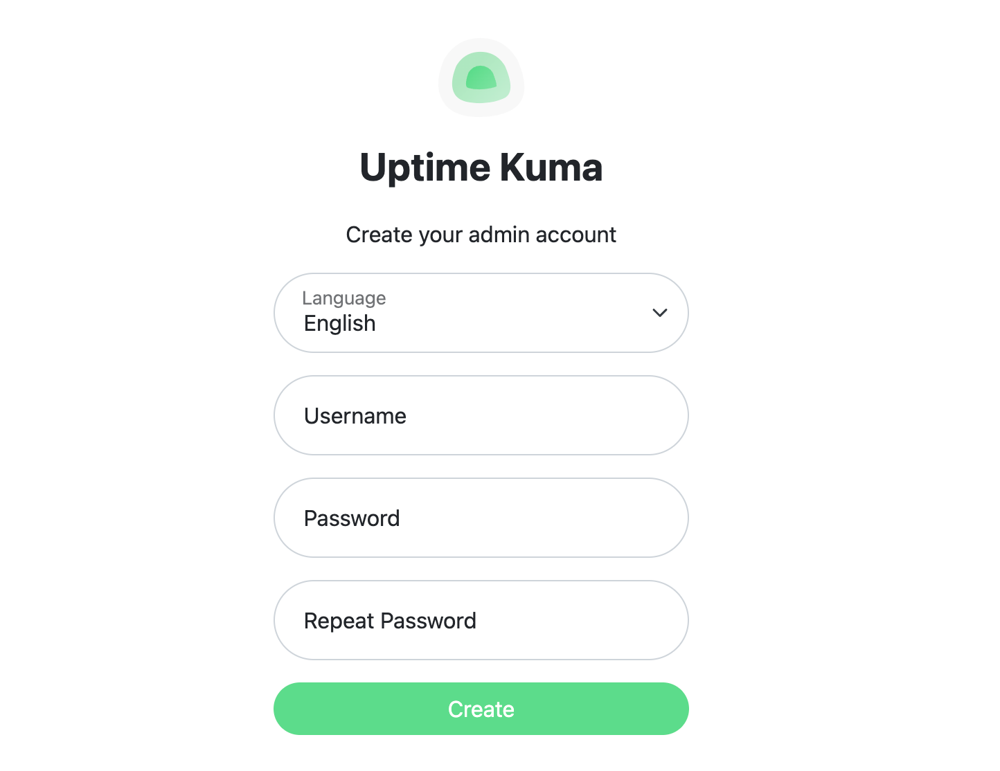

[Uptime Kuma](https://github.com/louislam/uptime-kuma) is an open source monitoring tool. It enables you to monitor services over HTTP/S, TCP, DNS, and other protocols. You can receive notification alerts of downtime and even create custom status pages for your users.

## Deploying the Uptime Kuma Marketplace App



**Software installation should complete within 5-10 minutes after the Linode has finished provisioning.**

## Configuration Options

### Uptime Kuma Options

Here are the additional options available for this Marketplace App:

| **Field** | **Description** |
|:--------------|:------------|
| **Admin Email for the server** | This email is require to generate the SSL certificates. *Required* |
| **Your Linode API Token** | Your Linode `API Token` is needed to create DNS records. If this is provided along with the `subdomain` and `domain` fields, the installation attempts to create DNS records via the Linode API. If you don't have a token, but you want the installation to create DNS records, you must [create one](/docs/platform/api/getting-started-with-the-linode-api/#get-an-access-token) before continuing. |
| **Subdomain** | The subdomain you wish the installer to create a DNS record for during setup. The suggestion given is `www`. The subdomain should only be provided if you also provide a `domain` and `API Token`. |
| **Domain** | The domain name where you wish to host your Uptime Kuma instance. The installer creates a DNS record for this domain during setup if you provide this field along with your `API Token`. |
| **The limited sudo user to be created for the Linode** | This is the limited user account to be created for the Linode. This account has sudo user privileges. |
| **The password for the limited sudo user** | Set a password for the limited sudo user. The password must meet the complexity strength validation requirements for a strong password. This password can be used to perform any action on your server, similar to root, so make it long, complex, and unique. |
| **The SSH Public Key that will be used to access the Linode** | If you wish to access [SSH via Public Key](/docs/security/authentication/use-public-key-authentication-with-ssh/) (recommended) rather than by password, enter the public key here. |
| **Disable root access over SSH?** | Select `Yes` to block the root account from logging into the server via SSH. Select `No` to allow the root account to login via SSH. |

### General Options

For advice on filling out the remaining options on the **Create a Linode** form, see [Getting Started > Create a Linode](/docs/guides/getting-started/#create-a-linode). That said, some options may be limited or recommended based on this Marketplace App:

- **Supported distributions:** Ubuntu 20.04 LTS, Debian 11
- **Recommended plan:** All plan types and sizes can be used.

## Getting Started after Deployment

### Accessing the Uptime Kuma App

1.  Open your web browser and navigate to `http://[domain]/`, where *[domain]* can be replaced with the custom domain you entered during deployment or your Compute Instance's rDNS domain (such as `192-0-2-1.ip.linodeusercontent.com`). See the [Managing IP Addresses](/docs/guides/managing-ip-addresses/) guide for information on viewing rDNS.

    

1.  If this is your first time logging in, the account creation page appears. Complete the form and click the **Create** button.

    

1.  After creating a user, you are automatically logged in and the Uptime Kuma dashboard is displayed.

    

Now that you’ve accessed your dashboard, check out [the official Uptime Kuma Repository](https://github.com/louislam/uptime-kuma) to learn how to further utilize your Uptime Kuma instance.

