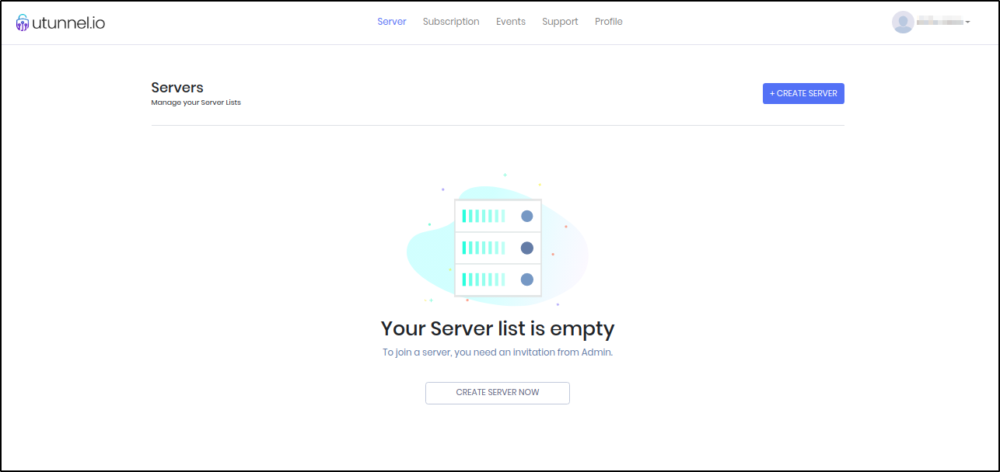
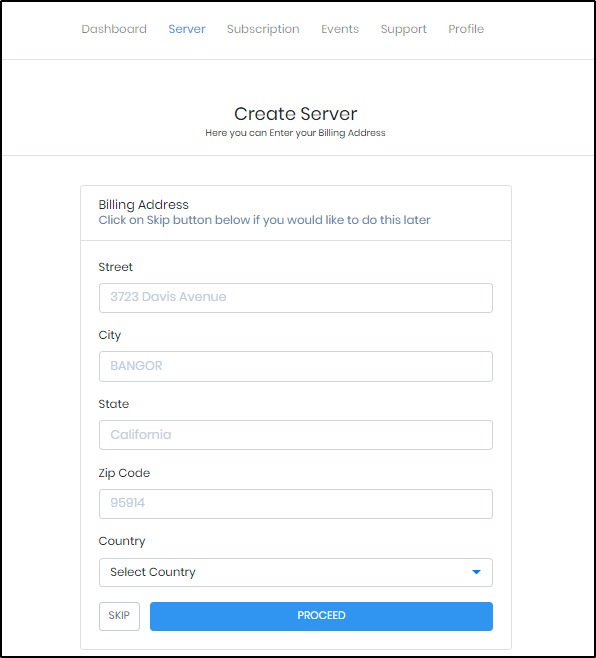
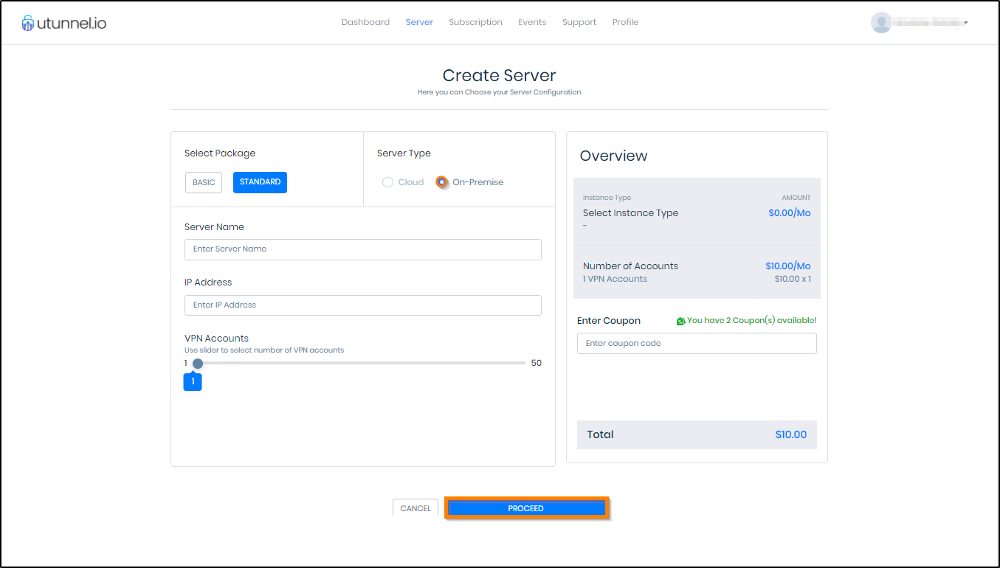
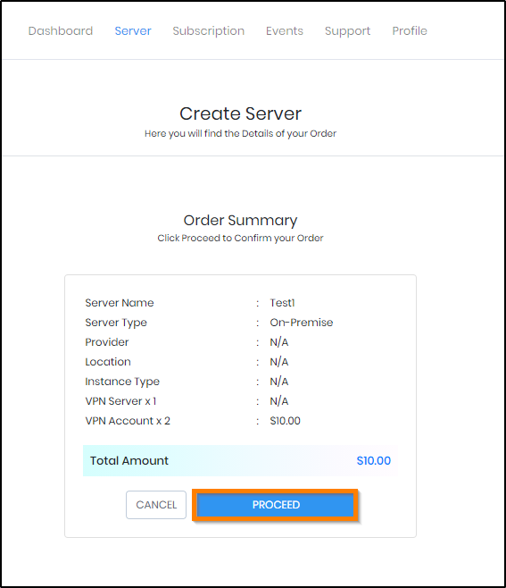
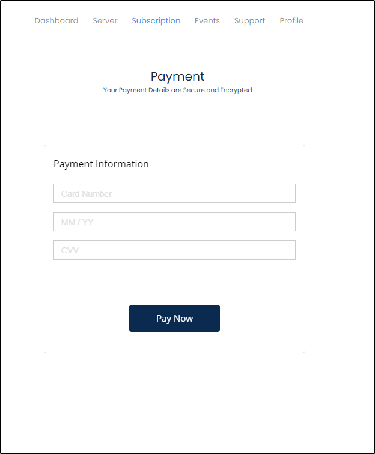
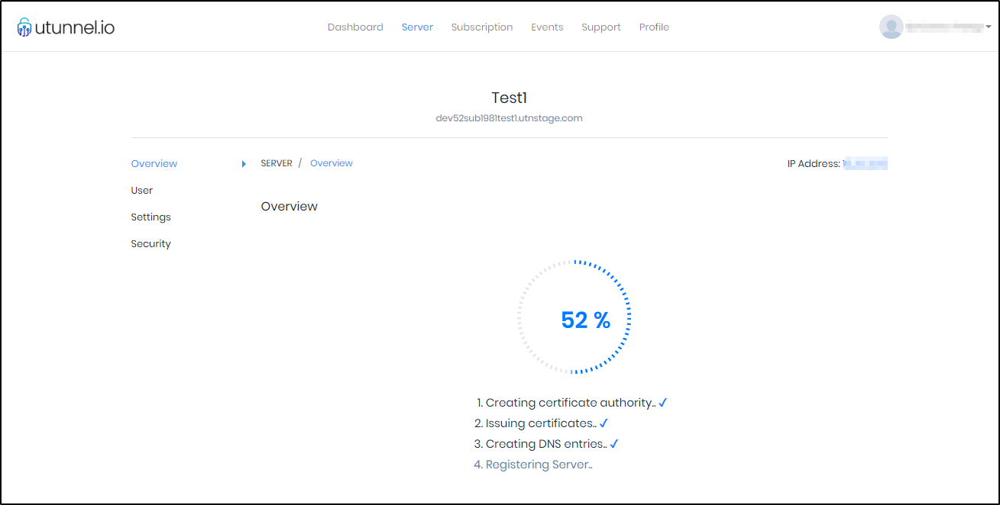
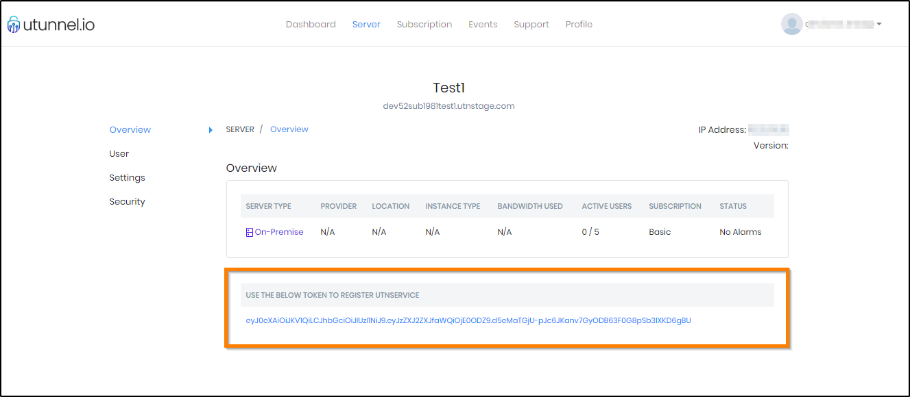

UTunnel lets you set up your own private VPN server quickly and easily; no technical expertise is required. It is well suited for small and medium businesses to set up easy and secure remote access for their employees, or for anyone who wants to keep their data private using their own VPN. UTunnel VPN supports multiple VPN protocols and comes with a server management console, secure 256-bit encryption, easy team management, single sign-on, 2-factor authentication, and an inbuilt firewall.

## Deploying the UTunnel Marketplace App



**Software installation should complete within 5-10 minutes after the Linode has finished provisioning.**

## Configuration Options

For advice on filling out the remaining options on the **Create a Linode** form, see [Getting Started > Create a Linode](/docs/guides/getting-started/#create-a-linode). That said, some options may be limited or recommended based on this Marketplace App:

- **Supported distributions:** Ubuntu 18.04 LTS
- **Recommended plan:** All plan types and sizes can be used.

## Getting Started after Deployment

### Accessing the UTunnel App

In order to use UTunnel, you will need to create an account on [UTunnel.io](https://dashboard.utunnel.io/user/signup/)

1.  Login to UTunnel [dashboard](https://dashboard.utunnel.io/) and click on either Create a Server now option or select Create Server button to create a new server.

    

1.  You will land on the Create Server screen. Here you can provide your billing address details. This step is optional. You can either provide the details and click on the Proceed button or select the Skip button to do it later from My Account tab on your dashboard.

    

1.  The next step is to select `On-Premise option` and enter the server details as given below:

    - Package: You can select from Basic or Standard subscription options
    - Server Type: Select On-Premise
    - Server Name: An easily identifiable name of your choice
    - IP address: Enter your server IP address
    - VPN accounts: Select the number of VPN users you want to allow access to this server
    - Coupon: Enter if you have any coupon available

    Click on the Proceed button toward the right bottom of the screen.

    

1.  You will be now on the Order Summary screen which displays the details of your order. Click PROCEED.

    

1.  Now enter your credit card details as required on the screen and click on Pay Now option.

    

1.  You will be redirected to the dashboard now. Here you can see the status of server creation.

    

1.  You will be redirected to the Server Details screen where the registration token is displayed. Please copy the registration token to safe place, this token is required when you deploy the server.

    

1.  Now it's the time to connect to your server via SSH. You will need sudo access to complete below steps. After the successful login, execute below commands. Remember to replace the string 'REGISTRATION_TOKEN' in the first command with the actual token you obtained in above step.

        sudo /utunnel/bin/utnservice register REGISTRATION_TOKEN

    Now it's the time to start UTunnel Service on your server. Run following command for the same.

        sudo /utunnel/bin/utnservice start

Now that you’ve deployed your UTunnel instance, checkout [the official UTunnel documentation](https://help.utunnel.io/About-UTunnel-VPN) to learn how to further utilize your UTunnel instance.

