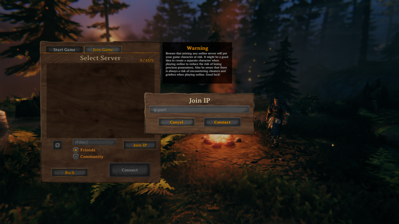

Valheim is an open-world Viking-themed survival and sandbox game developed by [Iron Gate Studio](https://irongatestudio.se/). Play solo in single player mode, or invite your friends for player vs. environment multiplayer mode. With challenging combat, numerous boss battles, and a creative building system that lets you craft things like halls, forts, and even imposing Viking warships, there's always something to do. Explore, build, conquer, and survive. The further you travel the more challenging adventures await.

Install Valheim on Linode with the Valheim Game Server Marketplace App to maximize your gaming experience.

## Deploying the Valheim Marketplace App



**Software installation should complete within 5-10 minutes after the Linode has finished provisioning.**

## Configuration Options

### Valheim Options

You can configure your Valheim Game Server by providing values for the following fields:

| **Field** | **Description** |
|:--------------|:------------|
| **The username to be used with Valheim** | Your Valheim Username. This is used to log in to Valheim. *Required*. |
| **The server name to be used with Valheim** | Your Valheim server name. This is used to log in to Valheim. *Required* |

### General Options

For advice on filling out the remaining options on the **Create a Linode** form, see [Getting Started > Create a Linode](/docs/guides/getting-started/#create-a-linode). That said, some options may be limited or recommended based on this Marketplace App:

- **Supported distributions:** Debian 10
- **Recommended minimum plan:** 4GB Dedicated CPU Compute Instance

## Getting Started after Deployment

### Access your Valheim Game Server

After Valheim has finished installing, you can access your server with your Linode's IPv4 address. Copy your Linode’s IPv4 address from the [Linode Cloud Manager](https://cloud.linode.com), and then connect to the server within the game using your Linode's IPv4 address and port `2456`(for example `192.0.2.0:2456`).

For more on Valheim, check out the following resources:

- [LinuxGSM Valheim Documentation](https://linuxgsm.com/lgsm/vhserver/)
- [Valheim official website](https://www.valheimgame.com/)

