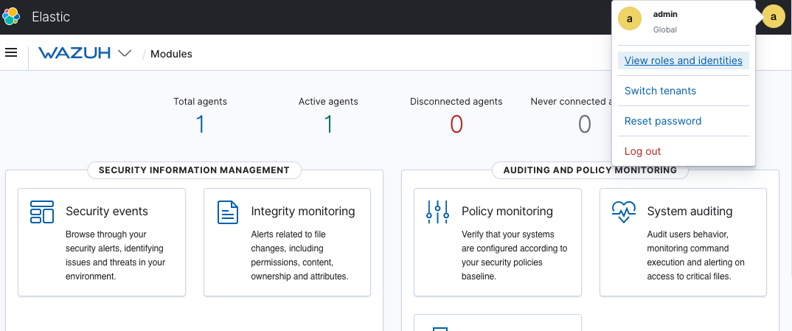

Wazuh provides a security solution for monitoring your infrastructure, detecting threats, intrusion attempts, system anomalies, poorly configured applications and unauthorized user actions. It also provides a framework for incident response and regulatory compliance.

## Deploying the Wazuh Marketplace App



**Software installation should complete within 10-15 minutes after the Linode has finished provisioning.**

## Configuration Options

### Wazuh Options
Here are the additional options available for this Marketplace App:

| **Field** | **Description** |
|:--------------|:------------|
| **Admin Email for the server** | This Email is require to generate the SSL certificates. *Required* |
| **Your Linode API Token** | Your Linode `API Token` is needed to create DNS records. If this is provided along with the `subdomain` and `domain` fields, the installation attempts to create DNS records via the Linode API. If you don't have a token, but you want the installation to create DNS records, you must [create one](/docs/platform/api/getting-started-with-the-linode-api/#get-an-access-token) before continuing. |
| **Subdomain** | The subdomain you wish the installer to create a DNS record for during setup. The suggestion given is `www`. The subdomain should only be provided if you also provide a `domain` and `API Token`. |
| **Domain** | The domain name where you wish to host your Wazuh instance. The installer creates a DNS record for this domain during setup if you provide this field along with your `API Token`. |
| **The limited sudo user to be created for the Linode** | This is the limited user account to be created for the Linode. This account has sudo user privileges. |
| **The password for the limited sudo user** | Set a password for the limited sudo user. The password must meet the complexity strength validation requirements for a strong password. This password can be used to perform any action on your server, similar to root, so make it long, complex, and unique. |
| **The SSH Public Key that will be used to access the Linode** | If you wish to access [SSH via Public Key](/docs/security/authentication/use-public-key-authentication-with-ssh/) (recommended) rather than by password, enter the public key here. |
| **Disable root access over SSH?** | Select `Yes` to block the root account from logging into the server via SSH. Select `No` to allow the root account to login via SSH. |

### General Options

For advice on filling out the remaining options on the **Create a Linode** form, see [Getting Started > Create a Linode](/docs/guides/getting-started/#create-a-linode). That said, some options may be limited or recommended based on this Marketplace App:

- **Supported distributions:** Ubuntu 20.04 LTS
- **Recommended plan:** All plan types and sizes can be used, though a minimum of a 8GB Instance is recommended for production.

## Getting Started after Deployment

### Accessing the Wazuh App

To access your Wazuh instance, Open a browser and navigate to the domain you created in the beginning of your deployment or your Linode rDNS domain `https://li1234-555.members.linode.com`. Replace `https://li1234-555.members.linode.com` with your [Linode's RDNS domain](/docs/guides/remote-access/#resetting-reverse-dns).

From there, you'll be presented with a login screen, the username will be 'admin' and the default password will be 'admin'. Once you login to your Wazuh instance, you will want to reset the admin password by click the icon on the top right of the dashboard as shown in the image below:

Now that you’ve accessed your Wazuh instance, you will need to configure a [Wazuh Agent](https://documentation.wazuh.com/current/installation-guide/wazuh-agent/index.html) on the server you'd like to monitor with Wazuh.

For more documentation on Wazuh,checkout [the official Wazuh documentation](https://documentation.wazuh.com/current/installation-guide/index.html) to learn how to further utilize your instance.

