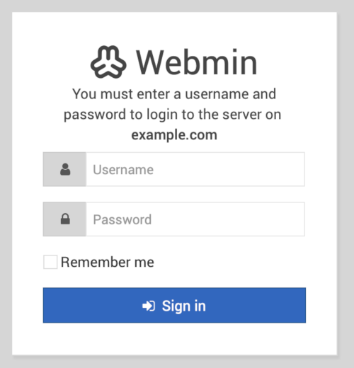

[Webmin](http://www.webmin.com) is an open source interface for Unix system administration that offers an easy to use graphical interface for managing user accounts, DNS, file sharing, and more. Webmin alleviates the need to use the command line to edit Unix system configuration files and allows you to configure your system easily from a simple web interface.

## Deploying the Webmin Marketplace App



**Software installation should complete within 2-5 minutes after the Linode has finished provisioning.**

## Configuration Options

### Webmin Options

The Webmin Marketplace form includes advanced fields to setup your Webmin's limited user account and DNS records. These are optional configuration options and are not required for installation.

| **Field&nbsp;&nbsp;&nbsp;&nbsp;&nbsp;&nbsp;&nbsp;&nbsp;&nbsp;&nbsp;&nbsp;&nbsp;&nbsp;&nbsp;&nbsp;&nbsp;&nbsp;&nbsp;&nbsp;&nbsp;&nbsp;&nbsp;&nbsp;&nbsp;&nbsp;&nbsp;&nbsp;&nbsp;&nbsp;&nbsp;&nbsp;&nbsp;&nbsp;&nbsp;&nbsp;&nbsp;&nbsp;&nbsp;&nbsp;&nbsp;&nbsp;&nbsp;** | **Description** |
|-----------|-----------------|
| **The limited sudo user to be created for the Linode** | This is the limited user account to be created for the Linode. This account will have sudo user privileges. |
| **The password for the limited sudo user** | Set a password for the limited sudo user. The password must meet the complexity strength validation requirements for a strong password. This password can be used to perform any action on your server, similar to root, so make it long, complex, and unique. |
| **The SSH Public Key that will be used to access the Linode** | If you wish to access [SSH via Public Key](https://www.linode.com/docs/security/authentication/use-public-key-authentication-with-ssh/) (recommended) rather than by password, enter the public key here. |
| **Enable passwordless sudo access for the limited user?** | If you entered an SSH Public Key above and it is for the limited user account, select `Yes` to allow SSH to use Public Key login for the limited user. Select `No` if you want SSH to rely on using password login for the limited user account. |
| **Disable root access over SSH?** | Select `Yes` to block the root account from logging into the server via SSH. Select `No` to allow the root account to login via SSH. |
| **Configure automatic security updates** | Select `yes` to automate security updates as part of this installation. |
| **Use fail2ban to prevent automated intrusion attempts** | Select `yes` to [Install and Configure Fail2ban](https://www.linode.com/docs/security/basics/using-fail2ban-to-secure-your-server-a-tutorial/) to protect against brute force attacks. |
| **Your Linode API Token** | Your Linode `API Token` is needed to create DNS records. If this is provided along with the `subdomain` and `domain` fields, the installation will attempt to create DNS records via the Linode API. If you don't have a token, but you want the installation to create DNS records, you must [create a token](/docs/platform/api/getting-started-with-the-linode-api/#get-an-access-token) to use in this field before continuing. |
| **Subdomain** | The subdomain you wish the installer to create a DNS record for during setup. The suggestion given is `www`. The subdomain can only be created if you also provide a `domain` and `API Token`. |
| **Domain** | The domain name where you wish to host your Webmin server. The installer creates a DNS record for this domain during setup if you provide this field along with the required `API Token`. |
| **Admin Email for the server** | The start of authority (SOA) email address for this server. This email address will be added to the SOA record for the domain. This is a required field if you want the installer to create DNS records. |
| **Do you need an MX record for this domain?** | Check `yes` if you plan on using Webmin to setup email. The installer will use your `API Token` (required) and `domain`(required) to set up the necessary MX records in the DNS Manager. Select `no` if you do not plan on using Webmin to manage email. You can [add an MX record manually](/docs/networking/dns/dns-records-an-introduction/#mx) at a later time if you change your decision. |
| **Do you need an SPF record for this domain?** | Check `yes` if you plan on using Webmin to setup email. The installer, along with your `API Token` (required) and `domain` (required)  will set up the necessary SPF records in the DNS Manager. Select `no` if you do not plan on using Webmin to manage email. You can [add an SPF record manually](/docs/networking/dns/dns-records-an-introduction/#spf) at a later time if you change your decision. |

### General Options

For advice on filling out the remaining options on the **Create a Linode** form, see [Getting Started > Create a Linode](/docs/guides/getting-started/#create-a-linode). That said, some options may be limited or recommended based on this Marketplace App:

- **Supported distributions:** Debian 10
- **Recommended minimum plan:** All plan types and sizes can be used.

## Getting Started after Deployment

Webmin is now installed and ready to use.

1.  If you filled out the optional Webmin configuration fields:

    - In the Cloud Manager [DNS Manager](/docs/guides/dns-manager/#add-a-domain), confirm that there is now an entry for your domain with possible subdomain, MX, and SPF records pointing to your new server.
    - [Configure rDNS](/docs/networking/dns/configure-your-linode-for-reverse-dns/) on your Linode to point to your new domain name.

1.  Webmin is served on port 10000. To access Webmin, navigate to either the IP address of your server, or to your domain name followed by port 10000. For example, entering `http://example.com:10000` or `http://203.0.113.0:10000` while replacing the domain name or IP address with values for your server will allow you to reach the Webmin login screen.

    

1.  At the login screen, login using either:

    - The system root username and password
    - The sudo username and password if you set that up in the Webmin optional configuration during installation.

1.  Once logged in, you will be taken to the Webmin dashboard, where you can see various statistics and controls for your server.

    


