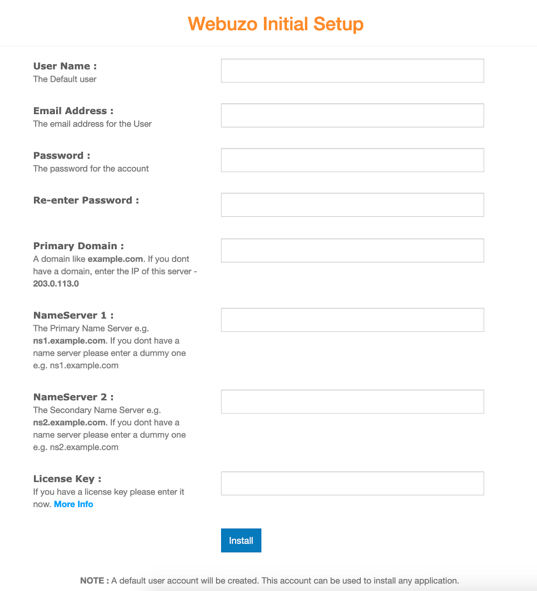
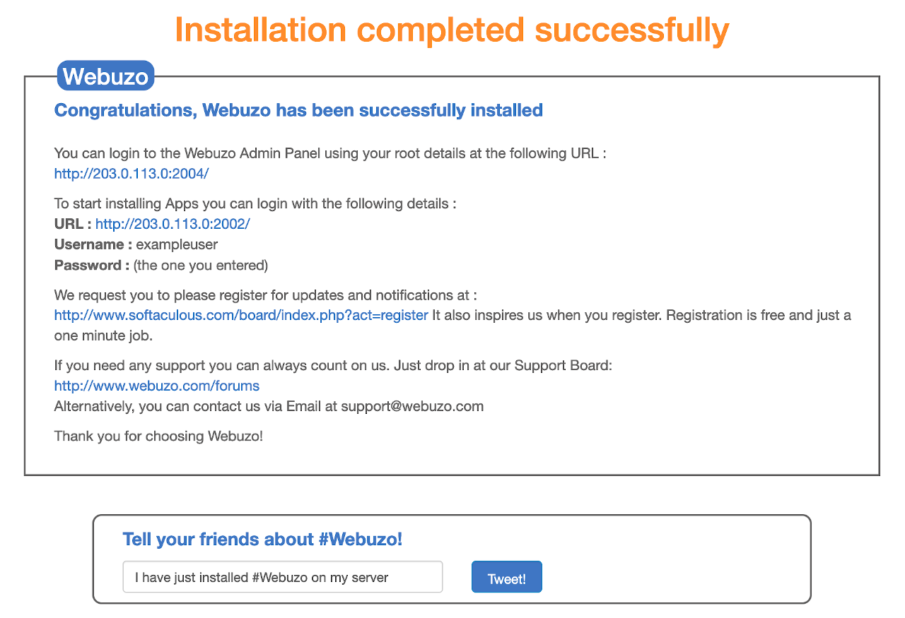
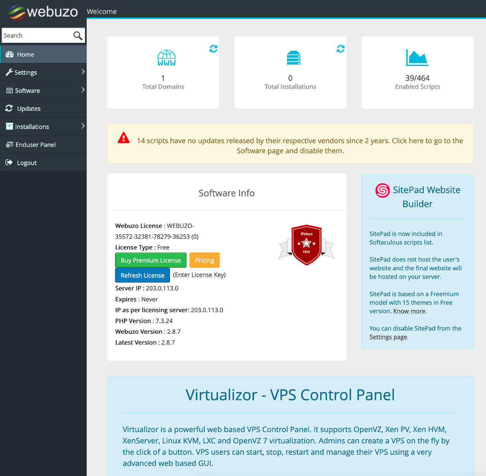
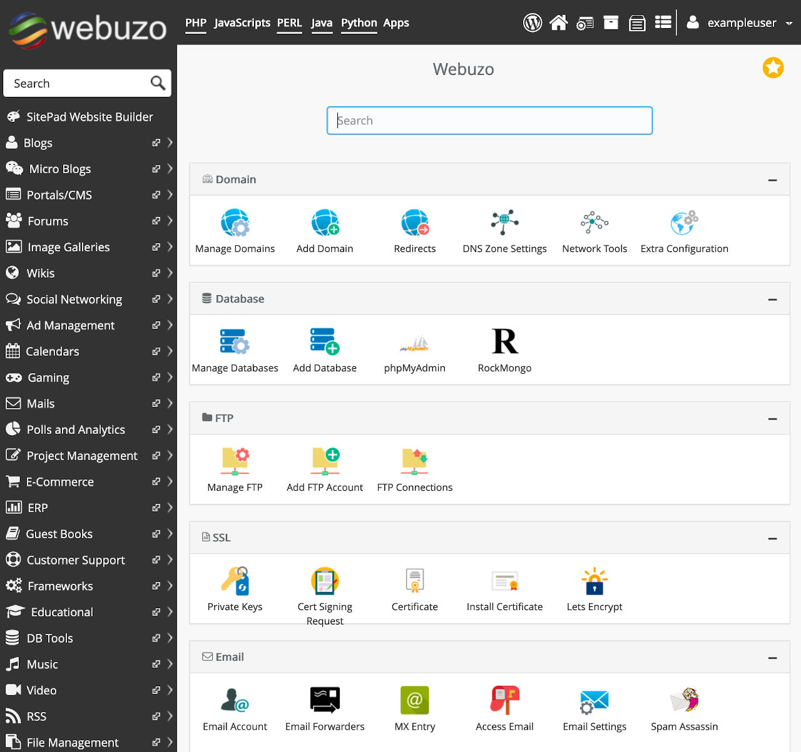

Softaculous [Webuzo](https://www.webuzo.com) is a single user LAMP stack control panel that allows you to deploy a growing number of applications and scripts on your server with a single click.

## Deploying the Webuzo Marketplace App



**Software installation should complete within 2-5 minutes after the Linode has finished provisioning.**

## Configuration Options

### Webuzo Options

The Webuzo Marketplace form includes advanced fields to setup your Webuzo server's limited user account and DNS records. These are optional configurations and are not required for installation.

| **Field&nbsp;&nbsp;&nbsp;&nbsp;&nbsp;&nbsp;&nbsp;&nbsp;&nbsp;&nbsp;&nbsp;&nbsp;&nbsp;&nbsp;&nbsp;&nbsp;&nbsp;&nbsp;&nbsp;&nbsp;&nbsp;&nbsp;&nbsp;&nbsp;&nbsp;&nbsp;&nbsp;&nbsp;&nbsp;&nbsp;&nbsp;&nbsp;&nbsp;&nbsp;&nbsp;&nbsp;&nbsp;&nbsp;&nbsp;&nbsp;&nbsp;&nbsp;** | **Description** |
|-----------|-----------------|
| **The limited sudo user to be created for the Linode** | This is the limited user account to be created for the Linode. This account has sudo user privileges. |
| **The password for the limited sudo user** | Set a password for the limited sudo user. The password must meet the complexity strength validation requirements for a strong password. This password can be used to perform any action on your server, similar to root, so make it long, complex, and unique. |
| **The SSH Public Key that will be used to access the Linode** | If you wish to access [SSH via Public Key](https://www.linode.com/docs/security/authentication/use-public-key-authentication-with-ssh/) (recommended) rather than by password, enter the public key here. |
| **Disable root access over SSH?** | Select `Yes` to block the root account from logging into the server via SSH. Select `No` to allow the root account to login via SSH. |

### General Options

For advice on filling out the remaining options on the **Create a Linode** form, see [Getting Started > Create a Linode](/docs/guides/getting-started/#create-a-linode). That said, some options may be limited or recommended based on this Marketplace App:

- **Supported distributions:** Ubuntu 20.04 LTS
- **Recommended minimum plan:** All plan types and sizes can be used.

## Getting Started after Deployment

The Webuzo application is now being served on your Linode, however it still requires a few additional steps to fully complete the installation process.

1.  The Webuzo setup wizard is served on port 2004, to access it, navigate to the IP address of your server followed by port 2004. For example, `http://203.0.113.0:2004`, replacing the IP address with values for your server.

    

1.  At the setup screen, fill in the fields and click the **Install** button. The installation may take a few minutes to fully complete.

1.  Once installation is completed, Webuzo Congratulates you on completing the setup and displays a confirmation screen.

    

    Here you find two links. One for the **Admin Panel** and one for the page where you can begin installing applications. The second is called the **Enduser Panel**, which can also be accessed from the Admin Panel. Both require you to login using the username and password you just created on the setup screen.

    - Admin Panel: `http://your.ip.address:2004`
    - Enduser Panel: `http://your.ip.address:2002`

1.  The Admin Panel allows you to change settings for what scripts and apps you are able to install and provides the option to update them as needed.

    

1.  The Enduser Panel allows you to install a number of applications. It is sorted into sections based on application category.

    


