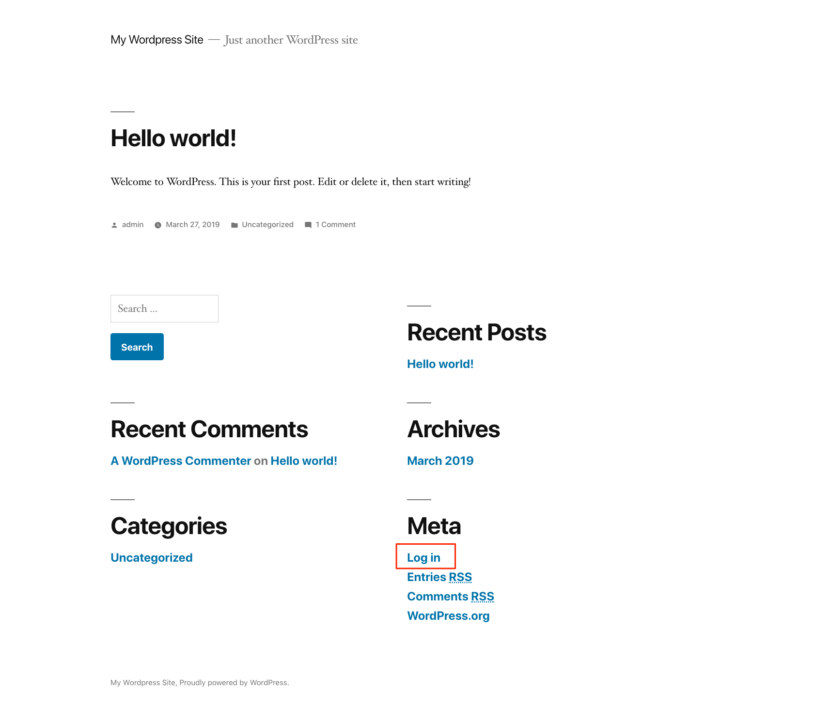
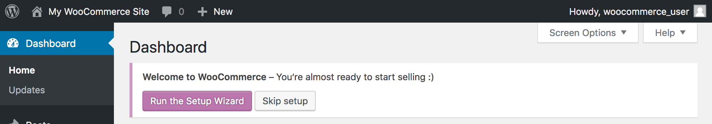

[WooCommerce](https://woocommerce.com/) is a popular open source eCommerce plugin for WordPress that can power online storefronts to sell both digital and physical products for small-to-large businesses. A variety of [themes for WooCommerce](https://woocommerce.com/product-category/themes/storefront-child-theme-themes/) are available so you can create a store that looks the way you want it to.  WooCommerce takes payments via major credit cards, bank transfers, [PayPal](https://woocommerce.com/products/woocommerce-gateway-paypal-checkout/), and other providers like [Stripe](https://woocommerce.com/products/stripe/). The WooCommerce plugin is free, but some themes and extensions have a cost.

## Deploying the WooCommerce Marketplace App



**Software installation should complete within 2-5 minutes after the Linode has finished provisioning.**

## Configuration Options

### WooCommerce Options

| **Field** | **Description** |
|:--------------|:------------|
| **Website Title** | Your WordPress site's title. |
| **E-Mail Address** | E-Mail address for your WordPress admin user. This is also used as the SOA email address if you also enter a domain. *Required*. |
| **Admin Username** | Username for your WordPress admin user. *Required*. |
| **Admin Password** | Password for your WordPress admin user. *Required*. |
| **MySQL root Password** | The root password for your MySQL database. *Required*. |
| **WordPress Database Password** | The root password for your WordPress database. *Required*. |
| **The limited sudo user to be created for the Linode** | This is the limited user account to be created for the Linode. This account has sudo user privileges. |
| **The password for the limited sudo user** | Set a password for the limited sudo user. The password must meet the complexity strength validation requirements for a strong password. This password can be used to perform any action on your server, similar to root, so make it long, complex, and unique. |
| **The SSH Public Key that will be used to access the Linode** | If you wish to access [SSH via Public Key](/docs/security/authentication/use-public-key-authentication-with-ssh/) (recommended) rather than by password, enter the public key here. |
| **Enable passwordless sudo access for the limited user?** | If you entered an SSH Public Key above and it is for the limited user account, select `Yes`, this allows SSH to use Public Key login for the limited user (recommended). Select `No` if you want SSH to rely on using password login for the limited user account. |
| **Disable root access over SSH?** | Select `Yes` to block the root account from logging into the server via SSH (recommended). Select `No` to allow the root account to login via SSH. |
| **Configure automatic security updates** | Select `Yes` to have the system automatically update WordPress with the latest security updates. Select `No` to if you wish to manage all updates manually. |
| **Use fail2ban to prevent automated intrusion attemps?** | Select `Yes` to install fail2ban. Select `No` to not install fail2ban during installation. If you chose `No`, you can install fail2ban later by following the [Using Fail2ban to Secure Your Server](/docs/security/basics/using-fail2ban-to-secure-your-server-a-tutorial/) guide. |
| **Your Linode API Token** | Your Linode `API Token` is needed to create DNS records. If this is provided along with the `subdomain` and `domain` fields, the installation attempts to create DNS records via the Linode API. If you don't have a token, but you want the installation to create DNS records, you must [create one](/docs/platform/api/getting-started-with-the-linode-api/#get-an-access-token) before continuing. |
| **Subdomain** | The subdomain you wish the installer to create a DNS record for during setup. The suggestion given is `www`. The subdomain should only be provided if you also provide a `domain` and `API Token`. |
| **Domain** | The domain name where you wish to host your WordPress site. The installer creates a DNS record for this domain during setup if you provide this field along with your `API Token`. |
| **Do you need an MX record for this domain?** | Check `Yes` if you plan on using WordPress to send email. The installer, along with your `API Token` (required) sets up the necessary MX records in the DNS Manager. Select `No` if you do not plan on using WordPress to send email. You can [add an MX record manually](/docs/networking/dns/dns-records-an-introduction/#mx) at a later time if you change your decision. |
| **Do you need an SPF record for this domain?** | Check `yes` if you plan on using WordPress to send email. The installer, along with your `API Token` (required) sets up the necessary SPF records in the DNS Manager. Select `No` if you do not plan on using WordPress to send email. You can [add an SPF record manually](/docs/networking/dns/dns-records-an-introduction/#spf) at a later time if you change your decision. |
| **Would you like to use a free Let's Encrypt SSL certificate?** | Select `Yes` if you would like the install to create an SSL certificate for you, or `No` if you do not. You cannot create secure, encrypted conferences without an SSL certificate. Validation of your SSL certificate can take up to two hours to complete.|

### General Options

For advice on filling out the remaining options on the **Create a Linode** form, see [Getting Started > Create a Linode](/docs/guides/getting-started/#create-a-linode). That said, some options may be limited or recommended based on this Marketplace App:

- **Supported distributions:** Debian 10
- **Recommended minimum plan:** All plan types and sizes can be used, though a minimum of a 4GB Dedicated CPU Compute Instance is recommended for production websites.

## Getting Started After Deployment

After WooCommerce has finished installing, a confirmation email will be sent to the email address you provided during configuration, at which point you will be able to [access your site](#getting-started-after-your-deployment).

### Access Your WooCommerce Site

After WooCommerce and WordPress have finished installing, you will be able to access your site by copying your Linode's IPv4 address and entering it in the browser of your choice. To find your Linode's IPv4 address:

1. Click on the **Linodes** link in the sidebar. You will see a list of all your Linodes.

1. Find the Linode you just created when deploying your app and select it.

1. Navigate to the **Networking** tab.

1. Your IPv4 address will be listed under the **Address** column in the **IPv4** table.

1. Copy and paste the IPv4 address into a browser window. You should see your WooCommerce site's home page.

1.  Once you have accessed your site via the browser, you can log in to the WordPress administrative interface and [start configuring your store](#complete-the-woocommerce-setup-wizard).

    The address of the WordPress login page is `http://< your IP address >/wp-login.php`. Or, you can click on the log in link that's visible on your site's home page, as highlighted below. Enter the credentials you previously specified in the **Admin Username** and **Admin Password** fields when you deployed the app.

    

### Complete the WooCommerce Setup Wizard

When you first log in to the WordPress admin interface, you will be presented with a banner that asks you to complete the WooCommerce setup wizard:

Click on the **Run the Setup Wizard** button to visit this form and start your store configuration.

## Software Included

| **Software** | **Description** |
|:--------------|:------------|
| [**MySQL Server**](https://www.mysql.com/) | Relational database. |
| [**PHP 7**](https://www.php.net/) | WordPress is written in PHP and requires PHP to operate. |
| [**Apache HTTP Server**](https://httpd.apache.org/) | Web server used to serve the WordPress site. |
| [**WordPress**](https://wordpress.org/) | Content management system. |
| [**WP CLI**](https://wp-cli.org/) | The command line interface for WordPress. |
| [**WooCommerce**](https://woocommerce.com/) | An online storefront plugin for WordPress. |




