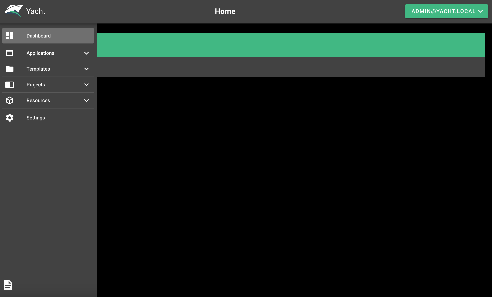
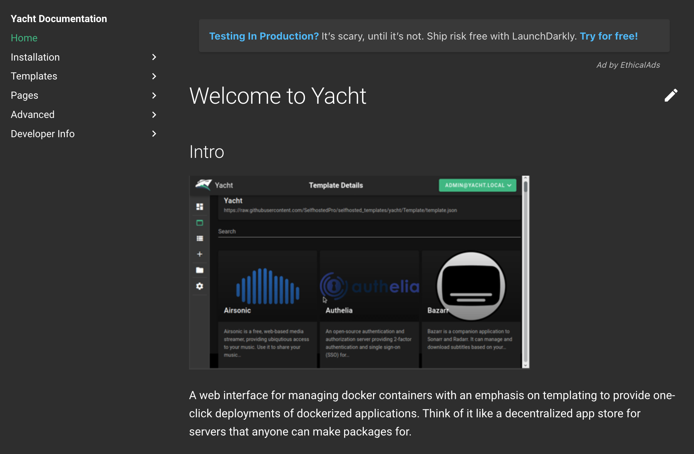

Yacht is a web interface for managing Docker containers, with an emphasis on templating to provide easy deployments. The ultimate goal of Yacht is to make Docker easy for anyone to use and manage with templates, template variables, and an intuitive UI.


Keep in mind, Yacht is still in alpha and is not recommended for production use.


## Deploying the Yacht Marketplace App



**Software installation should complete within 2-5 minutes after the Linode has finished provisioning.**

## Configuration Options

### Yacht Options

You can configure your Yacht App by providing values for the following fields:

| **Field** | **Description** |
|:--------------|:------------|
| **Yacht Email** | The email address for your Yacht login. The default is admin@yacht.local. *Required*. |
| **Yacht Password** | The password for your Yacht login. *Required*. |
| **Yacht Compose Support** | Support for using Yacht with [Docker Compose](https://yacht.sh/Advanced/docker-compose/). |
| **Yacht Theme** | Yacht theme options: Default, RED, and OMV. |

### General Options

For advice on filling out the remaining options on the **Create a Linode** form, see [Getting Started > Create a Linode](/docs/guides/getting-started/#create-a-linode). That said, some options may be limited or recommended based on this Marketplace App:

- **Supported distributions:** Debian 10
- **Recommended minimum plan:** All plan types and sizes can be used.

## Getting Started after Deployment

### Access your Yacht App

1.  After Yacht has finished installing, you can access your Yacht instance by visiting your [Linode's IP address](/docs/quick-answers/linode-platform/find-your-linodes-ip-address/) at port 8000 (for example, `http://192.0.2.0:8000`) in a web browser.

    
By default Yacht is not configured to use SSL, meaning that your login credentials will be sent over plain text. See [Additional Steps for SSL](#additional-steps-for-ssl) for guidance on how to encrypt your connection.


1.  Enter your [Yacht email address and password](#yacht-options):

    

    You should see the Yacht administration panel:

    

Yacht provides elegant theme customization, templating, easy management of Docker resources (volumes, images, network), applications and projects. Click the page icon on the bottom-left corner to view a live demo and official [Yacht documentation](https://yacht.sh/).

### Additional Steps for SSL
Since Yacht is not configured for SSL, some additional steps are required to encrypt your connection. The following example uses [self-signed SSL certificates](/docs/guides/create-a-self-signed-tls-certificate/), but this can also work with a [commercially signed](/docs/guides/obtain-a-commercially-signed-tls-certificate/) or [Let's Encrypt certificates](/docs/guides/install-lets-encrypt-to-create-ssl-certificates/) if the server is configured with a FQDN.

1.  Login to the Linode's IP over `ssh`. Replace `192.0.2.0` with your [Linode's IP address](/docs/quick-answers/linode-platform/find-your-linodes-ip-address/).

         ssh root@192.0.2.0

1.  Create two local directories for SSL and the modified `nginx.conf`.

         mkdir -p local/nginx
         mkdir local/ssl

1.  Create the self-signed certificate and key.

         openssl req -new -newkey rsa:4096 -x509 -sha256 -days 365 -nodes -out yacht.crt -keyout yacht.key

     You should see output similar to the following:

     
Generating a RSA private key
...............................................................................................................................................+
......................++++
writing new private key to 'yacht.key'
-----
You are about to be asked to enter information that will be incorporated
into your certificate request.
What you are about to enter is what is called a Distinguished Name or a DN.
There are quite a few fields but you can leave some blank
For some fields there will be a default value,
If you enter '.', the field will be left blank.
-----
Country Name (2 letter code) [AU]:US
State or Province Name (full name) [Some-State]:Pennsylvania
Locality Name (eg, city) []:Philadelphia
Organization Name (eg, company) [Internet Widgits Pty Ltd]:
Organizational Unit Name (eg, section) []:
Common Name (e.g. server FQDN or YOUR name) []:yacht.local
Email Address []:admin@yacht.local


1.  Move the newly generated certificate and key into the `local/ssl` directory.

         mv yacht.* local/ssl

1.  Dump the Yacht `nginx.conf` to the `local/nginx` directory.

         docker exec -it yacht /bin/sh -c "cat /etc/nginx/nginx.conf" > local/nginx/nginx.conf

1.  Open the `local/nginx/nginx.conf` file using `vim` or another text editor of your choice and locate the server block for port 8000 (around line 30).

    
...
server {
     listen *:8000;
...


     Add the `ssl` parameter and paths for the certificate and key.

    
...

server {
     listen *:8000 ssl;
     ssl_certificate /etc/nginx/ssl/yacht.crt;
     ssl_certificate_key /etc/nginx/ssl/yacht.key;

...


1.   Copy `local/nginx/nginx.conf` and `local/ssl` to the `/etc/nginx/` directory in the Yacht container, and then reload Nginx.

         docker cp local/nginx/nginx.conf yacht:/etc/nginx/
         docker cp local/ssl yacht:/etc/nginx/

         # remove ^M characters
         docker exec -it yacht /bin/sh -c "sed -ie 's/\r//g' /etc/nginx/nginx.conf"

         # reload nginx
         docker exec -it yacht /bin/sh -c "nginx -s reload"

Your browser may give warnings because the certificate is not signed by a Certificate Authority, and require you to add a security exception, but the connection is now encrypted.


