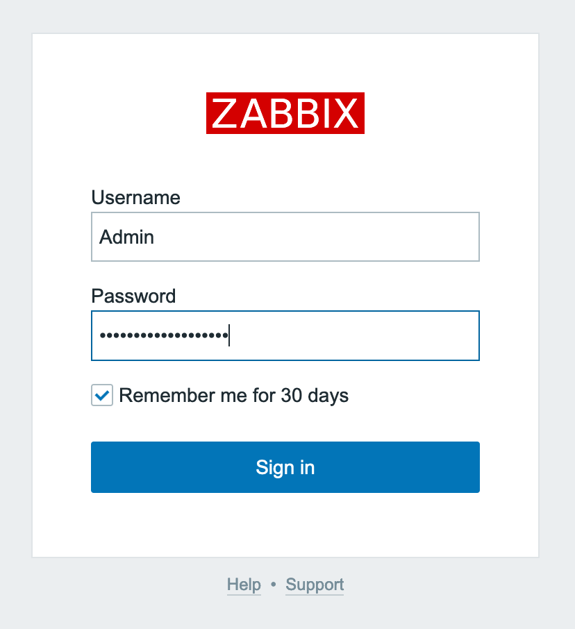
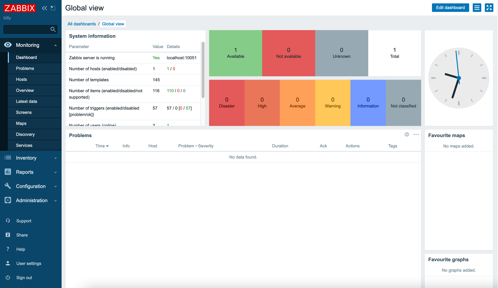

Zabbix is an enterprise-class, open source, distributed monitoring solution. Designed as an all-in-one monitoring solution, Zabbix can track performance and availability of network servers, devices, services, and other IT resources.

Zabbix empowers administrators to quickly respond to incidents with on-screen display capabilities and alerts by e-mail, SMS, or Jabber. Users can also collect, store, manage, and analyze information received from IT infrastructure.

Actively used by SMBs and large enterprises across all industries and in almost every country, Zabbix has a robust community driving its continued development.

## Deploying the Zabbix Marketplace App



**Software installation should complete within 5-10 minutes after the Linode has finished provisioning.**

## Configuration Options

### Zabbix Options

You can configure your Zabbix App by providing values for the following fields:

| **Field** | **Description** |
|:--------------|:------------|
| **Hostname** | Your Zabbix Linode's hostname. *Required*. |

### General Options

For advice on filling out the remaining options on the **Create a Linode** form, see [Getting Started > Create a Linode](/docs/guides/getting-started/#create-a-linode). That said, some options may be limited or recommended based on this Marketplace App:

- **Supported distributions:** CentOS 7
- **Recommended minimum plan:** All plan types and sizes can be used.

## Getting Started after Deployment

### Access your Zabbix App

After Zabbix has finished installing, you must first access your Zabbix Linode from the console via [SSH](/docs/guides/getting-started/#connect-to-your-linode-via-ssh), to obtain a randomly-generated administrative password. You can then use this password to log into your Zabbix App via web browser at your Linode's [IPv4 address](/docs/guides/find-your-linodes-ip-address/).

1. From your terminal, log into your Zabbix Linode as the `root` user with the following command, replacing `192.0.2.0` with your Linode's [IPv4 address](/docs/guides/find-your-linodes-ip-address/):

        ssh root@192.0.2.0

1. The Zabbix welome banner appears immediately after logging into your Zabbix Linode. Copy and save the randomly generated Admin password from the welcome banner in a secure manner for later. Here is an example welcome banner:

    
********************************************************************************
Zabbix frontend credentials:
Username: Admin
Password: abcdef0123456789
To learn about available professional services, including technical suppport and training, please visit https://www.zabbix.com/services
Official Zabbix documentation available at https://www.zabbix.com/documentation/current/
Note! Do not forget to change timezone PHP variable in /etc/php.d/99-zabbix.ini file.
********************************************************************************
    

1. Enter your Zabbix Linode's [IPv4 address](/docs/guides/find-your-linodes-ip-address/) into a browser window to access your Zabbix App's login page.

    
Zabbix uses a self-signed certificate. Because it is not signed by a common Certificate Authority, your browser may warn you about the security of the connection and require you to add a security exception.
    

    

1. Enter `Admin` as the username and the Admin password you saved from the welcome banner, then click **Sign in** to access the Zabbix control panel.

    

## Next Steps

For more on Zabbix, check out the following resources:

- [Learn from Zabbix Documentation](https://www.zabbix.com/documentation/5.0/manual)
- [Purchase Technical Support Contract](https://www.zabbix.com/support)
- [Visit the Zabbix Official Forum](https://www.zabbix.com/forum)

<!-- the following shortcode informs the user that Linode does not provide automatic updates
     to the Marketplace app, and that the user is responsible for the security and longevity
     of the installation. -->

