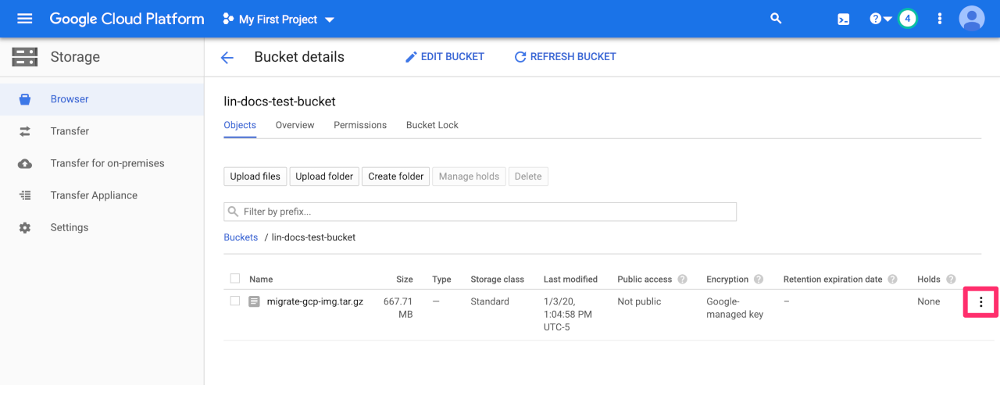
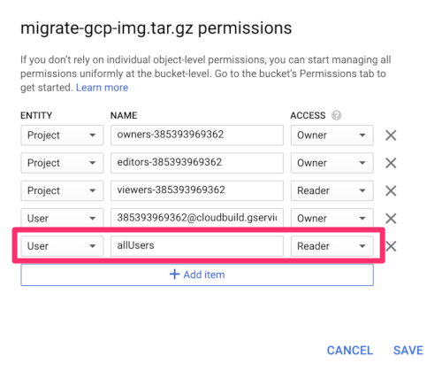
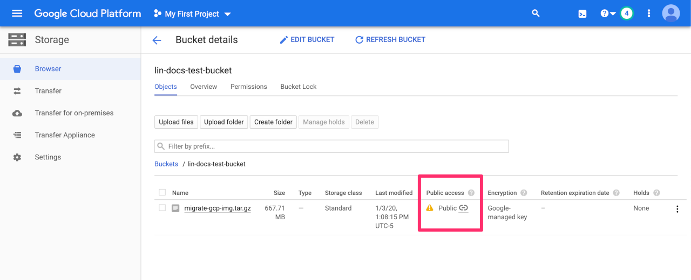
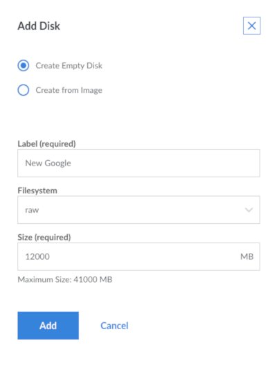
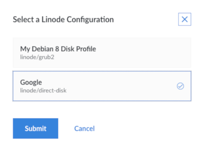

This guide describes the recommended strategy for migrating your services from a Google Cloud Platform (GCP) VM instance to Linode. The specific steps you’ll need to carry out will vary depending on the software you use, but the high-level outline is generally the same regardless of the nature of your service. The Migrate to Linode section offers other guides which describe migrating particular services in more detail.

## Deciding on a Migration Strategy

There are three general strategies for migrating from another hosting provider:

1.  **Migration Strategy 1: Manually Install Each Service Individually - Recommended Method**

    -  Create a Linode, deploy a Linode-provided Linux image to it, and copy over only the configuration and data relevant to your services. This results in a Linux environment that is guaranteed to boot normally on the Linode platform.

        Re-installing your services can take time, but any issues that come up when setting up your applications are usually easier to troubleshoot than low-level configuration problems. This is the recommended strategy when migrating.

1. **Migration Strategy 2: Use Configuration Management and Orchestration - Recommended Method**

    - If you use configuration management and orchestration tools, like Ansible, Salt, Chef, and Terraform, you can use the same tools to deploy a new Linode instance. You can use your existing configuration management files as a foundation to deploy Linode instances with the same configurations used by your GCP instance.

        We have an extensive [configuration management section](/docs/applications/configuration-management/) in our Guides and Tutorials library that you can use to get started with your preferred tool.

1.  **Migration Strategy 3: Transfer your Disk Images - Not Recommended**

    -  Create a Linode and perform a full clone of your existing disks from your GCP instance to the Linode. This will create an exact copy of your disks on the Linode platform. This strategy is not recommended because low-level system configuration files can be different on different hosting providers.

        These differences can prevent your Linode from booting normally. It is possible to adjust these settings sufficiently to allow your Linode to run normally, but getting the right values for these settings can be difficult, and it can be difficult to troubleshoot when they are incorrect. However, if you are confident in using this method, you can proceed to the Transfer your GCP disks to Linode section of this guide.

## Migration Strategy 1: Manual Migration Strategy

### Deploy a New Linode

There are two considerations when creating a new Linode: which data center the Linode should reside in, and which hardware resource plan the Linode should run under.

1.  **Data Center Location**

    -  To choose a data center location, run speed tests to the different regions that Linode offers from the [speedtest page](http://www.linode.com/speedtest/). This page allows you to download a 100MB file from each location. Compare the speed of each download to determine the bandwidth between your location and the data center.

        You can also run [MTR tests](/docs/guides/diagnosing-network-issues-with-mtr/) to the speed test servers at each location (e.g. `speedtest.dallas.linode.com`). These tests will report latency between your location and the data center--a lower latency is more desirable.

1.  **Plan Size**

    -  To determine which plan to choose, review the [Linode Pricing page](https://www.linode.com/pricing/). At a minimum, choose a plan which offers enough storage capacity for the data you store on your current GCP VM instance.

        CPU and RAM allocations are also important since a service with a higher workload/higher traffic will require more of each. If you're not sure what your workload will require, start with a smaller Linode and then [resize your plan](/docs/guides/resizing-a-linode/) up or down as needed.

### Deploy a Linux Distribution to your Linode

Determine the Linux distribution your current GCP instance uses and deploy that to your new Linode. If your current deployment uses an older version of a Linux distribution, deploy the newest version available for your new Linode to ensure the latest security enhancements and software availability.

For further details on deploying your new Linux image, follow the [Getting Started with Linode](/docs/guides/getting-started/) guide. It is also recommended that you follow the [Setting Up and Securing a Compute Instance](/docs/guides/set-up-and-secure/) guide once you have deployed your new image.

### Install Software on your Linode

1. Install the same software stack that is present on your GCP instance onto your new Linode. You can use your GCP instance's package manager to retrieve a list of all installed packages. For example, if you are using Debian or Ubuntu you can issue the following command:

        apt list --installed

1. Once you have identified the software you would like to migrate to your Linode, you can reference our [Guides & Tutorials](/docs/) to learn how to set up your system's software on your new Linode.

    For example, if your GCP instance is used to run a WordPress site, you should [install WordPress](/docs/guides/install-wordpress-ubuntu-18-04/), [PHP, MySQl, and Apache](/docs/guides/how-to-install-a-lamp-stack-on-ubuntu-18-04/) or [Nginx](/docs/guides/how-to-install-the-lemp-stack-on-ubuntu-18-04/) (web server) on your Linode instance.

### Create a Snapshot of your GCP Data

Locate and backup the data on your GCP instance by [creating a snapshot](https://cloud.google.com/compute/docs/disks/create-snapshots). Identify:

- Which software configuration settings should be preserved (e.g. web server, virtual host information, database connection settings, and which files contain these settings, etc.).

- Where your data is stored on disk (e.g. as files in a directory, in a database process, etc.).

If your data is stored in a database, you will likely need to perform a *database dump*. This will result in a file on disk that encapsulates your database data and can be copied over the network as a normal file:

-  [Use mysqldump to Back Up MySQL or MariaDB](/docs/guides/mysqldump-backups/)
-  [Create Physical Backups of your MariaDB or MySQL Databases](/docs/guides/create-physical-backups-of-your-mariadb-or-mysql-databases/)
-  Use [postgres dump database](/docs/guides/how-to-back-up-your-postgresql-database/)

### Use rsync to Transfer Your GCP Data to Your Linode

- Transfer your data to your Linode using a network transfer tool like `rsync`. The [Introduction to rsync](/docs/guides/introduction-to-rsync/) guide is a good place to become more familiar with this tool.

    For example, the following command will upload files from `/path/to/source_folder` on the current host to `/path/to/destination_folder` on the new Linode. Run this command from your current GCP instance. Replace `example_user` with the Linux user on your Linode, and `linode_ip_address` with your Linode's IP address:

        rsync -avzh /path/to/source_folder example_user@linode_ip_address:/path/to/destination_folder

- If you have uploaded a database dump file to your new Linode, you will also need to *restore* the dump file so that your database software can use the data normally. The database guides linked to in the [Create a Snapshot of your GCP Data](#create-a-snapshot-of-your-gcp-data) section include instructions for restoring those files.

### Test the New Environment

When you have finished setting up your software and restoring your data, test the installation to make sure it works normally. At this point, you have not yet updated DNS records to point to your Linode deployment, but there are still methods for [previewing your services without DNS](/docs/guides/previewing-websites-without-dns/).

Take this time to perform load testing on your new service. [ApacheBench](https://en.wikipedia.org/wiki/ApacheBench) is a popular benchmarking tool for web services. If you discover that the hardware resource plan you chose originally is not enough when completing these load tests, then [resize your plan](/docs/guides/resizing-a-linode/) and continue testing.

When you have finished testing, move on to the last step in migrating: updating your DNS records.

## Migration Strategy 2: Use Configuration Management and Orchestration Tools

If you are managing your GCP instance with configuration management and orchestration tools, you can use the same tools to manage your Linode. This means you can use configuration management tools to execute a migration from GCP to Linode. At a high-level this process would entail

- Using an orchestration tool, like Terraform, to [deploy a Linode instance(s)](/docs/applications/configuration-management/how-to-build-your-infrastructure-using-terraform-and-linode/) of the required size and region. See the [Deploy a New Linode](#deploy-a-new-linode) section of this guide for tips on choosing a Linode data center and plan size.

- Using a configuration management tool, like Ansible, to [install system software and perform system configurations](/docs/guides/getting-started-with-ansible/). In many cases, you could use the same configuration management files to configure your Linode. For example, if you were using an [Ansible Playbook](/docs/guides/running-ansible-playbooks/) to deploy and configure a LAMP stack on your GCP instance, you can likely use the same Playbook to manage your Linode instance.

- [Migrating any additional GCP instance data to your new Linode instance using rsync](#use-rsync-to-transfer-your-gcp-data-to-your-linode).

- [Testing your new Linode environment](#test-the-new-environment).

    
The following configuration management and orchestration tools support Linode:

Configuration management tools: [Ansible](/docs/guides/getting-started-with-ansible/), [Salt](/docs/guides/beginners-guide-to-salt/), [Chef](/docs/guides/beginners-guide-chef/), and [Puppet](/docs/guides/getting-started-with-puppet-6-1-basic-installation-and-setup/)

Orchestration tools: [Pulumi](/docs/guides/deploy-in-code-with-pulumi/), [Terraform](/docs/guides/beginners-guide-to-terraform/), [Ansible](/docs/guides/getting-started-with-ansible/)
    

## Migration Strategy 3: Transfer your Disk Images

### GCP Prerequisites

This section contains all of the preparation steps that you will need to complete on the Google Cloud Platform and on your GCP instance in order to migrate your disk images to Linode. At a high-level, you will disable Google specific daemons running on your GCP instance, create and export an image of your instance, and store the image in a GCP object storage bucket.


While it is possible to migrate a GCP disk image to Linode, due to differences in low-level system configurations between GCP and Linode, you may encounter some unexpected results that require additional troubleshooting steps. Continue with this method only if you are confident in your understanding of the Google Cloud Platform, [GCP IAM roles](https://cloud.google.com/iam/docs/understanding-roles), and [GCP disks and images](https://cloud.google.com/solutions/image-management-best-practices).


### Install and Set Up gcloud


If you have already installed the Google Cloud SDK on your computer, you can skip this section.


The [Google Cloud SDK](https://cloud.google.com/sdk/docs/) gives you access to the `gcloud` command-line tool. You will need `gcloud` to create and export an image of your GCP instance. You will [create the instance image](#create-and-export-image) later on in this guide.

1.  Download and install the latest [Google Cloud SDK](https://cloud.google.com/sdk/docs/) for your operating system.

1.  Setup [gcloud compute](https://cloud.google.com/compute/docs/gcloud-compute/) by running the following command:

        gcloud init

    
`gcloud init` will guide you through a setup process and ask to use your browser to log in to your Google account. If you do not have access to a browser, you can use the following command to force console only setup. This method will give you a URL to paste into a browser for verification, which in turn, will give you a verification code to paste back into your console:

    gcloud init --console-only
    

    The setup will ask you for your `project id`, `region`, and `zone`. You can find these values from your Google Cloud Platform account. Check [the GCP documentation](https://cloud.google.com/compute/docs/regions-zones/) for a full list of Google regions and zones.

### Create a GCP Object Storage Bucket

When you create an image of your GCP instance you will temporarily store it in a [GCP object storage bucket](#create-and-export-a-disk-image). Follow the steps in this section to create the GCP object storage bucket.


Using the GCP object storage service will incur additional charges outside of the cost of your GCP instance.


1. Navigate to your [GCP dashboard](https://console.cloud.google.com/home/dashboard). From the left sidebar menu, under the *Storage* section, click **Storage**.

1.  Create an object storage bucket. You can follow GCP's inline steps to complete this process. For more information on GCP object storage access control options, see their [official documentation](https://cloud.google.com/storage/docs/access-control/).

### Prepare Your GCP Instance

Now that you have completed the prerequisite steps, you are ready to prepare your GCP instance for its migration to Linode. This will require creating a root password, turning off Google daemons, and creating and exporting a GCP image.

#### Root Password
GCP instances don't have root or user passwords setup by default, you will create these so that you can log into your machine after you migrate it.

1. [SSH into your GCP instance](https://cloud.google.com/compute/docs/instances/connecting-to-instance).

1.  Once you're logged into your GCP instance with ssh, run the following command to set a root password:

        sudo passwd

1.  If you want to set a password for your user account, switch to root and then set user account passwords. Ensure you replace `username` with the username for which you want to set a password:

        su
        passwd username

1. Return to your normal user, if desired:

        exit

#### Inspect your GCP Instance's Disks

Before continuing with the preparation to migrate, you should inspect your GCP instance for the following information:

- The number of non-volatile disks located on your instance.
- The amount of storage space each disk takes up. In the [Prepare Your Linode](#prepare-your-linode) section, you will need to know the size of each disk you would like to migrate in order to select the appropriate plan size for the Linode you will be migrating to.
- Determine which disk(s) you would like to migrate to your new Linode. You will need to repeat the steps in the [Create and Export Image](#create-and-export-image) and the [Create New Disks and Configurations](#create-new-disks-and-configurations) sections for each non-volatile disk on your GCP instance that you would like to migrate to your Linode.

    
At minimum, you will migrate your GCP instance's boot disk. On a Linux system, without a custom boot disk configured, this is likely `/dev/sda1`.
    

1. To inspect your GCP instance's disks, [ssh into your GCP instance](https://cloud.google.com/compute/docs/instances/connecting-to-instance#gcetools) and issue the following command to view disk size on each mounted disk:

    
  The usable disk space that is reported by `df` reflects only 90 percent of full capacity.
    

        df -h

      You should see a similar output:

      
Filesystem      Size  Used Avail Use% Mounted on
udev            3.7G     0  3.7G   0% /dev
tmpfs           749M  9.9M  739M   2% /run
/dev/sda1       9.8G  1.2G  8.2G  13% /
tmpfs           3.7G     0  3.7G   0% /dev/shm
tmpfs           5.0M     0  5.0M   0% /run/lock
tmpfs           3.7G     0  3.7G   0% /sys/fs/cgroup
      

    You can also issue the following command, which displays all available block devices:

        lsblk

    Your output should resemble the following:

    
NAME   MAJ:MIN RM SIZE RO TYPE MOUNTPOINT
sda      8:0    0  10G  0 disk
└─sda1   8:1    0  10G  0 part /
    

    In this example, you will create a disk image for `/dev/sda1` and you will need, at minimum, 10GB of storage. For more details related to Linode plan size considerations see the [Create a Linode](#create-a-linode) section.

#### Turn Off Google Daemons
Before you migrate the instance, turn off the daemons that communicate with Google servers. If you don't do this, once you move to Linode, these services will continually try to access Google servers and fail if the daemons are still running.

1. With the text editor of your choice, create a new file called `/etc/default/instance_configs.cfg.template` file. Copy and paste the configurations in the example file:

        sudo nano /etc/default/instance_configs.cfg.template

    
[Daemons]
accounts_daemon = false
clock_skew_daemon = false
network_daemon = false
ip_forwarding_daemon = false
    

1.  Regenerate the `instance_configs.cfg` file with your changes by running the following script:

        sudo /usr/bin/google_instance_setup

    Verify that the changes took effect by viewing the contents of the `/etc/default/instance_configs.cfg` file. The `[Daemons]` section should resemble the file you created in step 1.

        cat /etc/default/instance_configs.cfg

1.  Stop and disable the daemons:

        sudo systemctl stop google-accounts-daemon
        sudo systemctl disable google-accounts-daemon
        sudo systemctl stop google-clock-skew-daemon
        sudo systemctl disable google-clock-skew-daemon
        sudo systemctl stop google-network-daemon
        sudo systemctl disable google-network-daemon
        sudo systemctl stop google-ip-forwarding-daemon
        sudo systemctl disable google-ip-forwarding-daemon

      
If your GCP instance was not created with IP forwarding enabled, then you may see a similar message after attempting to stop and disable the `google-ip-forwarding-daemon`:

    sudo systemctl disable google-ip-forwarding-daemon
    Failed to disable unit: No such file or directory
    user@test-instance:~$ sudo systemctl --status
    systemctl: unrecognized option '--status'
    user@test-instance:~$ sudo systemctl status
      

#### Stop Your GCP Instance
In order to create your instance's disk image in the next section, you will first need to stop the instance. This will prevent any new data from being written to the persistent disk.


GCP recommends stopping your instance prior to creating a disk image, however, it is possible to keep the instance running while you create your image. See their [official documentation](https://cloud.google.com/compute/docs/images/create-delete-deprecate-private-images#prepare_instance_for_image) for details.


1.  Navigate to your [GCP dashboard](https://console.cloud.google.com/home/dashboard). From the left sidebar menu, under *Compute*, click **Compute Engine**.

1.  Viewing your VM instances, click on the more options ellipsis for your instance and select **Stop**.

#### Create and Export a Disk Image

You are now ready to create and export an instance image using the `gcloud` command-line tool. If you have not [installed the Google Cloud SDK](#install-and-set-up-gcloud), you will need to do so before proceeding.

1.  Create an instance disk image with the command below. Replace `migrate-gcp-img` with a name you want to give your image, `test-gcp-instance` with the name of your instance's disk, `us-east1-b` with the zone for your instance, `debian-9` with the distribution [image family](https://cloud.google.com/compute/docs/images) for your instance, and `us-east1` with the region where you want your image to be stored.

        gcloud compute images create migrate-gcp-img --source-disk test-gcp-instance --source-disk-zone us-east1-b --family debian-9 --storage-location us-east1

1.  The output will look similar to the following:

    
Created [https://www.googleapis.com/compute/v1/projects/speedy-area-263218/global/images/migrate-gcp-img].
NAME             PROJECT             FAMILY    DEPRECATED  STATUS
migrate-gcp-img  speedy-area-263218  debian-9              READY


1.  Export the image to object storage with the command below. Replace `lin-docs-test-bucket` with your bucket name, `migrate-gcp-img` with your image name, and `speedy-area-263218` with your project id. This process may take a few minutes to complete.

        gcloud compute images export --destination-uri gs://lin-docs-test-bucket/migrate-gcp-img.tar.gz --image migrate-gcp-img --project speedy-area-263218

    
You may need to respond to some command-line prompts before the image is exported.
    

1.  The output will look similar to the following:

    
...
[image-export]: 2020-01-03T18:05:46Z Step "image-export-export-disk" (IncludeWorkflow) successfully finished.
[image-export]: 2020-01-03T18:05:46Z Serial-output value -> source-size-gb:10
[image-export]: 2020-01-03T18:05:46Z Serial-output value -> target-size-gb:1
[image-export]: 2020-01-03T18:05:46Z Workflow "image-export" cleaning up (this may take up to 2 minutes).
[image-export]: 2020-01-03T18:05:52Z Workflow "image-export" finished cleanup.


1. From your [GCP dashboard](https://console.cloud.google.com/home/dashboard), navigate to your **Storage Browser** and click on the GCP object storage bucket that you exported your instance image to.

1.  You will see your instance image listed. Click on its corresponding more options ellipses and select **Edit Permissions** from the drop down menu.

    
  If you do not see the **Edit Permissions** option, then your bucket may have been created with uniform access controls. To make the image publicly accessible, see GCP's [official documentation](https://cloud.google.com/storage/docs/access-control/making-data-public) for information on making data public. When you have completed the steps listed in the GCP documentation proceed to step 8 of this section.
    

    

1.  In the dialog box popup, click the **Add Item** button to add a new row to the table. Select `User` for Entity, `all Users` for Name, and `Reader` for Access. Then click the **Save** link.

    

1.  Now you will see that the status under the **Public access** column for this bucket item is set to *Public* with a link icon.

    

1.  **Right click** the link icon and click **Copy Link Address** to copy this object's link address. Paste it into a text file somewhere to save for later. It will resemble the following link:

        https://storage.googleapis.com/lin-docs-test-bucket/migrate-gcp-img.tar.gz

### Prepare Your Linode
In this section you will create a new Linode, add a new disk and configuration profile in order to boot the Linode from your GCP instance's image, import the GCP image to your Linode, and finally, boot your Linode using your GCP instance's image.


You will be importing your GCP image onto a *raw* disk with the *direct disk* boot option. This will result in a working custom installation; however, it will not support advanced Linode features such as [disk resizing](/docs/guides/resizing-a-linode/) or the [Backup Service](/docs/products/storage/backups/) by default. These features require an `ext4` formatted disk.

If you would like access to these features after completing your migration, ensure you complete the following steps:

- Create a Linode with **twice the storage space** of your [original disk image](#inspect-your-gcp-instances-disks). You can always resize it down later. See the [How Linode Billing Works](/docs/platform/billing-and-support/how-linode-billing-works/#how-hourly-billing-works) guide for details on how hourly billing works.

- Follow the steps in the optional section [Transfer Disk to ext4](#optional-transfer-disk-to-ext4).


### Create a Linode

You will first create a new Linode to import your GCP image to and then, boot the Linode from that image. Before creating your Linode, verify the storage size of your original GCP disk if you have not already.

1.  Log into the [Cloud Manager](https://cloud.linode.com).

1. Access the Linode create page by clicking **Create** at the top of the screen and selecting **Linode** from the dropdown menu.

1. Create a Linode by making the desired selections on the Linode create page. For more detailed steps, see the [Creating a Compute Instance](/docs/guides/creating-a-compute-instance/) guide.

    
When selecting your Linode's plan, if you want to have access to advanced features like resizing your Linode and our [Backup Service](/docs/products/storage/backups/), choose one that will be large enough to hold twice the size of the entire expanded [disk image](#inspect-your-gcp-instances-disks) that you created from your GCP instance (not just the size of the compressed tar file). This is needed so that later you can  move your installation over to an ext4 formatted disk. Once the move to an ext4 formatted disk is complete, you can delete the raw disk and [resize to a smaller plan](/docs/guides/resizing-a-linode/).
  

1.  Once the Linode is finished provisioning, power it down. Click on the **Running** status at the top of the Cloud Manager and select **Power Off** from the drop down menu.

1.  [Disable *Watchdog*](/docs/uptime/monitoring-and-maintaining-your-server/#configure-shutdown-watchdog), also known as *Lassie*, which is a Linode Cloud Manager feature capable of automatically rebooting your Linode if it powers off unexpectedly. Click the **Settings** tab, then **Shutdown Watchdog**. Toggle the **Enabled** switch to **Disabled**.

1.  Disable your Linode's Auto Resize capability. Click the **Resize** tab and scroll to the bottom of the screen. Uncheck the box for **Auto Resize Disk**.

### Create New Disks and Configurations

In this section you will create a new disk and boot configuration in order to be able to boot your Linode from your GCP image.

1.  Access your Linode's **Disks/Configs** tab.

1.  Under the **Disks** panel click the more options ellipses next to the main disk (for example, `Debian 9 Disk`) and select **Resize** from the drop down menu. Resize this disk to make room for the new raw disk you will create in the next step. The new raw disk is where your GCP image will be installed.

    
If, for example, your GCP disk image's size is 10GB, ensure that you resize the main disk to make enough room for a new disk that is slightly larger than 10 GB (11 GB, for example). This will ensure that you can safely reboot your Linode from the extracted image (you will complete that step in a later section).
    

1.  Click **Add a Disk** and create a new `Empty Disk`. Give it a label like "New Google", for filesystem, select `raw`, and for size, enter a size that will accommodate the entire extracted image. Click the **Add** button.

    

1.  Click **Add a Configuration** and setup a new Linode Configuration with the following settings:

    - Label: Google
    - Kernel: Direct Disk
    - /dev/sda: New Google (your new disk)
    - /dev/sdb: select the default swap disk when the Linode was created
    - Root Device: /dev/sda
    - Filesystem/Boot Helpers: disable all of these settings

1. Click on the **Submit** button to complete creating the new configuration.

### Import the Image

1.  Click the **Rescue** tab.

1.  Set `/dev/sda` to your **new disk**. In this example, the disk is named "New Google". Set all remaining options to **None**.

1.  Click the **Reboot into Rescue Mode** button. The Linode will reboot into *Rescue* mode.

1.  Once booting is complete, click **Launch Console** at the top of the screen. This opens the `Weblish` and `Glish` console window. You will be presented with a `Finnix` rescue terminal and root prompt.

1.  Run the following command to pull your image from Google cloud storage, unpack it, and copy it to the Linode. Replace the URL with the one you copied from your [GCP object storage bucket](#create-a-gcp-object-storage-bucket).

        curl -k https://storage.googleapis.com/lin-docs-test-bucket/migrate-gcp-img.tar.gz | tar -xzO  | dd of=/dev/sda

1.  The output will look similar to the following:

    
  % Total    % Received % Xferd  Average Speed   Time    Time     Time  Current
                                 Dload  Upload   Total   Spent    Left  Speed
100  667M  100  667M    0     0  1156k      0  0:09:51  0:09:51 --:--:-- 81996
20971520+0 records in
20971520+0 records out
10737418240 bytes (11 GB) copied, 593.648 s, 18.1 MB/s


1.  When this completes, close the console and return to the Cloud Manager. Click the **Running** status, select **Reboot**, choose the Google configuration that you created above, and click on **Submit**.

    

1.  Once booting is complete, click **Launch Console** at the top of the screen. Again, this opens the `Weblish` and `Glish` console window. This time, you should have a regular [Lish shell](/docs/guides/using-the-lish-console/). You should also be able to SSH to your Linode at this time.

    
If you are having trouble with ssh starting, you may have to run the following command to start the service from Lish:

    sudo service ssh start

You may also need to update your SSH server's configuration file to temporarily allow password authentication. Your GCP instance may have been configured to disallow password authentication and it may not have your computer's SSH keys stored.

1. Open your SSH server's configuration file with your preferred text editor:

         sudo nano /etc/ssh/sshd_config

1. Find the `PasswordAuthentication` configuration and set its value to `yes`:

          PasswordAuthentication yes

See the [SSH guide](/docs/guides/troubleshooting-ssh/) for more SSH troubleshooting tips.
    

### Remove Google Packages

You disabled the Google services from calling out before creating and migrating your image, however, there are a few Google packages that you may want to remove. From the console run the following commands:

    sudo dpkg -r google-osconfig-agent
    sudo dpkg -P google-osconfig-agent
    sudo dpkg -r --force-depends google-compute-engine-oslogin
    sudo dpkg -r google-cloud-sdk
    sudo dpkg -r google-cloud-packages-archive-keyring

### Optional: Transfer Disk to ext4

As stated above, to take advantage of features like resizing your disks in Cloud Manager and Backup Service, you'll need to move your new disk to an ext4 formatted disk. To do this, follow the procedures in the Linode Manager Compatibility section of the [Install a Custom Distribution on a Linode guide](/docs/tools-reference/custom-kernels-distros/install-a-custom-distribution-on-a-linode/#linode-manager-compatibility).

### Cleaning Up

When you're done:

- [Test your new Linode environment](#test-the-new-environment) as outlined in the Migration Strategy 1 section of this guide.
- [Delete the original disk](/docs/guides/disks-and-storage/#deleting-a-disk) that was created when you first deployed the Linode. If you chose to transfer your disk to ext4, delete the raw disk you created to import the GCP image.
- [Resize your Linode](/docs/guides/resizing-a-linode/) to a smaller plan or resize your remaining ext4 disk or raw disk to take up the rest of the storage space.
- [Delete the Configurations for the original Linode](/docs/guides/linode-configuration-profiles/#deleting-a-configuration-profile) when it was created. Optionally, delete the configuration for the raw disk if you created a new one for the ext4 boot disk.
- [Enable Shutdown Watchdog](/docs/uptime/monitoring-and-maintaining-your-server/#configure-shutdown-watchdog) (Lassie) under the **Settings** tab.

## Additional Migration Considerations

### Migrating DNS Records

To direct your visitors to your Linode, associate your domain with [your new Linode's IP](/docs/guides/managing-ip-addresses/). There are two options for moving your DNS records:

-  Use Linode's fast, stable [DNS hosting](/docs/products/networking/dns-manager/) which is free as long as you have one active Linode on your account.

-  Continue to use your current nameserver authority and update your DNS records with your new Linode's IP address. You should check with your current provider to see if there are any costs for their DNS services. If you are using your domain name registrar's nameservers, then they are generally free.



### Alternative: Use Your Current Nameservers

If you'd like to continue with your current nameservers, update all of the DNS records that are assigned to your old host's IP address to use your new Linode's IP. Contact your nameserver authority for instructions on how to update your DNS records.



After DNS propagation has finished, [set reverse DNS](/docs/guides/configure-your-linode-for-reverse-dns/) for your domain. This is especially important if you are running a mail server.

## Next Steps

After completing the steps above, your service should be fully migrated to Linode. It is a good idea to wait a few days before cancelling your shared hosting service to make sure that everything is running smoothly, and to confirm that you don't need to obtain more files from your shared host.
