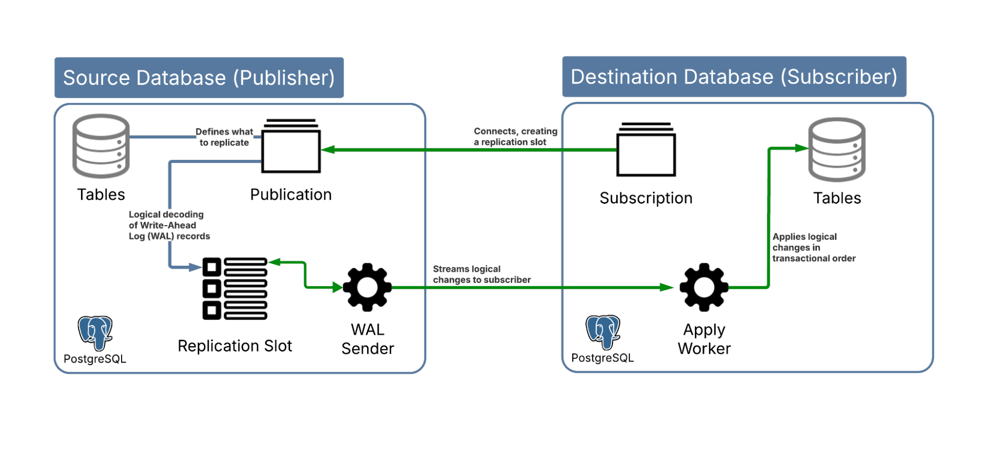
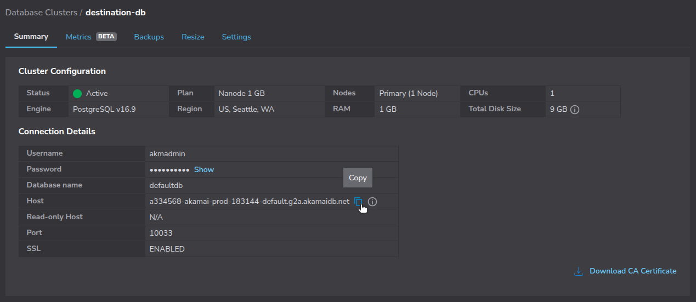

Logical replication with PostgreSQL allows you to stream changes from one database (the publisher) to another (the subscriber) at the table level. This makes it possible to replicate data across environments in near real-time, without disrupting the source database by taking it offline.

[Logical replication](https://www.postgresql.org/docs/current/logical-replication.html) is an alternative approach to the "dump-and-restore" method often used for data replication or migration. Logical replication is useful if you want:

-   **Zero Downtime Migration**: Keep the source database online while synchronizing data to the destination.
-   **Continuous Synchronization**: Maintain an ongoing sync between source and destination databases.
-   **Selective Table Replication**: Only replicate specific tables, rather than the entire database.

This guide walks through the process of setting up logical replication from an existing PostgreSQL database to a [Linode Managed Database](https://www.linode.com/products/databases/) running PostgreSQL.

## Things to Know Before Getting Started

Before configuring logical replication, review the following key concepts and requirements. Understanding these can help you configure your databases correctly and avoid common issues during replication.

### Key Terminology

Logical replication in PostgreSQL follows a *publisher/subscriber* (pub/sub) model. Here, the source database publishes table-level changes and one or more subscribers receive and apply them.

-   **Publisher**: The source PostgreSQL database that exposes data changes through one or more publications.
-   **Subscriber**: The destination PostgreSQL database that connects to a publisher and applies changes locally.
-   **Publication**: A named set of tables on the publisher whose changes are made available to subscribers.
-   **Subscription**: A replication object on the subscriber that connects to a publisher and retrieves changes from its publications.
-   **Write-Ahead Log (WAL)**: A sequential log of all database changes. Logical replication reads table-level changes decoded from this log.
-   **Replication Slot**: Tracks the progress of each subscriber and retains required WAL segments until they’ve been consumed.
-   **WAL Sender (`walsender`)**: A background process on the publisher that streams WAL-derived changes to the subscriber.
-   **Apply Worker**: A background process on the subscriber that replays incoming changes in transactional order.

The diagram below illustrates the logical replication flow between the publisher and subscriber:

(refer to diagram below) Logical Replication Flow



-   The publisher defines what to replicate via a publication.
-   Changes are captured from the Write-Ahead Log (WAL) and managed through a replication slot.
-   A WAL sender streams these changes to the subscriber, which uses an apply worker to write them to local tables.

### PostgreSQL Version Compatibility

Logical replication works across major versions of PostgreSQL, but some features may have compatibility limitations. Confirm that your source and destination PostgreSQL versions both support logical replication and are compatible with each other.

### Server Settings

To enable logical replication, the source database server must be configured with the following parameters:

-   `wal_level`: Must be set to `logical` to enable logical decoding.
-   `max_replication_slots`: At least one slot is required per subscription.
-   `max_wal_senders`: Should be equal to or greater than `max_replication_slots`.

### Roles and Permissions

The source database should have a dedicated replication user. This user must have the `REPLICATION` attribute and `SELECT` privileges on any tables to be replicated. This is a security best practice, as it avoids using superuser or administrator accounts for replication purposes.

### Network Access

Replication requires that the destination database can connect to the source over the network. This means ensuring the source database accepts connections from the Linode Managed Database host.

## Before You Begin

1.  Follow our [Get started](https://techdocs.akamai.com/cloud-computing/docs/getting-started) guide to create an Akamai Cloud account if you do not already have one.

1.  Follow the steps in the Akamai Cloud documentation to [create a new database cluster](https://techdocs.akamai.com/cloud-computing/docs/aiven-manage-database#create-a-new-database-cluster).

1.  [Set up access control](https://techdocs.akamai.com/cloud-computing/docs/aiven-manage-database#access-control) so that you can connect to the database from your local machine.

1.  Install the [Linode CLI](https://techdocs.akamai.com/cloud-computing/docs/install-and-configure-the-cli) on your local machine.

1.  Install the `psql` client on your local machine:

    ```command
    sudo apt install postgresql-client
    ```

1.  Ensure you have administrative access to your source PostgreSQL database.

### Placeholders and Examples

The following placeholders and example values are used in commands throughout this guide:

| Parameter | Placeholder | Example Value |
|------------|--------------|----------------|
| Destination Hostname or IP Address |  | `a334568-akamai-prod-183144-default.g2a.akamaidb.net` |
| Destination Port Number |  | `10033` |
| Destination Database Name |  | `defaultdb` |
| Destination Username |  | `akmadmin` |
| Destination Password |  | `thisismydestinationpassword` |
| Source Hostname or IP Address |  | `psql.managed-db-services.example.com` |
| Source Port Number |  | `5432` |
| Source Database Name |  | `postgres` |
| Replication Username |  | `linode_replicator` |
| Replication Password |  | `thisismyreplicatorpassword` |
| Publication Name |  | `my_publication` |
| Subscription Name |  | `my_subscription` |

Replace these placeholders with your own connection details when running commands in your environment.

Additionally, the examples used in this guide assume the source database contains three tables (`customers`, `products`, and `orders`) that you want to replicate to a Linode Managed Database.

### Example Scenario

The examples used in this guide assume you have an existing PostgreSQL database hosted with a managed service from a cloud provider. This source database contains three tables (`customers`, `products`, and `orders`) that you want to replicate to a Linode Managed Database for PostgreSQL.


## Configure the Source Database

The source PostgreSQL database must be properly configured to support logical replication and accept incoming connections from your Linode Managed Database.

### Obtain the IP Address of the Destination Database Host

To configure access control on your source database, you first need the IP address of your Linode Managed Database. Begin by identifying your destination host ().



1.  In the [Akamai Cloud Manager](https://cloud.linode.com/), navigate to **Databases**, then select your database cluster and copy the **Host** string:

    

    In the example above, the  value is `a334568-akamai-prod-183144-default.g2a.akamaidb.net`


1.  To find the host using the Linode CLI, run the following command to list your databases:

    ```command
    linode databases list --json
    ```

    Locate the `primary` host listed for your destination database:

    ```output
    [
      {
        "allow_list": [
          "2606:4700:3035::ac43:bc7a/128",
        ],
        "engine": "postgresql",
        "hosts": {
          "primary": "a334568-akamai-prod-183144-default.g2a.akamaidb.net"
        },
        "id": 334568,
        "label": "destination-db",
        "port": 10033,
        "region": "us-sea",
        "status": "active",
        "total_disk_size_gb": 9,
        "type": "g6-nanode-1",
        "version": "16.9",
        ...
      },
      ...
    ]
    ```

    In the example above, the  value is `a334568-akamai-prod-183144-default.g2a.akamaidb.net`



2.  Use an online service or `nslookup` to determine the IP address of the database host. Replace  with your actual value (e.g., `a334568-akamai-prod-183144-default.g2a.akamaidb.net`):

    ```command
    nslookup 
    ```

    ```output
    Non-authoritative answer:
    Name:	a334568-akamai-prod-183144-default.g2a.akamaidb.net
    Address: 172.232.188.122
    Name:	a334568-akamai-prod-183144-default.g2a.akamaidb.net
    Address: 2600:3c0a::2000:fbff:fe65:756d
    ```

### Prepare the Source Database for Logical Replication

With your Linode Managed Database host’s IP address located, follow the corresponding guide to prepare your source database for logical replication:

-   [Preparing your AWS RDS PostgreSQL Database for Logical Replication to Linode Managed Database](/docs/guides/preparing-your-aws-rds-postgresql-database-for-logical-replication-to-linode-managed-database/)
-   [Preparing your Azure PostgreSQL Database for Logical Replication to Linode Managed Database](/docs/guides/preparing-your-azure-postgresql-database-for-logical-replication-to-linode-managed-database/)
-   [Preparing your Google Cloud SQL PostgreSQL Database for Logical Replication to Linode Managed Database](/docs/guides/preparing-your-google-cloud-sql-postgresql-database-for-logical-replication-to-linode-managed-database/)

After completing the steps in one of the above guides, gather the following information for your *source database*:

| Parameter | Placeholder | Example Value |
|------------|--------------|----------------|
| Source Hostname or IP Address |  | `psql.managed-db-services.example.com` |
| Source Port Number |  | `5432` |
| Source Database Name |  | `postgres` |
| Replication Username |  | `linode_replicator` |
| Replication Password |  | `thisismyreplicatorpassword` |
| Publication Name |  | `my_publication` |

The remainder of this guide uses the example values shown above.

## Configure the Destination Database

Configure your Linode Managed PostgreSQL database as the replication target. This involves two main tasks:

-   Recreating the schema
-   Subscribing to the publication you defined on the source

### Create the Database Schema

Logical replication in PostgreSQL does not copy table definitions, it only replicates the data. This means you must manually create the destination tables to match the source database schema exactly. Use the same column names, types, constraints, and indexes to avoid replication errors.

1.  At the command line, use `pg_dump` with the `--schema-only` flag to connect to your source database and write the resulting SQL statements to a file. Replace  (e.g. `psql.managed-db-services.example.com`),  (e.g. `linode_replicator`), and  (e.g. `5432`) with your own values:

    ```command
    pg_dump \
      -h  \
      -U  \
      -p  \
      --schema-only \
      defaultdb > schema.sql
    ```

    
    If you only want to create the schema for specific tables rather than the entire database, use the `--table` flag. For example, the following command only dumps the schema for the `customers` and `orders` tables:

    ```command
    pg_dump \
      -h  \
      -U  \
      -p  \
      --schema-only \
      --table customers \
      --table orders \
      defaultdb > schema.sql
    ```
    

1.  Inspect the generated SQL statements to confirm that all expected tables and constraints are present:

    ```command
    cat schema.sql
    ```

    ```output
    ...
    CREATE TABLE public.customers (
        id integer NOT NULL,
        name text NOT NULL,
        email text NOT NULL,
        created_at timestamp without time zone DEFAULT CURRENT_TIMESTAMP
    );


    ALTER TABLE public.customers OWNER TO demouser;

    CREATE SEQUENCE public.customers_id_seq
        AS integer
        START WITH 1
        INCREMENT BY 1
        NO MINVALUE
        NO MAXVALUE
        CACHE 1;


    ALTER SEQUENCE public.customers_id_seq OWNER TO demouser;

    ALTER SEQUENCE public.customers_id_seq OWNED BY public.customers.id;
    ...
    ```

1.  In the resulting file, remove or comment out any `ALTER` lines that change the `OWNER`. One way to accomplish this is with `sed`:

    ```command
    sed -i '/^ALTER .* OWNER TO /d' schema.sql
    ```

    
    On macOS, use `-i ''` instead of the above command:

    ```command
    sed -i '' '/^ALTER .* OWNER TO /d' schema.sql
    ```
    

1.  Run the schema file on your Linode Managed Database to create the tables. Replace  (e.g, `a334568-akamai-prod-183144-default.g2a.akamaidb.net`),  (e.g., `akmadmin`),  (e.g, `10033`), and  (e.g., `defaultdb`) with your own values:

    ```command
    psql \
      -h  \
      -U  \
      -p  \
      -d  \
      -f schema.sql
    ```

### Create a Subscription

Once the schema is in place, create a subscription on the destination database. This step connects your Linode Managed Database (the subscriber) to your source database (the publisher) and begins streaming changes.

1.  Use the `psql` client to connect to your Linode Managed Database and enter the interactive prompt:

    ```command
    psql \
      -h  \
      -U  \
      -p  \
      -d 
    ```

1.  In the `psql` prompt, run the [`CREATE SUBSCRIPTION`](https://www.postgresql.org/docs/current/sql-createsubscription.html) command to create a subscription (e.g., `my_subscription`) on the destination database. Remember to substitute placeholders for your own source database values:

    ```command {title="Destination psql Prompt"}
    CREATE SUBSCRIPTION 
      CONNECTION 'host= port= user= password= dbname= sslmode=require'
      PUBLICATION ;
    ```

    ```output
    NOTICE:  created replication slot "my_subscription" on publisher
    CREATE SUBSCRIPTION
    ```

    Once the subscription is created, PostgreSQL begins replicating data from the source to the destination.

1.  When done, type `\q` and press <kbd>Enter</kbd> to exit the destination `psql` shell.

## Monitor and Verify Replication

Once replication is active, monitor its status and verify that data is syncing correctly.

### Check Subscription Status

1.  Use `psql` to establish a connection to the destination (subscriber) database and enter the interactive prompt:

    ```command
    psql \
      -h   \
      -U  \
      -p  \
      -d 
    ```

1.  On the destination database, run the following SQL command to retrieve information about the subscription:

    ```command {title="Destination psql Prompt"}
    SELECT * FROM pg_catalog.pg_stat_subscription;
    ```

    ```output
    -[ RECORD 1 ]---------+------------------------------
    subid                 | 16492
    subname               | my_subscription
    pid                   | 463099
    leader_pid            |
    relid                 |
    received_lsn          | 0/D90038A0
    last_msg_send_time    | 2025-07-24 17:38:44.539465+00
    last_msg_receipt_time | 2025-07-24 17:38:44.575312+00
    latest_end_lsn        | 0/D90038A0
    latest_end_time       | 2025-07-24 17:38:44.539465+00
    ```

    Note the following important fields in the output:

    -   `subname`: The name of the subscription
    -   `received_lsn`: The last WAL location received
    -   `latest_end_lsn`: The last WAL location applied
    -   `last_msg_send_time` and `last_msg_receipt_time`: Timestamps for the most recent activity

1.  When done, type `\q` and press <kbd>Enter</kbd> to exit the destination `psql` shell.

### Compare WAL Positions

To verify how far along the subscriber is, compare the `received_lsn` (or `latest_end_lsn`) from the destination with the current WAL position on the source.

1.  Use `psql` to establish a connection to the source (publisher) database:

    ```command
    psql \
      -h  \
      -U  \
      -p  \
      -d 
    ```

1.  On the source database, run the following SQL command to retrieve the current WAL log sequence number:

    ```command {title="Source psql Prompt"}
    SELECT pg_current_wal_lsn();
    ```

    ```output
    pg_current_wal_lsn
    --------------------
     0/DA0009D8
     (1 row)
    ```

    Compare this value with the `latest_end_lsn` shown on the destination:

    - If they match or are close, replication is current and lag-free.
    - A large gap may indicate replication delay or a connectivity issue.

    
    Small differences are normal on active databases as new WAL entries are generated continuously.
    

1.  When done, type `\q` and press <kbd>Enter</kbd> to exit the source `psql` shell.

### Validate Replicated Data

Verify that the expected data has appeared in the destination (subscriber) database.

1.  Use `psql` to reconnect to your Linode Managed Database and enter the interactive prompt:

    ```command
    psql \
      -h  \
      -U  \
      -p  \
      -d 
    ```

1.  Run validation queries and other table checks to ensure that all rows were copied and continue to stay in sync for example:

    ```command
    SELECT COUNT(*) FROM customers
    ```

1.  When done, type `\q` and press <kbd>Enter</kbd> to exit the source `psql` shell.

You may want to repeat this validation periodically until the cutover is complete.

## Finalize the Cutover

Once replication is stable and the destination database is fully caught up, complete the migration by redirecting application traffic and decommissioning the replication setup.

### Redirect Application Traffic

Update your applications to point to the Linode Managed Database instead of the old source database. This involves changing the database host, port, username, and password in each application's connection settings.

Test application connectivity to the new database in a staging environment or during a maintenance window before routing production traffic to the new database.

### Remove the Subscription

After all applications are using the Linode Managed database as the primary data store, remove the subscription. This stops replication and turns the destination into an independent, writable database.

1.  Use `psql` to reconnect to your Linode Managed Database and enter the interactive prompt:

    ```command
    psql \
      -h  \
      -U  \
      -p  \
      -d 
    ```

1.  Run the following SQL command to remove the subscription from destination database:

    ```command {title="Destination psql Prompt"}
    DROP SUBSCRIPTION ;
    ```

    ```output
    NOTICE:  dropped replication slot "my_subscription" on publisher
    DROP SUBSCRIPTION
    ```

    This command also removes the replication slot from the source database, preventing unnecessary WAL retention.

1.  When done, type `\q` and press <kbd>Enter</kbd> to exit the `psql` shell.

### Retire the Source Database

Once replication has stopped and all applications have switched to the destination database, you can safely decommission the source. Before doing so, make sure:

-   All applications connect exclusively to the new Linode Managed Database.
-   Replicated data has been verified as complete and accurate.
-   Backups exist for both the source and destination databases.

After confirming these items, follow your cloud provider's procedures to delete or archive the source database.

## Considerations and Potential Challenges

Logical replication provides flexibility, but a few common challenges can arise:

-   **Schema Drift**: Changes to table structures on the source are not automatically replicated. Keep schemas aligned manually to avoid replication errors.
-   **Conflicting Writes**: The subscriber should remain read-only during replication. Avoid making manual changes that could conflict with incoming data.
-   **Network Reliability**: Logical replication requires a stable network connection between the destination and source databases. Temporary disconnects can cause lag or stalled replication until connectivity is restored.
-   **Replication Slot Management**: Orphaned replication slots on the source can lead to WAL buildup. Always drop the subscription to clean up replication slots after cutover.