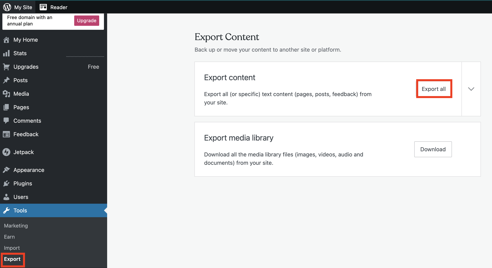
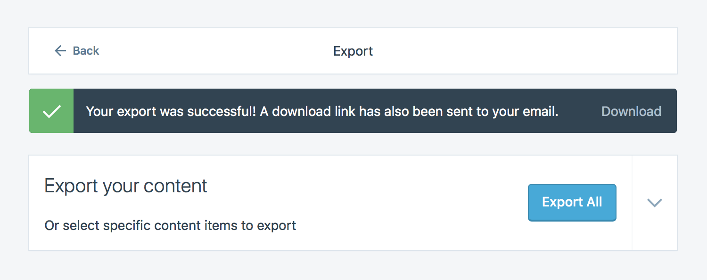
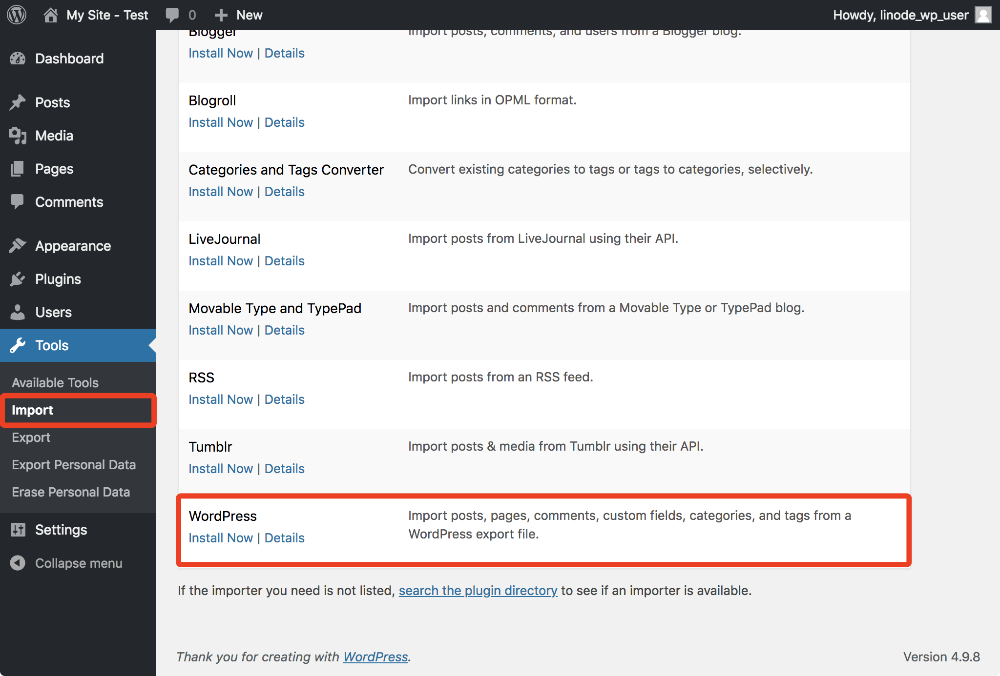
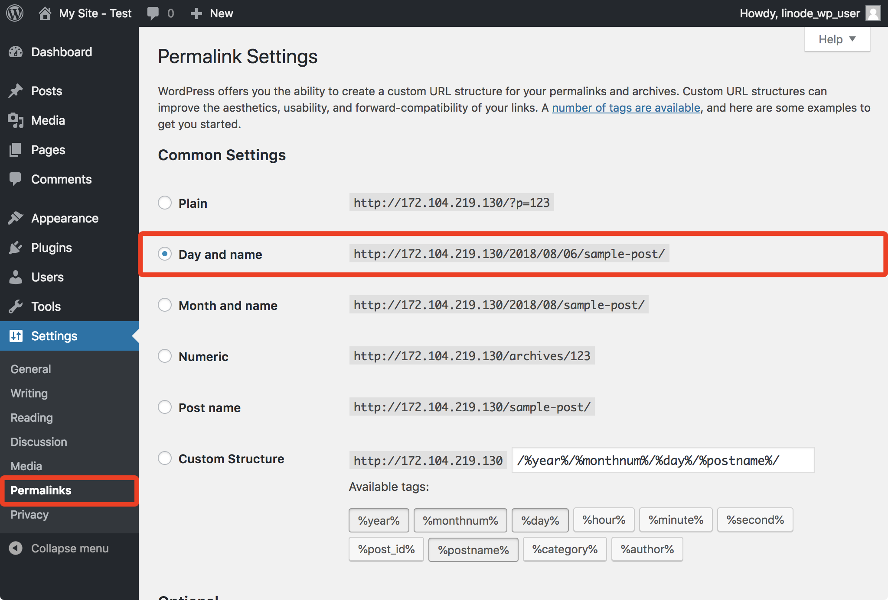

This guide describes how to export your content from WordPress.com and self-host your WordPress website on Linode. Read the [Best Practices when Migrating to Linode](/docs/guides/best-practices-when-migrating-to-linode/) guide prior to following this guide for more information about migrating your site.

Ubuntu 18.04 is used as the distribution for the new Linode deployment in this guide. If you'd like to choose another distribution, use the examples here as an approximation for the commands you'll need to run. You will also install either a [LAMP](/docs/guides/how-to-install-a-lamp-stack-on-ubuntu-18-04/) or [LEMP](/docs/guides/how-to-install-the-lemp-stack-on-ubuntu-18-04/) environment on your new Linode.


WordPress.com's export feature will export pages, posts, and comments from your site, but it will not export your themes and widgets. You will need to customize your new self-hosted WordPress site's appearance after completing your migration.


## Migrate Your Website

### Deploy Your Linode

1.  Follow Linode's [Creating a Compute Instance](/docs/products/compute/compute-instances/guides/create/) guide and choose Ubuntu 18.04 as your Linux image when deploying. Choose a Linode plan with enough storage space to accommodate the website data from your current host.

1.  Follow the [Setting Up and Securing a Compute Instance](/docs/products/compute/compute-instances/guides/set-up-and-secure/) guide and create a limited Linux user with `sudo` privileges.

1.  Follow the [Install WordPress on Ubuntu 18.04](/docs/guides/install-wordpress-ubuntu-18-04/) guide to stand up a new web server and WordPress installation. Later in this guide you will use the WordPress credentials you create during the installation, so be sure to record them.

### Export Your WordPress.com Content

1.  Login to your WordPress.com dashboard and navigate to the `Export` page of the `Tools` section. Choose the `Export all` option under the `Export content` subsection:

    

1.  Click `Export All`, then `Download` to download a compressed file of your content in XML form. A copy will also be emailed to you:

    

    To export posts, pages, or feedback from the site, press the down arrow to the right of the `Export All` button.

1.  Unzip the file.

### Import Your Content on Linode

1.  Visit your Linode-hosted WordPress login from your browser (usually `http://<your-linode-ip>/wp-admin`) and login with your WordPress credentials.

1.  Navigate to the Import page of the Tools section. The WordPress importer plugin will be listed:

    

1.  Choose `Install Now` and then run this plugin. On the page that appears, click `Choose File` and locate the XML file you previously exported from WordPress.com to your computer:

    

1.  A page will appear that surfaces a few import options:

    

    You are able to assign your imported posts to:

    -   Your previous WordPress.com user, which will also be imported
    -   A brand new user that the import plugin will create
    -   One of the WordPress users you've already created on your Linode as part of deploying your web server

    **Be sure to enable** the *Download and import file attachment* option on this page.

1.  Submit this form. Your content will now be imported.

1.  Navigate to the `Permalinks` page in the `Settings` section:

    

1.  Choose the `Day and name` option and save the change. This option matches the permalink style used on WordPress.com.

## Migrating DNS Records

The last step required to migrate is to update your DNS records to reflect your new Linode's IP. Once this is done, visitors will start loading the page from your Linode.



## Next Steps

The WordPress.com team recommends installing the [Jetpack plugin](https://jetpack.com/) on your new self-hosted WordPress site. This free plugin is maintained by the WordPress.com team and provides features available on your WordPress.com site, including analytics, site management tools, and access to the [WordPress.com apps](https://apps.wordpress.com/). [Premium versions](https://jetpack.com/pricing/) of the Jetpack plugin provide extra features.

If you had subscribers on your WordPress.com site, you can also migrate them to your new self-hosted site. This requires that you install the Jetpack plugin and uses Jetpack's [subscription migration tool](https://jetpack.com/support/subscription-migration-tool/).

Your new self-hosted WordPress site uses the default theme and widgets. Review the WordPress.org documentation for [themes](https://codex.wordpress.org/Using_Themes#Adding_New_Themes_using_the_Administration_Panels) and [widgets](https://codex.wordpress.org/WordPress_Widgets) to learn how to customize your site's appearance.
