Google Cloud Next Generation Firewall (NGFW) is a network-level firewall that allows administrators to define granular rules based on IP ranges, ports, protocols, and service accounts. NGFW supports threat intelligence-based filtering and hierarchical policy enforcement, offering centralized control for securing workloads across projects and regions.

[Cloud Firewalls](https://techdocs.akamai.com/cloud-computing/docs/cloud-firewall) on Akamai Cloud is a network-level firewall service that lets users control traffic for Linode instances and NodeBalancers, Akamai Cloud’s load balancing service. Cloud Firewalls support inbound and outbound traffic management for Linode instances and inbound traffic for NodeBalancers. They operate at [Layers 3 and 4](https://www.akamai.com/glossary/what-are-network-layers) of the [OSI model](https://en.wikipedia.org/wiki/OSI_model) (see diagram below), providing IP, protocol, and port filtering.

This guide includes steps on how to migrate a basic security setup from Google Cloud NGFW to Cloud Firewalls. It covers planning, documenting your configuration, creating equivalent rules with Cloud Firewalls, and testing results to ensure network security after migration.

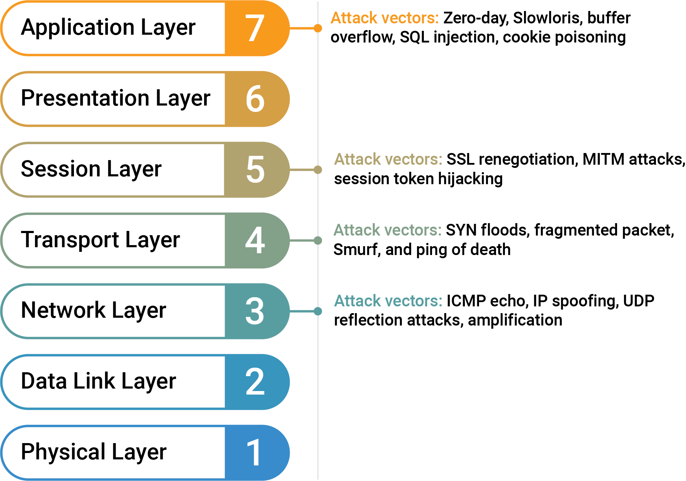

## Feature Comparison

Before beginning the migration process between service providers, it's important to understand the capabilities and specifications of both Google Cloud NGFW and Cloud Firewalls. This can help optimize your results by identifying which rules can be migrated directly and which may require additional configuration.

### Features of Google Cloud NGFW

Google Cloud NGFW filters traffic at the VPC network level. It supports rules based on IP ranges, ports, protocols, and targets (e.g. network tags or service accounts).  NGFW also enables centralized firewall policy management across projects, including threat intelligence-based blocking and hierarchical enforcement for consistent, scalable security controls.

### Features of Cloud Firewalls

Cloud Firewalls on Akamai Cloud is a Layer 3/4 stateless packet filter designed for simplicity and performance. It allows users to specify rules that allow or deny traffic based on source IP, destination port, and protocol (TCP, UDP, ICMP, and IPEncap). The Cloud Firewalls service does not inspect application-layer traffic; however, it is effective at managing access to services based on IP and port-level rules.

### What’s Not Directly Portable

Since Cloud Firewalls doesn’t currently support Layer 7 inspection, features such as pattern matching, geographic filtering, and rate limiting cannot be replicated natively. These must be implemented at the application level using reverse proxies like NGINX or other third-party services.

## Before You Begin

Complete the following prerequisites prior to following the steps in this guide.

1.  Follow our [Get Started](https://techdocs.akamai.com/cloud-computing/docs/getting-started) guide to create an Akamai Cloud account if you do not already have one.

1.  Create a personal access token using the instructions in our [Manage personal access tokens](https://techdocs.akamai.com/cloud-computing/docs/manage-personal-access-tokens) guide.

1.  Install the Linode CLI using the instructions in the [Install and configure the CLI](https://techdocs.akamai.com/cloud-computing/docs/install-and-configure-the-cli) guide. See our [API reference](https://techdocs.akamai.com/linode-api/reference/api) for comprehensive documentation of Linode CLI functionality.

1.  You need a Google Cloud project with a user or service account that has permissions to list, view, and modify VPC firewall rules.

1.  Ensure the Google Cloud CLI is installed locally and authenticated (via `gcloud auth login`) for the correct project (via `gcloud config set project`).

### Example Environment Used in This Guide

The example used throughout this guide involves a GCP VM instance on a network with traffic governed by a Google Cloud NGFW. The VM instance is configured for several services:

-   Web traffic handled by NGINX on ports `80` and `443`
-   PostgreSQL database on port `5432`
-   SSH on port `22`
-   Redis on port `6379`

The Google Cloud NGFW is configured with inbound rules to restrict access to known IP addresses.

The equivalent setup on Akamai Cloud uses a single Linode instance running the same services. The Cloud Firewalls service is used to recreate the access controls previously handled by the Google Cloud NGFW.

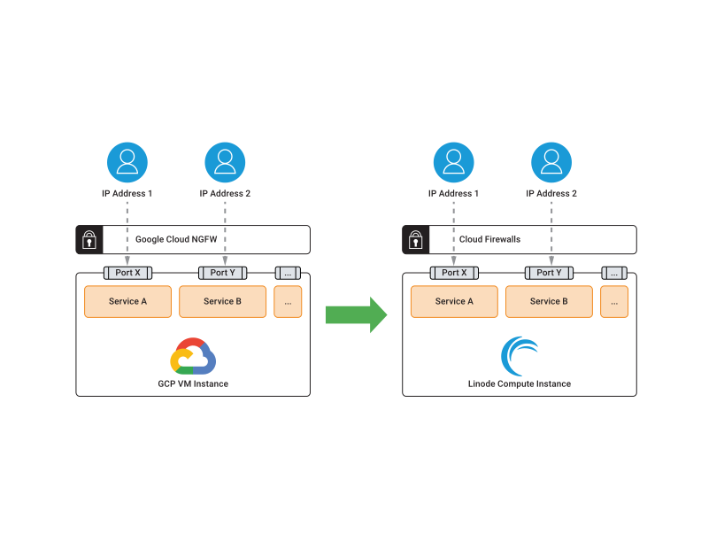

## Document your Current Configuration

Before making changes, it's essential to fully understand your existing GCP VM instance and Google Cloud NGFW configuration. Document and template how traffic flows to your Compute Engine virtual machine by noting which ports are open and which services are bound to each port. This can help you set up equivalent access controls using Cloud Firewalls.

### Review Google Cloud NGFW Rules

Use the Google Cloud Console or `gcloud` CLI to export or list your NGFW rules.



1.  In the Google Cloud Console, navigate to GCP **Compute Engine** > **VM Instances**.

1.  Select the appropriate VM instance to view its details:

    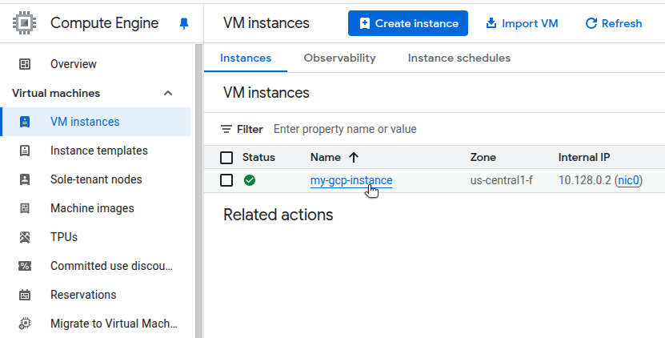

1.  Within the **Details** tab, under **Network interfaces**, select the name of the Network associated with this VM:

    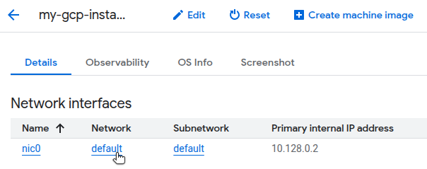

1.  On the VPC network details page, navigate to the **Firewalls** tab to view a list of Google Cloud NGFW rules applied to your VPC:

    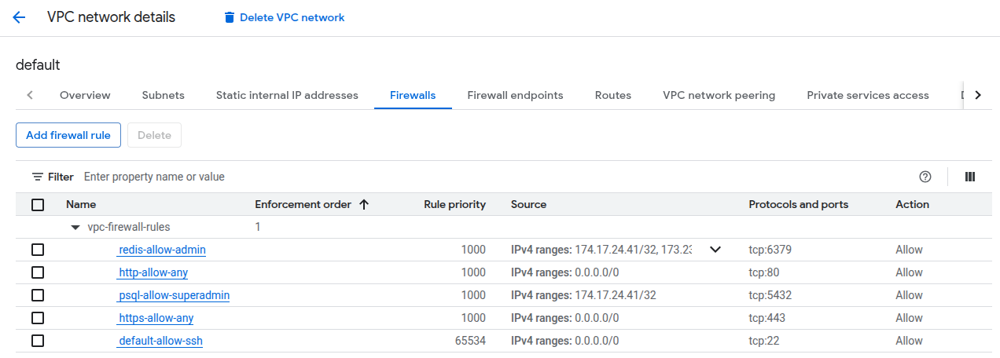


Run the following `gcloud` CLI command to list all NGFW rules:

```command
gcloud compute firewall-rules list \
    --format="json(name,description,allowed,sourceRanges)"
```

```output
[
  {
    "allowed": [
      {
        "IPProtocol": "tcp",
        "ports": [
          "22"
        ]
      }
    ],
    "description": "Allow SSH from anywhere",
    "name": "default-allow-ssh",
    "sourceRanges": [
      "0.0.0.0/0"
    ]
  },
  {
    "allowed": [
      {
        "IPProtocol": "tcp",
        "ports": [
          "80"
        ]
      }
    ],
    "description": "Allow any IP to port 80",
    "name": "http-allow-any",
    "sourceRanges": [
      "0.0.0.0/0"
    ]
  },
  {
    "allowed": [
      {
        "IPProtocol": "tcp",
        "ports": [
          "443"
        ]
      }
    ],
    "description": "Allow any to port 443",
    "name": "https-allow-any",
    "sourceRanges": [
      "0.0.0.0/0"
    ]
  },
  {
    "allowed": [
      {
        "IPProtocol": "tcp",
        "ports": [
          "5432"
        ]
      }
    ],
    "description": "Only allow superadmin to port 5432",
    "name": "psql-allow-superadmin",
    "sourceRanges": [
      "174.17.24.41/32"
    ]
  },
  {
    "allowed": [
      {
        "IPProtocol": "tcp",
        "ports": [
          "6379"
        ]
      }
    ],
    "description": "Allow to port 6379 from specific IPs",
    "name": "redis-allow-admin",
    "sourceRanges": [
      "174.17.24.41/32",
      "173.230.174.213/32"
    ]
  }
]
```



The example in this guide only has inbound rules, with traffic allowed for specific IP addresses. The inbound permissions for the example in this guide are diagrammed below:

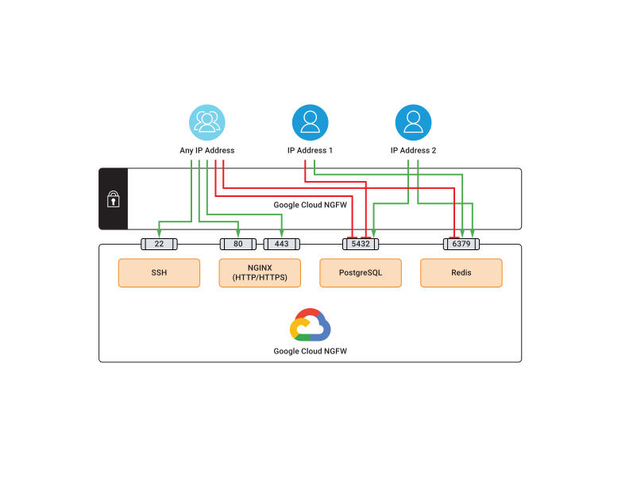


Your firewall may have both inbound and outbound rules, with traffic allowed for specific IP addresses or denied for specific IP addresses.


### Plan Your Rule-Mapping Strategy

After documenting your Google Cloud setup, plan how to translate those rules using the Cloud Firewalls syntax and feature set.

In this example, core services are exposed on ports `22`, `80`, `443`, `5432`, and `6379`. The Google Cloud NGFW allows access to certain ports (`5432` and `6379`) only from an approved IP allowlist, while traffic from any source can reach ports `22`, `80`, `443`. These rules must be recreated on Akamai Cloud to maintain equivalent protection.

It can be helpful to create a side-by-side comparison, mapping Google Cloud NGFW rules to their Cloud Firewalls equivalents. For example, a rule that allows PostgreSQL traffic (TCP `5432`) from a specific IP should be represented as a Cloud Firewalls rule allowing TCP traffic on port `5432` from that same IP.

### Back up Your Existing Configuration

Before disabling or removing Google Cloud resources, create a backup of all relevant configuration data.

Export your existing Google Cloud NGFW rules by running the following command and saving the output to a file:

```command
gcloud compute firewall-rules list --format=json > firewall-rules.json
```

## Create Equivalent Rules with Cloud Firewalls

Once planning and documentation are complete, begin building your new network firewall configuration in Akamai Cloud.

Cloud Firewalls rules can be managed through the [Cloud Manager](https://cloud.linode.com/) web interface or via the [Linode CLI](https://techdocs.akamai.com/cloud-computing/docs/cli). This section demonstrates both methods.

### Enable Cloud Firewalls



1.  While logged into Cloud Manager, navigate to the **Firewalls** dashboard, and click **Create Firewall**.

1.  Specify a label for the Cloud Firewall, accept the defaults for the inbound and outbound policies, and click **Create Firewall**. Initially, you do not need to assign any services. You can focus on rule creation first, then associate services later.

Once the Cloud Firewall has been created, you should see an initially empty list of inbound and outbound firewall rules.

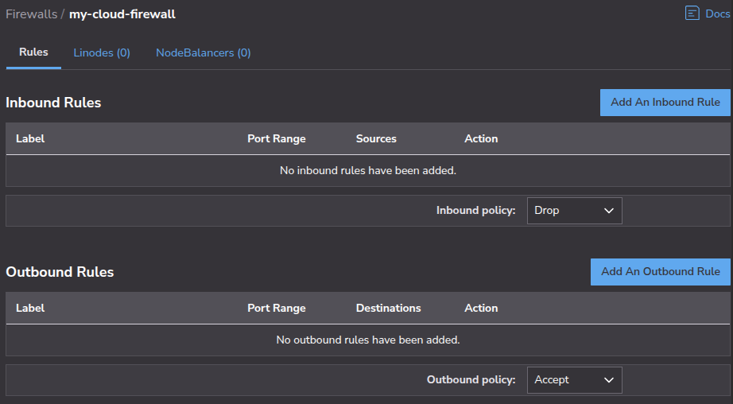


Use the Linode CLI to create a firewall, replacing  with a label of your choosing (e.g. `my-cloud-firewall`):

```command
linode-cli firewalls create \
    --rules.inbound_policy DROP \
    --rules.outbound_policy ACCEPT \
    --label ""
```

```output
┌---------┬--------------------┬---------┬---------------------┐
│ id      │ label              │ status  │ created             │
├---------┼--------------------┼---------┼---------------------┤
│ 2420060 │ my-cloud-firewall  │ enabled │ 2025-04-28T17:42:45 │
└---------┴--------------------┴---------┴---------------------┘
```



### Recreate Rules



1.  Select your Cloud Firewall, and create a new rule by clicking **Add An Inbound Rule**.

1.  Specify a label and description for the rule. For example:

    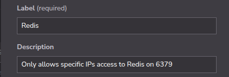

1.  Next, select the protocol and which ports to apply this rule to. You can select from commonly used ports or select **Custom** to specify a custom port range. For example:

    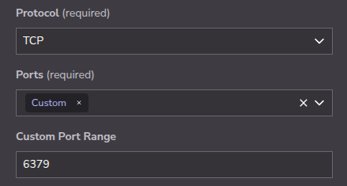

1.  For Sources, specify whether you want the rule to apply to **all** IPv4 or IPv6 addresses, or if you want to provide specific IP addresses. If providing specific IP addresses, add them one at a time. See our guide on [managing firewall rules](https://techdocs.akamai.com/cloud-computing/docs/manage-firewall-rules) for syntax specifications.

    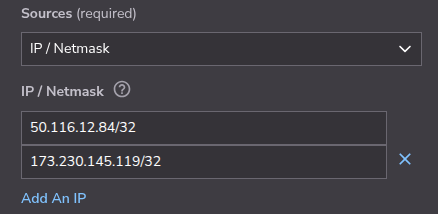

1.  Finally, decide whether the rule is meant to serve as an allowlist (Accept) or denylist (Drop). For this example migration from NGFW, the action would be Accept. Click **Add Rule**.

1.  Recreate each of the rules documented from your Google Cloud NGFW. Within the web UI, create a new rule by clicking **Add An Inbound Rule**.

1.  Repeat the steps above to recreate all the equivalent rules from the Google Cloud NGFW configuration.

1.  After adding all rules, click **Save Changes**.


When using the web UI, rules must be created one at a time. With the Linode CLI, you can add all rules with a single call of the [`rules-update`](https://techdocs.akamai.com/linode-api/reference/put-firewall-rules) action for the [`firewalls`](https://techdocs.akamai.com/linode-api/reference/post-firewalls) command.

1.  First, use `nano` or text editor of your choice to create a file called `inbound-rules.json`:

    ```command
    nano inbound-rules.json
    ```

    Enter all the inbound rules as a JSON array, for example:

    ```file {title="inbound-rules.json"}
    [
        {
            "action": "ACCEPT",
            "addresses": {
                "ipv4": [
                    "/32",
                    "/32"
                ],
                "ipv6": []
            },
            "description": "Redis",
            "label": "restrict",
            "ports": "6379",
            "protocol": "TCP"
        },
        {
            "action": "ACCEPT",
            "addresses": {
                "ipv4": [
                    "/32",
                    "/32"
                ],
                "ipv6": []
            },
            "description": "PostgreSQL",
            "label": "restrict",
            "ports": "5432",
            "protocol": "TCP"
        },
        {
            "action": "ACCEPT",
            "addresses": {
                "ipv4": [
                    "0.0.0.0/0"
                ],
                "ipv6": []
            },
            "description": "SSH",
            "label": "allow",
            "ports": "22",
            "protocol": "TCP"
        },
        {
            "action": "ACCEPT",
            "addresses": {
                "ipv4": [
                    "0.0.0.0/0"
                ],
                "ipv6": []
            },
            "description": "HTTP web",
            "label": "allow",
            "ports": "80",
            "protocol": "TCP"
        },
        {
            "action": "ACCEPT",
            "addresses": {
                "ipv4": [
                    "0.0.0.0/0"
                ],
                "ipv6": []
            },
            "description": "HTTPS web",
            "label": "allow",
            "ports": "443",
            "protocol": "TCP"
        }
    ]
    ```

    When done, press <kbd>CTRL</kbd>+<kbd>X</kbd>, followed by <kbd>Y</kbd> then <kbd>Enter</kbd> to save the file and exit `nano`.

1.  With the file in place, run the following Linode CLI command, making sure to supply your Akamai  (e.g. `2420060`):

    ```command
    linode-cli firewalls rules-update  \
        --inbound "$(cat inbound-rules.json)"
    ```

    ```output
    ┌-------------┬----------------┬-----------------┬---------┐
    │ fingerprint │ inbound_policy │ outbound_policy │ version │
    ├-------------┼----------------┼-----------------┼---------┤
    │ 96379b42    │ DROP           │ ACCEPT          │ 2       │
    └-------------┴----------------┴-----------------┴---------┘

    inbound
    ┌--------┬--------------------┬-------------┬---------┬-------┬---------┐
    │ action │ addresses.ipv4     │ description │ label   │ ports │ protocol│
    ├--------┼--------------------┼-------------┼---------┼-------┼---------┤
    │ ACCEPT │ 173.230.145.119/32 │ Redis       │ restrict│ 6379  │ TCP     │
    ├--------┼--------------------┼-------------┼---------┼-------┼---------┤
    │ ACCEPT │ 50.116.12.84/32    │ PostgreSQL  │ restrict│ 5432  │ TCP     │
    ├--------┼--------------------┼-------------┼---------┼-------┼---------┤
    │ ACCEPT │ 0.0.0.0/0          │ SSH         │ allow   │ 22    │ TCP     │
    ├--------┼--------------------┼-------------┼---------┼-------┼---------┤
    │ ACCEPT │ 0.0.0.0/0          │ HTTP web    │ allow   │ 80    │ TCP     │
    ├--------┼--------------------┼-------------┼---------┼-------┼---------┤
    │ ACCEPT │ 0.0.0.0/0          │ HTTPS web   │ allow   │ 443   │ TCP     │
    └--------┴--------------------┴-------------┴---------┴-------┴---------┘

    outbound
    ┌--------┬--------------------┬-------------┬---------┬-------┬---------┐
    │ action │ addresses.ipv4     │ description │ label   │ ports │ protocol│
    ├--------┼--------------------┼-------------┼---------┼-------┼---------┤
    └--------┴--------------------┴-------------┴---------┴-------┴---------┘
    ```



### Attach Instances to the Firewall

You can attach multiple Linodes or NodeBalancers to the Cloud Firewall. Note that inbound and outbound rules apply to Linode instances, whereas only inbound rules apply to NodeBalancers.

See our additional [migration documentation](https://www.linode.com/docs/guides/platform/migrate-to-linode/) for guidance on migrating other services -- such as compute instances -- to Akamai Cloud.



1.  Navigate to the **Linodes** tab for your Cloud Firewall and click **Add Linodes to Firewall**:

    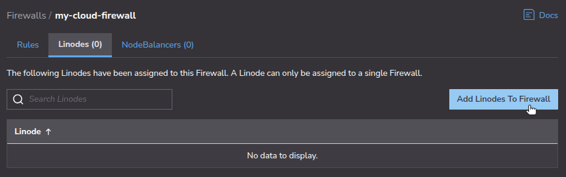

1.  From the list, select which Linode (or Linodes) to assign to the Cloud Firewall and click **Add**:

    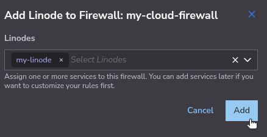

The firewall rules you specified should now be applied to the Linode (or Linodes) you have added.


1.  To assign Linodes to a Cloud Firewall using the Linode CLI, first retrieve the id of the Linode you want to add:

    ```command
    linode-cli linodes list
    ```

    ```output
    ┌----------┬-------------┬--------┬---------┬-----------------┐
    │ id       │ label       │ region │ status  │ ipv4            │
    ├----------┼-------------┼--------┼---------┼-----------------┤
    │ 76033001 │ my-linode   │ us-lax │ running │ 172.235.225.120 │
    ├----------┼-------------┼--------┼---------┼-----------------┤
    │ 76033002 │ my-linode-2 │ us-lax │ running │ 172.221.114.36  │
    ├----------┼-------------┼--------┼---------┼-----------------┤
    │ 76033003 │ my-linode-3 │ us-lax │ running │ 172.218.17.4    │
    └----------┴-------------┴--------┴---------┴-----------------┘
    ```

1.  Next, execute the [`device-create`](https://techdocs.akamai.com/linode-api/reference/post-firewall-device) action to assign a Linode to the Cloud Firewall, supplying both the  (e.g. `76033001`) and the  (e.g. `2420060`):

    ```command
    linode-cli firewalls device-create \
        --type linode --id  \
        
    ```

    ```output
    ┌---------┬---------------------┬---------------------┐
    │ id      │ created             │ updated             │
    ├---------┼---------------------┼---------------------┤
    │ 4877449 │ 2025-04-28T18:55:59 │ 2025-04-28T18:55:59 │
    └---------┴---------------------┴---------------------┘
    ```



## Test and Validate Your Configuration

After applying rules to your Cloud Firewalls, confirm that they behave as expected under real traffic conditions. Note that your firewall configurations may require different testing methods than those listed in this section.

### Simulate Expected and Blocked Traffic

From an IP on the allowlist, test access for each service and confirm that the connection succeeds to your instance’s endpoint. Use `ssh` to test connections from any IP address.

In all examples, replace  with the IP address of the instance assigned to your Cloud Firewall (e.g. `172.236.228.122`).

1.  Use `curl` to test HTTP traffic through NGINX:

    ```command {title="cURL HTTP Connection Attempt"}
    curl -I http://
    ```

    ```output
    HTTP/1.1 200 OK
    Server: nginx/1.24.0 (Ubuntu)
    Date: Mon, 28 Apr 2025 21:00:32 GMT
    Content-Type: text/html
    Content-Length: 615
    Last-Modified: Mon, 28 Apr 2025 20:58:01 GMT
    Connection: keep-alive
    ETag: "680febd9-267"
    Accept-Ranges: bytes
    ```

1.  Similarly, you can also use `curl` to test HTTPS traffic through NGINX:

    ```command {title="cURL HTTPS Connection Attempt"}
    curl -I https://
    ```

    ```output
    HTTP/1.1 200 OK
    Server: nginx/1.24.0 (Ubuntu)
    Date: Mon, 28 Apr 2025 21:02:02 GMT
    Content-Type: text/html
    Content-Length: 615
    Last-Modified: Mon, 28 Apr 2025 20:58:01 GMT
    Connection: keep-alive
    ETag: "6434bbbe-267"
    Accept-Ranges: bytes
    ```

    
    If you generated a self-signed certificate, skip certificate verification by adding the `-k` flag:

    ```command
    curl -Ik https://
    ```
    

1.  Attempt to connect to the PostgreSQL server with the `psql` client from an allowed IP address, replacing  (e.g. `5432`),  (e.g. `testuser`), and  (e.g. `testdb`):

    ```command {title="Successful PostgreSQL Connection Attempt"}
    psql --host  \
        --port  \
        --username  \
        --dbname  \
        --password
    ```

    ```output
    Password: ********
    psql (17.2 (Ubuntu 17.2-1.pgdg20.04+1), server 16.8 (Ubuntu 16.8-0ubuntu0.24.04.1))
    SSL connection (protocol: TLSv1.3, cipher: TLS_AES_256_GCM_SHA384, compression: off, ALPN: none)
    Type "help" for help.

    testdb=#
    ```

1.  In contrast, if you attempt to connect to the PostgreSQL server with the `psql` client from an IP address not allowed through the Cloud Firewall rules, the execution hangs after prompting for the password:

    ```command {title="Blocked PostgreSQL Connection Attempt"}
    psql --host  \
        --port  \
        --username  \
        --dbname  \
        --password
    ```

    ```output
    Password: ********

    ```

1.  Attempt to connect to Redis with `redis-cli` from an allowed IP address, replacing  (e.g. `6379`):

    ```command {title="Successful Redis Connection Attempt"}
    redis-cli -h  -p 
    ```

    The result should be similar to the following:

    ```output
    172.236.228.122:6379> INFO Server
    # Server
    redis_version:7.0.15
    …
    executable:/usr/bin/redis-server
    config_file:/etc/redis/redis.conf
    io_threads_active:0
    ```

1.  Now attempt to connect to Redis with `redis-cli` from an IP address that is not on the allowlist:

    ```command {title="Blocked Redis Connection Attempt"}
    redis-cli -h  -p 
    ```

    The connection attempt simply hangs:

    ```output

    ```

### Log and Monitor Behavior

The Cloud Firewalls service does not show per-packet or rule-level logging. To verify behavior, rely on logs from the services themselves. For example:

-   NGINX access logs, as configured in individual virtual server configuration files, are found in `/etc/nginx/sites-available`.
-   SSH authentication logs are located at (`/var/log/auth.log`).
-   Redis logs are typically found in `/var/log/redis/redis-server.log`, though this is configurable in `/etc/redis/redis.conf`.
-   PostgreSQL logs are typically found in `/var/log/postgresql/`, though this is configurable in `/etc/postgresql/[PATH-TO-VERISON]/postgresql.conf`.

Connection and activity logs from these services can help to confirm whether traffic is reaching them as expected.

## Monitor Post-Migration Performance

Ongoing monitoring helps identify any overlooked configuration issues or unexpected traffic patterns. Continue observing application logs and metrics post-migration. Make sure services are available to intended users and there are no spikes in error rates or timeouts.

If legitimate traffic is being blocked or malicious traffic is being allowed, refine your Cloud Firewalls rules. It may take a few iterations and troubleshooting to achieve parity with your original Google Cloud NGFW behavior.

## Finalize Your Firewall Migration

Once you've validated the new firewall configuration, clean up legacy resources and update internal references:

-   Find components that were connecting with your GCP Compute Engine VM instance.
-   Create equivalent rules with Cloud Firewalls to allow traffic from legitimate components.
-   Remove the Google Cloud NGFW rules.
-   Remove the GCP Compute Engine VM instance.

Update runbooks, internal network diagrams, and configuration documentation to reflect the new firewall architecture based on Cloud Firewalls.