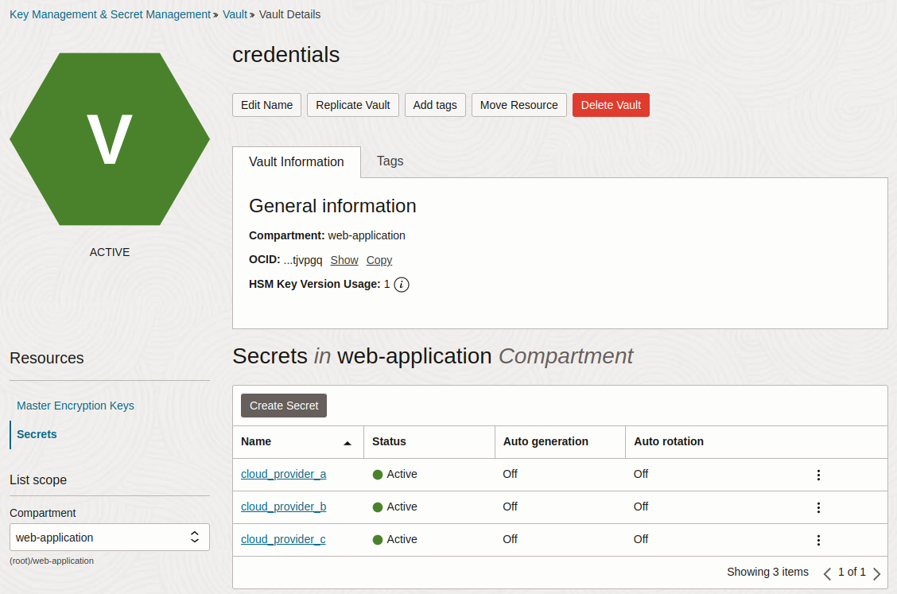

[OpenBao](https://openbao.org/) is an open source secrets management tool and fork of [HashiCorp Vault](https://www.vaultproject.io/) that provides teams control over how secrets are stored, encrypted, and accessed. OpenBao can be self-hosted in any environment, including on-premises and across multiple clouds.

Oracle Vault is a part of Oracle Cloud Infrastructure (OCI). It provides a secure, managed solution for storing and controlling access to sensitive information like API keys, passwords, and encryption keys. Oracle Vault is designed to integrate with other Oracle services, supporting features for key management, secret storage, and cryptographic functions.

This guide provides steps and considerations for how to migrate secrets stored in Oracle Vault to OpenBao running on Akamai Cloud.

## Before You Begin

1.  Follow our [Get Started](https://techdocs.akamai.com/cloud-computing/docs/getting-started) guide to create an Akamai Cloud account if you do not already have one.

1.  When migrating from Oracle Vault to OpenBao on Akamai Cloud, OpenBao should be deployed before you begin. OpenBao can be installed on a single Linode instance or deployed to a multi-node cluster using Linode Kubernetes Engine (LKE). Follow the appropriate guide below based on your production needs:

    -   [Deploying OpenBao on a Linode Instance](/docs/guides/deploying-openbao-on-a-linode-instance/)
    -   [Deploy OpenBao on Linode Kubernetes Engine](/docs/guides/deploy-openbao-on-linode-kubernetes-engine/)
    -   [Deploying OpenBao through the Linode Marketplace](/docs/marketplace-docs/guides/openbao/)

1.  Ensure that you have access to your Oracle Cloud platform account with sufficient permissions to work with Oracle Vault. The [OCI CLI](https://docs.oracle.com/en-us/iaas/Content/API/SDKDocs/cliinstall.htm) must also be installed and configured

1.  Install `jq`, a lightweight command line JSON processor.


This guide is written for a non-root user. Commands that require elevated privileges are prefixed with `sudo`. If you’re not familiar with the `sudo` command, see our [Users and Groups](/docs/guides/linux-users-and-groups/) doc.


### Using This Guide

This tutorial contains a number of placeholders that are intended to be replaced by your own unique values. For reference purposes, the table below lists these placeholders, what they represent, and the example values used in this guide:

| Placeholder                              | Represents                                              | Example Value                                                                                                                                                  |
|------------------------------------------|---------------------------------------------------------|-------------------------------------------------------------------------------------------------------------------------------------------------------|
|  | The OCID of the compartment containing your vault.      | `ocid1.compartment.oc1..aaaaaaaawrrlh7hw6b4tnsbxevyoywscike5ygn4ut5n734mjsclijgpjjgq`                                                                                          |
|       | The OCID of the secret stored in Oracle Vault.          | `ocid1.vaultsecret.oc1.phx.amaaaaaaogvqnkqaepiqln7ztj43ugit75w3wl7kyzldk3rbqkfd2zmtp3ea`                                                                                          |
|  | The base64-encoded value of the Oracle secret.          | `eyAiYWNjZXNzX2tleV9pZCIgOiAiQUtJQTUxM0oyRERSQVhDRktYRjUiLCAic2VjcmV0X2FjY2Vzc19rZXkiIDoiWGRxRDBCUGE4YUxGYU4rRUk4U0FZbTlVNFpZZVhRZE1HQUlqS0QveCIgfQ==` |
|         | The name of the file containing the OpenBao policy.     | `cloud-credentials-policy.hcl`                                                                                                                                                   |
|   | The KV mount path used in OpenBao to organize secrets.  | `cloud-credentials`                                                                                                                                    |
|         | The internal name for the policy in OpenBao.            | `cloud-credentials-policy`                                                                                                                             |
|        | The name of the AppRole in OpenBao.                     | `cloud-credential-reader-approle`                                                                                                                      |
|          | The role ID generated for the AppRole by OpenBao.       | `c8663988-136f-42de-af40-1dfb94f0c1f6`                                                                                                                 |
|   | The secret ID generated for the AppRole by OpenBao.     | `9b9c27a3-dc27-4eea-921f-773164ec17c7`                                                                                                                 |
|       | The API token retrieved from OpenBao using the AppRole. | `s.36Yb3ijEOJbifprhdEiFtPhR`                                                                                                                              |
|         | The name of the secret to store in OpenBao.             | `provider-a`                                                                                                                                           |
|          | The key of the secret to store in OpenBao               | `secret`                                                                                                                                               |
|        | The value of the secret to store in OpenBao.            | `{ "access_key_id": "AKIA513J2DDRAXCFKXF5", "secret_access_key": "XdqD0BPa8aLFaN+EI8SAYm9U4ZYeXQdMGAIjKD/x" }`                                                                                                                         |


All of the example values used in this guide are purely examples to mimic and display the format of actual secrets. Nothing listed is a real credential to any existing system.

When creating your own values, **do not** use any of the above credentials.


## Review Existing Secrets in Oracle Vault

Before migrating to OpenBao, evaluate how your organization currently uses Oracle Vault.

For example, an application that accesses services from multiple cloud providers might retrieve access keys stored in Oracle Vault. Granting access at runtime ensures that credentials aren’t embedded in code or exposed during deployment.

OpenBao supports equivalent secret injection workflows through AppRole and Kubernetes integration.


Ensure that you securely handle any exposed secrets or other sensitive data, as they no longer benefit from encryption by Oracle Vault.


### Review Secrets Using the Oracle Console

1.  Navigate to **Security > Vault**, select your vault, and open the **Secrets** tab. The example secrets below are used throughout this guide:

    

1.  To display a secret's value, select the secret, go to the latest version, and click **View Secret Contents**:

    

### Review Secrets Using the OCI CLI

You can also use the Oracle Cloud CLI (`oci`) to manage the secrets in your Oracle Vault.

1.  Authenticate with the OCI CLI. You must have configured your API key, tenancy OCID, and user OCID. Run a basic command to confirm authentication:

    ```command
    oci iam region list
    ```

1.  Identify the compartment that contains your vault:

    ```command
    oci iam compartment list --query 'data[]["name","id"]'
    ```

    In the example above, the `credentials` vault belongs to the `web-application` compartment:

    ```output
    [
      [
        "web-application", "ocid1.compartment.oc1..aaaaaaaawrrlh7hw6b4tnsbxevyoywscike5ygn4ut5n734mjsclijgpjjgq"
      ]
    ]
    ```

1.  [List the secrets in your vault](https://docs.oracle.com/en-us/iaas/tools/oci-cli/3.53.0/oci_cli_docs/cmdref/vault/secret/list.html) by specifying the  (e.g. `ocid1.compartment.oc1..aaaaaaaawrrlh7hw6b4tnsbxevyoywscike5ygn4ut5n734mjsclijgpjjgq`):

    ```command
    oci vault secret list \
      --compartment-id  \
      --query 'data[].["secret-name","description","id"]'
    ```

    **For Example**:

    ```command
    oci vault secret list \
      --compartment-id ocid1.compartment.oc1..aaaaaaaawrrlh7hw6b4tnsbxevyoywscike5ygn4ut5n734mjsclijgpjjgq \
      --query 'data[].["secret-name","description","id"]'
    ```

    ```output
    [
      [
        "cloud_provider_a",
        "Access key ID and secret access key for provider",
    "ocid1.vaultsecret.oc1.phx.amaaaaaaogvqnkqaepiqln7ztj43ugit75w3wl7kyzldk3rbqkfd2zmtp3ea"
      ],
      [
        "cloud_provider_b",
        "Project ID and project API KEY",
    "ocid1.vaultsecret.oc1.phx.amaaaaaaogvqnkqacnhdzfprgd4f4ml7rpkjqmqlyz7p5kjjfinvyn57qdoa"
      ],
      [
        "cloud_provider_c",
        "Client ID and client secret",
    "ocid1.vaultsecret.oc1.phx.amaaaaaaogvqnkqavn32ibazaqinya5bv3eyc4ndfvebcnksnqk4vl74xqqa"
      ]
    ]
    ```

1.  Retrieve the [value of a secret](https://docs.oracle.com/en-us/iaas/tools/oci-cli/3.53.0/oci_cli_docs/cmdref/secrets/secret-bundle/get.html) by specifying its  (e.g. `ocid1.vaultsecret.oc1.phx.amaaaaaaogvqnkqaepiqln7ztj43ugit75w3wl7kyzldk3rbqkfd2zmtp3ea`):

    ```command
    oci secrets secret-bundle get \
      --secret-id  \
      --stage CURRENT \
      --query 'data."secret-bundle-content"'
    ```

    **For Example**:

    ```command
    oci secrets secret-bundle get \
      --secret-id ocid1.vaultsecret.oc1.phx.amaaaaaaogvqnkqaepiqln7ztj43ugit75w3wl7kyzldk3rbqkfd2zmtp3ea \
      --stage CURRENT \
      --query 'data."secret-bundle-content"'
    ```

    ```output
    {
      "content":
    "eyAiYWNjZXNzX2tleV9pZCIgOiAiQUtJQTUxM0oyRERSQVhDRktYRjUiLCAic2VjcmV0X2FjY2Vzc19rZXkiIDoiWGRxRDBCUGE4YUxGYU4rRUk4U0FZbTlVNFpZZVhRZE1HQUlqS0QveCIgfQ==",
      "content-type": "BASE64"
    }
    ```

1.  If the secret bundle `content-type` is `BASE64` (e.g. `eyAiYWNjZXNzX2tleV9pZCIgOiAiQUtJQTUxM0oyRERSQVhDRktYRjUiLCAic2VjcmV0X2FjY2Vzc19rZXkiIDoiWGRxRDBCUGE4YUxGYU4rRUk4U0FZbTlVNFpZZVhRZE1HQUlqS0QveCIgfQ==`), you must decode it to reveal the original value:

    ```command
    echo  \
      | base64 --decode
    ```

    **For Example**:

    ```command
    echo eyAiYWNjZXNzX2tleV9pZCIgOiAiQUtJQTUxM0oyRERSQVhDRktYRjUiLCAic2VjcmV0X2FjY2Vzc19rZXkiIDoiWGRxRDBCUGE4YUxGYU4rRUk4U0FZbTlVNFpZZVhRZE1HQUlqS0QveCIgfQ== \
      | base64 --decode
    ```

    ```output
    { "access_key_id": "AKIA513J2DDRAXCFKXF5", "secret_access_key": "XdqD0BPa8aLFaN+EI8SAYm9U4ZYeXQdMGAIjKD/x" }
    ```

    
    You can also retrieve and decode the secret in a single command:

    ```command
    oci secrets secret-bundle get \
      --secret-id  \
      --stage CURRENT \
      --query 'data."secret-bundle-content".content' \
      --raw-output \
      | base64 --decode
    ```
    

## Access Your OpenBao Deployment on Akamai Cloud

The following steps focus on migrating secrets into your OpenBao deployment on Akamai Cloud. You should already have a running OpenBao instance on either a standalone Linode instance, in an LKE cluster, or deployed via the Linode Marketplace.

If your OpenBao environment is not yet ready, refer to the appropriate deployment guide listed in the [Before You Begin](#before-you-begin) section and complete the setup.

Once deployed, log into your OpenBao environment. Before continuing, verify that:

-   OpenBao is successfully initialized.
-   The vault is unsealed.
-   The `BAO_ADDR` environment variable is set.
-   You are authenticated using the root token.

### Create a Policy and AppRole

To replicate Oracle IAM-style access control in OpenBao, use AppRoles. While Oracle Vault manages permissions through IAM policies instead of granular roles, OpenBao allows you to assign access through policy-bound AppRoles.

Follow these steps to create an OpenBao AppRole that mirrors the access controls used in Oracle IAM.

#### Enable AppRole

1.  Enable the AppRole authentication method:

    ```command
    bao auth enable approle
    ```

    ```output
    Success! Enabled approle auth method at: approle/
    ```

#### Create a Policy

2.  Using a text editor like `nano`, create a new `.hcl` [policy file](https://openbao.org/docs/concepts/policies/) in `/etc/openbao`, replacing  (e.g. `cloud-credentials-policy.hcl`) with a policy filename of your choosing:

    ```command
    sudo nano /etc/openbao/
    ```

    **For Example**:

    ```command
    sudo nano /etc/openbao/cloud-credentials-policy.hcl
    ```
1.  Give the file the following contents, replacing  (e.g. `cloud-credentials`) with your chosen mount path:

    ```file {title="POLICY_FILE.hcl"}
    path "/*" {
      capabilities = ["read"]
    }
    ```

    **For Example**:

    ```file {title="cloud-credentials-policy.hcl"}
    path "cloud-credentials/*" {
      capabilities = ["read"]
    }
    ```

    This policy grants read access to any secrets within the specified mount path.

    When done, press <kbd>CTRL</kbd>+<kbd>X</kbd>, followed by <kbd>Y</kbd> then <kbd>Enter</kbd> to save the file and exit `nano`.

1.  Add the policy to OpenBao, replacing  (e.g. `cloud-credentials-policy`) and :

    ```command
    bao policy write  /etc/openbao/
    ```

    **For Example**:

    ```command
    bao policy write cloud-credentials-policy /etc/openbao/cloud-credentials-policy.hcl
    ```

    ```output
    Success! Uploaded policy: cloud-credentials-policy
    ```

#### Create an AppRole

5.  Create an AppRole for the application that needs access to the secret, replacing  (e.g. `cloud-credential-reader-approle`) and :

    ```command
    bao write \
        auth/approle/role/ \
        token_policies=
    ```

    **For Example**:

    ```command
    bao write \
        auth/approle/role/cloud-credential-reader-approle \
        token_policies=cloud-credentials-policy
    ```

    ```output
    Success! Data written to: auth/approle/role/cloud-credential-reader-approle
    ```

1.  Verify that the AppRole was written successfully, replacing :

    ```command
    bao read auth/approle/role/
    ```

    **For Example**:

    ```command
    bao read auth/approle/role/cloud-credential-reader-approle
    ```

    ```output
    Key                        Value
    ---                        -----
    bind_secret_id             true
    local_secret_ids           false
    secret_id_bound_cidrs      <nil>
    secret_id_num_uses         0
    secret_id_ttl              0s
    token_bound_cidrs          []
    token_explicit_max_ttl     0s
    token_max_ttl              0s
    token_no_default_policy    false
    token_num_uses             0
    token_period               0s
    token_policies             [cloud-credentials-secrets-policy]
    token_strictly_bind_ip     false
    token_ttl                  0s
    token_type                 default
    ```

1.  Fetch the AppRole ID, replacing :

    ```command
    bao read auth/approle/role//role-id
    ```

    **For Example**:

    ```command
    bao read auth/approle/role/cloud-credential-reader-approle/role-id
    ```

    ```output
    Key        Value
    ---        -----
    role_id    c8663988-136f-42de-af40-1dfb94f0c1f6
    ```

#### Generate a Secret ID

8.  Generate a secret ID for the role, replacing :

    ```command
    bao write -f auth/approle/role//secret-id
    ```

    **For Example**:

    ```command
    bao write -f auth/approle/role/cloud-credential-reader-approle/secret-id
    ```

    ```output
    Key                   Value
    ---                   -----
    secret_id             9b9c27a3-dc27-4eea-921f-773164ec17c7
    secret_id_accessor    20abfad4-029f-45e8-a749-ecc041ff3554
    secret_id_num_uses    0
    secret_id_ttl         0s
    ```

#### Generate an API Token

9.  Generate an API token for the AppRole, supplying the  (e.g. `c8663988-136f-42de-af40-1dfb94f0c1f6`) and  (e.g. `9b9c27a3-dc27-4eea-921f-773164ec17c7`) from the previous commands:

    ```command
    bao write auth/approle/login \
      role_id="" \
      secret_id=""
    ```

    **For Example**:

    ```command
    bao write auth/approle/login \
      role_id="c8663988-136f-42de-af40-1dfb94f0c1f6" \
      secret_id="9b9c27a3-dc27-4eea-921f-773164ec17c7"
    ```

    ```output
    Key                     Value
    ---                     -----
    token                   s.Q9n7KPnLKSDoYnVdrHnphEml
    token_accessor          LkSCfmBQVCfL8s2eX4EfnqO4
    token_duration          768h
    token_renewable         true
    token_policies          ["cloud-credentials-secrets-policy" "default"]
    identity_policies       []
    policies                ["cloud-credentials-secrets-policy" "default"]
    token_meta_role_name    cloud-credential-reader-approle
    ```

    The resulting AppRole token (e.g. `s.Q9n7KPnLKSDoYnVdrHnphEml`) can be used by a user, machine, or service (e.g. an infrastructure management application) to authenticate OpenBao API calls and read the cloud provider credentials secrets.

### Storing Secrets

Create the secret store defined in the policy created above.

1.  Enable the KV secrets engine, replacing :

    ```command
    bao secrets enable --path= kv
    ```

    **For Example**:

    ```command
    bao secrets enable --path=cloud-credentials kv
    ```

    ```output
    Success! Enabled the kv secrets engine at: cloud-credentials/
    ```

1.  The example secret from Oracle Vault contains multiple fields stored within a single JSON object. To mirror this format in OpenBao, store the entire  (e.g. `{ "access_key_id": "AKIA513J2DDRAXCFKXF5", "secret_access_key": "XdqD0BPa8aLFaN+EI8SAYm9U4ZYeXQdMGAIjKD/x" }`) in a single  (e.g. `secret`) in the  under the secret name  (e.g. `provider-a`):

    ```command
    bao kv put --mount=  \
      ""=""
    ```

    **For Example**:

    ```command
    bao kv put --mount=cloud-credentials provider-a \
      "secret"="{ "access_key_id": "AKIA513J2DDRAXCFKXF5", "secret_access_key": "XdqD0BPa8aLFaN+EI8SAYm9U4ZYeXQdMGAIjKD/x" }"
    ```

    ```output
    Success! Data written to: cloud-credentials/provider-a
    ```

### Retrieving Secrets

1.  While authenticated with the root token, retrieve the secret using the OpenBao CLI (`bao`), replacing  and :

    ```command
    bao kv get --mount= 
    ```

    **For Example**:

    ```command
    bao kv get --mount=cloud-credentials provider-a
    ```

    ```output
    ====== Data ======
    Key                 Value
    ---                 -----
    access_key_id       AKIA513J2DDRAXCFKXF5
    secret_access_key   XdqD0BPa8aLFaN+EI8SAYm9U4ZYeXQdMGAIjKD/x
    ```

1.  Test access using the  (e.g. `s.36Yb3ijEOJbifprhdEiFtPhR`) saved earlier, your , and the :

    ```command
    curl --header "X-Vault-Token: " \
         --request GET \
         $BAO_ADDR/v1// \
         | jq
    ```

    **For Example**:

    ```command
    curl --header "X-Vault-Token: s.36Yb3ijEOJbifprhdEiFtPhR" \
         --request GET \
         $BAO_ADDR/v1/cloud-credentials/provider-a \
         | jq
    ```

    ```output
    {
      "request_id": "92c5026e-bb14-4e2a-8d70-e94fb005183f",
      "lease_id": "",
      "renewable": false,
      "lease_duration": 2764800,
      "data": {
        "access_key_id": "AKIA513J2DDRAXCFKXF5",
        "secret_access_key": "XdqD0BPa8aLFaN+EI8SAYm9U4ZYeXQdMGAIjKD/x"
      },
      "wrap_info": null,
      "warnings": null,
      "auth": null
    }
    ```

    The AppRole token can be used by applications or services to retrieve secrets through the OpenBao API.

    
    According to the [OpenBao API documentation](https://openbao.org/api-docs/libraries/), OpenBao is API-compatible with HashiCorp Vault. This means most Vault client libraries should also work with OpenBao, including:

    -   [Go](https://github.com/hashicorp/vault/tree/main/api)
    -   [Ruby](https://github.com/hashicorp/vault-ruby)
    -   [C#](https://github.com/rajanadar/VaultSharp)
    -   [Java](https://developer.hashicorp.com/vault/api-docs/libraries#java)
    -   [Kotlin](https://github.com/kunickiaj/vault-kotlin)
    -   [Node.js](https://developer.hashicorp.com/vault/api-docs/libraries#node-js)
    -   [PHP](https://developer.hashicorp.com/vault/api-docs/libraries#php)
    -   [Python](https://github.com/hvac/hvac)
    

## Production Considerations

When migrating workloads from Oracle Vault across providers to OpenBao on Akamai Cloud, it's important to ensure your deployment is secure, resilient, and optimized for performance. This section covers key security and high availability considerations to help you maintain a reliable and protected secrets management system.

### Security

Security should be a top priority for a production-grade OpenBao deployment. Protecting secrets from unauthorized access, ensuring secure communication, and enforcing strict access controls are essential to maintaining a secure environment.

-   **Access Control Policies**: Use OpenBao's [policy](https://openbao.org/docs/concepts/policies/) system to enforce RBAC. Define granular policies that grant only the necessary permissions, following the principle of least privilege.
-   **Audit Logging**: Enable [detailed audit logs](https://openbao.org/docs/configuration/log-requests-level/) to track all access and modifications to secrets. OpenBao supports multiple logging backends, such as `syslog` and file-based logs, to help monitor suspicious activity.
-    **Secrets Lifecycle Management**: Implement automated secrets rotation, revocation, and expiration to ensure secrets do not become stale or overexposed. Consider using dynamic secrets where possible to generate time-limited credentials.
-   **Securing Network Communication**: [Configure OpenBao to use TLS](https://openbao.org/docs/configuration/listener/tcp/#configuring-tls)  to encrypt all communications, ensuring data in transit remains secure. Regularly rotate TLS certificates to prevent expiration-related outages and reduce the risk of compromised certificates.

### High Availability

Production-grade OpenBao environments should be deployed with fault tolerance and scalability in mind. OpenBao’s [Autopilot mode](https://openbao.org/docs/concepts/integrated-storage/autopilot) for [high availability](https://openbao.org/docs/internals/high-availability/) ensures that if the active node fails, the cluster automatically elects a new leader, maintaining uptime without manual intervention. However, to enable seamless failover, organizations must configure their deployment correctly, and proactively monitor system health.

-   **Raft Storage Backend**: Use OpenBao’s [integrated storage](https://openbao.org/docs/internals/integrated-storage/), based on the [Raft protocol](https://thesecretlivesofdata.com/raft/), to enable distributed data replication across multiple nodes. This ensures data consistency and fault tolerance while reducing reliance on external storage backends. Configure regular Raft snapshots for disaster recovery.
-   **Deploy Multiple Nodes**: OpenBao recommends at least five nodes for a [high-availability deployment](https://openbao.org/docs/concepts/ha/). The active node handles all requests, while standby nodes remain ready to take over in case of failure.
-   **Monitor Leader Status**: Use [`bao operator raft list-peers`](https://openbao.org/docs/commands/operator/raft/#list-peers) to check the cluster’s leader and node statuses. This command helps ensure that standby nodes are correctly registered and ready for failover.