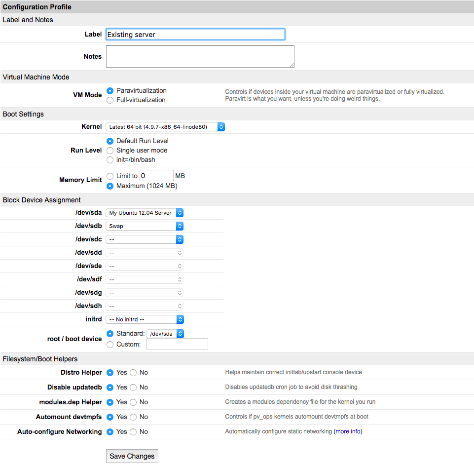
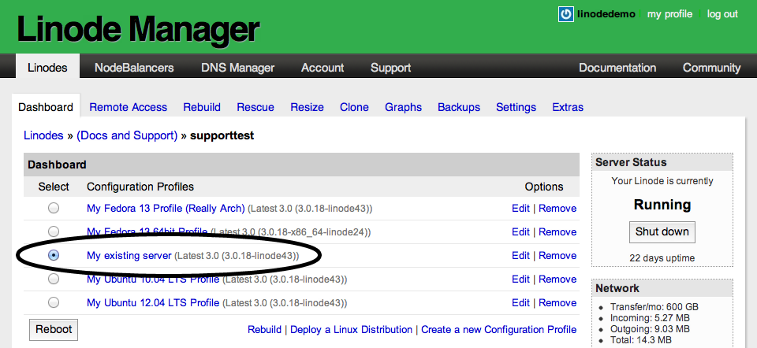


The process for migrating a server image to your Linode will vary depending upon how the image was created. We recommend making an `.iso` file from your existing image, and then following the steps in our updated [custom distribution](/docs/products/compute/compute-instances/guides/install-a-custom-distribution/) guide to deploy it on a Linode. This guide is no longer being maintained, and the procedure outlined here is not recommended for new migrations.


You can migrate an existing server to your Linode from another hosting provider or a local machine. This is a great option if you're moving to Linode from another hosting provider or if you've built a custom server on your local machine. You can even migrate virtualized servers created with products like VirtualBox or VMware. This guide shows you how to prepare the Linode to receive the files, copy the files from the existing server to the Linode, and then make the disks bootable.


These instructions assume that you'll be working with a live server. If you can boot into an alternate environment, such as a live CD, you should do so. However, most hosting providers do not offer a bootable recovery or maintenance environment.


## Preparing the Linode

First you'll need to prepare the Linode to receive the files from the existing server. Create disks to store the files on the existing server and a configuration profile to boot the Linode from the existing server's disks. Then start the Linode in rescue mode.

### Creating Disks

Create two disks: one for the files on your existing server, and another for a swap disk. That way, the import from the existing server will be bootable. Here's how to create the disks:

We assume that your existing server has a single root partition. If you have multiple partitions set up, you'll need to add extra disks to accommodate each partition.


1.  Log in to the [Linode Manager](https://cloud.linode.com).
2.  Click the **Linodes** tab.
3.  Select a Linode. The Linode's dashboard appears.
4.  Create a disk to hold the files from the existing server. Select **Create a new Disk**. The webpage shown below appears.

    

5.  Enter a descriptive name for the disk in the **Label** field.
6.  Enter a size for the disk in the **Size** field. You should make the disk large enough to hold the contents of your current server's root partition.
7.  Click **Save Changes** to create the disk. The Linode's dashboard appears. You can monitor the disk creation process by watching the *Host Job Queue*.
8.  Now create a swap disk for your existing server. Select **Create a new Disk**. The webpage shown below appears.

    

9.  Enter a name for the swap disk in the **Label** field.
10. From the **Type** menu, select **swap**.
11. Enter `256` in the **Size** field.
12. Click **Save Changes** to create the swap disk.

You have successfully created the disks.

### Creating a Configuration Profile

You'll need a configuration profile to boot your existing server after you upload the files. Here's how to create the configuration profile:

1.  In the [Linode Manager](https://cloud.linode.com), select the Linode's dashboard.
2.  Select **Create a new Configuration Profile**. The webpage shown below appears.

    

3.  Enter a name for the configuration profile in the **Label** field.
4.  *Optional:* Enter notes for the configuration profile in the **Notes** field.

    
Make sure that you select the correct kernel for your existing server. There are 32-bit and 64-bit versions available. The 64-bit version has `x86_64` in the name.


5.  Set `/dev/sda` to the primary disk you created for the existing server.
6.  Set `/dev/sdb` to the swap disk you created for the existing server.
7.  Click **Save Changes**.

You have successfully created the configuration profile.

### Booting into Rescue Mode

Before you initiate the transfer, you need to start the Linode in rescue mode. Here's how:

1.  Boot your Linode into Rescue Mode. For instructions, see [Booting into Rescue Mode](/docs/products/compute/compute-instances/guides/rescue-and-rebuild/#boot-into-rescue-mode). Be sure to set the primary disk to `/dev/sda` and the swap disk to `/dev/sdb`.
2.  After the Linode has booted, connect to it via LISH. For instructions, see [Connecting to a Linode Running in rescue mode](/docs/products/compute/compute-instances/guides/rescue-and-rebuild/#connecting-to-a-compute-instance-running-in-rescue-mode).
3.  Start SSH. For instructions, see [Start SSH](/docs/products/compute/compute-instances/guides/rescue-and-rebuild/#starting-ssh).
4.  Mount the blank primary disk by entering the following command:

        mount -o barrier=0 /dev/sda

Your Linode is now ready to receive the files from your existing server.

## Copying the Files

You've created disks on the Linode to receive the files from the existing server, and you've created configuration profiles to boot into rescue mode and from the new disks. Now it's time to transfer files from the existing server to the Linode.

### Stopping Services

At this point, you should stop as many services as possible on the existing server. This includes web server daemons (Apache and nginx), database servers (PostgreSQL and MySQL), and any other non-critical services. To stop a service, enter the following command, replacing `apache2` with the name of the service you want to stop:

    sudo service apache2 stop

### Initiating the Transfer

Now it's time to copy the files from your existing server to your Linode. Here's how:

1.  Connect to your existing server via SSH and log in as `root`.
2.  Enter the following command to initiate the copy, replacing `123.45.67.890` with your Linode's IP address. (For instructions on finding your Linode's IP address, see [Finding the IP Address](/docs/products/platform/get-started/#find-the-ip-address-of-your-linode).) :

        rsync --exclude="/sys/*" --exclude="/proc/*" -aHSKDvz -e ssh / root@123.45.67.890:/media/sda/

If you receive a message indicating that the rsync command couldn't be found, you'll need to install it by entering `apt-get install rsync` on Ubuntu or Debian. If you're using a different distribution, you may need to enter a different command.


The files on your existing server will be copied to your Linode. Depending on the amount of data stored on existing server, the network copy may take a long time. You can monitor the progress from your current server's SSH session.

## Configuring the Disks

Now the files from your existing server are stored on your Linode. You can't boot from the new disks yet, however. First, you'll need to do some things to the disks, like set the IP address to the IP address assigned to your Linode. Be sure to follow all of the instructions in this section before restarting your Linode from the new disks!

### Setting the IP Address

After the network copy is complete and the files from the existing server have been moved in to the disks, you'll need to update the existing server's IP address and network configuration with your Linode's IP address and network settings. Here's how:

1.  On the Linode, which should still be running in rescue mode, enter the following command to change directories:

        cd /media/sda

2.  Now enter the following command to replace all instances of your old IP address. Be sure to replace all instances of the old IP address with the new IP address. In this example, `98.76.54.32` is the old IP address and `12.34.56.78` is the Linode's IP address:

        find ./ -type f -exec sed -i 's/98\.76\.54\.32/12\.34\.56\.78/' {} \;

    The entire mounted filesystem will be recursively searched for any instances of your old IP address. Note that this replacement operation can take a while to complete.

3.  You can find your IP information in the Linode Cloud Manger under the **Networking** tab. You'll need your public IP, gateway, and DNS server. On the Linode, open the relevant network configuration files for your distribution and adjust them accordingly.

### Configuring Mount Points

Now you should configure mount points for the new disks. Here's how:

1.  On the Linode, open the `/media/sda/etc/fstab` file for editing by entering the following command:

        nano /media/sda/etc/fstab

2.  Change the mount point for `root` to `/dev/sda`, and the mount and `swap` to `/dev/sdb`, as shown below:

    
# /etc/fstab: static file system information.
#
# <file system> <mount point>   <type>  <options>       <dump>  <pass>
/dev/sda       /               ext4    errors=remount-ro 0       1
/dev/sdb       none            swap    sw              0       0
proc            /proc           proc    defaults        0       0



You have successfully configured the mount points for the disks.

### Configuring Device Nodes via Chroot

Verify that `/media/sda/dev` is complete by making sure that all of the device node entries listed below are present. If they aren't, you'll need to `chroot` to the mount point and execute the `MAKEDEV` command. Here's how:

1.  `Chroot` to the mount point by entering the following command:

        chroot /media/sda /bin/bash

2.  Enter the following command:

        MAKEDEV /dev

3.  If necessary, manually create `sd[a-h]` device node entries by entering the following commands:

        cd /dev
        mknod sda b 202 0
        mknod sdb b 202 16
        mknod sdc b 202 32
        mknod sdd b 202 48
        mknod sde b 202 64
        mknod sdf b 202 80
        mknod sdg b 202 96
        mknod sdh b 202 112

4.  If `/dev/ttyS0` doesn't exist, enter the following command:

        mknod ttyS0 c 229 0

5.  Exit `chroot` by entering the following command:

        exit

You have successfully configured device nodes via `chroot`.

### Fixing Persistent Rules

Here's how to fix persistent rules:

1.  If your distribution is using `udev` (most distributions are these days), enter the following command on the Linode:

        cd /media/sda/etc/udev/rules.d

2.  Open the file that creates the persistent network rules, which is usually `75-persistent-net-generator.rules`, by entering the following command:

        nano 75-persistent-net-generator.rules

3.  Modify the file to remove `eth*` from the beginning of the kernel whitelist so that it does not create persistent rules for `eth*`. In this case we simply removed `eth*` from the beginning of the kernel whitelist. The relevant section in the file should resemble the following:

    
# device name whitelist
KERNEL!="ath*|wlan*[0-9]|msh*|ra*|sta*|ctc*|lcs*|hsi*", \
GOTO="persistent_net_generator_end"



4.  Remove any rules that were auto generated by entering the following command:

        rm /media/sda/etc/udev/rules.d/70-persistent-net.rules

5.  Remove the `cd rules` file by entering the following command:

        rm /media/sda/etc/udev/rules.d/70-persistent-cd.rules

You have successfully fixed persistent rules.

## Booting the Linode with the New Disks

Now it's time to boot your Linode from the new disks. All you have to do is select the new configuration profile you created and then restart the Linode. Here's how:

1.  Log in to the [Linode Manager](https://cloud.linode.com).
2.  Click the **Linodes** tab.
3.  Select a Linode. The Linode's dashboard appears.
4.  Select the configuration profile you created earlier, as shown below.

    

5.  Click **Reboot** to restart your Linode with the configuration profile and disks you just created.

The Linode will start with the disks you imported.
