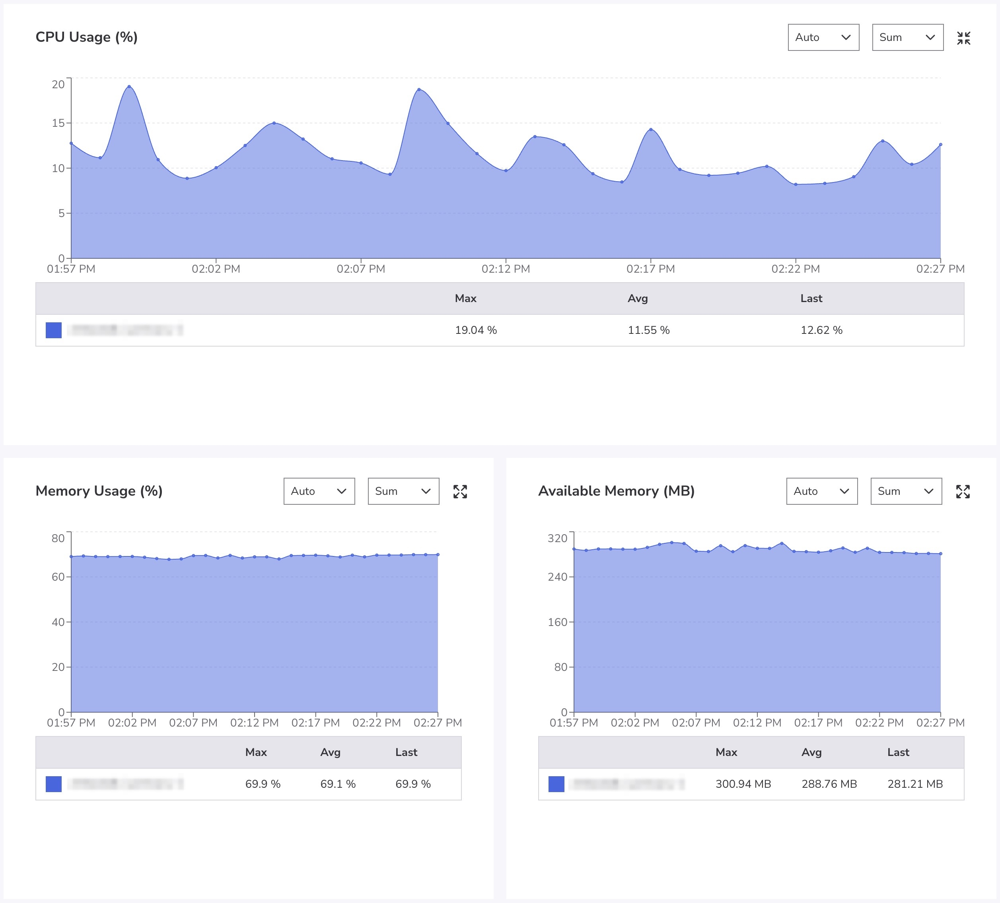

## Introduction

Managed databases can offload many day-to-day responsibilities that database administrators (DBAs) traditionally hold when managing self-hosted databases, such as software patching and backup scheduling. By handling these tasks, fully managed services -- like [Managed Database Clusters](https://techdocs.akamai.com/cloud-computing/docs/aiven-database-clusters) on Akamai Cloud -- allow teams to direct more attention to database performance tuning, data architecture, and operational alignment.

Adopting a managed database involves giving up certain capabilities typically associated with self-managed environments. DBAs who are accustomed to full system control may encounter restrictions, particularly in multi-tenant environments where superuser privileges and host-level access are not available. These trade-offs do not eliminate the role of the DBA, rather, they shift the focus toward higher-level responsibilities.

This guide outlines key feature and administrative differences between self-hosted and managed databases. It compares the upsides of both solutions, as well as what techniques can be used to help maintain control and performance within a managed environment.

## Resources

-   [Get Started with Managed Databases](https://techdocs.akamai.com/cloud-computing/docs/get-started-new-clusters): A quickstart tutorial on setting up a managed database cluster, including: provisioning, selecting a data center, and connecting to your database.

-   Data migration instructions on how to move from a source database to a target database:

    -   [Migrate a PostgreSQL database to a Managed Database](https://techdocs.akamai.com/cloud-computing/docs/aiven-postgresql#migrate-a-postgresql-database-to-a-managed-database)

    -   [Migrate a MySQL database to a Managed Database](https://techdocs.akamai.com/cloud-computing/docs/aiven-mysql#migrate-a-mysql-database-to-a-managed-database)

-   [Managed Databases Product Documentation](https://techdocs.akamai.com/cloud-computing/docs/aiven-database-clusters): Complete documentation for our Managed Databases service.

## Superuser and OS-Level Access

Self-hosted database environments inherently provide a higher level of administrative control than managed databases. This includes access to operating systems and superuser roles, which can affect how certain tasks are performed.

### Benefits of Self-Hosting

Self-hosted environments give DBAs unrestricted access to the operating system (OS) and superuser roles such as `root`, `postgres`, or `mysql`. This level of access enables direct control over user privileges, background processes, file system operations, and system configurations.

In managed environments, users typically interact with the database through a restricted administrative account that doesn't include full superuser privileges. Operating system access is generally not available, and many system-level commands or settings are locked down by the cloud provider.

### Benefits of Managed

One of the primary use cases for managed database models is reducing the risk of misconfiguration, as well as limiting the impact of potential security issues. Tasks like patching, system upgrades, and critical maintenance are handled automatically by the provider.

### How to Adapt

When working with a managed database, begin by **determining what permissions are granted** by the provider to you as the database owner.

For example, in PostgreSQL, run the following command:

```command
psql=> \du+

                           List of roles
     Role name      |                         Attributes
--------------------+------------------------------------------------------
 youruser           | Create role, Create DB, Replication, Bypass RLS
```

In MySQL, the equivalent command would be:

```command
mysql> show grants\G;

*************************** 1. row ***************************
Grants for youruser@%: GRANT SELECT, INSERT, UPDATE, DELETE, CREATE, DROP, RELOAD, PROCESS, REFERENCES, INDEX, ALTER, SHOW DATABASES, CREATE TEMPORARY TABLES, LOCK TABLES, EXECUTE, REPLICATION SLAVE, REPLICATION CLIENT, CREATE VIEW, SHOW VIEW, CREATE ROUTINE, ALTER ROUTINE, CREATE USER, EVENT, TRIGGER ON *.* TO "youruser"@"%" WITH GRANT OPTION
*************************** 2. row ***************************
Grants for youruser@%: GRANT REPLICATION_APPLIER,ROLE_ADMIN ON *.* TO "youruser"@"%" WITH GRANT OPTION
*************************** 3. row ***************************
Grants for youruser@%: REVOKE INSERT, UPDATE, DELETE, CREATE, DROP, REFERENCES, INDEX, ALTER, CREATE TEMPORARY TABLES, LOCK TABLES, EXECUTE, CREATE VIEW, SHOW VIEW, CREATE ROUTINE, ALTER ROUTINE, EVENT, TRIGGER ON "metrics_user_telegraf".* FROM "youruser"@"%"
*************************** 4. row ***************************
Grants for youruser@%: REVOKE INSERT, UPDATE, DELETE, CREATE, DROP, REFERENCES, INDEX, ALTER, CREATE TEMPORARY TABLES, LOCK TABLES, EXECUTE, CREATE VIEW, SHOW VIEW, CREATE ROUTINE, ALTER ROUTINE, EVENT, TRIGGER ON "mysql".* FROM "youruser"@"%"
*************************** 5. row ***************************
Grants for youruser@%: REVOKE INSERT, UPDATE, DELETE, CREATE, DROP, REFERENCES, INDEX, ALTER, CREATE TEMPORARY TABLES, LOCK TABLES, EXECUTE, CREATE VIEW, SHOW VIEW, CREATE ROUTINE, ALTER ROUTINE, EVENT, TRIGGER ON "sys".* FROM "youruser"@"%"

5 rows in set (0.06 sec)
```

The resulting list shows you what access and permission limitations the managed database service has in place. From there, you can use the highest-level administrative role available to manage users, roles, and other permissions.

For tasks that normally require OS-level access -- such as inspecting logs or modifying system services -- look for equivalent features exposed via the provider UI or API.

## Configuration Flexibility

Managed databases expose a curated set of configuration parameters. This limits the degree to which environments can be fine-tuned but can simplify administration while reducing the potential for misconfiguration.

### Benefits of Self-Hosting

Self-hosted databases allow full access to configuration files and system parameters, providing DBAs with the ability to fine-tune behavior at every level, from memory usage and query planning to connection handling and timeout values.

In managed environments, access to these settings is typically restricted to a predefined list of modifiable parameters. Some tuning options may be unavailable or applied globally across multiple tenants.

### Benefits of Managed

Managed providers supply sensible defaults optimized for general performance and stability. These defaults are often sufficient for a wide range of workloads and reduce the risk of degraded performance due to manual misconfiguration. Centralized control can also simplify scaling and software upgrades.

### How to Adapt

Use the managed provider's control panel, CLI, or API to configure available settings. Managed environments expose a limited set of PostgreSQL or MySQL parameters that can be changed without superuser access.

For example, some PostgreSQL parameters can be configured dynamically. Examples include:

-   `SET statement_timeout = '7s';` limits query execution time.

-   `SET work_mem = '16MB';` controls memory usage for sort and hash operations.

-   `SET search_path = myschema, public;` defines schema lookup order.

-   `SET client_encoding = 'UTF8';` sets character encoding for the session.

-   `SET TIME ZONE 'America/Los_Angeles';` ensures consistent timestamp behavior.

Retry logic, connection timeouts, and pooling behavior can often be managed through your application's database driver or ORM. This allows greater control over performance characteristics even when backend configuration options are limited.

Below is a basic Node.js example using the `pg` client with a connection pool and retry logic:

```
const { Pool } = require('pg');

const pool = new Pool({
  connectionString: process.env.DATABASE_URL,
  connectionTimeoutMillis: 5000, // 5s to establish a connection
  idleTimeoutMillis: 10000,      // 10s before releasing idle clients
  max: 10                        // max number of clients in the pool
});

async function queryWithRetry(sql, params, retries = 3) {
  for (let attempt = 1; attempt <= retries; attempt++) {
    try {
      const client = await pool.connect();
      try {
        const res = await client.query(sql, params);
        return res;
      } finally {
        client.release();
      }
    } catch (err) {
      if (attempt === retries) throw err;
      console.warn(`Attempt ${attempt} failed. Retrying...`);
    }
  }
}
```

## Extension and Plugin Support

Managed databases offer specific extensions and plugins, usually curated and tested by the provider to ensure compatibility and stability.

### Benefits of Self-Hosting

In self-hosted environments, DBAs can install any PostgreSQL extension or MySQL plugin supported by the underlying system. This allows teams to extend functionality with third-party or custom-built extensions.

Managed environments do not have the same level of flexibility. There is a predefined list of supported extensions, and installing custom or community plugins may not be permitted.

### Benefits of Managed

The curated extension list provided by managed database services includes commonly used and well-supported options. These are tested for compatibility and maintained across upgrades, reducing the operational risk associated with extension conflicts or outdated binaries.

### How to Adapt

Before migrating databases from self-hosted to managed, compare the list of extensions required by your applications against what the provider supports. Most providers publish an [extension compatibility matrix](https://aiven.io/docs/products/postgresql/reference/list-of-extensions) to help you optimize compatibility before cutover.

In PostgreSQL, you can view the extensions available in your current environment by running the following query:

```
psql=> SELECT * FROM pg_available_extensions;

             name             | default_version
------------------------------+-----------------
 address_standardizer         | 3.5.0
 address_standardizer_data_us | 3.5.0
 aiven_extras                 | 1.1.16
 amcheck                      | 1.3
 autoinc                      | 1.0
 bloom                        | 1.0
 bool_plperl                  | 1.0
 btree_gin                    | 1.3
 btree_gist                   | 1.7
…
 timescaledb                  | 2.19.2
 tsm_system_rows              | 1.0
 tsm_system_time              | 1.0
 unaccent                     | 1.1
 unit                         | 7
 uuid-ossp                    | 1.1
 vector                       | 0.7.4
 vectorscale                  | 0.6.0
 xml2                         | 1.1
(73 rows)
```

This returns a list of all extensions that can be installed within the current environment, which can be useful for validating compatibility during the planning phase of a migration.

In MySQL, you can query for available plugins and components in your current environment with the below command:

```
mysql> show plugins;
+-----------------------+--------+----------------+--------------------+
| Name                  | Status | Type           | Library            |
+-----------------------+--------+----------------+--------------------+
| binlog                | ACTIVE | STORAGE ENGINE | NULL               |
| mysql_native_password | ACTIVE | AUTHENTICATION | NULL               |
| sha256_password       | ACTIVE | AUTHENTICATION | NULL               |
| caching_sha2_password | ACTIVE | AUTHENTICATION | NULL               |
| sha2_cache_cleaner    | ACTIVE | AUDIT          | NULL               |
...
| ngram                 | ACTIVE | FTPARSER       | NULL               |
| mysqlx_cache_cleaner  | ACTIVE | AUDIT          | NULL               |
| mysqlx                | ACTIVE | DAEMON         | NULL               |
| rpl_semi_sync_master  | ACTIVE | REPLICATION    | semisync_master.so |
| rpl_semi_sync_slave   | ACTIVE | REPLICATION    | semisync_slave.so  |
+-----------------------+--------+----------------+--------------------+
47 rows in set (0.08 sec)
```


The query `select * from mysql.component` shows components registered with the MySQL server which extend server functionality differently from traditional plugins.


If a needed extension or plugin is unavailable, consider replicating its functionality in application logic, using companion services, or integrating with external platforms. When direct equivalents exist, evaluate supported alternatives that achieve similar outcomes without requiring unsupported plugins.

## Backups

Managed databases [automate the backup process](https://techdocs.akamai.com/cloud-computing/docs/aiven-manage-database#manage-backups), often providing regular snapshots and recovery options with minimal configuration. However, these backup systems may not offer the same level of customization or retention control as a self-hosted solution.

### Benefits of Self-Hosting

In self-hosted environments, DBAs have access to backup files, can schedule backups at highly specific times, select backup formats and destinations, and define retention policies tailored to compliance or business continuity needs. Managed services can abstract some of these options, applying provider-defined scheduling windows and storage durations.

### Benefits of Managed

Another primary use case for managed database solutions is offloading backup tasks, with the added benefit of significantly reducing operational overhead. Free backups are included with Akamai’s Managed Database Clusters and are enabled upon startup. Backups are handled on a daily basis, are retained for 14 days, and include point-in-time [recovery](https://techdocs.akamai.com/cloud-computing/docs/aiven-database-clusters#disaster-recovery). This helps ensure data safety without requiring manual oversight.

### How to Adapt

To help maintain flexibility, you can use command line tools like [`pg_dump`](https://www.postgresql.org/docs/current/app-pgdump.html) or [`mysqldump`](https://dev.mysql.com/doc/refman/8.4/en/mysqldump.html) to create additional manual backups on your own schedule. Backups can be customized by database, schema, or format.

For example, using `pg_dump`:

```
~/$ pg_dump -\
  --host a123456-prod-default.g2a.akamaidb.net \
  --port 10033 \
  --username akmadmin
  defaultdb > outfile_psql.sql
```


If permissions allow, you can use [`pg_dumpall`](https://www.postgresql.org/docs/current/app-pg-dumpall.html) to dump all the databases from a single cluster.


And using `mysqldump`:

```
~/$ mysqldump -\
  --host a987654-prod-default.g2a.akamaidb.net \
  --port 10033 \
  --user akmadmin \
  --password \
  defaultdb > outfile_mysql.sql
```

Exported backups can also be stored in Object Storage using tools like [`rclone`](/docs/guides/rclone-object-storage-file-sync/) or [`s3cmd`](https://techdocs.akamai.com/cloud-computing/docs/using-s3cmd-with-object-storage). This approach allows you to enforce your own retention and [access control policies](https://techdocs.akamai.com/cloud-computing/docs/define-access-and-permissions-using-bucket-policies).

You can also test backups by restoring them to a temporary environment to ensure data integrity. This also provides a way to benchmark recovery times and identify potential gaps in coverage.

## Maintenance Scheduling and Version Control

Managed services regularly apply patches and upgrades to ensure security and reliability. This helps remove the burden of manual maintenance, but it can also limit control over when updates occur and how they are tested.

### Benefits of Self-Hosting

In a self-hosted environment, DBA can choose when to apply patches, test updates in staging environments, and defer changes that might disrupt production workloads. This level of control is often not available in managed environments, where providers control the patch cycle.

### Benefits of Managed

Managed providers apply critical updates automatically, reducing exposure to known vulnerabilities and ensuring software remains up-to-date. Some platforms like Akamai Cloud allow users to [define preferred maintenance windows](https://techdocs.akamai.com/cloud-computing/docs/aiven-manage-database#automatic-updates-and-maintenance-window) to avoid peak traffic periods.

### How to Adapt

Although you may be unable to configure database maintenance schedules down to the minute, managed databases let you set a preferred maintenance window (i.e. day of the week, hour of the day) to help reduce impact on production workloads. High-availability clusters also enable automatic failover between nodes to reduce the possibility of downtime.

Consider spinning up additional new database instances for development and staging. This way, you can roll out and test proposed database changes before promoting them to production. When rolling out significant changes, use [blue-green deployments](https://en.wikipedia.org/wiki/Blue%E2%80%93green_deployment) to reduce downtime and verify stability before directing traffic to the updated environment.

You can also use schema versioning tools -- such as [Liquibase Open Source](https://www.liquibase.com/open-source) -- to help manage migrations and provide a structured rollback path if issues arise. For example, you can define a `liquibase.properties` file with credentials to access your managed database. Then, define migrations with XML in individual files. See the below example file that creates a `products` table for an ecommerce site database:

```
<?xml version="1.0" encoding="UTF-8"?>
<databaseChangeLog
    xmlns="http://www.liquibase.org/xml/ns/dbchangelog"
    xmlns:xsi="http://www.w3.org/2001/XMLSchema-instance"
    xsi:schemaLocation="http://www.liquibase.org/xml/ns/dbchangelog
                      http://www.liquibase.org/xml/ns/dbchangelog/dbchangelog-4.20.xsd">

    <changeSet id="1" author="alvin">
        <createTable tableName="products">
            <column name="id" type="bigint" autoIncrement="true">
                <constraints primaryKey="true" nullable="false"/>
            </column>
            <column name="name" type="varchar(255)">
                <constraints nullable="false"/>
            </column>
            <column name="description" type="text"/>
            <column name="price" type="decimal(11,2)">
                <constraints nullable="false"/>
            </column>
            <column name="created_at" type="timestamp" defaultValueComputed="CURRENT_TIMESTAMP">
                <constraints nullable="false"/>
            </column>
            <column name="updated_at" type="timestamp" defaultValueComputed="CURRENT_TIMESTAMP">
                <constraints nullable="false"/>
            </column>
        </createTable>
    </changeSet>

</databaseChangeLog>
```

Then, update your database schema by applying your migrations:

```
$ liquibase update

…
Starting Liquibase at 13:53:48 using Java 21.0.6 (version 4.31.1 #6739 built at 2025-02-13 13:46+0000)
Liquibase Version: 4.31.1
Liquibase Open Source 4.31.1 by Liquibase
Running Changeset: db/changelog/changes/01-create-products-table.xml::1::user
Running Changeset: db/changelog/changes/02-add-stock-column.xml::2::user
Running Changeset: db/changelog/changes/03-remove-stock-column.xml::3::user
Running Changeset: db/changelog/changes/04-create-orders-table.xml::4::user

UPDATE SUMMARY
Run:                          4
Previously run:               0
Filtered out:                 0
-------------------------------
Total change sets:            4

Liquibase: Update has been successful. Rows affected: 4
Liquibase command 'update' was executed successfully.
```

You can also roll back migrations incrementally. For example:

```
$ liquibase rollbackCount 2


…
Starting Liquibase at 13:54:12 using Java 21.0.6 (version 4.31.1 #6739 built at 2025-02-13 13:46+0000)
Liquibase Version: 4.31.1
Liquibase Open Source 4.31.1 by Liquibase
Rolling Back Changeset: db/changelog/changes/04-create-orders-table.xml::4::user
Rolling Back Changeset: db/changelog/changes/03-remove-stock-column.xml::3::user
Liquibase command 'rollbackCount' was executed successfully.
```

## Monitoring and Logging

When you migrate data to any managed environment, access to raw system logs and OS-level monitoring is typically abstracted. However, solutions like Managed Database Clusters on Akamai Cloud provide [integrated dashboards and performance insights](https://techdocs.akamai.com/cloud-computing/docs/monitor-database-cluster).

### Benefits of Self-Hosting

Self-hosted environments allow direct access to detailed system logs, query logs, and custom monitoring setups. The level of insight supports advanced troubleshooting and performance tuning.

### Benefits of Managed

Managed services usually offer built-in dashboards and monitoring features, including performance tracking and resource allocation. These tools are designed to cover common diagnostic needs.

### How to Adapt

For database monitoring or performance diagnostics apart from provider tooling, you can look into application-layer tools or using a database client CLI to tap into performance insights without needing external access. For example:

-   **PostgreSQL** makes database server activity statistics through its [cumulative statistics system](https://www.postgresql.org/docs/current/monitoring-stats.html#MONITORING-STATS).

-   **MySQL** server statistics can be found in the [MySQL Performance Schema](https://dev.mysql.com/doc/refman/8.4/en/performance-schema.html) and [server status variables](https://dev.mysql.com/doc/refman/5.7/en/server-status-variables.html).

To maintain visibility, log queries, response times, and error details at the application level. Some platforms support exporting metrics to tools like Prometheus, Grafana, or third-party services. If database metrics are exposed on a protected endpoint, configure Prometheus to scrape metrics from that endpoint.

Akamai's Managed Databases use Akamai Cloud Pulse (ACLP) to help users monitor Managed Database Clusters and visualize performance trends. You can view ACLP in Cloud Manager by selecting a database's **Metrics** tab.



## Hardware Tuning and Infrastructure Control

Managed databases run on fixed hardware profiles and instance types, which can limit options for fine-grained infrastructure tuning.

### Benefits of Self-Hosting

In self-hosted setups, DBAs have the ability to choose CPU models, configure RAID (redundant array of independent disks), control disk IOPS (input/output operations per second), and fine-tune memory and storage allocations. These decisions are abstracted in managed services.

### Benefits of Managed

Managed services offer preconfigured plan tiers optimized for availability, scaling, and consistency. These plans eliminate the need to manage hardware directly and can simplify capacity planning.

### How to Adapt

When choosing a plan or database instance type with a managed database service, **match the compute profile to the expected workload**. At the time of this writing, Akamai's Managed Databases offer both [shared and dedicated](https://techdocs.akamai.com/cloud-computing/docs/database-engines-plans#database-plans) Compute Instance options.

Monitor your database usage to determine when to scale. Consider provisioning additional database nodes for high availability.

Offload read-heavy queries to replicas, or try a solution like [Memcached](https://memcached.org/) to reduce database load. Move infrequently accessed records to archival storage to improve query performance and reduce costs.

## Custom Audit Workflows

Managed environments often do not provide access to system-level audit trails, but custom workflows can be implemented using database and application logic.

### Benefits of Self-Hosting

With self-hosted databases, DBAs can configure audit plugins or access system logs for forensic analysis. This level of granularity is not always supported in a managed offering.

### Benefits of Managed

Managed environments often offload logging tasks and may offer log insight via Support upon request.

### How to Adapt

Capture data updates to critical tables by implementing triggers that write to audit logs.

Consider the following example of a PostgreSQL database with a `customers` table for an ecommerce site. To track and audit any data operations on the table -- such as `INSERT`, `UPDATE`, or `DELETE` -- a database trigger can be created that logs those operations to a separate table.

The following query creates the logging table:

```
psql=> CREATE TABLE data_change_audit (
       id SERIAL PRIMARY KEY,
       event_time TIMESTAMP WITH TIME ZONE DEFAULT now(),
       operation TEXT,      -- 'INSERT', 'UPDATE', 'DELETE'
       table_name TEXT,     -- e.g., 'customers'
       record_id TEXT,      -- primary key or identifier (optional)
       old_data JSONB,      -- previous row (for UPDATE/DELETE)
       new_data JSONB       -- new row (for INSERT/UPDATE)
       );
```

You can then [create a function](https://www.postgresql.org/docs/17/sql-createfunction.html) to be called by the trigger that handles inserting a recording into the `data_change_audit` table:

```
psql=> CREATE OR REPLACE FUNCTION audit_data_changes()
RETURNS TRIGGER
LANGUAGE plpgsql
AS $$
BEGIN
  IF (TG_OP = 'INSERT') THEN
    INSERT INTO data_change_audit(operation, table_name, record_id, old_data, new_data)
    VALUES ('INSERT', TG_TABLE_NAME, NEW.id::TEXT, NULL, to_jsonb(NEW));

  ELSIF (TG_OP = 'UPDATE') THEN
    INSERT INTO data_change_audit(operation, table_name, record_id, old_data, new_data)
    VALUES ('UPDATE', TG_TABLE_NAME, NEW.id::TEXT, to_jsonb(OLD), to_jsonb(NEW));

  ELSIF (TG_OP = 'DELETE') THEN
    INSERT INTO data_change_audit(operation, table_name, record_id, old_data, new_data)
    VALUES ('DELETE', TG_TABLE_NAME, OLD.id::TEXT, to_jsonb(OLD), NULL);
  END IF;

  RETURN NULL;
END;
$$;
```

Lastly, [create the trigger](https://www.postgresql.org/docs/current/sql-createtrigger.html) that executes the function on data changes in the `customers` table:

```
psql=> CREATE TRIGGER trigger_audit_customer_changes
       AFTER INSERT OR UPDATE OR DELETE ON customers
       FOR EACH ROW
       EXECUTE FUNCTION audit_data_changes();
```

Now when data in the `customers` table changes, a record exists in the `data_change_audit` table:

```
psql=> select * from data_change_audit;
(0 rows)

psql=> delete from customers where id=5;
DELETE 1

psql=> select * from data_change_audit;
-[ RECORD 1 ]
id         | 2
event_time | 2025-04-27 05:10:36.78078+00
operation  | DELETE
table_name | customers
record_id  | 5
old_data   | {"id": 5, "email": "eve@example.com", "phone": "555-567-8901", "created_at": "2025-04-27T04:56:40.002589+00:00", "updated_at": "2025-04-27T04:56:40.002589+00:00", "shipping_address": "202 Birch Ln, Salem, OR 97301"}
new_data   |
```

By keeping audit trails in dedicated tables, you can implement separate application-level processes to export audit trail records to an external logging system.

MySQL has similar [trigger](https://dev.mysql.com/doc/refman/8.4/en/triggers.html) capabilities, though with slight [trigger syntax](https://dev.mysql.com/doc/refman/8.4/en/trigger-syntax.html) differences from PostgreSQL.

## Security and Access Control

Managed database services typically provide built-in controls for secure connections and limited exposure, but do not allow full control over network-layer firewalls or OS-level security.

### Benefits of Self-Hosting

Self-hosted environments can use host-based firewalls, OS hardening, and custom ACLs to tailor security posture. These operations are often abstracted in managed environments.

### Benefits of Managed

Managed services provide built-in TLS encryption, disk encryption, and IP-based access control. These defaults support [secure-by-design](https://en.wikipedia.org/wiki/Secure_by_design) principles. See our doc on [managing access control](https://techdocs.akamai.com/cloud-computing/docs/aiven-manage-database#access-control) for your database clusters.

### How to Adapt

Many managed database providers, including Akamai, offer IP allowlist and denylist features directly in their dashboards or APIs. These settings let you specify exactly which IP addresses or ranges are permitted to initiate a connection to your database.

Role-based access control (RBAC) allows you to define granular permissions, ensuring users and applications only have access to the actions and data they require. To follow this methodology, create a new user and restrict their access to specific tables and operations by granting minimal privileges.

For example, to create a user who can only read from the `customers` table in the previous scenario, run the following:

```
CREATE USER readonly_user WITH PASSWORD '';
GRANT CONNECT ON DATABASE defaultdb TO readonly_user;
GRANT USAGE ON SCHEMA public TO readonly_user;
GRANT SELECT ON TABLE customers TO readonly_user;
```

If that user attempts to `INSERT` or `DELETE` rows to the `customers` table, they would encounter the following results since they only have `readonly` permissions:

```
psql=> DELETE FROM customers WHERE id=1;
ERROR:  permission denied for table customers

psql=> INSERT INTO customers(email, shipping_address, phone)
       VALUES ('ivan@example.com',
               '606 Chestnut Cir, Tampa, FL 33602',
               '555-901-2345');
ERROR:  permission denied for table customers
```

## Conclusion

Migrating to a managed database changes how DBAs interact with their systems. While some low-level controls may no longer be available, managed platforms provide reliability, scalability, and integrated tooling that reduce operational overhead.

By understanding what capabilities change, and adapting in the necessary ways, DBAs can achieve the level of visibility and control they need to maintain performance and effectiveness.