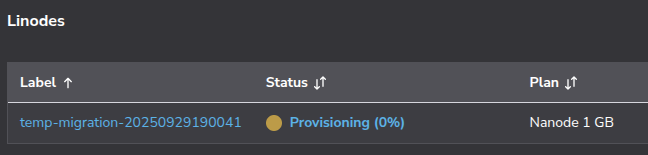
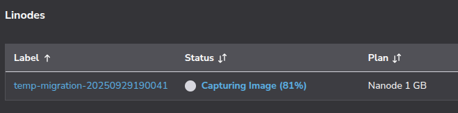

Organizations may migrate to Akamai Cloud for various reasons, including cost optimization and improved performance. Whether you're looking to consolidate providers or take advantage of Akamai's competitive pricing and dedicated resources, migrating existing virtual machines can seem like a daunting task.

This guide provides a provider-agnostic approach to migrating a compute instance to Akamai Cloud using [HashiCorp Packer](https://developer.hashicorp.com/packer).

Although this guide uses an AWS EC2 instance as its primary example with screenshots and specific commands, the methodology applies to virtual machines from any cloud provider or on-premises infrastructure.

By the end of this walkthrough, you'll have a repeatable, automated process for migrating your virtual machines that captures your applications, configurations, and data while leveraging the infrastructure advantages of Akamai Cloud.

## How Packer Works for VM Migration

Understanding how Packer approaches VM migration is crucial for setting proper expectations and planning an effective migration strategy.

Unlike traditional imaging tools that create bit-for-bit copies of existing disks, Packer takes a different approach. It creates a new virtual machine from a base image (such as Ubuntu 22.04) and then uses provisioners to replicate your configuration and bundle your data during the build process. The result is a "golden image" that contains your applications and data, ready for deployment on Linode's infrastructure.

This approach means Packer creates a fresh, clean installation rather than cloning your existing system state. While this requires more setup, it often results in a more reliable and optimized final image.

### What gets migrated and what doesn't

It's important to understand what Packer can and cannot migrate:

#### Successfully migrated

-   Applications and installed packages
-   Configuration files and system settings
-   User data and application files
-   Database dumps and backups
-   SSL certificates and environment files
-   Service configurations and startup scripts

#### Not migrated

-   Exact OS state and kernel modules
-   Running processes and their current state
-   Temporary files and cached data
-   System logs and transient data

#### Requires special planning

-   Large databases (may need a separate migration strategy)
-   SSL certificates with private keys
-   Secrets and API keys
-   Third-party integrations and external dependencies

### Why use Packer instead of a direct image upload?

Akamai Cloud supports direct image uploads, but this approach has limitations. Direct uploads are constrained by size limits (6GB uncompressed / 5GB compressed) and require specific disk image formats. Many production systems exceed these size constraints, especially when including application data and databases.

Packer's [Linode builder plugin](https://developer.hashicorp.com/packer/integrations/linode/linode/latest/components/builder/linode) provides an automated alternative that helps keep migrated disk sizes slim enough to stay within these size constraints, and it enables repeatable builds. The process is API-driven and version-controllable, and it can be integrated into CI/CD pipelines for ongoing infrastructure management.


## Prerequisites and Assumptions

The example used in this guide is a simple AWS EC2 environment running NGINX and an Express API, with additional user data stored in `/home/ubuntu/userdata`. You can replicate this environment by creating an AWS CloudFormation stack from the template found in this [GitHub repository](https://github.com/alvinslee/simple-aws-ec2-with-nginx-and-express).

This guide assumes access to administrative credentials and CLI tools for both AWS (or your source VM cloud provider) and Akamai Cloud. You should have the ability to view and modify relevant cloud resources in both environments.

You will need SSH access to your source VM with the ability to install Packer (sudo access required). On the Akamai side, you will need an Akamai Cloud account and the ability to generate an API token.

## Pre-Migration Assessment and Planning

Proper planning is essential for a successful migration. Take time to thoroughly assess your current environment before proceeding.

### Step 1: Inventory your environment

Start by documenting what's currently running on your source VM:

```command {title="List installed packages, store in file"}
dpkg --get-selections > installed-packages.txt
```

```command {title="Check running services"}
systemctl list-units --type=service --state=running
```

```output
 UNIT                           LOAD   ACTIVE SUB     DESCRIPTION
  acpid.service                 loaded active running ACPI event daemon
  chrony.service                loaded active running chrony, an NTP client/server
  cron.service                  loaded active running Regular background program processing daemon
  dbus.service                  loaded active running D-Bus System Message Bus
  express-api.service           loaded active running Express API Service
  fwupd.service                 loaded active running Firmware update daemon
  getty@tty1.service            loaded active running Getty on tty1
  irqbalance.service            loaded active running irqbalance daemon
  ModemManager.service          loaded active running Modem Manager
  multipathd.service            loaded active running Device-Mapper Multipath Device Controller
  networkd-dispatcher.service   loaded active running Dispatcher daemon for systemd-networkd
  nginx.service                 loaded active running A high performance web server and a reverse proxy server
...
```

```command {title="Review disk usage"}
df -h; du -sh /var /opt /home/ubuntu
```

```output
Filesystem       Size  Used Avail Use% Mounted on
/dev/root        6.8G  2.8G  4.0G  41% /
tmpfs            458M     0  458M   0% /dev/shm
tmpfs            183M  912K  182M   1% /run
tmpfs            5.0M     0  5.0M   0% /run/lock
efivarfs         128K  3.6K  120K   3% /sys/firmware/efi/efivars
/dev/nvme0n1p16  881M  149M  671M  19% /boot
/dev/nvme0n1p15  105M  6.2M   99M   6% /boot/efi
tmpfs             92M   12K   92M   1% /run/user/1000


881M    /var
4.0K    /opt
12M     /home/ubuntu
```

```command {title="Check listening ports"}
sudo ss -tulnp
```

```output
Netid       State        Recv-Q       Send-Q                Local Address:Port             Peer Address:Port      Process
udp         UNCONN       0            0                        127.0.0.54:53                    0.0.0.0:*          users:(("systemd-resolve",pid=8214,fd=16))
udp         UNCONN       0            0                     127.0.0.53%lo:53                    0.0.0.0:*          users:(("systemd-resolve",pid=8214,fd=14))
udp         UNCONN       0            0                  172.31.31.1%ens5:68                    0.0.0.0:*          users:(("systemd-network",pid=19258,fd=23))
udp         UNCONN       0            0                         127.0.0.1:323                   0.0.0.0:*          users:(("chronyd",pid=13440,fd=5))
udp         UNCONN       0            0                             [::1]:323                      [::]:*          users:(("chronyd",pid=13440,fd=6))
tcp         LISTEN       0            4096                     127.0.0.54:53                    0.0.0.0:*          users:(("systemd-resolve",pid=8214,fd=17))
tcp         LISTEN       0            511                         0.0.0.0:80                    0.0.0.0:*          users:(("nginx",pid=20521,fd=5),("nginx",pid=20520,fd=5),("nginx",pid=19520,fd=5))
tcp         LISTEN       0            4096                        0.0.0.0:22                    0.0.0.0:*          users:(("sshd",pid=20549,fd=3),("systemd",pid=1,fd=193))
tcp         LISTEN       0            511                         0.0.0.0:3000                  0.0.0.0:*          users:(("node",pid=20507,fd=18))
tcp         LISTEN       0            4096                  127.0.0.53%lo:53                    0.0.0.0:*          users:(("systemd-resolve",pid=8214,fd=15))
tcp         LISTEN       0            511                            [::]:80                       [::]:*          users:(("nginx",pid=20521,fd=6),("nginx",pid=20520,fd=6),("nginx",pid=19520,fd=6))
tcp         LISTEN       0            4096                           [::]:22                       [::]:*          users:(("sshd",pid=20549,fd=4),("systemd",pid=1,fd=194))
```

Create a comprehensive inventory that includes:

-   All installed applications and services
-   Custom configurations and their locations
-   User accounts and permission structures
-   Database systems and their data sizes
-   Web server configurations
-   SSL certificates and their renewal processes

### Step 2: Identify critical data and configurations

Identify the essential files and configurations required for your applications to function properly. For example:

-   Application source code and binaries
-   Configuration files in `/etc/`
-   User data in home directories
-   Application-specific data directories
-   Database files or dump locations
-   Log files that contain critical historical data

### Step 3: Plan your migration strategy

Decide which data to bundle directly into the Packer image and which to migrate separately. For example:

#### Bundle in the Packer image

-   Application code and configurations
-   System configurations
-   Small databases (< 1GB)
-   SSL certificates
-   User accounts and basic data

#### Migrate separately

-   Large databases (use database-specific migration tools)
-   Large file stores and media libraries
-   Log archives
-   Backup files

Consider your downtime requirements and plan accordingly. Some applications can be migrated with minimal downtime, while others may require a maintenance window.

## Setting Up the Migration Environment

### Step 1: Verify your source operating system

First, determine exactly what operating system you're running:

```command {title="Check OS version and distribution"}
lsb_release -a
```

```command {title="Alternative method to check OS version and distribution"}
cat /etc/os-release
```

For the example AWS EC2 environment, you might see output like the following:

```output
No LSB modules are available.
Distributor ID: Ubuntu
Description:    Ubuntu 24.04.3 LTS
Release:        24.04
Codename:       noble
```

```command {title="Check architecture"}
uname -m
```

```output
x86_64
```

### Step 2: Find a compatible Linode base image

Based on your source VM architecture, identify the corresponding base image available on Linode. Use the Linode API to list available images:

```command {title="Set API token, then list available public images"}
export LINODE_TOKEN="your_api_token_here"

curl -H "Authorization: Bearer $LINODE_TOKEN" \
  https://api.linode.com/v4/images | \
  jq '.data[] | select(.is_public == true) | {id: .id, label: .label}'
```

To filter for Ubuntu images specifically, run the following command:

```command {title="List available public Ubuntu images"}
curl -H "Authorization: Bearer $LINODE_TOKEN" \
  https://api.linode.com/v4/images | \
  jq '.data[] | select(.id | contains("ubuntu")) | {id: .id, label: .label}'
```

```output
{
  "id": "linode/ubuntu22.04",
  "label": "Ubuntu 22.04 LTS"
}
{
  "id": "linode/ubuntu22.04-kube",
  "label": "Ubuntu 22.04 LTS KPP"
}
{
  "id": "linode/ubuntu24.04",
  "label": "Ubuntu 24.04 LTS"
}
{
  "id": "linode/ubuntu16.04lts",
  "label": "Ubuntu 16.04 LTS"
}
{
  "id": "linode/ubuntu18.04",
  "label": "Ubuntu 18.04 LTS"
}
{
  "id": "linode/ubuntu20.04",
  "label": "Ubuntu 20.04 LTS"
}
{
  "id": "linode/ubuntu24.10",
  "label": "Ubuntu 24.10"
}
```

For maximum compatibility, choose the image that most closely matches the OS of your source VM.

### Step 3: Install and configure Packer

Follow the instructions provided [here](https://developer.hashicorp.com/packer/tutorials/docker-get-started/get-started-install-cli) to install Packer on your source VM.

```command {title="Add HashiCorp's GPG key and repository"}
udo mkdir -m 0755 -p /etc/apt/keyrings/
curl -fsSL https://apt.releases.hashicorp.com/gpg | sudo gpg --dearmor -o /etc/apt/keyrings/hashicorp-archive-keyring.gpg

echo "deb [arch=$(dpkg --print-architecture) signed-by=/etc/apt/keyrings/hashicorp-archive-keyring.gpg] https://apt.releases.hashicorp.com $(grep -oP '(?<=UBUNTU_CODENAME=).*' /etc/os-release || lsb_release -cs) main" | sudo tee /etc/apt/sources.list.d/hashicorp.list
```

```command {title="Update package list and install Packer"}
sudo apt-get update && sudo apt-get install packer
```

```command {title="Verify installation"}
packer --version
```

```output
Packer v1.14.2
```

```command {title="Install the official Linode builder plugin for Packer"}
sudo packer plugins install github.com/linode/linode
```

```output
Installed plugin github.com/linode/linode v1.6.8 in "/home/ubuntu/.config/packer/plugins/github.com/linode/linode/packer-plugin-linode_v1.6.8_x5.0_linux_amd64"
```

## Data Capture and Bundling

The data capture phase is crucial for ensuring your migrated system has everything it needs to function properly.

### Step 1: Create a data capture script

On your source VM, create a folder named `packer-migration`.

```command {title="Create migration working directory"}
sudo mkdir /usr/packer-migration
sudo cd /usr/packer-migration
```

Create a script (`capture-system.sh`) to systematically capture your system configuration and data. Using the example AWS EC2 environment for this guide, your data capture script may look like this:

```bash {title="Data capture script"}
#!/bin/bash
set -e

echo "Starting system capture for Packer migration..."

# Create bundle directory
mkdir -p bundle-data
cd bundle-data

# Capture system packages and services
echo "Capturing system configuration..."
dpkg --get-selections > installed-packages.txt
systemctl list-unit-files --state=enabled > enabled-services.txt
apt list --installed > apt-packages.txt

# Capture important system configurations
echo "Capturing configuration files..."
mkdir -p configs
sudo cp -r /etc/nginx configs/ 2>/dev/null || true
sudo cp /etc/hosts configs/ 2>/dev/null || true
sudo cp /etc/environment configs/ 2>/dev/null || true
sudo cp -r /etc/systemd/system configs/ 2>/dev/null || true

# Capture application data
echo "Capturing application data..."
mkdir -p apps
sudo cp -r /var/www apps/ 2>/dev/null || true
sudo cp -r /opt apps/ 2>/dev/null || true
sudo cp -r /srv apps/ 2>/dev/null || true

# Node.js applications
sudo cp -r /usr/local/lib/node_modules apps/ 2>/dev/null || true

# Capture user data
echo "Capturing user configurations..."
mkdir -p users

# Capture all user directories in /home
for user_home in /home/*; do
    if [ -d "$user_home" ]; then
        username=$(basename "$user_home")
        echo "Capturing user directory: $username"
        mkdir -p "users/$username" 2>/dev/null || true

        # Copy common user files and directories
        cp -r "$user_home"/.bashrc "users/$username/" 2>/dev/null || true
        cp -r "$user_home"/.bash_profile "users/$username/" 2>/dev/null || true
        cp -r "$user_home"/.ssh "users/$username/" 2>/dev/null || true
        cp -r "$user_home"/.gitconfig "users/$username/" 2>/dev/null || true
        cp -r "$user_home"/.config "users/$username/" 2>/dev/null || true
        cp -r "$user_home"/.local "users/$username/" 2>/dev/null || true

        # Copy application and data directories
        cp -r "$user_home"/userdata "users/$username/" 2>/dev/null || true
        cp -r "$user_home"/api "users/$username/" 2>/dev/null || true
        cp -r "$user_home"/projects "users/$username/" 2>/dev/null || true
        cp -r "$user_home"/data "users/$username/" 2>/dev/null || true
        cp -r "$user_home"/app "users/$username/" 2>/dev/null || true
        cp -r "$user_home"/www "users/$username/" 2>/dev/null || true

        # Copy any other directories that might contain application data
        find "$user_home" -maxdepth 1 -type d -name ".*" -not -name ".ssh" -not -name ".config" -not -name ".local" -not -name ".cache" | \
        while read dir; do
            cp -r "$dir" "users/$username/" 2>/dev/null || true
        done
    fi
done

# Also capture root user configurations if we're running as root
if [ "$EUID" -eq 0 ]; then
    echo "Capturing root user configurations..."
    mkdir -p users/root 2>/dev/null || true
    cp -r /root/.bashrc users/root/ 2>/dev/null || true
    cp -r /root/.bash_profile users/root/ 2>/dev/null || true
    cp -r /root/.ssh users/root/ 2>/dev/null || true
    cp -r /root/.gitconfig users/root/ 2>/dev/null || true
fi

# Capture SSL certificates
echo "Capturing SSL certificates..."
mkdir -p ssl
sudo cp -r /etc/ssl/certs ssl/ 2>/dev/null || true
sudo cp -r /etc/letsencrypt ssl/ 2>/dev/null || true

# Capture environment files
echo "Capturing environment files..."
mkdir -p env-files
find /var/www /opt /home -name ".env*" -o -name "*.env" 2>/dev/null | \
    xargs -I {} cp {} env-files/ 2>/dev/null || true

# Capture logs for reference (recent only)
echo "Capturing recent logs..."
mkdir -p logs
sudo find /var/log -name "*.log" -mtime -7 -exec cp {} logs/ \; 2>/dev/null || true

# Capture cron jobs
echo "Capturing scheduled tasks..."
crontab -l > user-crontab.txt 2>/dev/null || true
sudo crontab -l > root-crontab.txt 2>/dev/null || true

# Create inventory file
echo "Creating inventory file..."
cat > inventory.txt << 'INNER_EOF'
# EC2 to Linode Migration Inventory
# Generated: $(date)
# Source EC2 Instance: $(curl -s http://169.254.169.254/latest/meta-data/instance-id 2>/dev/null || echo "Unknown")

## System Info
OS: $(lsb_release -d | cut -f2)
Kernel: $(uname -r)
Architecture: $(uname -m)

## Network
Private IP: $(hostname -I | awk '{print $1}')
Hostname: $(hostname)

## Disk Usage
$(df -h)

## Memory
$(free -h)

## Running Services
$(systemctl list-units --type=service --state=running --no-pager)

## Listening Ports
$(sudo netstat -tlnp)
INNER_EOF

# Fix permissions on copied files
sudo chown -R $USER:$USER .

cd ..
echo "Data capture complete! Bundle located at: $(pwd)/bundle-data"
echo "Bundle size: $(du -sh bundle-data | cut -f1)"
```

Set the proper executable permissions on the script.

```command {title="Set capture script permissions"}
sudo chmod +x /usr/packer-migration/capture-system.sh
```

### Step 2: Run the capture process

```command {title="Execute the capture script"}
sudo /usr/packer-migration/capture-system.sh
```

```output
Starting system capture for Packer migration...
Capturing system configuration...

WARNING: apt does not have a stable CLI interface. Use with caution in scripts.

Capturing configuration files...
Capturing application data...
Capturing user configurations...
Capturing user directory: ubuntu
Capturing root user configurations...
Capturing database dumps...
Capturing SSL certificates...
Capturing environment files...
Capturing recent logs...
Capturing scheduled tasks...
Creating inventory file...
Data capture complete! Bundle located at: /usr/packer-migration/bundle-data
Bundle size: 45M
```

### Step 3: Review the captured data for completeness

```command {title="Review the size of different components captured"}
sudo du -sh /usr/packer-migration/bundle-data/*
```

```output
28K     /usr/packer-migration/bundle-data/apps
48K     /usr/packer-migration/bundle-data/apt-packages.txt
240K    /usr/packer-migration/bundle-data/configs
3.7M    /usr/packer-migration/bundle-data/databases
8.0K    /usr/packer-migration/bundle-data/enabled-services.txt
4.0K    /usr/packer-migration/bundle-data/env-files
20K     /usr/packer-migration/bundle-data/installed-packages.txt
4.0K    /usr/packer-migration/bundle-data/inventory.txt
864K    /usr/packer-migration/bundle-data/logs
0       /usr/packer-migration/bundle-data/root-crontab.txt
644K    /usr/packer-migration/bundle-data/ssl
0       /usr/packer-migration/bundle-data/user-crontab.txt
40M     /usr/packer-migration/bundle-data/users
```

### Bundling best practices

When deciding what to include in your bundle, consider adopting the following guidelines to keep your bundle size manageable:

-   Keep the total bundle under 1GB for optimal build times.
-   Use `.tar.gz` compression for large directories.
-   Remove unnecessary files before bundling.
-   Consider splitting very large applications across multiple images.

For security considerations, be mindful of sensitive data in your bundle:

-   Review environment files for hardcoded secrets.
-   Consider using Linode's metadata service for secrets instead of bundling them.
-   Ensure proper file permissions are maintained during migration.
-   Remove or replace development keys and certificates.
-   Audit database dumps for sensitive information.

## Preparing the Destination Restore Process

On the destination VM, Packer will run a setup and restore script that installs the necessary applications and effectively mirrors the data capture process.

### Step 1: Create a setup and restore script

On the source VM, in `/usr/packer-migration`, create a file called `setup-and-restore.sh`. Packer will copy this file over to the destination VM.

```bash {title="Setup and restore script to be used on destination VM"}
#!/bin/bash
set -e

echo "Starting system restoration..."

BUNDLE_DIR="/tmp/bundle-data"

# Function to safely restore files
restore_files() {
    local src="$1"
    local dest="$2"
    local description="$3"

    if [ -d "$src" ] || [ -f "$src" ]; then
        echo "Restoring $description..."
        mkdir -p "$(dirname "$dest")"
        cp -r "$src" "$dest" 2>/dev/null || true
    fi
}

# 1. Install captured packages
echo "Installing system packages..."
if [ -f "$BUNDLE_DIR/installed-packages.txt" ]; then
    # Install packages, filtering out problematic ones
    grep "install" "$BUNDLE_DIR/installed-packages.txt" | \
    grep -v "deinstall\|linux-image\|linux-headers\|linux-modules" | \
    awk '{print $1}' | \
    xargs apt-get install -y || true
fi

# Install additional packages that might be needed
apt-get install -y \
    nginx \
    nodejs \
    npm \
    certbot \
    2>/dev/null || true

# 2. Restore system configurations
echo "Restoring system configurations..."
if [ -d "$BUNDLE_DIR/configs" ]; then
    # Restore web server configs
    restore_files "$BUNDLE_DIR/configs/nginx" "/etc/nginx" "Nginx configuration"

    # Restore system files
    restore_files "$BUNDLE_DIR/configs/hosts" "/etc/hosts" "Hosts file"
    restore_files "$BUNDLE_DIR/configs/environment" "/etc/environment" "Environment file"
    restore_files "$BUNDLE_DIR/configs/system/." "/etc/systemd/system" "Systemd services"
fi

# 3. Restore applications
echo "Restoring application data..."
if [ -d "$BUNDLE_DIR/apps" ]; then
    # Web applications
    restore_files "$BUNDLE_DIR/apps/www" "/var/www" "Web applications"
    restore_files "$BUNDLE_DIR/apps/opt" "/opt" "Optional applications"
    restore_files "$BUNDLE_DIR/apps/srv" "/srv" "Service applications"

    # Node.js modules
    restore_files "$BUNDLE_DIR/apps/node_modules" "/usr/local/lib/node_modules" "Node.js modules"
fi

# 4. Restore all user accounts and data
echo "Restoring user accounts and data..."
if [ -d "$BUNDLE_DIR/users" ]; then
    for user_dir in "$BUNDLE_DIR/users"/*; do
        if [ -d "$user_dir" ]; then
            username=$(basename "$user_dir")
            echo "Restoring user: $username"

            # Create user account (skip if it's root)
            if [ "$username" != "root" ]; then
                useradd -m -s /bin/bash "$username" 2>/dev/null || true
                # Add to sudo group if it's ubuntu user
                if [ "$username" = "ubuntu" ]; then
                    usermod -aG sudo "$username" 2>/dev/null || true
                fi
            fi

            # Determine target home directory
            if [ "$username" = "root" ]; then
                user_home="/root"
            else
                user_home="/home/$username"
            fi

            # Create home directory if it doesn't exist
            mkdir -p "$user_home"

            # Restore user files and directories
            if [ -f "$user_dir/.bashrc" ]; then
                cp "$user_dir/.bashrc" "$user_home/" 2>/dev/null || true
            fi
            if [ -f "$user_dir/.bash_profile" ]; then
                cp "$user_dir/.bash_profile" "$user_home/" 2>/dev/null || true
            fi
            if [ -f "$user_dir/.gitconfig" ]; then
                cp "$user_dir/.gitconfig" "$user_home/" 2>/dev/null || true
            fi
            if [ -d "$user_dir/.ssh" ]; then
                cp -r "$user_dir/.ssh" "$user_home/" 2>/dev/null || true
                chmod 700 "$user_home/.ssh" 2>/dev/null || true
                chmod 600 "$user_home/.ssh"/* 2>/dev/null || true
            fi
            if [ -d "$user_dir/.config" ]; then
                cp -r "$user_dir/.config" "$user_home/" 2>/dev/null || true
            fi
            if [ -d "$user_dir/.local" ]; then
                cp -r "$user_dir/.local" "$user_home/" 2>/dev/null || true
            fi

            # Restore application and data directories
            if [ -d "$user_dir/userdata" ]; then
                cp -r "$user_dir/userdata" "$user_home/" 2>/dev/null || true
            fi
            if [ -d "$user_dir/api" ]; then
                cp -r "$user_dir/api" "$user_home/" 2>/dev/null || true
            fi
            if [ -d "$user_dir/projects" ]; then
                cp -r "$user_dir/projects" "$user_home/" 2>/dev/null || true
            fi
            if [ -d "$user_dir/data" ]; then
                cp -r "$user_dir/data" "$user_home/" 2>/dev/null || true
            fi
            if [ -d "$user_dir/app" ]; then
                cp -r "$user_dir/app" "$user_home/" 2>/dev/null || true
            fi
            if [ -d "$user_dir/www" ]; then
                cp -r "$user_dir/www" "$user_home/" 2>/dev/null || true
            fi

            # Restore any other directories
            for item in "$user_dir"/*; do
                if [ -d "$item" ]; then
                    item_name=$(basename "$item")
                    # Skip already handled directories
                    if [[ ! "$item_name" =~ ^(\.ssh|\.config|\.local|userdata|api|projects|data|app|www)$ ]]; then
                        cp -r "$item" "$user_home/" 2>/dev/null || true
                    fi
                fi
            done

            # Set ownership
            if [ "$username" != "root" ]; then
                chown -R "$username:$username" "$user_home" 2>/dev/null || true
            fi
        fi
    done
fi

# 5. Restore SSL certificates
echo "Restoring SSL certificates..."
if [ -d "$BUNDLE_DIR/ssl" ]; then
    restore_files "$BUNDLE_DIR/ssl/letsencrypt" "/etc/letsencrypt" "Let's Encrypt certificates"
    restore_files "$BUNDLE_DIR/ssl/certs" "/etc/ssl/certs" "SSL certificates"
fi

# 6. Restore environment files
echo "Restoring environment files..."
if [ -d "$BUNDLE_DIR/env-files" ]; then
    find "$BUNDLE_DIR/env-files" -name "*.env*" | while read envfile; do
        # Determine appropriate location based on filename
        if [[ "$(basename "$envfile")" == *"www"* ]]; then
            cp "$envfile" "/var/www/" 2>/dev/null || true
        elif [[ "$(basename "$envfile")" == *"opt"* ]]; then
            cp "$envfile" "/opt/" 2>/dev/null || true
        else
            cp "$envfile" "/home/ubuntu/" 2>/dev/null || true
        fi
    done
fi

# 7. Restore cron jobs
echo "Restoring scheduled tasks..."
if [ -f "$BUNDLE_DIR/user-crontab.txt" ]; then
    sudo -u ubuntu crontab "$BUNDLE_DIR/user-crontab.txt" 2>/dev/null || true
fi
if [ -f "$BUNDLE_DIR/root-crontab.txt" ]; then
    crontab "$BUNDLE_DIR/root-crontab.txt" 2>/dev/null || true
fi

# 8. Enable services
echo "Enabling services..."
if [ -f "$BUNDLE_DIR/enabled-services.txt" ]; then
    grep "enabled" "$BUNDLE_DIR/enabled-services.txt" | \
    awk '{print $1}' | \
    while read service; do
        # Skip problematic services
        if [[ ! "$service" =~ ^(cloud-|snap\.|.*\.mount).*$ ]]; then
            systemctl enable "$service" 2>/dev/null || true
        fi
    done
fi

# 9. Set correct permissions
echo "Setting permissions..."
chown -R www-data:www-data /var/www 2>/dev/null || true

# 10. Reload systemd and start services
echo "Starting services..."
systemctl daemon-reload
systemctl restart nginx 2>/dev/null || true
systemctl restart mysql 2>/dev/null || true
systemctl restart postgresql 2>/dev/null || true
systemctl restart redis 2>/dev/null || true

# Start any custom services (like express-api from CloudFormation)
systemctl restart express-api 2>/dev/null || true

apt-get clean

# 11. Final system configuration
echo "Final system configuration..."
# Set timezone
timedatectl set-timezone UTC

# Generate SSH host keys if needed
ssh-keygen -A 2>/dev/null || true

echo "System restoration complete!"
echo "Please review the inventory file for reference:"
[ -f "$BUNDLE_DIR/inventory.txt" ] && cat "$BUNDLE_DIR/inventory.txt"
```

Set the proper executable permissions on the script.

```command {title="Set restore script permissions"}
sudo chmod +x /usr/packer-migration/setup-and-restore.sh
```

## Building the Packer Template

The Packer template automates the entire migration by spinning up a temporary Linode, copying your data bundle to it, running scripts to install your applications and restore your configurations, then creating a snapshot of the configured system. This results in a custom Linode image that contains your migrated environment, ready to deploy as a new instance.

### Step 1: Copy the working starter template

Rather than building a template from scratch, you can start with the following template that covers the most common migration scenarios. This file, `migrate-to-linode.pkr.hcl`, should also be placed in the `/usr/packer-migraton` folder.

```hcl {title="Packer template file, starter template"}
variable "linode_api_token" {
  type    = string
  default = env("LINODE_TOKEN")
}

locals {
  timestamp = regex_replace(timestamp(), "[- TZ:]", "")
}

source "linode" "migration" {
  image               = "linode/ubuntu24.04"  # Match your source OS
  image_description   = "Migrated system - ${local.timestamp}"
  image_label         = "migrated-system-${local.timestamp}"
  instance_label      = "temp-migration-${local.timestamp}"
  instance_type       = "g6-nanode-1"
  linode_token        = var.linode_api_token
  region              = "us-lax"  # Choose your preferred region
  ssh_username        = "root"
}

build {
  sources = ["source.linode.migration"]

  # Create destination directory
  provisioner "shell" {
    inline = ["mkdir -p /tmp/bundle-data"]
  }

  # Upload captured data
  provisioner "file" {
    source      = "./bundle-data/"
    destination = "/tmp/bundle-data"
  }

  # Upload setup and restore script
  provisioner "file" {
    source      = "./setup-and-restore.sh"
    destination = "/tmp/setup-and-restore.sh"
  }

  # Initial system setup
  provisioner "shell" {
    inline = [
      "apt-get update",
      "apt-get upgrade -y"
    ]
  }

  # Restore the captured system
  provisioner "shell" {
    script = "./setup-and-restore.sh"
  }

  # Final cleanup
  provisioner "shell" {
    inline = [
      "rm -rf /tmp/bundle-data",
      "rm -f /tmp/setup-and-restore.sh",
      "apt-get autoremove -y",
      "apt-get autoclean"
    ]
  }
}
```

Note that the template directs Packer to copy the `bundle-data` folder (created by the data capture script) to the destination VM. It also copies `setup-and-restore.sh` and executes the script on the destination VM.

### Step 2: Validate and test the template

Before running the full build, validate your template with the following Packer command:

```command {title="Validate template syntax"}
sudo LINODE_TOKEN="your_api_token_here" \
     packer validate migrate-to-linode.pkr.hcl
```

```output
The configuration is valid.
```

### Advanced techniques

While the starter template covers most migration scenarios, Packer supports advanced techniques for complex configurations:

-   **Attach Linode metadata**: [Add user-defined metadata](https://techdocs.akamai.com/cloud-computing/docs/metadata-service-api) to the creation of the Linode, such as authorized public SSH keys, root password, or image naming configurations.
-   **Ansible provisioner**: For complex configuration management and orchestration
-   **Multiple builders**: To create images for multiple cloud providers simultaneously
-   **Post-processors**: For image compression, upload to registries, or integration with other tools
-   **Variable files**: For environment-specific configurations and secrets management

For detailed information on these advanced features, refer to the [HashiCorp Packer documentation](https://www.packer.io/docs).

## Executing the Migration Build

With your template ready and data captured, you're ready to execute the migration build.

### Step 1: Run the complete migration build

Execute the build process with the following command, enabling detailed logging to monitor the build process.

```command {title="Start the migration build"}
sudo PACKER_LOG=1 \
     PACKER_LOG_PATH="./packer-build.log" \
     LINODE_TOKEN="your_api_token_here" \
     packer build \
     --on-error=ask \
     migrate-to-linode.pkr.hcl
```

During the build, Packer goes through several distinct phases:

1.  **Create temporary Linode**: Provision a Linode instance using your specified base image
1.  **Connect via SSH**: Establish SSH connectivity to the temporary instance
1.  **Run Provisioners**: Execute each provisioner in sequence (e.g., file uploads, shell scripts, etc.).
1.  **Create Image**: Take a snapshot of the configured instance to create your custom image
1.  **Cleanup**: Destroys the temporary instance, leaving only your custom image

Soon after the build process begins, you will see in the Akamai Cloud Console that the temporary Linode has been provisioned.



The Packer output will show the result of running through its process.

```output
==> linode.migration: Running builder ...
==> linode.migration: Creating temporary SSH key for instance...
==> linode.migration: Creating Linode...
==> linode.migration: Using SSH communicator to connect: 172.233.131.208
==> linode.migration: Waiting for SSH to become available...
==> linode.migration: Connected to SSH!
==> linode.migration: Provisioning with shell script: /tmp/packer-shell1500940104
==> linode.migration: Uploading ./bundle-data/ => /tmp/bundle-data
==> linode.migration: Uploading ./setup-and-restore.sh => /tmp/setup-and-restore.sh
==> linode.migration: Provisioning with shell script: /tmp/packer-shell1565007556…
…
==> linode.migration: Reading package lists...
==> linode.migration: Building dependency tree...
==> linode.migration: Reading state information...
==> linode.migration: 0 upgraded, 0 newly installed, 0 to remove and 3 not upgraded.
==> linode.migration: Reading package lists...
==> linode.migration: Building dependency tree...
==> linode.migration: Reading state information...
==> linode.migration: Shutting down Linode...
==> linode.migration: Creating image...
```



The build process may take 10 minutes or more, depending on the size of your bundle and the complexity of your restoration script. After the build completes successfully, you will see output that looks like this:

```output
Build 'linode.migration' finished after 10 minutes 12 seconds.

==> Wait completed after 10 minutes 12 seconds

==> Builds finished. The artifacts of successful builds are:
--> linode.migration: Linode image: migrated-system-20250929190041 (private/34452080)
```

The key information here is:

-   **Image label**: `migrated-system-20250929024415` (for identification in Cloud Manager)
-   **Image ID**: `private/34451688` (for API and CLI usage)


### Step 3: Deploy a new Linode from the golden image

With your golden image created, [follow this guide for deploying an image to a new Linode](https://techdocs.akamai.com/cloud-computing/docs/deploy-an-image-to-a-new-compute-instance).

### Step 4: Test the migrated instance

Once your migrated Linode is running, connect via SSH. You can also reset the root password in the Akamai Cloud Console, on the **Settings** page for your Linode Compute Instance. Go through the following steps to test your migrated instance:

1.   Check for basic network connectivity and system status.
1.   Check disk usage and verify the presence of expected folders.
1.   Verify that your expected services (web servers, databases, etc.) are running correctly.
1.   Review any failed services (`systemctl --failed`).
1.   Test API endpoints and functionality.
1.   Check file permissions and ownership.
1.   Validate SSL certificates and HTTPS functionality.

You've successfully migrated your virtual machine to Linode using Packer. This automated approach gives you several advantages:

-   **Repeatability**: Your templates can create identical environments
-   **Version Control**: Templates can be stored in git for tracking changes
-   **Automation**: The process works with CI/CD pipelines
-   **Documentation**: The template documents your infrastructure

## Post-Migration Tasks and Optimization

### Final configuration adjustments

After your migrated instance is running and validated, you'll need to make several final adjustments:

-   Update firewall rules (either with a firewall installed on your Linode instance or with a [Linode Cloud Firewall](https://techdocs.akamai.com/cloud-computing/docs/cloud-firewall)) to match your desired network environment.
-   Review and update hardcoded IP addresses in application configurations and database connection strings.
-   Reconfigure cloud-provider-specific services (like AWS S3 or CloudWatch) to use Linode alternatives.
-   Monitor resource usage for a few days and resize your instance if needed.
-   Set up [automated backups](https://www.linode.com/products/backups/) of your VM disk.

### Data migrations for large datasets or databases

For databases and datasets that may be exceptionally large (for example, exceeding 1GB), migrate them separately from the Packer build. Use database-specific tools for reliable transfers. For guidance on migrating from self-hosted databases (such as MySQL or PostgreSQL) to managed database, see [here](https://www.linode.com/docs/guides/self-hosted-vs-managed-databases/#resources).

For large file stores and media libraries, use [`rsync`](https://rsync.samba.org/) over SSH for direct transfers or [Akamai Object Storage](https://www.linode.com/products/object-storage/) as an intermediate location. Attach [Block Storage](https://techdocs.akamai.com/cloud-computing/docs/block-storage) volumes for large persistent datasets. For detailed guidance, see the following migration guides:

-   [Migrate from AWS EBS to Linode Block Storage](https://www.linode.com/docs/guides/migrate-from-aws-ebs-to-linode-block-storage/)
-   [Migrate from Azure Disk Storage to Linode Block Storage](https://www.linode.com/docs/guides/migrate-from-azure-disk-storage-to-linode-block-storage/)
-   [Migrate from GCP Hyperdisk and Persistent Disk to Linode Block Storage](https://www.linode.com/docs/guides/migrate-from-gcp-hyperdisk-and-persistent-disk-to-linode-block-storage/)

### DNS updates and traffic cutover planning

Plan your DNS cutover carefully to minimize downtime:

-   Lower DNS TTL values 24-48 hours before migration for faster propagation.
-   Document all DNS records requiring updates (A, CNAME, MX, TXT records).
-   Consider a phased cutover: migrate staging first, then gradually shift production traffic.
-   Keep your old environment running 24-72 hours after cutover to allow for the possibility of a rollback.

## Troubleshooting Common Issues

### Failed image creation

It is possible that the Packer build process fails on image creation, and you see output that looks like the following:

```output {title="Packer build output when image creation fails"}
==> linode.migration: Failed to wait for image creation: event 1146467561 has failed
==> linode.migration: Failed to wait for image creation: event 1146467561 has failed
==> linode.migration: Step "stepCreateImage" failed
```

The cause of the image creation failure is likely related to custom image size limits imposed by Linode (6GB uncompressed). Ordinarily, if Packer encounters this kind of error, it will terminate the build process and perform clean up steps, including the deletion of the temporary Linode.

Because you ran the `packer build` command with `--on-error=ask`, Packer will instead ask you what it ought to do when it encounters the image creation error:

```output {title="Packer asks how to proceed when image creation fails"}
==> linode.migration: [c] Clean up and exit, [a] abort without cleanup, or [r] retry step (build may fail even if retry succeeds)?
```

If you select `[a] abort without cleanup`, then Packer will leave the temporary Linode intact. You can boot it up and use it directly as your migrated VM. If you still wish to create a golden image from this Linode, then:

1.   Perform any necessary disk cleanup to reduce the disk usage to approximately less than 4.5 GB (use `df -h` to see disk usage).
1.   Power off the Linode.
1.   Resize the storage disk to be 5500 MB, so that the resulting image will be less than 6 GB.
1.   Create an image from the Linode.

### Post-migration application issues

Application issues after migration typically stem from network problems or permission issues.

#### Network problems

-   Check for connection timeouts or "connection refused" errors in logs.
-   Verify firewall rules allow necessary traffic.
-   Update applications using cloud-provider metadata services to use Linode's Metadata Service API.

#### Permission issues

-   Verify web server files are owned by the correct user (typically `www-data`).
-   Check application directories have appropriate read/write permissions.
-   Ensure environment variables are properly set and file paths are correct.

### Performance tuning and resource sizing

Monitor your migrated Linode's performance and optimize as needed:

-   Use Akamai Cloud Manager compute metrics or tools like `htop`, `iostat`, and `vmstat` to monitor resources.
-   Resize to a larger plan if you are experiencing CPU, memory, or I/O bottlenecks.
-   If your resources are consistently underutilized, downsize to reduce costs.
-   Tune web server worker processes and connection limits.
-   Optimize database memory and cache sizes based on workload.
-   Implement or expand caching layers (Redis, Memcached) for better performance.

### Debugging techniques and log analysis

Use systematic log analysis to troubleshoot issues:

-   Check systemd logs with `journalctl -xe`.
-   Review application logs in `/var/log/` (such as NGINX, databases, custom apps).
-   Check service status with `systemctl status <service-name>`.
-   When deeper investigation is needed, enable verbose logging temporarily.
-   Debug network issues with `tcpdump`, `netstat`, or `ss`.
-   Reference your inventory file to identify missing or misconfigured elements.

### Additional resources

Packer:
-   [Documentation](https://developer.hashicorp.com/packer/docs)
-   [CLI usage](https://developer.hashicorp.com/packer/docs/commands)
-   [Builder plugin for Linode](https://developer.hashicorp.com/packer/integrations/linode/linode)
-   [Including Linode metadata in build configuration](https://developer.hashicorp.com/packer/integrations/linode/linode/latest/components/builder/linode#optional)
Akamai Cloud:
-   [Images documentation](https://techdocs.akamai.com/cloud-computing/docs/images)
-   [Deploy an image to a new Linode](https://techdocs.akamai.com/cloud-computing/docs/deploy-an-image-to-a-new-compute-instance)
-   [Capture an image from an existing Linode](https://techdocs.akamai.com/cloud-computing/docs/capture-an-image)
-   [Using the Metadata Service API](https://techdocs.akamai.com/cloud-computing/docs/metadata-service-api)