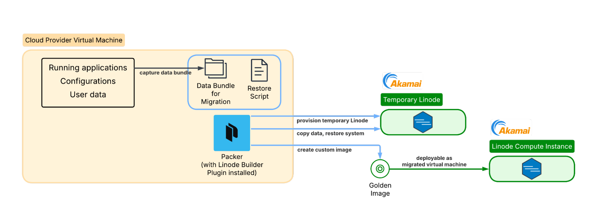
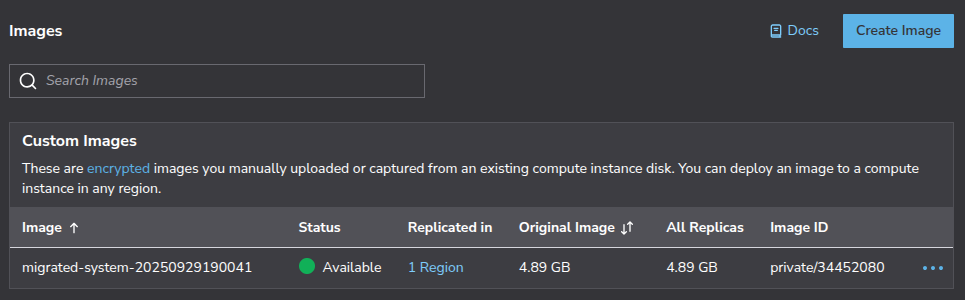

Migrating existing virtual machines (VMs) between cloud providers can be challenging, especially when applications depend on specific system configurations, services, and data layouts. Rather than copying disks directly, many migrations involve rebuilding the system in a controlled and repeatable way.

This guide demonstrates how to migrate a VM to Akamai Cloud using [HashiCorp Packer](https://developer.hashicorp.com/packer). It uses an AWS EC2 instance as the working example, but the same approach applies to VMs from other cloud providers or on-premises environments.

Follow these steps to capture system configuration and data from a source VM, rebuild it on a clean base image, and produce a reusable image that can be deployed as a new VM on Akamai Cloud.

## How Packer Works for VM Migration

Unlike traditional imaging tools that create bit-for-bit copies of existing disks, Packer takes a different approach. It creates a new VM from a base image (such as Ubuntu 24.04) and uses provisioners to replicate your configuration and bundle your data during the build process. The result is a "golden image" that contains your applications and data, ready to deploy on Akamai Cloud.

This approach means Packer creates a fresh installation rather than cloning your existing system state. While this requires more setup, it often results in a more reliable and optimized final image.

### What Can Packer Migrate?

The table below summarizes what is migrated automatically, what is not migrated, and what requires additional handling:

| Successfully Migrated | Not Migrated | Requires Additional Planning |
|----------------------|--------------|------------------------------|
| Applications | Exact OS state | Large databases |
| Installed packages | Kernel modules | SSL certificates with private keys |
| Configuration files | Running processes | Secrets |
| System settings | Process state | API keys |
| User data | Temporary files | Third-party integrations |
| Application files | Cached data | External dependencies |
| User accounts | System logs | Large file stores and media libraries |
| Database dumps | Transient data | Log archives |
| Backups | | |
| SSL certificates | | |
| Environment files | | |
| Service configurations | | |
| Startup scripts | | |

### Why Use Packer Instead of a Direct Image Upload?

Akamai Cloud supports direct image uploads, but this approach has limitations (see our [Images documentation](https://techdocs.akamai.com/cloud-computing/docs/images) for more information). Direct uploads are constrained by size limits (6 GB uncompressed / 5 GB compressed) and require specific disk image formats. Many production systems exceed these size constraints, especially when including application data and databases.

Packer's [Akamai Cloud builder plugin](https://developer.hashicorp.com/packer/integrations/linode/linode/latest/components/builder/linode) provides an automated alternative that helps keep migrated disk sizes slim enough to stay within these size constraints while enabling repeatable builds. The process is API-driven and can be integrated into CI/CD pipelines for ongoing infrastructure management.



## Before You Begin

1.  Ensure you have a source VM that you can access via SSH with administrative (`sudo`) privileges.

    
    The examples in this article use an AWS EC2 instance running NGINX and a Node.js Express API, with user data stored in `/home/ubuntu/userdata`. You can deploy this example using the CloudFormation template in this [GitHub repository](https://github.com/alvinslee/simple-aws-ec2-with-nginx-and-express). To use this example deployment, you also need an AWS account with permission to create CloudFormation stacks and EC2 instances, and the AWS CLI installed and configured (`aws configure`).
    

1.  Ensure your local machine has an SSH client and access to the source VM using an SSH key.

1.  Create an Akamai Cloud account if you do not already have one. Follow our [Get Started](https://techdocs.akamai.com/cloud-computing/docs/getting-started) guide.

1.  Generate an Akamai Cloud API token. Follow our [Manage personal access tokens](https://techdocs.akamai.com/cloud-computing/docs/manage-personal-access-tokens) guide. This guide uses the placeholder  to represent your Akamai Cloud API token in commands.


This guide is written for a non-root user. Commands that require elevated privileges are prefixed with `sudo`. If you’re not familiar with the `sudo` command, see the [Users and Groups](/docs/guides/linux-users-and-groups/) guide.


## Inspect the Source VM

The commands below provide a baseline inventory of the source VM, including installed packages, running services, disk usage, and listening ports.

1.  List the installed packages and store the output in a file:

    ```command
    dpkg --get-selections > installed-packages.txt
    ```

1.  Check the running services:

    ```command
    systemctl list-units --type=service --state=running
    ```

    ```output
     UNIT                           LOAD   ACTIVE SUB     DESCRIPTION
      acpid.service                 loaded active running ACPI event daemon
      chrony.service                loaded active running chrony, an NTP client/server
      cron.service                  loaded active running Regular background program processing daemon
      dbus.service                  loaded active running D-Bus System Message Bus
      express-api.service           loaded active running Express API Service
      fwupd.service                 loaded active running Firmware update daemon
      getty@tty1.service            loaded active running Getty on tty1
      irqbalance.service            loaded active running irqbalance daemon
      ModemManager.service          loaded active running Modem Manager
      multipathd.service            loaded active running Device-Mapper Multipath Device Controller
      networkd-dispatcher.service   loaded active running Dispatcher daemon for systemd-networkd
      nginx.service                 loaded active running A high performance web server and a reverse proxy server
    ...
    ```

1.  Review disk usage:

    ```command
    df -h
    sudo du -sh /var /opt /home/ubuntu
    ```

    ```output
    Filesystem       Size  Used Avail Use% Mounted on
    /dev/root        6.8G  2.8G  4.0G  41% /
    tmpfs            458M     0  458M   0% /dev/shm
    tmpfs            183M  912K  182M   1% /run
    tmpfs            5.0M     0  5.0M   0% /run/lock
    efivarfs         128K  3.6K  120K   3% /sys/firmware/efi/efivars
    /dev/nvme0n1p16  881M  149M  671M  19% /boot
    /dev/nvme0n1p15  105M  6.2M   99M   6% /boot/efi
    tmpfs             92M   12K   92M   1% /run/user/1000


    881M    /var
    4.0K    /opt
    12M     /home/ubuntu
    ```

1.  Check listening ports:

    ```command
    sudo ss -tulnp
    ```

    ```output
    Netid       State        Recv-Q       Send-Q                Local Address:Port             Peer Address:Port      Process
    udp         UNCONN       0            0                        127.0.0.54:53                    0.0.0.0:*          users:(("systemd-resolve",pid=8214,fd=16))
    udp         UNCONN       0            0                     127.0.0.53%lo:53                    0.0.0.0:*          users:(("systemd-resolve",pid=8214,fd=14))
    udp         UNCONN       0            0                  172.31.31.1%ens5:68                    0.0.0.0:*          users:(("systemd-network",pid=19258,fd=23))
    udp         UNCONN       0            0                         127.0.0.1:323                   0.0.0.0:*          users:(("chronyd",pid=13440,fd=5))
    udp         UNCONN       0            0                             [::1]:323                      [::]:*          users:(("chronyd",pid=13440,fd=6))
    tcp         LISTEN       0            4096                     127.0.0.54:53                    0.0.0.0:*          users:(("systemd-resolve",pid=8214,fd=17))
    tcp         LISTEN       0            511                         0.0.0.0:80                    0.0.0.0:*          users:(("nginx",pid=20521,fd=5),("nginx",pid=20520,fd=5),("nginx",pid=19520,fd=5))
    tcp         LISTEN       0            4096                        0.0.0.0:22                    0.0.0.0:*          users:(("sshd",pid=20549,fd=3),("systemd",pid=1,fd=193))
    tcp         LISTEN       0            511                         0.0.0.0:3000                  0.0.0.0:*          users:(("node",pid=20507,fd=18))
    tcp         LISTEN       0            4096                  127.0.0.53%lo:53                    0.0.0.0:*          users:(("systemd-resolve",pid=8214,fd=15))
    tcp         LISTEN       0            511                            [::]:80                       [::]:*          users:(("nginx",pid=20521,fd=6),("nginx",pid=20520,fd=6),("nginx",pid=19520,fd=6))
    tcp         LISTEN       0            4096                           [::]:22                       [::]:*          users:(("sshd",pid=20549,fd=4),("systemd",pid=1,fd=194))
    ```

Use this inventory to verify that your source VM includes the services, data, and configuration you expect to migrate. Once you have reviewed the output, you can begin preparing the migration environment.

### Verify the Source Operating System

First, determine exactly what operating system you're running:

1.  Check the OS version and distribution:

    ```command
    lsb_release -a
    ```

    For the example AWS EC2 environment, you might see output like the following:

    ```output
    No LSB modules are available.
    Distributor ID: Ubuntu
    Description:    Ubuntu 24.04.3 LTS
    Release:        24.04
    Codename:       noble
    ```

    
    Here's an alternate command to check the OS version and distribution:

    ```command
    cat /etc/os-release
    ```
    

1.  Check the architecture:

    ```command
    uname -m
    ```

    ```output
    x86_64
    ```

### Find a Compatible Akamai Cloud Base Image

Based on your source VM architecture, identify a compatible base image available on Akamai Cloud.

1.  Set your Akamai Cloud API token as an environment variable, replacing  with your actual token:

    ```command
    export AKAMAI_CLOUD_TOKEN=""
    ```

1.  List the available public images:

    ```command
    curl -H "Authorization: Bearer $AKAMAI_CLOUD_TOKEN" \
      https://api.linode.com/v4/images | \
      jq '.data[] | select(.is_public == true) | {id: .id, label: .label}'
    ```

    For maximum compatibility, choose the image that most closely matches the OS of your source VM:

    ```output
    ...
    {
      "id": "linode/ubuntu22.04",
      "label": "Ubuntu 22.04 LTS"
    }
    {
      "id": "linode/ubuntu22.04-kube",
      "label": "Ubuntu 22.04 LTS KPP"
    }
    {
      "id": "linode/ubuntu24.04",
      "label": "Ubuntu 24.04 LTS"
    }
    {
      "id": "linode/ubuntu16.04lts",
      "label": "Ubuntu 16.04 LTS"
    }
    {
      "id": "linode/ubuntu18.04",
      "label": "Ubuntu 18.04 LTS"
    }
    {
      "id": "linode/ubuntu20.04",
      "label": "Ubuntu 20.04 LTS"
    }
    {
      "id": "linode/ubuntu24.10",
      "label": "Ubuntu 24.10"
    }
    ```

    For the example used in this guide, select `linode/ubuntu24.04`.

## Install and Configure Packer

Install Packer on your source VM by following the [official installation instructions](https://developer.hashicorp.com/packer/tutorials/docker-get-started/get-started-install-cli). For additional reference, see the [Packer CLI usage documentation](https://developer.hashicorp.com/packer/docs/commands).

1.  Create a directory for trusted keys:

    ```command
    sudo mkdir -m 0755 -p /etc/apt/keyrings/
    ```

1.  Download and install HashiCorp's GPG key:

    ```command
    curl -fsSL https://apt.releases.hashicorp.com/gpg | \
    sudo gpg --dearmor -o /etc/apt/keyrings/hashicorp-archive-keyring.gpg
    ```

1.  Add the HashiCorp repository:

    ```command
    echo "deb [arch=$(dpkg --print-architecture) signed-by=/etc/apt/keyrings/hashicorp-archive-keyring.gpg] https://apt.releases.hashicorp.com $(grep -oP '(?<=UBUNTU_CODENAME=).*' /etc/os-release || lsb_release -cs) main" | sudo tee /etc/apt/sources.list.d/hashicorp.list
    ```

1.  Update the package list and install Packer:

    ```command
    sudo apt update
    sudo apt install packer
    ```

1.  Verify the installation:

    ```command
    packer --version
    ```

    ```output
    Packer v1.15.1
    ```

1.  Install the official Akamai Cloud builder plugin for Packer:

    ```command
    sudo packer plugins install github.com/linode/linode
    ```

    ```output
    Installed plugin github.com/linode/linode v1.10.1 in "/root/.config/packer/plugins/github.com/linode/linode/packer-plugin-linode_v1.10.1_x5.0_linux_amd64"
    ```

## Create a Data Capture Script

The data capture phase ensures that the migrated system has the files and configuration it needs to function correctly.

1.  On your source VM, create a folder named `packer-migration` to serve as the migration working directory:

    ```command
    sudo mkdir -p /usr/packer-migration
    sudo chown ubuntu:ubuntu /usr/packer-migration
    cd /usr/packer-migration
    ```

1.  Use a terminal-based text editor such as `nano` to create a script file (for example, `capture-system.sh`) to systematically capture your system configuration and data:

    ```command
    sudo nano capture-system.sh
    ```

    Using the example AWS EC2 environment for this guide, the contents of your data capture script should look like this:

    ```file {title="capture-system.sh" lang="bash"}
    #!/bin/bash
    set -e

    echo "Starting system capture for Packer migration..."

    # Create bundle directory
    mkdir -p bundle-data
    cd bundle-data

    # Capture system packages and services
    echo "Capturing system configuration..."
    dpkg --get-selections > installed-packages.txt
    apt list --installed > apt-packages.txt 2>/dev/null || true

    # Capture important system configurations
    echo "Capturing configuration files..."
    mkdir -p configs
    sudo cp -r /etc/nginx configs/ 2>/dev/null || true
    sudo cp /etc/hosts configs/ 2>/dev/null || true
    sudo cp /etc/environment configs/ 2>/dev/null || true
    mkdir -p configs/systemd
    sudo cp /etc/systemd/system/express-api.service configs/systemd/ 2>/dev/null || true

    # Capture application data
    echo "Capturing application data..."
    mkdir -p apps
    sudo cp -r /var/www apps/ 2>/dev/null || true
    sudo cp -r /opt apps/ 2>/dev/null || true
    sudo cp -r /srv apps/ 2>/dev/null || true

    # Node.js applications
    sudo cp -r /usr/local/lib/node_modules apps/ 2>/dev/null || true

    # Capture user data
    echo "Capturing user configurations..."
    mkdir -p users

    # Capture all user directories in /home
    for user_home in /home/*; do
        if [ -d "$user_home" ]; then
            username=$(basename "$user_home")
            echo "Capturing user directory: $username"
            mkdir -p "users/$username" 2>/dev/null || true

            # Copy common user files and directories
            cp -r "$user_home"/.bashrc "users/$username/" 2>/dev/null || true
            cp -r "$user_home"/.bash_profile "users/$username/" 2>/dev/null || true
            cp -r "$user_home"/.ssh "users/$username/" 2>/dev/null || true
            cp -r "$user_home"/.gitconfig "users/$username/" 2>/dev/null || true
            cp -r "$user_home"/.config "users/$username/" 2>/dev/null || true
            cp -r "$user_home"/.local "users/$username/" 2>/dev/null || true

            # Copy application and data directories
            cp -r "$user_home"/userdata "users/$username/" 2>/dev/null || true
            cp -r "$user_home"/api "users/$username/" 2>/dev/null || true
            cp -r "$user_home"/projects "users/$username/" 2>/dev/null || true
            cp -r "$user_home"/data "users/$username/" 2>/dev/null || true
            cp -r "$user_home"/app "users/$username/" 2>/dev/null || true
            cp -r "$user_home"/www "users/$username/" 2>/dev/null || true

            # Copy any other directories that might contain application data
            find "$user_home" -maxdepth 1 -type d -name ".*" -not -name ".ssh" -not -name ".config" -not -name ".local" -not -name ".cache" | \
            while read dir; do
                cp -r "$dir" "users/$username/" 2>/dev/null || true
            done
        fi
    done

    # Also capture root user configurations if we're running as root
    if [ "$(id -u)" -eq 0 ]; then
        echo "Capturing root user configurations..."
        mkdir -p users/root 2>/dev/null || true
        cp -r /root/.bashrc users/root/ 2>/dev/null || true
        cp -r /root/.bash_profile users/root/ 2>/dev/null || true
        cp -r /root/.ssh users/root/ 2>/dev/null || true
        cp -r /root/.gitconfig users/root/ 2>/dev/null || true
    fi

    # Capture SSL certificates
    echo "Capturing SSL certificates..."
    mkdir -p ssl
    sudo cp -r /etc/ssl/certs ssl/ 2>/dev/null || true
    sudo cp -r /etc/letsencrypt ssl/ 2>/dev/null || true

    # Capture environment files
    echo "Capturing environment files..."
    mkdir -p env-files
    find /var/www /opt /home -name ".env*" -o -name "*.env" 2>/dev/null | \
        xargs -I {} cp {} env-files/ 2>/dev/null || true

    # Capture logs for reference (recent only)
    echo "Capturing recent logs..."
    mkdir -p logs
    sudo find /var/log -name "*.log" -mtime -7 -exec cp {} logs/ \; 2>/dev/null || true

    # Capture cron jobs
    echo "Capturing scheduled tasks..."
    crontab -l > user-crontab.txt 2>/dev/null || true
    sudo crontab -l > root-crontab.txt 2>/dev/null || true

    # Create inventory file
    echo "Creating inventory file..."

    TOKEN=$(curl -sX PUT "http://169.254.169.254/latest/api/token" \
      -H "X-aws-ec2-metadata-token-ttl-seconds: 21600" 2>/dev/null || true)

    INSTANCE_ID=$(curl -s \
      -H "X-aws-ec2-metadata-token: $TOKEN" \
      http://169.254.169.254/latest/meta-data/instance-id 2>/dev/null || echo "Unknown")

    cat > inventory.txt <<INNER_EOF
    # EC2 to Akamai Cloud Migration Inventory
    # Generated: $(date)
    # Source EC2 Instance: ${INSTANCE_ID:-Unknown}

    ## System Info
    OS: $(lsb_release -d | cut -f2)
    Kernel: $(uname -r)
    Architecture: $(uname -m)

    ## Network
    Private IP: $(hostname -I | awk '{print $1}')
    Hostname: $(hostname)

    ## Disk Usage
    $(df -h)

    ## Memory
    $(free -h)

    ## Running Services
    $(systemctl list-units --type=service --state=running --no-pager)

    ## Listening Ports
    $(sudo ss -tulnp)
    INNER_EOF

    # Fix permissions on copied files
    sudo chown -R "${SUDO_USER:-$USER}":"${SUDO_USER:-$USER}" .

    cd ..
    echo "Data capture complete! Bundle located at: $(pwd)/bundle-data"
    echo "Bundle size: $(du -sh bundle-data | cut -f1)"
    ```

    When done, press <kbd>CTRL</kbd>+<kbd>X</kbd>, followed by <kbd>Y</kbd> then <kbd>Enter</kbd> to save the file and exit `nano`.

1.  Set the proper executable permissions on the script.

    ```command
    sudo chmod +x /usr/packer-migration/capture-system.sh
    ```

### Run the Capture Process

1.  Execute the capture script:

    ```command
    sudo /usr/packer-migration/capture-system.sh
    ```

    ```output
    Starting system capture for Packer migration...
    Capturing system configuration...
    Capturing configuration files...
    Capturing application data...
    Capturing user configurations...
    Capturing user directory: ubuntu
    Capturing root user configurations...
    Capturing SSL certificates...
    Capturing environment files...
    Capturing recent logs...
    Capturing scheduled tasks...
    Creating inventory file...
    Data capture complete! Bundle located at: /usr/packer-migration/bundle-data
    Bundle size: 14M
    ```

1.  Review the size of different components captured:

    ```command
    sudo du -sh /usr/packer-migration/bundle-data/*
    ```

    ```output
    28K     /usr/packer-migration/bundle-data/apps
    52K     /usr/packer-migration/bundle-data/apt-packages.txt
    232K    /usr/packer-migration/bundle-data/configs
    4.0K    /usr/packer-migration/bundle-data/env-files
    20K     /usr/packer-migration/bundle-data/installed-packages.txt
    8.0K    /usr/packer-migration/bundle-data/inventory.txt
    920K    /usr/packer-migration/bundle-data/logs
    0       /usr/packer-migration/bundle-data/root-crontab.txt
    644K    /usr/packer-migration/bundle-data/ssl
    0       /usr/packer-migration/bundle-data/user-crontab.txt
    13M     /usr/packer-migration/bundle-data/users
    ```

    Before continuing, review the bundle for:

    -   Unnecessary or oversized files
    -   Hardcoded secrets in environment files
    -   Private keys or development certificates
    -   Sensitive data in database dumps

## Create a Setup and Restore Script

Create a setup and restore script for the destination Akamai Cloud VM. Packer copies this file to the destination VM during the build.

1.  On the source VM, create a file called `setup-and-restore.sh` in `/usr/packer-migration`.

    ```command
    sudo nano /usr/packer-migration/setup-and-restore.sh
    ```

    Using the example AWS EC2 instance, the contents of your setup and restore script should look like this:

    ```file {title="/usr/packer-migration/setup-and-restore.sh" lang="bash"}
    #!/bin/bash
    set -e

    echo "Starting system restoration..."

    BUNDLE_DIR="/tmp/bundle-data"

    # Function to safely restore files
    restore_files() {
        local src="$1"
        local dest="$2"
        local description="$3"

        if [ -d "$src" ]; then
            echo "Restoring $description..."
            mkdir -p "$dest"
            cp -a "$src"/. "$dest"/ 2>/dev/null || true
        elif [ -f "$src" ]; then
            echo "Restoring $description..."
            mkdir -p "$(dirname "$dest")"
            cp -a "$src" "$dest" 2>/dev/null || true
        fi
    }

    # 1. Install captured packages
    echo "Installing system packages..."
    if [ -f "$BUNDLE_DIR/installed-packages.txt" ]; then
        # Reinstall captured packages, excluding kernel packages and Packer itself
        grep "install" "$BUNDLE_DIR/installed-packages.txt" | \
        grep -v "deinstall\|linux-image\|linux-headers\|linux-modules\|packer" | \
        awk '{print $1}' | \
        xargs -r env DEBIAN_FRONTEND=noninteractive apt-get install -y || true
    fi

    # Install additional packages that might be needed
    DEBIAN_FRONTEND=noninteractive apt-get install -y \
        nginx \
        nodejs \
        npm \
        certbot \
        2>/dev/null || true

    # 2. Restore system configurations
    echo "Restoring system configurations..."
    if [ -d "$BUNDLE_DIR/configs" ]; then
        # Restore web server configs
        restore_files "$BUNDLE_DIR/configs/nginx" "/etc/nginx" "Nginx configuration"

        # Restore system files
        restore_files "$BUNDLE_DIR/configs/hosts" "/etc/hosts" "Hosts file"
        restore_files "$BUNDLE_DIR/configs/environment" "/etc/environment" "Environment file"
        restore_files "$BUNDLE_DIR/configs/systemd" "/etc/systemd/system" "Systemd service files"
    fi

    # 3. Restore applications
    echo "Restoring application data..."
    if [ -d "$BUNDLE_DIR/apps" ]; then
        # Web applications
        restore_files "$BUNDLE_DIR/apps/www" "/var/www" "Web applications"
        restore_files "$BUNDLE_DIR/apps/opt" "/opt" "Optional applications"
        restore_files "$BUNDLE_DIR/apps/srv" "/srv" "Service applications"

        # Node.js modules
        restore_files "$BUNDLE_DIR/apps/node_modules" "/usr/local/lib/node_modules" "Node.js modules"
    fi

    # 4. Restore all user accounts and data
    echo "Restoring user accounts and data..."
    if [ -d "$BUNDLE_DIR/users" ]; then
        for user_dir in "$BUNDLE_DIR/users"/*; do
            if [ -d "$user_dir" ]; then
                username=$(basename "$user_dir")
                echo "Restoring user: $username"

                # Create user account (skip if it's root)
                if [ "$username" != "root" ]; then
                    useradd -m -s /bin/bash "$username" 2>/dev/null || true
                    # Add to sudo group if it's ubuntu user
                    if [ "$username" = "ubuntu" ]; then
                        usermod -aG sudo "$username" 2>/dev/null || true
                    fi
                fi

                # Determine target home directory
                if [ "$username" = "root" ]; then
                    user_home="/root"
                else
                    user_home="/home/$username"
                fi

                # Create home directory if it doesn't exist
                mkdir -p "$user_home"

                # Restore user files and directories
                if [ -f "$user_dir/.bashrc" ]; then
                    cp "$user_dir/.bashrc" "$user_home/" 2>/dev/null || true
                fi
                if [ -f "$user_dir/.bash_profile" ]; then
                    cp "$user_dir/.bash_profile" "$user_home/" 2>/dev/null || true
                fi
                if [ -f "$user_dir/.gitconfig" ]; then
                    cp "$user_dir/.gitconfig" "$user_home/" 2>/dev/null || true
                fi
                if [ -d "$user_dir/.ssh" ]; then
                    cp -r "$user_dir/.ssh" "$user_home/" 2>/dev/null || true
                    chmod 700 "$user_home/.ssh" 2>/dev/null || true
                    chmod 600 "$user_home/.ssh"/* 2>/dev/null || true
                fi
                if [ -d "$user_dir/.config" ]; then
                    cp -r "$user_dir/.config" "$user_home/" 2>/dev/null || true
                fi
                if [ -d "$user_dir/.local" ]; then
                    cp -r "$user_dir/.local" "$user_home/" 2>/dev/null || true
                fi

                # Restore application and data directories
                if [ -d "$user_dir/userdata" ]; then
                    cp -r "$user_dir/userdata" "$user_home/" 2>/dev/null || true
                fi
                if [ -d "$user_dir/api" ]; then
                    cp -r "$user_dir/api" "$user_home/" 2>/dev/null || true
                fi
                if [ -d "$user_dir/projects" ]; then
                    cp -r "$user_dir/projects" "$user_home/" 2>/dev/null || true
                fi
                if [ -d "$user_dir/data" ]; then
                    cp -r "$user_dir/data" "$user_home/" 2>/dev/null || true
                fi
                if [ -d "$user_dir/app" ]; then
                    cp -r "$user_dir/app" "$user_home/" 2>/dev/null || true
                fi
                if [ -d "$user_dir/www" ]; then
                    cp -r "$user_dir/www" "$user_home/" 2>/dev/null || true
                fi

                # Restore any other directories
                for item in "$user_dir"/*; do
                    if [ -d "$item" ]; then
                        item_name=$(basename "$item")
                        # Skip already handled directories
                        if [[ ! "$item_name" =~ ^(\.ssh|\.config|\.local|userdata|api|projects|data|app|www)$ ]]; then
                            cp -r "$item" "$user_home/" 2>/dev/null || true
                        fi
                    fi
                done

                # Set ownership
                if [ "$username" != "root" ]; then
                    chown -R "$username:$username" "$user_home" 2>/dev/null || true
                fi
            fi
        done
    fi

    # 5. Restore SSL certificates
    echo "Restoring SSL certificates..."
    if [ -d "$BUNDLE_DIR/ssl" ]; then
        restore_files "$BUNDLE_DIR/ssl/letsencrypt" "/etc/letsencrypt" "Let's Encrypt certificates"
        restore_files "$BUNDLE_DIR/ssl/certs" "/etc/ssl/certs" "SSL certificates"
    fi

    # 6. Restore environment files
    echo "Restoring environment files..."
    if [ -d "$BUNDLE_DIR/env-files" ]; then
        find "$BUNDLE_DIR/env-files" -name "*.env*" | while read envfile; do
            # Determine appropriate location based on filename
            if [[ "$(basename "$envfile")" == *"www"* ]]; then
                cp "$envfile" "/var/www/" 2>/dev/null || true
            elif [[ "$(basename "$envfile")" == *"opt"* ]]; then
                cp "$envfile" "/opt/" 2>/dev/null || true
            else
                cp "$envfile" "/home/ubuntu/" 2>/dev/null || true
            fi
        done
    fi

    # 7. Restore cron jobs
    echo "Restoring scheduled tasks..."
    if [ -f "$BUNDLE_DIR/user-crontab.txt" ]; then
        sudo -u ubuntu crontab "$BUNDLE_DIR/user-crontab.txt" 2>/dev/null || true
    fi
    if [ -f "$BUNDLE_DIR/root-crontab.txt" ]; then
        crontab "$BUNDLE_DIR/root-crontab.txt" 2>/dev/null || true
    fi

    # 8. Set correct permissions
    echo "Setting permissions..."
    chown -R www-data:www-data /var/www 2>/dev/null || true

    # 9. Reload systemd and enable required services
    echo "Enabling and starting services..."
    systemctl daemon-reload

    systemctl enable nginx || true
    systemctl enable express-api || true

    systemctl restart nginx || true
    systemctl restart express-api || true
    systemctl restart mysql 2>/dev/null || true
    systemctl restart postgresql 2>/dev/null || true
    systemctl restart redis 2>/dev/null || true

    # Validate nginx configuration
    nginx -t && systemctl reload nginx || true

    apt-get clean

    # 11. Final system configuration
    echo "Final system configuration..."
    # Set timezone
    timedatectl set-timezone UTC

    # Generate SSH host keys if needed
    ssh-keygen -A 2>/dev/null || true

    echo "System restoration complete!"
    echo "Please review the inventory file for reference:"
    [ -f "$BUNDLE_DIR/inventory.txt" ] && cat "$BUNDLE_DIR/inventory.txt"
    ```

    When done, press <kbd>CTRL</kbd>+<kbd>X</kbd>, followed by <kbd>Y</kbd> then <kbd>Enter</kbd> to save the file and exit `nano`.

1.  Set the proper executable permissions on the script.

    ```command
    sudo chmod +x /usr/packer-migration/setup-and-restore.sh
    ```

## Build the Packer Template

The Packer template automates the entire migration by spinning up a temporary Akamai Cloud VM, copying your data bundle to it, running scripts to install your applications and restore your configurations, then creating a snapshot of the configured system. This results in a custom Akamai Cloud VM image that contains your migrated environment, ready to deploy as a new VM.

Rather than building a template from scratch, you can start with the following template, which covers the most common migration scenarios.

1.  Create a Packer template file called `migrate-to-akamai-cloud.pkr.hcl` in `/usr/packer-migration`:

    ```command
    sudo nano /usr/packer-migration/migrate-to-akamai-cloud.pkr.hcl
    ```

    Give the file the following contents:

    ```file {title="/usr/packer-migration/migrate-to-akamai-cloud.pkr.hcl" lang="hcl"}
    variable "akamai_cloud_api_token" {
      type    = string
      default = env("AKAMAI_CLOUD_TOKEN")
    }

    locals {
      timestamp = regex_replace(timestamp(), "[- TZ:]", "")
    }

    source "linode" "migration" {
      image               = "linode/ubuntu24.04"  # Match your source OS
      image_description   = "Migrated system - ${local.timestamp}"
      image_label         = "migrated-system-${local.timestamp}"
      instance_label      = "temp-migration-${local.timestamp}"
      instance_type       = "g6-nanode-1"
      linode_token        = var.akamai_cloud_api_token
      region              = "us-lax"  # Choose your preferred region
      ssh_username        = "root"
    }

    build {
      sources = ["source.linode.migration"]

      # Create destination directory
      provisioner "shell" {
        inline = ["mkdir -p /tmp/bundle-data"]
      }

      # Upload captured data
      provisioner "file" {
        source      = "./bundle-data/"
        destination = "/tmp/bundle-data"
      }

      # Upload setup and restore script
      provisioner "file" {
        source      = "./setup-and-restore.sh"
        destination = "/tmp/setup-and-restore.sh"
      }

      # Initial system setup
      provisioner "shell" {
        inline = [
          "DEBIAN_FRONTEND=noninteractive apt-get update",
          "DEBIAN_FRONTEND=noninteractive apt-get upgrade -y"
        ]
      }

      # Restore the captured system
      provisioner "shell" {
        script = "./setup-and-restore.sh"
      }

      # Final cleanup
      provisioner "shell" {
        inline = [
          "rm -rf /tmp/bundle-data",
          "rm -f /tmp/setup-and-restore.sh",
          "apt-get autoremove -y",
          "apt-get autoclean"
        ]
      }
    }
    ```

    The template copies the `bundle-data` folder created by the data capture script to the destination Akamai Cloud VM. It also copies `setup-and-restore.sh` and runs it on the destination VM.

    When done, press <kbd>CTRL</kbd>+<kbd>X</kbd>, followed by <kbd>Y</kbd> then <kbd>Enter</kbd> to save the file and exit `nano`.

1.  Before running the full build, validate the template syntax with the following Packer command, replacing  with your actual API token:

    ```command
    sudo AKAMAI_CLOUD_TOKEN="" \
         packer validate migrate-to-akamai-cloud.pkr.hcl
    ```

    ```output
    The configuration is valid.
    ```


While the starter template covers most migration scenarios, Packer supports advanced techniques for complex configurations:

-   **Attach Akamai Cloud metadata**: [Add user-defined metadata](https://techdocs.akamai.com/cloud-computing/docs/metadata-service-api) to the creation of the Akamai Cloud VM, such as authorized public SSH keys, root password, or image naming configurations.
-   **Ansible provisioner**: For complex configuration management and orchestration.
-   **Multiple builders**: To create images for multiple cloud providers simultaneously.
-   **Post-processors**: For image compression, upload to registries, or integration with other tools.
-   **Variable files**: For environment-specific configurations and secrets management.

For detailed information on these advanced features, refer to the official [HashiCorp Packer documentation](https://www.packer.io/docs).


## Run the Migration Build

With your template ready and your data captured, you can run the migration build. During the build, Packer goes through several distinct phases:

1.  **Create a temporary VM**: Provisions an Akamai Cloud VM using your specified base image.
1.  **Connect via SSH**: Establishes SSH connectivity to the temporary VM.
1.  **Run provisioners**: Executes each provisioner in sequence, such as file uploads and shell scripts.
1.  **Create an image**: Takes a snapshot of the configured VM to create your custom image.
1.  **Clean up**: Deletes the temporary VM, leaving only your custom image.

Run the following command to start the build and enable detailed logging:

```command
sudo PACKER_LOG=1 \
     PACKER_LOG_PATH="./packer-build.log" \
     AKAMAI_CLOUD_TOKEN="" \
     packer build \
     --on-error=ask \
     migrate-to-akamai-cloud.pkr.hcl
```

The Packer output shows the progress of the build process:

```output
==> linode.migration: Running builder ...
==> linode.migration: Creating temporary SSH key for instance...
==> linode.migration: Creating Linode...
==> linode.migration: Using SSH communicator to connect: 172.233.131.208
==> linode.migration: Waiting for SSH to become available...
==> linode.migration: Connected to SSH!
==> linode.migration: Provisioning with shell script: /tmp/packer-shell1500940104
==> linode.migration: Uploading ./bundle-data/ => /tmp/bundle-data
==> linode.migration: Uploading ./setup-and-restore.sh => /tmp/setup-and-restore.sh
==> linode.migration: Provisioning with shell script: /tmp/packer-shell1565007556…
…
==> linode.migration: Reading package lists...
==> linode.migration: Building dependency tree...
==> linode.migration: Reading state information...
==> linode.migration: 0 upgraded, 0 newly installed, 0 to remove and 3 not upgraded.
==> linode.migration: Reading package lists...
==> linode.migration: Building dependency tree...
==> linode.migration: Reading state information...
==> linode.migration: Shutting down Linode...
==> linode.migration: Creating image...
```

This may take 10 minutes or longer, depending on the size of your bundle and restore complexity. After the build completes successfully, the output should look like this:

```output
Build 'linode.migration' finished after 10 minutes 12 seconds.

==> Wait completed after 10 minutes 12 seconds

==> Builds finished. The artifacts of successful builds are:
--> linode.migration: Linode image: migrated-system-20250929190041 (private/34452080)
```

The key information here is the **image label** (`migrated-system-20250929190041`) for identification in Cloud Manager and the **image ID** (`private/34452080`) for API and CLI usage.

When the build completes, the image appears in the Images screen in Akamai Cloud Manager:



## Deploy a New Akamai Cloud VM

With your golden image created, [follow this guide for deploying an image to a new Akamai Cloud VM](https://techdocs.akamai.com/cloud-computing/docs/deploy-an-image-to-a-new-compute-instance).

Once deployed, run the following commands to verify the migrated VM is functioning correctly:

```command
systemctl status nginx --no-pager
systemctl status express-api --no-pager
ss -tulnp | grep :3000
curl localhost
curl localhost:3000
curl localhost/api/
ls -la /home/ubuntu/userdata
systemctl --failed
```

Confirm that:

-   `nginx` is `active` and `running`
-   `express-api` is `active` and `enabled`
-   Port `3000` is listening
-   The `root` endpoint returns the expected HTML response
-   The `/api/` endpoint returns JSON
-   The `userdata` directory exists and contains expected files
-   No failed `systemd` units are reported

You have now migrated your VM to Akamai Cloud using Packer. This approach makes the migration process repeatable, easier to version, and simpler to automate.

## Post-Migration Tasks

After your migrated VM is running and validated, review your environment and make any remaining adjustments.

Update firewall rules to match your desired network environment, either with a firewall installed on your Akamai Cloud VM or with an [Akamai Cloud Firewall](https://techdocs.akamai.com/cloud-computing/docs/cloud-firewall). Update hardcoded IP addresses in application configurations and database connection strings. Reconfigure any provider-specific services, such as AWS S3 or CloudWatch, to use appropriate Akamai Cloud services or other replacements.

For databases and datasets that may be exceptionally large (for example, over 1 GB), migrate them separately from the Packer build. Use database-specific tools for reliable transfers. For guidance on migrating from self-hosted databases (such as MySQL or PostgreSQL) to managed databases, see [these resources](/docs/guides/self-hosted-vs-managed-databases/#resources).

For large file stores and media libraries, use [`rsync`](https://rsync.samba.org/) over SSH for direct transfers or [Akamai Object Storage](https://www.linode.com/products/object-storage/) as an intermediate location. Attach [Block Storage](https://techdocs.akamai.com/cloud-computing/docs/block-storage) volumes for large persistent datasets. For detailed guidance, see the following migration guides:

-   [Migrate from AWS EBS to Akamai Block Storage](/docs/guides/migrate-from-aws-ebs-to-linode-block-storage/)
-   [Migrate from Azure Disk Storage to Akamai Block Storage](/docs/guides/migrate-from-azure-disk-storage-to-linode-block-storage/)
-   [Migrate from GCP Hyperdisk and Persistent Disk to Akamai Block Storage](/docs/guides/migrate-from-gcp-hyperdisk-and-persistent-disk-to-linode-block-storage/)

Plan your DNS cutover carefully to minimize downtime. Lower TTL values 24–48 hours before migration for faster propagation and document all DNS records requiring updates (such as `A`, `CNAME`, `MX`, and `TXT` records). Consider migrating staging systems first, then gradually shifting production traffic. Keep your old environment running for at least 24–72 hours after the transition in case a rollback is required.

Continue monitoring your migrated VM and adjust resources as needed. Use Akamai Cloud Manager compute metrics or tools like `htop`, `iostat`, and `vmstat` to monitor resources. Resize to a larger plan if you are experiencing CPU, memory, or I/O bottlenecks. Alternatively, if your resources are consistently underutilized, downsize to reduce costs. Tune web server worker processes and connection limits. Optimize database memory and cache sizes based on workload. Implement or expand caching layers (for example, Redis and Memcached) for better performance.

Finally, set up [automated backups](https://www.linode.com/products/backups/) for your VM disk.

## Troubleshooting Common Issues

The most common build-time issue is failed image creation, while post-migration application issues typically stem from network problems or permission issues.

### Failed Image Creation

If the Packer build fails during image creation, you may see output similar to the following:

```output {title="Packer build output when image creation fails"}
==> linode.migration: Failed to wait for image creation: event 1146467561 has failed
==> linode.migration: Step "stepCreateImage" failed
```

Image creation failures are often caused by Akamai Cloud custom image size limits (6 GB uncompressed). By default, if Packer encounters this error, it terminates the build and cleans up the temporary VM.

Because the `packer build` command was run with the `--on-error=ask` flag, Packer prompts you to choose how to proceed when it encounters the image creation error:

```output {title="Packer asks how to proceed when image creation fails"}
==> linode.migration: [c] Clean up and exit, [a] abort without cleanup, or [r] retry step (build may fail even if retry succeeds)?
```

If you select `[a] abort without cleanup`, Packer leaves the temporary VM intact. You can boot it and use it directly as your migrated VM. If you still wish to create a golden image from this VM, then:

1.  Perform any necessary disk cleanup to reduce disk usage to under 4.5 GB (use `df -h` to see disk usage).
1.  Power off the VM.
1.  Resize the storage disk to be 5500 MB, so that the resulting image is less than 6 GB (see our guide on [capturing an image from an existing Akamai Cloud VM](https://techdocs.akamai.com/cloud-computing/docs/capture-an-image)).
1.  Create an image from the VM.

### Networking Problems

-   Check logs for connection timeouts or "connection refused" errors.
-   Verify that firewall rules allow required traffic.
-   Update applications using cloud provider metadata services to use the Akamai Cloud Metadata Service API.
-   Debug network issues with `tcpdump` or `ss`.
-   Review system and application logs (such as NGINX, databases, and custom apps) with `journalctl -xe` and the relevant files in `/var/log/`.

### Permission Issues

-   Verify that web server files are owned by the correct user (typically `www-data`).
-   Check that application directories have appropriate read/write permissions.
-   Ensure environment variables are properly set and file paths are correct.
-   Check service status with `systemctl status` when ownership or file path issues may be preventing startup.