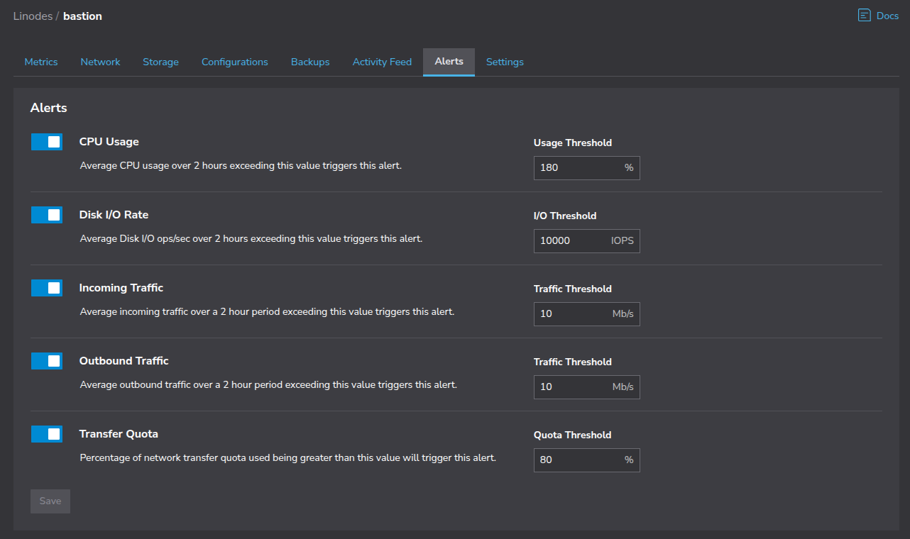

A virtual private cloud (VPC) is a private network environment that lets you define IP address ranges, segment workloads into subnets, and control how resources communicate. VPCs help isolate and organize infrastructure while enabling internal and external traffic control.

A managed VPC service handles key networking functions like NAT, internet access, and routing - while integrating with other cloud features - so you don't need to configure them manually.

This guide covers how to migrate a basic Azure VNet environment to an Akamai Cloud VPC. The Azure setup includes three private Azure VM instances, a NAT gateway for selective outgoing traffic, and a public VM instance acting as a bastion for SSH access. You will walk through how to recreate this setup in Akamai using Linode compute instances and a manual NAT router.

## Feature comparison

Before migrating, it's useful to understand the differences between the managed VNet from Azure and the Akamai Cloud VPC.

### What Azure VNets offer

Azure Virtual Networks (VNets) allow administrators to define custom IP address ranges, segment workloads into subnets, and configure routing and firewall rules. In addition to network security groups (NSGs) and its NAT gateway service, Azure VNets integrate with Azure's managed services-such as databases, Kubernetes, and isolated app service environments.

### What Akamai Cloud VPCs offer

VPCs from Akamai provide private, regional networks that let you define custom IP ranges and subnets. All traffic is isolated from the public internet unless explicitly routed through a configured gateway. This lightweight model is ideal for tightly scoped environments where users want fine-grained control without added complexity.

### How to adapt

Some Azure features don't have direct equivalents in Linode, but can be replicated with custom configuration. For example, Akamai Cloud doesn't offer a managed NAT service. However, outgoing traffic can be enabled using a Linode compute instance manually configured to act as a NAT router. This approach suits teams that prefer direct management of network behavior.

At present, Akamai Cloud does not integrate other services (such as NodeBalancers, LKE clusters, or managed databases) with its VPCs. However, some of these services can be replaced with self-managed equivalents and open-source tooling.

## Prerequisites and assumptions

This guide assumes access to administrative credentials and CLI tools for both Azure and Akamai Cloud. You should have the ability to view and modify relevant cloud resources in both environments.

### Azure CLI and permissions

Ensure that the [Azure CLI](https://learn.microsoft.com/en-us/cli/azure/?view=azure-cli-latest) (`az`) is installed and configured with a user or role that has permission to manage VMs, subnets, network security groups, and NAT gateways.

### Linode CLI and permissions

Install the Linode CLI and authenticate using a personal access token with permissions for managing Linode instances and VPCs. You may also need some familiarity with creating and modifying basic Linux network configuration, including IP routes and `ufw` rules.

### Example environment used in this guide

The example used throughout this guide involves four Azure VMs that all belong to a single VNet:

-   **Alice**: A private VM with no internet access.
-   **Bob**: Another private VM with no internet access.
-   **Charlie**: A private VM that requires outgoing internet access via a NAT gateway, but is not accessible from the public internet.
-   **Bastion**: A public VM with a public IP address, used for SSH access to Alice, Bob, and Charlie.

These instances are distributed across two subnets within a single Azure VNet:

-   A **private subnet** (`10.0.1.0/24`) that hosts Alice, Bob, and Charlie, with an attached NAT gateway to enable internet connectivity for Charlie.
-   A **public subnet** (`10.0.2.0/24`) that hosts the bastion instance.

Visually, the AZure VNet environment looks like this:


This example layout is representative of many small-to-medium Azure environments where internal workloads are kept isolated from the public internet but require selective outgoing access and secure administrative access.

## Document and back up your current configuration

Before making any changes, document the current Azure setup. Having a full record of your environment will help you replicate the configuration accurately and recover if needed.

### VNet and Subnet CIDR blocks

Start by recording the CIDR block used by your Azure VNet, along with the IP ranges and names of each subnet. Within the list of resources in the **Resource group**, find and select the virtual network.


From the VNet's details page, navigate to **Address space**. This page shows the CIDR block and full address space for your VNet.


Next, navigate to **Subnets**, where you'll find your VNet subnets and their corresponding CIDR blocks.


From the command line, obtain this information with the following:

```command {title="Query for VNet and subnet address spaces"}
az network vnet show \
  --resource-group REPLACE-WITH-RESOURCE-GROUP-NAME \
  --name my-vnet \
  --output json \
  --query "{ CIDR: addressSpace.addressPrefixes[], name: name, subnets: subnets[].{ name: name, CIDR: addressPrefix }}"
```

```output
{
  "CIDR": [
    "10.0.0.0/16"
  ],
  "name": "my-vnet",
  "subnets": [
    {
      "CIDR": "10.0.1.0/24",
      "name": "private-subnet"
    },
    {
      "CIDR": "10.0.2.0/24",
      "name": "public-subnet"
    }
  ]
}
```

### IP addresses and subnets of VM instances

Next, find the private IP addresses assigned to each VM instance in your VNet. Note also which subnet each instance belongs to. This can also be discerned by viewing the CIDR block to which the IP address belongs (for example `10.0.1.0/24` versus `10.0.2.0/24`).

In Azure, each VM is attached to a network interface card (NIC). The NIC resource belongs to a subnet and has a private IP address assigned. To see the NIC resources in your VNet, navigate to **Connected devices**.


Although it may be clear from the naming of the NIC resource which VM it is attached to, you can see this in the NIC details page.


To obtain the equivalent of this information with the `az` CLI, run the following command:

```command {title="Query for NICs, with IP address and attached VM"}
az network nic list \
    --resource-group REPLACE-WITH-RESOURCE-GROUP-NAME \
    --query "[].{nicName: name, vmId: virtualMachine.id, subnetId: ipConfigurations[0].subnet.id, IP: ipConfigurations[0].privateIPAddress}"
```

```output
[
  {
    "IP": "10.0.1.18",
    "nicName": "alice-nic",
    "subnetId": "/.../virtualNetworks/my-vnet/subnets/private-subnet",
    "vmId": "/.../virtualMachines/alice"
  },
  {
    "IP": "10.0.2.78",
    "nicName": "bastion-nic",
    "subnetId": "/.../virtualNetworks/my-vnet/subnets/public-subnet",
    "vmId": "/.../virtualMachines/bastion"
  },
  {
    "IP": "10.0.1.136",
    "nicName": "bob-nic",
    "subnetId": "/.../virtualNetworks/my-vnet/subnets/private-subnet",
    "vmId": "/.../virtualMachines/bob"
  },
  {
    "IP": "10.0.1.179",
    "nicName": "charlie-nic",
    "subnetId": "/.../virtualNetworks/my-vnet/subnets/private-subnet",
    "vmId": "/.../virtualMachines/charlie"
  }
]
```

### NAT gateway and network security group

The example Azure VNet has a NAT gateway and a network security group with firewall rules to enable outbound internet access for Charlie while also denying access for Alice and Bob. From the list of resources on the **Resource group** overview page, find the NAT gateway resource and click on it. In the NAT gateway details page, navigate to the **Subnets** page.


This shows the subnet which is associated with the NAT gateway. In the example Azure environment, this is the subnet called `private-subnet`. From the command line, you can run the following:

```command {title="Query for NAT gateway details and associated subnet"}
az network nat gateway show \
  --resource-group REPLACE-WITH-RESOURCE-GROUP-NAME \
  --name REPLACE-WITH-NAT-NAME \
  --output json \
  --query "{name: name, subnetId: subnets[0].id}"
```

```output
{
  "name": "my-nat-gateway",
  "subnetId": "/.../virtualNetworks/my-vnet/subnets/private-subnet"
}
```

With this configuration, all VMs in the private subnet have outgoing internet access with the NAT gateway. However, the environment also uses a network security group to restrict access.

Find and select the network security group from the list of resources on the **Resource group** overview page. Within the network security group details, navigate to **Subnets**.


This shows the subnet associated with the network security group. In the example environment, this is the private subnet. Returning to the overview page for the network security group, you'll see the list of inbound and outbound security rules.


In the example environment, there is a rule to deny outbound internet access from any source: any machine in the subnet. However, there is a higher priority rule (a lower priority number indicates higher priority) to allow outbound access specifically to the VM with IP address `10.0.1.179`, which is the Charlie VM.

To use the CLI for this, run the following command:

```command {title="Query for security group and rules"}
az network nsg show \
  --resource-group REPLACE-WITH-RESOURCE-GROUP-NAME \
  --name REPLACE-WITH-NSG-NAME \
  --output json \
  --query "{name: name, subnetId: subnets[0].id, rules: securityRules[].{access:access, direction:direction, priority:priority, sourceAddressPrefix:sourceAddressPrefix}}"
```

```output
{
  "name": "my-network-security-group",
  "rules": [
    {
      "access": "Deny",
      "direction": "Outbound",
      "priority": 1000,
      "sourceAddressPrefix": "*"
    },
    {
      "access": "Allow",
      "direction": "Outbound",
      "priority": 100,
      "sourceAddressPrefix": "10.0.1.179"
    }
  ],
  "subnetId": "/.../virtualNetworks/my-vnet/subnets/private-subnet"
}
```

The goal is to have a complete snapshot of your Azure VNet layout, connectivity, and access controls before starting the migration.

## Plan your VPC mapping strategy

With your Azure VNet environment documented, the next step is to design the equivalent layout in Akamai Cloud. Your goal is to replicate routing behavior, instance roles, and access controls as closely as possible. For example, to replicate the Azure VNet in Akamai Cloud, you would need:

-   An Akamai VPC with a CIDR block that matches the Azure VNet configuration, if possible
    -   `10.0.1.0/24` for private workloads
    -   `10.0.2.0/24` for public resources
-   2 Linode instances (Alice and Bob) which will be isolated within the private subnet
-   1 Linode instance (Charlie) with access to the internet but within the private subnet
-   1 Linode instance (Bastion) for SSH access to all instances, within the public subnet, also acting as a NAT router
-   Static private IPs assigned to all Linode instances, to match their Azure counterparts


## Recreate the environment in Akamai Cloud (Linode)

With your strategy mapped out, you can begin provisioning resources in Akamai Cloud.

### Create the VPC and subnets

Start by creating a new VPC in your preferred region. This can be done within the Akamai Cloud Manager console, or via the `linode` CLI. In the same command for creating the VPC, define two subnets: a private subnet for Alice, Bob, and Charlie, and a public subnet for the bastion host.

With the CLI, the command to create an equivalent VPC would be:

```command {title="Create a VPC with the Linode CLI"}
linode vpcs create \
  --label "my-migrated-vpc" \
  --description "VPC migrated from Azure" \
  --region us-lax \
  --pretty
  --subnets '[{"label":"private-subnet","ipv4":"10.0.1.0/24"},{"label":"public-subnet","ipv4":"10.0.2.0/24"}]'
```

```output {title="Command output, abridged for readability"}
[
  {
    "description": "VPC migrated from Azure",
    "id": 197854,
    "label": "my-migrated-vpc",
    "region": "us-lax",
    "subnets": [
      {
        "databases": [],
        "id": 199163,
        "ipv4": "10.0.1.0/24",
        "label": "private-subnet",
        "linodes": [],
        "nodebalancers": []
      },
      {
        "databases": [],
        "id": 199164,
        "ipv4": "10.0.2.0/24",
        "label": "public-subnet",
        "linodes": [],
        "nodebalancers": []
      }
    ]
  }
]
```

### Create the private Linode compute instances

Next, deploy Linode compute instances that correspond with the private VMs from your Azure environment. For the example in this guide, this means deploying Alice, Bob, and Charlie in the private subnet.

The Linodes will be able to communicate with one another through a VLAN. A VLAN is a private network link between Linodes in the same VPC. It allows internal traffic to flow securely-even between instances in different subnets-as long as they share the same VLAN.

Use the Linode CLI to create each of the Linodes that are in the private subnet. The important configurations to keep in mind are:

-   It has a VPC network interface using the private subnet.
-   It is *not* assigned a public IPv4 address.
-   It has a VLAN network interface with an IP address management (IPAM) address.

For example, to create the Alice instance and attach it to the private subnet (with the same VPC IP address as in the original Azure environment) and make it part of a VLAN, run the following command:

```command {title="Create the Alice Linode on the private subnet"}
linode linodes create \
  --region us-lax \
  --type g6-standard-2 \
  --image linode/ubuntu20.04 \
  --label alice \
  --backups_enabled false \
  --private_ip false \
  --root_pass mylinodepassword \
  --interfaces '[{"purpose":"vpc","subnet_id":199163,"ipv4":{"vpc":"10.0.1.18"}},{"purpose":"vlan","label":"my-vlan","ipam_address":"10.0.1.18/24"}]' \
  --pretty
```

```output {title="Command output, abridged for readability"}
[
  {
    ...
    "disk_encryption": "enabled",
    "group": "",
    "has_user_data": false,
    "host_uuid": "6b4ea6a82e3a8bfe2bee090b3caf31dee2f94850",
    "hypervisor": "kvm",
    "id": 78417007,
    "image": "linode/ubuntu20.04",
    "ipv4": [
      "172.235.252.246"
    ],
    "label": "alice",
    "region": "us-lax",
    "status": "provisioning",
    "tags": [],
    "type": "g6-nanode-1",
    ...
  }
]
```

To see the network interfaces-with VPC IP and VLAN IPAM addresses-retrieve the Linode's network configuration, supplying the Linode's `id`:

```command {title="View the network confirmation for the Alice Linode"}
linode linodes configs-list 78417007 --pretty
```

```output {title="Command output, abridged for readability"}
[
  {
    ...
    "interfaces": [
      {
        "active": true,
        "id": 5629467,
        "ip_ranges": [],
        "ipam_address": null,
        "ipv4": {
          "nat_1_1": null,
          "vpc": "10.0.1.18"
        },
        "label": null,
        "primary": false,
        "purpose": "vpc",
        "subnet_id": 199163,
        "vpc_id": 197854
      },
      {
        "active": true,
        "id": 5629468,
        "ip_ranges": null,
        "ipam_address": "10.0.1.18/24",
        "label": "my-vlan",
        "primary": false,
        "purpose": "vlan",
        "subnet_id": null,
        "vpc_id": null
      }
    ],
    ...
  }
]
```

The command to create the Alice Linode provided a VPC interface with the VPC IP address `10.0.1.18` and a VLAN IPAM address of `10.0.1.18/24`.

A public IP address is created for every Linode, but because the Linode creation command did not include a `public` interface, the public IP address is not actually attached to a network interface for the Linode.

After creating the Linodes for Bob and Charlie, you should have:

| Linode | VPC IP  |
| :---- | :---- |
| Alice | 10.0.1.18 |
| Bob | 10.0.1.236 |
| Charlie | 10.0.1.179 |

### Create the public Linode compute instance

Deploy the bastion host in the public subnet. This will be the only instance you can SSH into from the public internet. From this machine, you will be able to SSH into the other private instances in the VLAN.

In the original Azure VNet, the NAT gateway was used to allow outgoing internet access for a machine in the private subnet (for example, Charlie). Because Linode does not offer a NAT gateway service, the bastion host can be configured to function as a NAT router.

The important configurations for the bastion instance:

-   It has a VPC network interface using the public subnet.
-   It *is* assigned a public IPv4 address.
-   It has a VLAN network interface with an IP address management (IPAM) address.

```command {title="Create the Bastion Linode on the public subnet"}
linode linodes create \
  --region us-lax \
  --type g6-standard-2 \
  --image linode/ubuntu20.04 \
  --label bastion \
  --backups_enabled false \
  --private_ip false \
  --root_pass mylinodepassword \
  --interfaces '[{"purpose":"vpc","subnet_id":199164,"ipv4":{"vpc":"10.0.2.78","nat_1_1":"any"}},{"purpose":"vlan","label":"my-vlan","ipam_address":"10.0.2.78/24"}]' \
  --pretty
```

```output
[
  {
    ...
    "disk_encryption": "enabled",
    "id": 78472676,
    "image": "linode/ubuntu20.04",
    "ipv4": [
      "172.236.243.216"
    ],
    "label": "bastion",
    "lke_cluster_id": null,
    "region": "us-lax",
    "status": "provisioning",
    "tags": [],
    "type": "g6-standard-2",
  }
]
```

Including `nat_1_1:any` in the options for the VPC interface enables the assigned public IPv4 address for the Linode. Examine the resulting network configuration for the bastion instance.

```command {title="View the network confirmation for the Bastion Linode"}
linode linodes configs-list 78472676 --pretty
```

```output {title="Command output, abridged for readability"}
[
  {
    ...
    "interfaces": [
      {
        "active": false,
        "id": 5646878,
        "ip_ranges": [],
        "ipam_address": null,
        "ipv4": {
          "nat_1_1": "172.236.243.216",
          "vpc": "10.0.2.78"
        },
        "label": null,
        "primary": false,
        "purpose": "vpc",
        "subnet_id": 199164,
        "vpc_id": 197854
      },
      {
        "active": false,
        "id": 5646879,
        "ip_ranges": null,
        "ipam_address": "10.0.2.78/24",
        "label": "my-vlan",
        "primary": false,
        "purpose": "vlan",
        "subnet_id": null,
        "vpc_id": null
      }
    ],
    ...
  }
]
```

Notice for this instance that the `nat_1_1` address for the VPC interface is set to the auto-generated public IP address (`172.236.243.216`).

#### Verify SSH access for Bastion

Using the public IP address for the bastion instance, connect with SSH to verify access.

```command {title="Connect to Bastion Linode with SSH"}
ssh root@172.236.2443.216
```

The remainder of this guide assumes commands performed while logged in as `root`. However, you should consider [creating and using a limited `sudo` user](https://techdocs.akamai.com/cloud-computing/docs/set-up-and-secure-a-compute-instance#add-a-limited-user-account) to reduce your risk of accidentally performing damaging operations.

### Configure Linodes for SSH access within the VPC

You can connect to the bastion instance with SSH because it has a public IP address attached to its VPC network interface. As expected, you cannot connect to any of the private Linode instances from outside the VPC. This matches the original Azure VNet environment.

To ensure you can SSH into each of the private instances, configure VLAN and firewall settings on each Linode.

#### Verify VLAN IPAM address on Bastion

Using your already established SSH connection to the bastion instance, examine its VLAN network interface configuration with the following command:

```command {title="Show VLAN network interface configuration for Bastion Linode"}
ip addr show dev eth1
```

The command output should show a line with the IPAM address you specified when creating the Linode, similar to this:

```command {title="Command output, showing VLAN with IPAM address"}
inet 10.0.2.78/24 scope global eth1
```

If it does not, then you will need to edit the system's Netplan config, which is a YAML file found in `/etc/netplan/`. Edit the contents of the file to look like the following:

```file {title="Edit /etc/netplan/01-netcfg.yaml on Bastion to set eth1 VLAN address"}
network:
  version: 2
  ethernets:
    eth0:
      dhcp4: true
    eth1:
      addresses:
        - 10.0.2.78/24
```

Save the file. This assigns a static IP of `10.0.2.78/24` to `eth1`. This will also ensure that the setting persists even when the machine is rebooted. Set proper permissions on the file, then apply the new Netplan configuration.

```command {title="Apply new Netplan configuration"}
chmod 600 /etc/netplan/01-netcfg.yaml
netplan apply
```

Check the network interface configuration again. You should see the line that begins with `inet` which includes the IPAM address you specified.

```command {title="Show VLAN network interface configuration for Bastion Linode"}
ip addr show dev eth1
```

```output
4: eth1: <BROADCAST,MULTICAST,UP,LOWER_UP> mtu 1500 qdisc mq state UP group default qlen 1000
    link/ether 90:de:01:3c:2e:58 brd ff:ff:ff:ff:ff:ff
    inet 10.0.2.78/24 brd 10.0.2.255 scope global eth1
        valid_lft forever preferred_lft forever
    inet6 fe80::92de:1ff:fe3c:2e58/64 scope link
        valid_lft forever preferred_lft forever
```

#### Configure public instances for intra-VLAN SSH

For each of the private Linode instances (Alice, Bob, Charlie), you will need to:

-   Verify properly configured VLAN IPAM addresses
-   Use `ufw` (firewall) to allow SSH connections from within the VLAN

Because these Linode instances do not have a public IP address, you cannot connect with SSH-from either your local machine or the bastion instance. You will need to log in to your Akamai Cloud Manager, navigate to each Linode, and click **Launch LISH Console**.


Within the LISH Console, connect to the machine as `root`, using the password specified when creating the Linode. Verify that the `eth1` VLAN interface shows the `inet` line with the expected IPAM address.

```command {title="Check the VLAN IPAM address"}
ip addr show dev eth1
```

If the output does not include the `inet` line, manually assign by editing `/etc/netplan/01-netcfg.yaml`.

```file {title="Edit /etc/netplan/01-netcfg.yaml on Alice to set eth1 VLAN address"}
network:
  version: 2
  ethernets:
    eth0:
      dhcp4: true
    eth1:
      addresses:
        - 10.0.1.18/24
```

```file {title="Edit /etc/netplan/01-netcfg.yaml on Bob to set eth1 VLAN address"}
network:
  version: 2
  ethernets:
    eth0:
      dhcp4: true
    eth1:
      addresses:
        - 10.0.1.236/24
```

Set proper permissions on the file, then apply the new Netplan configuration.

```command {title="Apply new Netplan configuration"}
chmod 600 /etc/netplan/01-netcfg.yaml
netplan apply
```

Each machine also needs to have `ufw` rules configured to:

-   Deny any incoming or outgoing connections by default
-   Explicitly allow incoming and outgoing SSH connections within the VLAN

To do this, run the following commands:

```command {title="Configure ufw rules for intra-VLAN SSH"}
ufw default deny incoming
ufw default deny outgoing
ufw allow from 10.0.0.0/16 to any port 22 proto tcp
ufw allow out to 10.0.0.0/16 port 22 proto tcp
```

Enable or restart `ufw`, then verify the rule setup with the following commands:

```command {title="Enable or restart ufw, then verify rules"}
ufw enable
ufw reload
ufw status numbered
```

```output
Status: active

     To                       Action      From
     --                       ------      ----
[ 1] 22/tcp                   ALLOW IN    10.0.0.0/16
[ 2] 10.0.0.0/16 22/tcp       ALLOW OUT   Anywhere      (out)
```

Now, you can SSH into these private Linodes from the bastion instance, using the VLAN IPAM address and the root password. From within your existing SSH connection to the bastion instance, run the following command:

```command {title="SSH from Bastion to Alice"}
ssh root@10.0.1.18
```

```command {title="Command output"}
root@10.0.1.18's password: ****************
Welcome to Ubuntu 24.04.2 LTS (GNU/Linux 6.14.3-x86_64-linode168 x86_64)

...
```

After configuring each of the Linode instances in the VPC, you will be able to SSH from any machine in the VPC to any other machine within the VPC.

Now that you have successfully configured this Linode instance for SSH access from the Bastion Linode, you can close the LISH Console.

### Configure private instance for outgoing internet access

At this point, the configuration for Alice and Bob is complete. However, the Charlie instance needs outgoing internet access. To do this, it will use the bastion instance, which will be configured to function like a NAT router.

#### Verify outgoing internet access from bastion instance

With the SSH connection to the bastion instance established, verify that it has outgoing internet access. [ifconfig.me](http://ifconfig.me) is an online service that returns the IP address of the calling machine.

```command {title="Verify outgoing internet access from Bastion Linode"}
curl -i ifconfig.me
```

```command {title="Command output"}
HTTP/1.1 200 OK
Content-Length: 15
access-control-allow-origin: *
content-type: text/plain
...

172.236.243.216
```

#### Enable IP forwarding on bastion instance

IP forwarding enables a machine to forward packets between network interfaces. To turn the bastion instance into a basic router, it must be configured to forward packets received on one interface to another-for example, between the VLAN on `eth1` and the public VPC subnet on `eth0`.

Tell the Linux kernel to pass IPv4 packets between interfaces by modifying `/etc/sysctl.conf` on the bastion instance. Find or uncomment the following line:

```command {title="Enable IP forwarding by adding this line to /etc/sysctl.conf"}
net.ipv4.ip_forward=1
```

Save the file and apply the new settings with the following command:

```command {title="As root user, reload sysctl with the new settings"}
sysctl -p /etc/sysctl.conf
```

```output
net.ipv4.ip_forward = 1
```

#### Configure `ufw` on bastion instance to allow packet forwarding

By default, `ufw` drops forwarded packets. Change this behavior on the bastion instance by modifying `/etc/default/ufw`. Change the value of the `DEFAULT_FORWARD_POLICY` line from `DROP` to `ACCEPT`.

```command {title="Allow ufw packet forwarding by changing /etc/default/ufw"}
DEFAULT_FORWARD_POLICY="ACCEPT"
```

Add `ufw` rules on the bastion instance to allow inbound traffic from `eth1` (the VLAN) and outgoing traffic on `eth0` (the public interface).

```command {title="Add ufw rules, then reload and verify"}
ufw allow in on eth1
ufw allow out on eth0
ufw reload
ufw status verbose
```

```command {title="Command output"}
Status: active
Logging: on (low)
Default: deny (incoming), allow (outgoing), allow (routed)
New profiles: skip

To                         Action      From
--                         ------      ----
22/tcp                     ALLOW IN    10.0.0.0/16
Anywhere on eth1           ALLOW IN    Anywhere
10.0.0.0/16 22/tcp         ALLOW OUT   Anywhere
Anywhere                   ALLOW OUT   Anywhere on eth0
```

#### Configure Bastion to use NAT masquerading

NAT masquerading rewrites the outgoing packets' source IP addresses (forwarded from other machines in the VPC) to use the bastion instance's public IP address. This is what allows the Charlie instance's traffic to be routed to the internet, even though it doesn't have a public IP address. The response packets will come back to the bastion instance, which maps them back to Charlie.

On the bastion instance, edit `/etc/ufw/before.rules` to add NAT masquerading. Near the top of the file, above the `*filter` line, add the following lines:

```command {title="Add NAT masquerading on Bastion Linode by editing /etc/ufw/before.rules"}
# NAT table rules
*nat
:POSTROUTING ACCEPT [0:0]
# Masquerade traffic from private VLAN subnet to the public internet
-A POSTROUTING -s 10.0.0.0/16 -o eth0 -j MASQUERADE
COMMIT
```

After saving these changes, restart `ufw`.

```command {title="Restart ufw, then verify NAT masquerading behavior"}
ufw reload
iptables -t nat -L -n -v
```

```output
...
Chain POSTROUTING (policy ACCEPT 0 packets, 0 bytes)
 pkts bytes target      prot opt in  out   source           destination
    0     0 MASQUERADE  0    --  *   eth0  10.0.0.0/16      0.0.0.0/0
```

This confirms that the private subnet traffic is being masqueraded out the external interface (`eth0`) on the bastion instance.

#### Configure private instance to route outgoing traffic through Bastion

On the private Linode instance (Charlie), you will need to:

-   Set the default route to use the bastion instance's VLAN IMAP address.
-   Configure `ufw` to allow outgoing traffic

From the bastion instance, SSH into Charlie. Confirm that Charlie does not currently have outgoing internet access:

```command {title="Test for outgoing internet access from Charlie"}
curl ifconfig.me
```

The above command will hang, with no response. This is expected.

Set the default route for this private instance to use the VLAN IMAP address of the bastion instance. This will send all non-local traffic to the bastion instance's VLAN interface. Do this by editing the Netplan config file in `/etc/netplan/`. Edit the contents of the file to look like the following:

```file {title="Edit /etc/netplan/01-netcfg.yaml on Charlie to set default IP behavior"}
network:
  version: 2
  ethernets:
    eth0:
      addresses:
        - 10.0.1.179/24
    eth1:
      addresses:
        - 10.0.2.100/24
      nameservers:
        addresses:
          - 8.8.8.8
          - 8.8.4.4
        routes:
          - to: 0.0.0.0/0
            via: 10.0.2.78
```

Save the file.

This configuration assigns Charlie two static IPs:

-   `10.0.1.179` on `eth0` to communicate with other machines in the internal subnet
-   `10.0.2.100` on `eth1` to route outgoing traffic through the NAT router on the bastion instance at `10.0.2.78`

By placing Charlie's default route on `eth1`, all internet-bound traffic is directed through the bastion instance, which handles NAT and forwards the traffic externally. This setup keeps internal communication and internet routing on separate interfaces, helping to isolate local traffic from upstream NAT operations.

Set proper permissions on the file, then apply the new Netplan configuration.

```command {title="Apply new Netplan configuration on Charlie, then verify routes"}
chmod 600 /etc/netplan/01-netcfg.yaml netplan apply
```

Change the ufw rules to allow outgoing traffic, which will now route through the bastion instance.

```command {title="Modify ufw to allow outgoing traffic, then restart ufw"}
ufw default allow outgoing
ufw reload
```

With these configurations in place, verify that Charlie now has outgoing access to the internet:

```command {title="Test for outgoing internet access from Charlie"}
curl -i ifconfig.me
```

```output
HTTP/1.1 200 OK
Content-Length: 15
access-control-allow-origin: *
content-type: text/plain
...

172.236.243.216
```

```command {title="Test for outgoing internet access from Charlie"}
ping -c 3 8.8.8.8
```

```output
PING 8.8.8.8 (8.8.8.8) 56(84) bytes of data.
64 bytes from 8.8.8.8: icmp_seq=1 ttl=110 time=0.639 ms
64 bytes from 8.8.8.8: icmp_seq=2 ttl=110 time=0.724 ms
64 bytes from 8.8.8.8: icmp_seq=3 ttl=110 time=0.668 ms

--- 8.8.8.8 ping statistics ---
3 packets transmitted, 3 received, 0% packet loss, time 2038ms
rtt min/avg/max/mdev = 0.639/0.677/0.724/0.035 ms
```

## Monitor post-migration behavior

After initial testing, continue to monitor the new environment to ensure it operates as expected.

On the NAT router, check for dropped or rejected traffic using tools like `dmesg`, `journalctl`, or `iptables`. For example:

-   `dmesg | grep -i drop` shows kernel log messages that contain the word "drop", which can surface dropped packets.
-   `journalctl -u ufw` shows `ufw` logs.
-   `journalctl -k` shows kernel messages.
-   `iptables -t nat -L POSTROUTING -v -n` helps you confirm that your NAT rules (such as `MASQUERADE`) are being hit by showing how many packets/bytes have matched each rule.

```command {title="Check for outgoing connectivity to confirm NAT is working as expected"}
iptables -t nat -L POSTROUTING -v -n
```

```command {title="Number of packets and bytes that have come via VLAN for forwarding"}
Chain POSTROUTING (policy ACCEPT 25 packets, 1846 bytes)
 pkts bytes target     prot opt in   out   source           destination
  653  149K MASQUERADE  0    --  *   eth0  10.0.0.0/16      0.0.0.0/0
```

Monitor resource usage on the NAT router to ensure it is not becoming a bottleneck. Tools like `top`, `htop`, and `iftop` can help you keep an eye on CPU, memory, and bandwidth usage.

Within the Akamai Cloud Manager, you can set up monitoring and alerts for Linode compute instances.




Alternatively, install monitoring agents or set up log forwarding to external observability platforms for more detailed insight into traffic flow, resource utilization, and system health.

Periodic SSH audits and basic connectivity checks between instances can also help validate that the VPC remains stable over time. For example, to check SSH activity, run the following command:

```command {title="Check auth log for SSH activity"}
grep 'sshd' /var/log/auth.log
```

```output
...
2025-06-16T23:28:59.223088-07:00 my-linode sshd[9355]: Accepted password for root from 10.0.2.78 port 53520 ssh2
2025-06-16T23:28:59.227749-07:00 my-linode sshd[9355]: pam_unix(sshd:session): session opened for user root(uid=0) by root(uid=0)
2025-06-16T23:43:44.812075-07:00 my-linode sshd[9526]: Accepted password for root from 10.0.2.78 port 32886 ssh2
2025-06-16T23:43:44.816294-07:00 my-linode sshd[9526]: pam_unix(sshd:session): session opened for user root(uid=0) by root(uid=0)
2025-06-16T23:44:30.593329-07:00 my-linode sshd[9355]: Received disconnect from 10.0.2.78 port 53520:11: disconnected by user
2025-06-16T23:44:30.597043-07:00 my-linode sshd[9355]: Disconnected from user root 10.0.2.78 port 53520
2025-06-16T23:44:30.597234-07:00 my-linode sshd[9355]: pam_unix(sshd:session): session closed for user root
```

## Finalize your migration

Once you've verified that the Linode environment is functioning correctly, complete the migration by updating services and decommissioning the original Azure infrastructure.

Update any scripts, applications, or service configurations that reference Azure-specific hostnames or IPs. If you use DNS, point records to any new Linode instances with public IPs. This helps minimize downtime and makes the transition seamless for users.

Check your monitoring and alerting setup. Make sure Linode compute instances are covered by any health checks or observability tools your team depends on. If you used Azure Monitor or other Azure-native tools, replace them with Linode monitoring or third-party alternatives. See "[Migrating From Azure Monitor to Prometheus and Grafana on Akamai](https://www.linode.com/docs/guides/migrating-from-azure-monitor-to-prometheus-and-grafana-on-akamai/)."

Decommission Azure resources that are no longer needed. This includes VM instances, NAT gateways, network security groups, subnets, and eventually the virtual network itself. Make sure to clean up all resources to avoid unnecessary charges.

Finally, update internal documentation, runbooks, and network diagrams to reflect the new environment. A clear and current record will support future audits, troubleshooting, and onboarding.

## Additional Resources

The resources below are provided to help you become familiar with Akamai VPC when migrating from Azure VNet.

-   Azure
  -   [What is Azure Virtual Network?](https://learn.microsoft.com/en-us/azure/virtual-network/virtual-networks-overview)
  -   [What is Azure NAT Gateway?](https://learn.microsoft.com/en-us/azure/nat-gateway/nat-overview)
  -   [Network Security Groups](https://learn.microsoft.com/en-us/azure/virtual-network/network-security-groups-overview)
  -   [Azure CLI](https://learn.microsoft.com/en-us/cli/azure/?view=azure-cli-latest)
-   Akamai
  -   [Akamai Cloud Manager](https://cloud.linode.com/)
  -   [VPC Documentation](https://techdocs.akamai.com/cloud-computing/docs/vpc)
  -   [VLAN Documentation](https://techdocs.akamai.com/cloud-computing/docs/vlan)
  -   [API reference for VPC management](https://techdocs.akamai.com/linode-api/reference/post-vpc)