A Virtual Private Cloud (VPC) is a private network environment that lets you define IP address ranges, create subnets, and control how resources communicate. VPCs isolate workloads while providing controlled access to internal and external traffic.

This guide shows how to migrate a basic AWS VPC environment to Akamai Cloud. The AWS setup includes three private EC2 instances, a NAT gateway for selective outgoing traffic, and a bastion host for SSH access. It walks through how to recreate this setup in Akamai Cloud using Linode compute instances, a VLAN, and a manually configured NAT router.

## Feature Comparison

Before migrating, it’s useful to understand the differences between AWS VPCs and [Akamai Cloud VPCs](https://techdocs.akamai.com/cloud-computing/docs/vpc).

### Akamai Cloud VPCs

-   Deliver private, regional networks where you control IP ranges and subnets.
-   Isolate all traffic by default, with internet access only where you explicitly configure it.
-   Provide a straightforward model: no hidden routing, fewer managed abstractions, and predictable behavior.
-   Ideal for teams that want fine-grained control and freedom to use open source or self-managed components.

### AWS VPCs

-   Support both public and private subnets, with managed Internet and NAT Gateways.
-   Use route tables and security groups to control connectivity.
-   Deeply integrated with AWS services (e.g., RDS, Lambda, ECS), which can simplify deployments but also increase vendor lock-in.

### How to Adapt

AWS’s managed NAT Gateway can be replicated on Akamai Cloud with a Linode Compute Instance configured as a NAT router. Services tightly coupled to AWS (e.g., managed databases or load balancers) can be replaced with self-managed equivalents or open source tools on Akamai Cloud.

## Before You Begin

Complete the following prerequisites prior to following the steps in this guide:

1.  Follow our [Get Started](https://techdocs.akamai.com/cloud-computing/docs/getting-started) guide to create an Akamai Cloud account if you do not already have one.

1.  Create a personal access token with permissions to manage Linode instances and VPCs using the instructions in our [Manage personal access tokens](https://techdocs.akamai.com/cloud-computing/docs/manage-personal-access-tokens) guide.

1.  Install the Linode CLI using the instructions in the [Install and configure the CLI](https://techdocs.akamai.com/cloud-computing/docs/install-and-configure-the-cli) guide. See our [API reference](https://techdocs.akamai.com/linode-api/reference/api) for comprehensive documentation of Linode CLI functionality.

1.  You need an AWS account with a user or role that has permission to manage EC2 instances, subnets, route tables, and NAT gateways.

1.  Ensure that the [AWS CLI](https://docs.aws.amazon.com/cli/latest/userguide/getting-started-install.html) (`aws`) is installed and configured (via `aws configure`).

### Example Environment

The example used throughout this guide involves four AWS EC2 instances that all belong to a single VPC:

-   **Alice** (`10.0.1.18`): Private EC2 instance with no internet access.
-   **Bob** (`10.0.1.236`): Private EC2 instance with no internet access.
-   **Charlie** (`10.0.1.179`): Private EC2 instance that requires outgoing internet access via a NAT, but no direct inbound access.
-   **Bastion** (`10.0.2.78`): Public EC2 instance with a public IP address, used to SSH into Alice, Bob, and Charlie.

These instances are distributed across two subnets within a single AWS VPC:

-   **Private subnet** (`10.0.1.0/24`): Alice, Bob, and Charlie.
-   **Public subnet** (`10.0.2.0/24`): Bastion, with a NAT gateway to provide outbound internet for the private subnet.

The diagram below offers a visual representation of the example AWS setup:

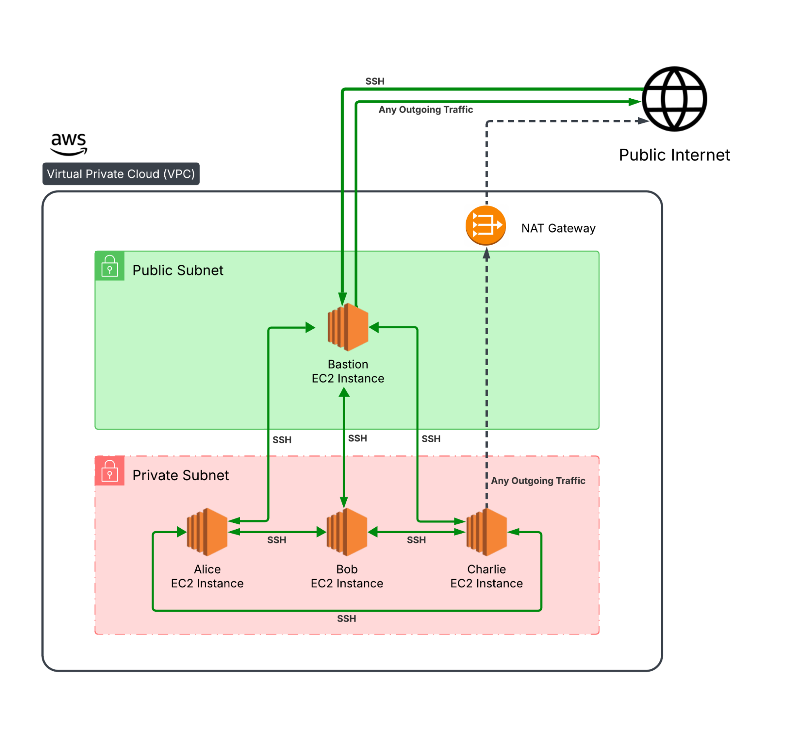

This reflects common small-to-medium AWS environments where workloads remain private but need selective egress and secure administrative access.

## Document Your Current Configuration

Before migrating, capture the details of your AWS setup. This record ensures you can replicate it in Akamai Cloud.

### VPC CIDR Block

Record the CIDR block used by your AWS VPC.



1.  In the AWS Console, open the **VPC** service.

1.  Select your VPC in the list of **Your VPCs**:

    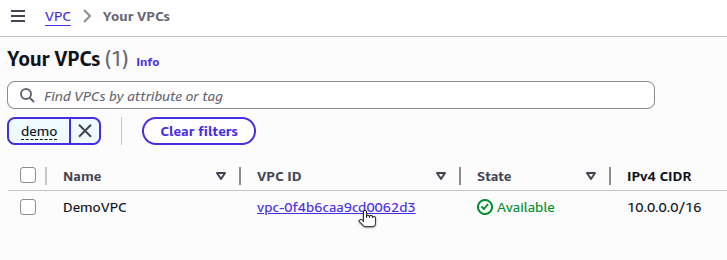

1.  The IPv4 CIDR is listed on the VPC **Details** page and under the **CIDRs** tab:

    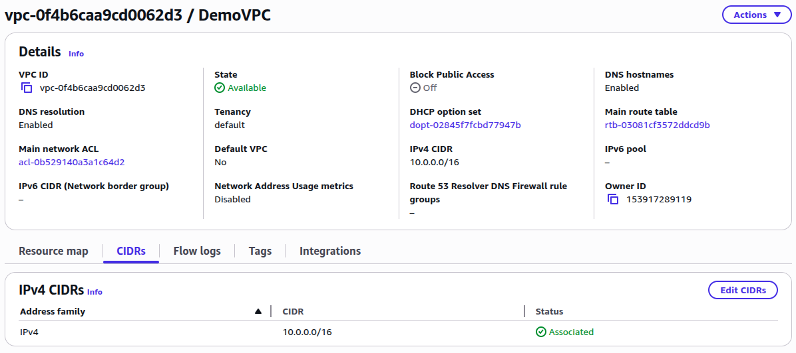


Run the following `aws` CLI command to display the CIDR block of your VPC, replacing :

```command
aws ec2 describe-vpcs \
  --region  \
  --query "Vpcs[*].[VpcId,CidrBlock]"
```

```output
[
    [
        "vpc-0f4b6caa9cd0062d3",
        "10.0.0.0/16"
    ]
]
```



### Subnets and CIDR Blocks

Document the subnets associated with your VPC, their CIDR blocks, and whether they are configured as public or private.



1.  The **Resource map** tab on the VPC details page contains the list of subnets associated with your VPC:

    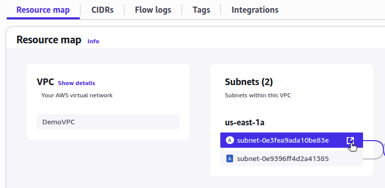

1.  Click on the **open link** icon to see details for each one. The public subnet has been assigned a public IPv4 address. EC2 instances on this subnet have private IP addresses in the `10.0.2.0/24` CIDR block:

    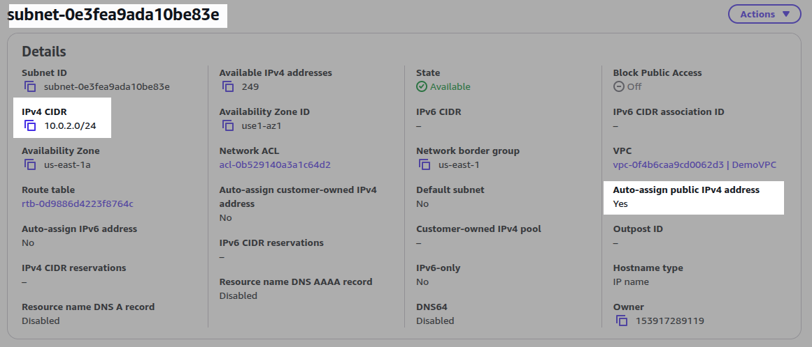

1.  The private subnet does not have a public IPv4 address. EC2 instances on this subnet have private IP addresses in the `10.0.1.0/24` CIDR block:

    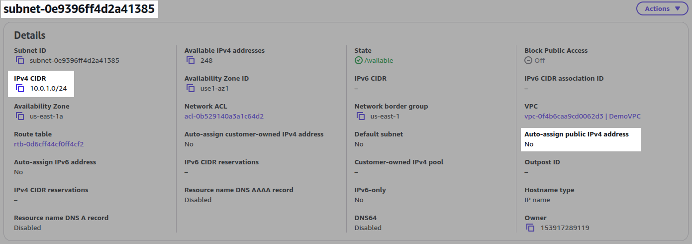


Run the following `aws` CLI command to list all the subnets in your VPC, replacing :

```command
aws ec2 describe-subnets \
    --region  \
    --filters "Name=vpc-id,Values=" \
    --query "Subnets[].[SubnetId,MapPublicIpOnLaunch,CidrBlock]"
```

```output
[
    [
        "subnet-0e3fea9ada10be83e",
        true,
        "10.0.2.0/24"
    ],
    [
        "subnet-0e9396ff4d2a41385",
        false,
        "10.0.1.0/24"
    ]
]
```



### IP Addresses and Subnets of EC2 Instances

Record the private IPs of each EC2 instance in your VPC and the subnet it belongs to (e.g., `10.0.1.0/24` versus `10.0.2.0/24`). If a Bastion is present, also note its public IP and security group rules.



1.  On the **EC2** service page, navigate to **Instances**:

    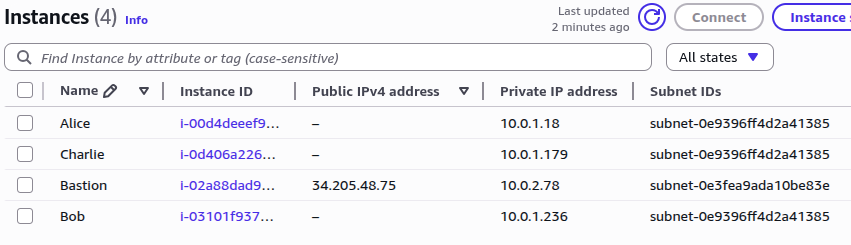

1.  Under the **Security** tab for the EC2 instance details, view the inbound rules associated with the instance's security group:

    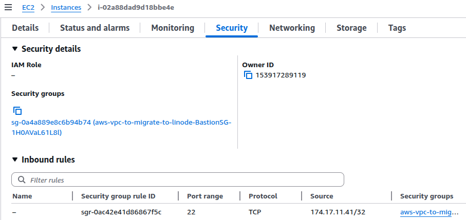


1.  Run the following `aws` CLI command to list the EC2 instances in your VPC:

    ```command
    aws ec2 describe-instances \
        --region  \
        --filters "Name=vpc-id,Values=" \
        --query "Reservations[].Instances[].[InstanceId,SubnetId,PrivateIpAddress,Tags[?Key=='Name']]"
    ```

    ```output
    [
        [
            "i-00d4deeef9349223c",
            "subnet-0e9396ff4d2a41385",
            "10.0.1.18",
            [
                {
                    "Key": "Name",
                    "Value": "Alice"
                }
            ]
        ],
        [
            "i-0d406a226a301f056",
            "subnet-0e9396ff4d2a41385",
            "10.0.1.179",
            [
                {
                    "Key": "Name",
                    "Value": "Charlie"
                }
            ]
        ],
        [
            "i-02a88dad9d18bbe4e",
            "subnet-0e3fea9ada10be83e",
            "10.0.2.78",
            [
                {
                    "Key": "Name",
                    "Value": "Bastion"
                }
            ]
        ],
        [
            "i-03101f93798bc4190",
            "subnet-0e9396ff4d2a41385",
            "10.0.1.236",
            [
                {
                    "Key": "Name",
                    "Value": "Bob"
                }
            ]
        ]
    ]
    ```

1.  Fetch any security group rules associated with the EC2 instance, replacing :

    ```command
    aws ec2 describe-instances \
        --region  \
        --instance-ids  \
        --query "Reservations[0].Instances[0].SecurityGroups"
    ```

    ```output
    [
        {
            "GroupName": "aws-vpc-to-migrate-to-linode-BastionSG-1H0AVaL61L8l",
            "GroupId": "sg-0a4a889e8c6b94b74"
        }
    ]
    ```

1.  Query for all associated rules for each Security Group:

    ```command
    aws ec2 describe-security-group-rules \
        --region  \
        --filters Name=group-id,Values=
    ```

    ```output
    {
        "SecurityGroupRules": [
            {
                "SecurityGroupRuleId": "sgr-0e5a9ef366545f63f",
                "GroupId": "sg-0a4a889e8c6b94b74",
                "IsEgress": true,
                "IpProtocol": "-1",
                "FromPort": -1,
                "ToPort": -1,
                "CidrIpv4": "0.0.0.0/0",
                "Tags": []
            },
            {
                "SecurityGroupRuleId": "sgr-0ac42e41d86867f5c",
                "GroupId": "sg-0a4a889e8c6b94b74",
                "IsEgress": false,
                "IpProtocol": "tcp",
                "FromPort": 22,
                "ToPort": 22,
                "CidrIpv4": "174.17.11.41/32",
                "Tags": []
            }
        ]
    }
    ```



### Route Tables

Note your route table entries, especially any `0.0.0.0/0` routes pointing to the NAT gateway or internet gateway.



1.  In the **Resource Map** tab for your VPC, review the route table associations with subnets, NAT gateways, and internet gateways:

    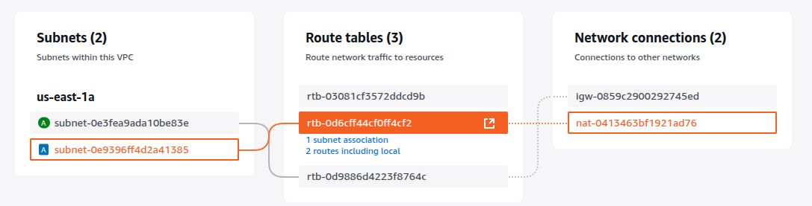

1.  A closer examination of each route table shows how its `0.0.0.0/0` routes maps to the network resource:

    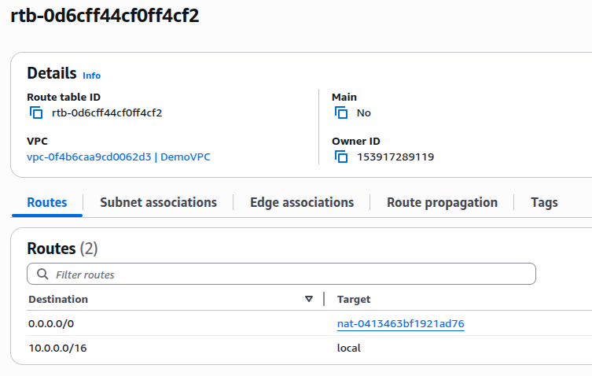

1.  Open the **Subnet associations** tab to show the individual subnet associated with the route table:

    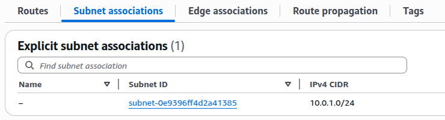


Run the following `aws` CLI command to query for route tables belonging to a VPC:

```command
aws ec2 describe-route-tables \
    --region  \
    --filters "Name=vpc-id,Values=" \
    --query "RouteTables[][RouteTableId, Routes, Associations[][Routes[][DestinationCidrBlock, GatewayId, NatGatewayId],SubnetId]]"
```

```output
[
    [
        "rtb-03081cf3572ddcd9b",
        [
            {
                "DestinationCidrBlock": "10.0.0.0/16",
                "GatewayId": "local",
                "Origin": "CreateRouteTable",
                "State": "active"
            }
        ],
        [
            [
                null,
                null
            ]
        ]
    ],
    [
        "rtb-0d6cff44cf0ff4cf2",
        [
            {
                "DestinationCidrBlock": "10.0.0.0/16",
                "GatewayId": "local",
                "Origin": "CreateRouteTable",
                "State": "active"
            },
            {
                "DestinationCidrBlock": "0.0.0.0/0",
                "NatGatewayId": "nat-0413463bf1921ad76",
                "Origin": "CreateRoute",
                "State": "active"
            }
        ],
        [
            [
                null,
                "subnet-0e9396ff4d2a41385"
            ]
        ]
    ],
    [
        "rtb-0d9886d4223f8764c",
        [
            {
                "DestinationCidrBlock": "10.0.0.0/16",
                "GatewayId": "local",
                "Origin": "CreateRouteTable",
                "State": "active"
            },
            {
                "DestinationCidrBlock": "0.0.0.0/0",
                "GatewayId": "igw-0859c2900292745ed",
                "Origin": "CreateRoute",
                "State": "active"
            }
        ],
        [
            [
                null,
                "subnet-0e3fea9ada10be83e"
            ]
        ]
    ]
]
```



The goal is to have a complete snapshot of your VPC layout, connectivity, and access controls before starting the migration.

## Recreate the Environment in Akamai Cloud

With your AWS environment documented, the next step is to design the equivalent layout in Akamai Cloud. The goal is to replicate routing behavior, instance roles, and access controls as closely as possible. To replicate the example AWS environment in Akamai Cloud, you would need:

-   An Akamai VPC with a CIDR block that matches the AWS configuration, for example:
    -   `10.0.1.0/24` for private workloads
    -   `10.0.2.0/24` for public resources
-   2 Linode instances (Alice and Bob) isolated within the private subnet
-   1 Linode instance (Charlie) with access to the internet, but within the private subnet
-   1 Linode instance (Bastion) for SSH access to all instances, within the public subnet, which also acts as a NAT router
-   Static private IPs assigned to all Linode instances, to match their AWS counterparts

Additionally, a [VLAN](https://techdocs.akamai.com/cloud-computing/docs/vlan) provides a private Layer-2 link between Linodes in the same VPC, enabling secure internal communication across subnets without exposing traffic to the public internet.

The diagram below offers a visual representation of the equivalent Akamai Cloud setup:

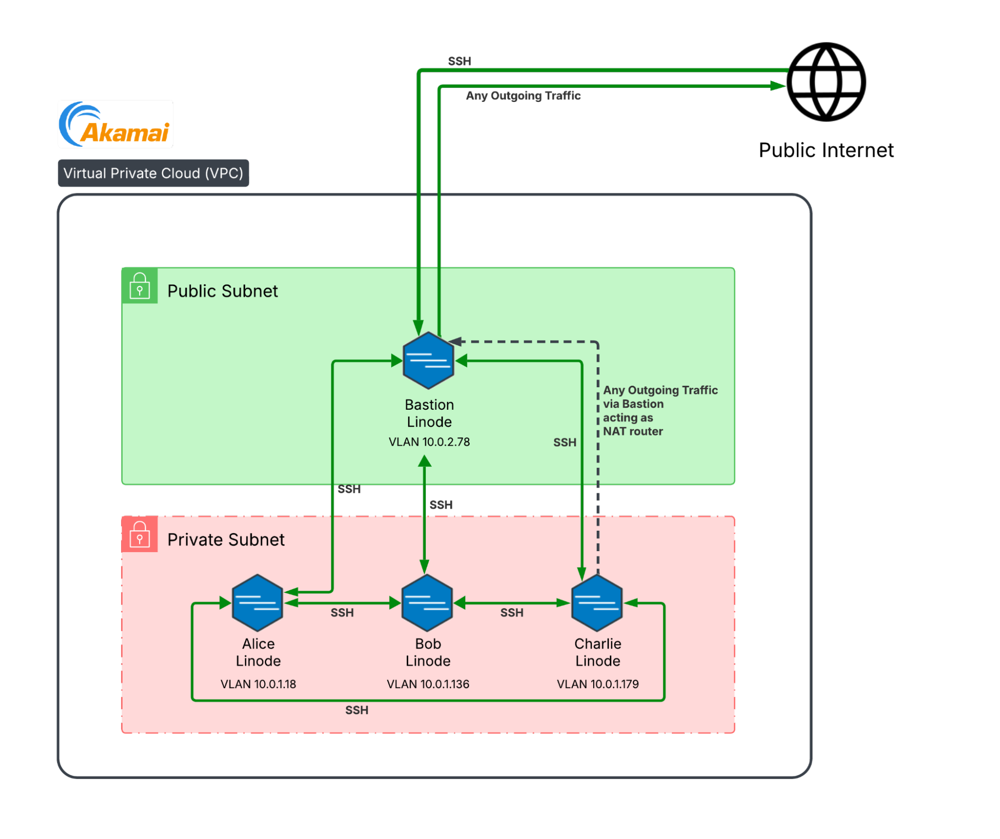

With your strategy mapped out, you can begin provisioning resources in Akamai Cloud.

### Create the VPC and Subnets

Create a new VPC in your preferred region. Within the VPC, define a private subnet for Alice, Bob, and Charlie, and a public subnet for Bastion. This can be done within the [Akamai Cloud Manager](https://cloud.linode.com/), or via the `linode` CLI.

Run the following `linode-cli` command to [create an equivalent VPC](https://techdocs.akamai.com/linode-api/reference/post-vpc), replacing  (e.g., `us-mia`) with the Akamai Cloud region closest to you or your users:

```command
linode-cli vpcs create \
    --label "my-migrated-vpc" \
    --description "VPC migrated from AWS" \
    --region  \
    --pretty \
    --subnets '[{"label":"private-subnet","ipv4":"10.0.1.0/24"},{"label":"public-subnet","ipv4":"10.0.2.0/24"}]'
```

Take note of the `id` fields associated with each subnet (e.g., `254564` for `private-subnet` and `254565` for `public-subnet`) for use in subsequent commands:

```output
[
  {
    "created": "2025-09-05T16:25:24",
    "description": "VPC migrated from AWS",
    "id": 249729,
    "label": "my-migrated-vpc",
    "region": "us-mia",
    "subnets": [
      {
        "created": "2025-09-05T16:25:24",
        "databases": [],
        "id": 254564,
        "ipv4": "10.0.1.0/24",
        "label": "private-subnet",
        "linodes": [],
        "nodebalancers": [],
        "updated": "2025-09-05T16:25:24"
      },
      {
        "created": "2025-09-05T16:25:24",
        "databases": [],
        "id": 254565,
        "ipv4": "10.0.2.0/24",
        "label": "public-subnet",
        "linodes": [],
        "nodebalancers": [],
        "updated": "2025-09-05T16:25:24"
      }
    ],
    "updated": "2025-09-05T16:25:24"
  }
]
```

### Create the Private Linodes

Deploy Linode compute instances that correspond with the private EC2 instances from your AWS environment (e.g., Alice, Bob, and Charlie) to the `private-subnet`. The Linodes can communicate with each other through a [VLAN](https://techdocs.akamai.com/cloud-computing/docs/vlan), which is a private network link between Linodes in the same VPC. It allows internal traffic to flow securely, even between instances in different subnets, as long as they share the same VLAN.

1.  The command below creates the Alice instance, attaches it to the private subnet, assigns it the same VPC IP address used in the original AWS environment (e.g, `10.0.1.18`), and adds it to the VLAN at `10.0.99.18/24`. Substitute  (e.g., `us-mia`),  (e.g., `myalicerootpassword`), and  (e.g., `254564`) with your own values:

    ```command
    linode-cli linodes create \
      --region  \
      --type g6-standard-2 \
      --image linode/ubuntu24.04 \
      --label alice \
      --backups_enabled false \
      --private_ip false \
      --root_pass  \
      --interfaces '[{"purpose":"vpc","subnet_id":,"ipv4":{"vpc":"10.0.1.18"}},{"purpose":"vlan","label":"my-vlan","ipam_address":"10.0.99.18/24"}]' \
      --pretty
    ```

    ```output
    [
      {
        ...
        "disk_encryption": "enabled",
        "group": "",
        "has_user_data": false,
        "host_uuid": "4a53d44b88e1a32a4194cde65aa65f04721a8a7d",
        "hypervisor": "kvm",
        "id": 84164398,
        "image": "linode/ubuntu24.04",
        "ipv4": [
          "172.238.217.174"
        ],
        "ipv6": "2a01:7e04::2000:43ff:feae:fdd2/128",
        "label": "alice",
        "lke_cluster_id": null,
        "region": "us-mia",
        "specs": {
          "disk": 81920,
          "gpus": 0,
          "memory": 4096,
          "transfer": 4000,
          "vcpus": 2
        },
        "status": "provisioning",
        "tags": [],
        "type": "g6-standard-2",
        ...
      }
    ]
    ```

    
    A public IP address is created for every Linode, however, because the Linode creation command did not include a `public` interface, the public IP address is not attached to a network interface.
    

1.  Use a variation of the `create` command to deploy the Bob Linode, attach it to the private subnet, assign it the original AWS VPC IP (e.g, `10.0.1.236`), and add it to the VLAN at `10.0.99.236/24`:

    ```command
    linode-cli linodes create \
      --region  \
      --type g6-standard-2 \
      --image linode/ubuntu24.04 \
      --label bob \
      --backups_enabled false \
      --private_ip false \
      --root_pass  \
      --interfaces '[{"purpose":"vpc","subnet_id":,"ipv4":{"vpc":"10.0.1.236"}},{"purpose":"vlan","label":"my-vlan","ipam_address":"10.0.99.236/24"}]' \
      --pretty
    ```

1.  Repeat the `create` command once more to deploy the Charlie Linode, attach it to the private subnet, assign it the original AWS VPC IP (e.g, `10.0.1.179`), and add it to the VLAN at `10.0.99.179/24`:

    ```command
    linode-cli linodes create \
      --region  \
      --type g6-standard-2 \
      --image linode/ubuntu24.04 \
      --label charlie \
      --backups_enabled false \
      --private_ip false \
      --root_pass  \
      --interfaces '[{"purpose":"vpc","subnet_id":,"ipv4":{"vpc":"10.0.1.179"}},{"purpose":"vlan","label":"my-vlan","ipam_address":"10.0.99.179/24"}]' \
      --pretty
    ```

Afterwards, you should have three instances with the following corresponding VPC IP addresses and VLAN IPAM addresses:

| Instance | VPC IP Address | VLAN IPAM Address |
| -- | -- | -- |
| **Alice** | `10.0.1.18` | `10.0.99.18/24` |
| **Bob** | `10.0.1.236` | `10.0.99.236/24` |
| **Charlie** | `10.0.1.179` | `10.0.99.179/24` |

### Create the Public Linode

In the original AWS environment, the NAT gateway service is used to allow outgoing internet access for a machine in the private subnet (e.g., Charlie). Because Linode does not offer a NAT gateway service, Bastion is configured to function as a NAT router.

Use the following command to create the Bastion instance on the public subnet. This command assigns it the same VPC IP as in the original AWS environment (e.g, `10.0.2.78`) and adds it to the VLAN at `10.0.99.78/24`. Replace  (e.g., `us-mia`),  (e.g., `mybastionrootpassword`), and  (e.g., `254565`) with your own values:

```command
linode-cli linodes create \
  --region  \
  --type g6-standard-2 \
  --image linode/ubuntu24.04 \
  --label bastion \
  --backups_enabled false \
  --private_ip false \
  --root_pass  \
  --interfaces '[{"purpose":"vpc","subnet_id":,"ipv4":{"vpc":"10.0.2.78","nat_1_1":"any"}},{"purpose":"vlan","label":"my-vlan","ipam_address":"10.0.99.78/24"}]' \
  --pretty
```

Including `nat_1_1:any` in the options for the VPC interface enables the assigned public IPv4 address for the Linode (e.g, `172.233.162.30`):

```output
[
  {
    ...
    "id": 83120114,
    "image": "linode/ubuntu24.04",
    "ipv4": [
      "172.233.162.30"
    ],
    ...
  }
]
```

Afterwards, you should have one instance with the following addresses:

| Instance | VPC IP Address | VLAN IPAM Address | Public IPv4 Address |
| -- | -- | -- | -- |
| **Bastion** | `10.0.1.18` | `10.0.99.18/24` | `172.233.162.30` |

## Connect to the Public Linode

You can connect to the Bastion instance with SSH because it has a public IP address. This is the only instance you can SSH into from the public internet. From this machine, you can SSH into the other private instances in the VLAN. This matches the original AWS VPC environment.

Supply the  (e.g., `172.236.243.216`) to connect with SSH and verify access to the Linode:

```command
ssh root@
```


The remainder of this guide assumes commands are performed while logged in as `root`. However, you should consider [creating and using a limited `sudo` user](https://techdocs.akamai.com/cloud-computing/docs/set-up-and-secure-a-compute-instance#add-a-limited-user-account) on each Linode to reduce your risk of accidentally performing damaging operations.


### Enable IP Forwarding

IP forwarding enables a machine to forward packets between network interfaces. For example, between the VLAN on `eth1` and the public VPC subnet on `eth0`.

1.  From your existing SSH connection, use `nano` to modify `/etc/sysctl.conf` on the Bastion instance:

    ```command {title="Bastion via SSH"}
    nano /etc/sysctl.conf
    ```

    Add or uncomment the following line to enable IP forwarding:

    ```file {title="/etc/sysctl.conf"}
    net.ipv4.ip_forward=1
    ```

    When done, press <kbd>CTRL</kbd>+<kbd>X</kbd>, followed by <kbd>Y</kbd> then <kbd>Enter</kbd> to save the file and exit `nano`.

1.  Reload `sysctl` to apply the change:

    ```command {title="Bastion via SSH"}
    sysctl -p /etc/sysctl.conf
    ```

    ```output
    net.ipv4.ip_forward = 1
    ```

### Allow Packet Forwarding

By default, `ufw` drops forwarded packets, so you need to change that behavior on the Bastion instance.

1.  Modify the `/etc/default/ufw` file:

    ```command {title="Bastion via SSH"}
    nano /etc/default/ufw
    ```

    Locate the `DEFAULT_FORWARD_POLICY` line and change the value from `DROP` to `ACCEPT`:

    ```file {title="/etc/default/ufw"}
    DEFAULT_FORWARD_POLICY="ACCEPT"
    ```

    When done, press <kbd>CTRL</kbd>+<kbd>X</kbd>, followed by <kbd>Y</kbd> then <kbd>Enter</kbd> to save the file and exit `nano`.

1.  Add `ufw` rules to allow inbound traffic from `eth1` (the VLAN), outgoing traffic on `eth0` (the public interface), and SSH everywhere:

    ```command {title="Bastion via SSH"}
    ufw allow in on eth1
    ufw allow out on eth0
    ufw allow 22/tcp
    ufw allow out to 10.0.0.0/16 port 22 proto tcp
    ```

    ```output
    Rules updated
    Rules updated (v6)
    Rules updated
    Rules updated (v6)
    Rules updated
    Rules updated (v6)
    Rules updated
    ```

1.  Enable `ufw`:

    ```command
    ufw enable
    ```

    ```output
    Command may disrupt existing ssh connections. Proceed with operation (y|n)? y
    ```

    When prompted, press <kbd>Y</kbd> then <kbd>Enter</kbd> to proceed:

    ```output
    Firewall is active and enabled on system startup
    ```

1.  Restart `ufw` and verify the rule setup:

    ```command
    ufw reload
    ufw status verbose
    ```

    ```output
    Firewall reloaded
    Status: active
    Logging: on (low)
    Default: deny (incoming), allow (outgoing), allow (routed)
    New profiles: skip

    To                         Action      From
    --                         ------      ----
    Anywhere on eth1           ALLOW IN    Anywhere
    22/tcp                     ALLOW IN    Anywhere
    Anywhere (v6) on eth1      ALLOW IN    Anywhere (v6)
    22/tcp (v6)                ALLOW IN    Anywhere (v6)

    Anywhere                   ALLOW OUT   Anywhere on eth0
    10.0.0.0/16 22/tcp         ALLOW OUT   Anywhere
    Anywhere (v6)              ALLOW OUT   Anywhere (v6) on eth0
    ```

### Configure NAT Masquerading

NAT masquerading rewrites the source IP of packets from private instances with Bastion’s public IP, allowing them to reach the internet. Bastion then maps the return traffic back to the originating instance (e.g., Charlie).

1.  On the Bastion instance, edit `/etc/ufw/before.rules` to add NAT masquerading:

    ```command {title="Bastion via SSH"}
    nano /etc/ufw/before.rules
    ```

    Near the top of the file, add the following lines above the `*filter` line:

    ```file {title="/etc/ufw/before.rules"}
    # NAT table rules
    *nat
    :POSTROUTING ACCEPT [0:0]
    # Masquerade traffic from private VLAN subnet to the public internet
    -A POSTROUTING -s 10.0.0.0/16 -o eth0 -j MASQUERADE
    COMMIT
    ```

    When done, press <kbd>CTRL</kbd>+<kbd>X</kbd>, followed by <kbd>Y</kbd> then <kbd>Enter</kbd> to save the file and exit `nano`.

1.  Restart `ufw`, then verify NAT masquerading behavior:

    ```command {title="Bastion via SSH"}
    ufw reload
    iptables -t nat -L -n -v
    ```

    ```output
    ...
    Chain POSTROUTING (policy ACCEPT 0 packets, 0 bytes)
     pkts bytes target      prot opt in  out   source           destination
        0     0 MASQUERADE  0    --  *   eth0  10.0.0.0/16      0.0.0.0/0
    ```

    This confirms that private subnet traffic exits via Bastion’s external interface (`eth0`).

## Secure Firewall on Private Linodes

Set the firewall (`ufw`) on each of the private instances (Alice, Bob, Charlie) to only allow SSH connections from within the VLAN.

1.  Use your existing SSH connection to Bastion to connect to Alice (e.g., `10.0.99.18`), Bob (e.g., `10.0.99.236`), and Charlie (e.g., `10.0.99.179`) via their respective VLAN IP Addresses:

    ```command {title="Bastion via SSH"}
    ssh root@VLAN_IP_ADDRESS
    ```

    
    If your VLAN configuration initially prevents SSH access, you can use [Lish (Linode Shell)](https://www.linode.com/docs/products/compute/compute-instances/guides/lish/) instead.

    Log in to your Akamai Cloud Manager, navigate to each Linode, and click **Launch LISH Console**:

    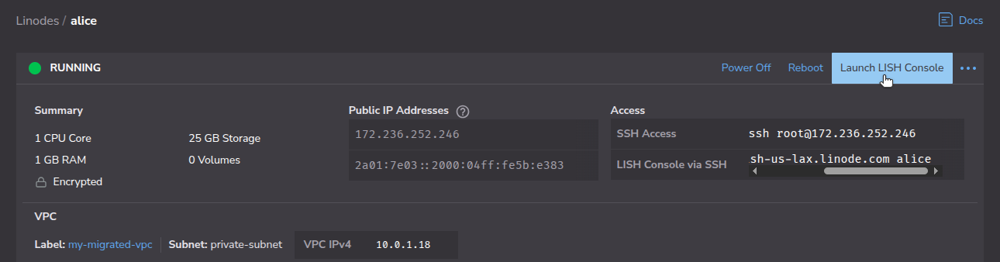

    Within the LISH Console, connect to the machine as `root`, using the password specified when creating the Linode.
    

1.  Configure `ufw` rules to deny all incoming and outgoing connections by default, but explicitly allow incoming and outgoing SSH connections within the VLAN:

    ```command {title="Alice/Bob/Charlie via SSH from Bastion"}
    ufw default deny incoming
    ufw default deny outgoing
    ufw allow from 10.0.0.0/16 to any port 22 proto tcp
    ufw allow out to 10.0.0.0/16 port 22 proto tcp
    ```

    ```output
    Default incoming policy changed to 'deny'
    (be sure to update your rules accordingly)
    Default outgoing policy changed to 'deny'
    (be sure to update your rules accordingly)
    Rules updated
    Rules updated
    ```

1.  Enable `ufw`:

    ```command {title="Alice/Bob/Charlie via SSH from Bastion"}
    ufw enable
    ```

    ```output
    Command may disrupt existing ssh connections. Proceed with operation (y|n)? y
    ```

    When prompted, press <kbd>Y</kbd> then <kbd>Enter</kbd> to proceed:

    ```output
    Firewall is active and enabled on system startup
    ```

1.  Restart `ufw` and verify the rule setup:

    ```command {title="Alice/Bob/Charlie via SSH from Bastion"}
    ufw reload
    ufw status numbered
    ```

    ```output
    Firewall reloaded
    Status: active

         To                       Action      From
         --                       ------      ----
    [ 1] 22/tcp                   ALLOW IN    10.0.0.0/16
    [ 2] 10.0.0.0/16 22/tcp       ALLOW OUT   Anywhere      (out)
    ```

1.  Log out and return to the Bastion instance:

    ```command {title="Alice/Bob/Charlie via SSH from Bastion"}
    exit
    ```

1.  Repeat the steps above for the Bob and Charlie instances.

## Configure Charlie for Internet Access

At this point, Alice and Bob are now fully configured. However, Charlie requires outgoing internet access. To enable this, Charlie routes traffic through Bastion, which is now configured to function as a NAT router.

### Disable Network Helper

By default, Linode’s Network Helper rewrites `systemd-networkd` configs at boot and forces a public default route (`10.0.1.1`). For Charlie to use Bastion as its gateway for public internet access, you must first disable Network Helper.

1.  In the Akamai Cloud Manager, navigate to **Linodes** and click on the entry for **charlie**.

1.  Click the three horizontal dots (**...**) in the upper-right corner and select **Power Off**, then choose **Power Off Linode**.

1.  Once the instance reports as **Offline**, open the **Configurations** tab.

1.  Click the three horizontal dots (**...**) to the right of the listed **Network Interfaces** and select **Edit**.

1.  Scroll to the bottom of the window and switch the toggle next to **Auto-configure networking** to the off position, then click **Save Changes** to disable Network Helper.

1.  Click the three horizontal dots (**...**) in the upper-right corner and select **Power On**, then choose **Power On Linode**.

### Route Outgoing Traffic Through Bastion

Set Charlie's default route to use Bastion's VLAN IPAM address and configure `ufw` to allow outgoing traffic.

1.  SSH into the Charlie instance from your existing SSH connection to the Bastion instance:

    ```command {title="Bastion via SSH"}
    ssh root@
    ```

1.  Use `nano` to edit the `05-eth0.network` configuration file in `/etc/systemd/network/` on the Charlie instance:

    ```command {title="Charlie via SSH from Bastion"}
    nano /etc/systemd/network/05-eth0.network
    ```

    Comment out the `Gateway` line:

    ```file {title="/etc/systemd/network/05-eth0.network" hl_lines="11"}
    [Match]
    Name=eth0

    [Network]
    DHCP=no
    DNS=172.233.160.27 172.233.160.30 172.233.160.34

    Domains=members.linode.com
    IPv6PrivacyExtensions=false

    #Gateway=10.0.1.1
    Address=10.0.1.179/24
    ```

    When done, press <kbd>CTRL</kbd>+<kbd>X</kbd>, followed by <kbd>Y</kbd> then <kbd>Enter</kbd> to save the file and exit `nano`.

1.  Now edit the edit the `05-eth1.network` configuration file:

    ```command {title="Charlie via SSH from Bastion"}
    nano /etc/systemd/network/05-eth1.network
    ```

    Add the following lines for `Gateway` and `DNS`:

    ```file {title="/etc/systemd/network/05-eth1.network" hl_lines="11-13"}
    [Match]
    Name=eth1

    [Network]
    DHCP=no

    Domains=members.linode.com
    IPv6PrivacyExtensions=false

    Address=10.0.99.179/24
    Gateway=10.0.99.78
    DNS=1.1.1.1
    DNS=8.8.8.8
    ```

    By setting Charlie's default route on `eth1`, all internet-bound traffic goes through Bastion. This separates internal communication from external routing, isolate local traffic from NAT operations.

    When done, press <kbd>CTRL</kbd>+<kbd>X</kbd>, followed by <kbd>Y</kbd> then <kbd>Enter</kbd> to save the file and exit `nano`.

1.  Restart `networkd` to apply the new configuration:

    ```command {title="Charlie via SSH from Bastion"}
    systemctl restart systemd-networkd
    ```

1.  Change the `ufw` rules to allow outgoing traffic, which is now routed through the Bastion instance:

    ```command {title="Charlie via SSH from Bastion"}
    ufw default allow outgoing
    ufw reload
    ```

    ```output
    Default outgoing policy changed to 'allow'
    (be sure to update your rules accordingly)
    Firewall reloaded
    ```

1.  Use `curl` to query [ifconfig.me](http://ifconfig.me), an online service that simply returns the public IP address of the calling machine, to verify that Charlie now has outgoing internet access:

    ```command {title="Charlie via SSH from Bastion"}
    curl -i ifconfig.me
    ```

    ```output
    HTTP/1.1 200 OK
    Content-Length: 15
    access-control-allow-origin: *
    content-type: text/plain
    ...

    172.236.243.216
    ```

1.  Use `ping` to test for outgoing internet access from Charlie:

    ```command {title="Charlie via SSH from Bastion"}
    ping -c 3 8.8.8.8
    ```

    ```output
    PING 8.8.8.8 (8.8.8.8) 56(84) bytes of data.
    64 bytes from 8.8.8.8: icmp_seq=1 ttl=110 time=0.639 ms
    64 bytes from 8.8.8.8: icmp_seq=2 ttl=110 time=0.724 ms
    64 bytes from 8.8.8.8: icmp_seq=3 ttl=110 time=0.668 ms

    --- 8.8.8.8 ping statistics ---
    3 packets transmitted, 3 received, 0% packet loss, time 2038ms
    rtt min/avg/max/mdev = 0.639/0.677/0.724/0.035 ms
    ```

## Monitor Post-Migration Behavior

After initial testing, continue to monitor the new environment to ensure it operates as expected.

On the NAT router (Bastion), check for dropped or rejected traffic using tools like `dmesg`, `journalctl`, or `iptables`. For example:

-   `dmesg | grep -i drop` shows kernel log messages that contain the word "drop", which can surface dropped packets.
-   `journalctl -u ufw` shows ufw logs.
-   `journalctl -k` shows kernel messages.
-   `iptables -t nat -L POSTROUTING -v -n` helps confirm that NAT rules such as `MASQUERADE` are being used. For example:

    ```command {title="Bastion via SSH"}
    iptables -t nat -L POSTROUTING -v -n
    ```

    This shows how many packets and bytes have matched each rule:

    ```output
    Chain POSTROUTING (policy ACCEPT 25 packets, 1846 bytes)
     pkts bytes target     prot opt in   out   source           destination
     653  149K MASQUERADE  0    --  *   eth0  10.0.0.0/16      0.0.0.0/0
    ```

Monitor resource usage on the NAT router to ensure it is not becoming a bottleneck. Tools like `top`, `htop`, and `iftop` can help you keep an eye on CPU, memory, and bandwidth usage.

Within the Akamai Cloud Manager, you can set up monitoring and alerts for Linode compute instances.

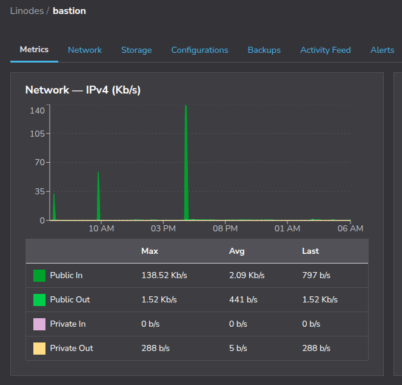


Alternatively, install monitoring agents or set up log forwarding to external observability platforms for more detailed insight into traffic flow, resource utilization, and system health.

Periodic SSH audits and basic connectivity checks between instances can also help validate that the VPC remains stable over time. For example, run the following command to check `auth.log` for SSH activity:

```command {title="Bastion via SSH"}
grep 'sshd' /var/log/auth.log
```

```output
...
2025-06-16T23:28:59.223088-07:00 my-linode sshd[9355]: Accepted password for root from 10.0.2.78 port 53520 ssh2
2025-06-16T23:28:59.227749-07:00 my-linode sshd[9355]: pam_unix(sshd:session): session opened for user root(uid=0) by root(uid=0)
2025-06-16T23:43:44.812075-07:00 my-linode sshd[9526]: Accepted password for root from 10.0.2.78 port 32886 ssh2
2025-06-16T23:43:44.816294-07:00 my-linode sshd[9526]: pam_unix(sshd:session): session opened for user root(uid=0) by root(uid=0)
2025-06-16T23:44:30.593329-07:00 my-linode sshd[9355]: Received disconnect from 10.0.2.78 port 53520:11: disconnected by user
2025-06-16T23:44:30.597043-07:00 my-linode sshd[9355]: Disconnected from user root 10.0.2.78 port 53520
2025-06-16T23:44:30.597234-07:00 my-linode sshd[9355]: pam_unix(sshd:session): session closed for user root
```

## Finalize Your Migration

Once you've verified that the Linode environment is functioning correctly, complete the migration by updating services and decommissioning the original AWS infrastructure.

Update any scripts, applications, or service configurations that reference AWS-specific hostnames or IPs. If you use DNS, point records to any new Linode instances with public IPs. This helps minimize downtime and makes the transition seamless to users.

Check your monitoring and alerting setup. Make sure Linode compute instances are covered by any health checks or observability tools your team depends on. If you used CloudWatch or other AWS-native tools, replace them with Linode monitoring or third-party alternatives. See [Migrating From AWS CloudWatch to Prometheus and Grafana on Akamai](https://www.linode.com/docs/guides/migrating-from-aws-cloudwatch-to-prometheus-and-grafana-on-akamai/) for more information.

Decommission AWS resources that are no longer needed. This includes EC2 instances, NAT gateways, Elastic IPs, route tables, subnets, and eventually the VPC itself. Make sure to clean up all resources to avoid unnecessary charges.

Finally, update internal documentation, runbooks, and network diagrams to reflect the new environment. A clear and current record helps with future audits, troubleshooting, and onboarding.