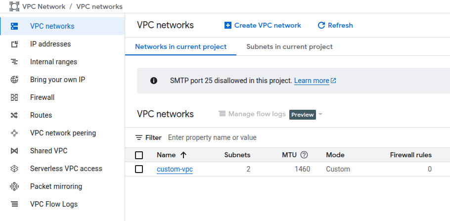

A Virtual Private Cloud (VPC) is a private network environment that lets you define IP address ranges, segment workloads into subnets, and control how resources communicate. VPCs help isolate and organize infrastructure while enabling internal and external traffic control.

A managed VPC service handles key networking functions like NAT, internet access, and routing. It also integrates with other cloud features, so you don't need to configure them manually.

This guide covers how to migrate a basic Google Cloud Platform (GCP) VPC environment to Akamai Cloud. The GCP setup includes three private compute instances, a cloud NAT gateway for selective outgoing traffic, and a bastion host for SSH access. It walks through how to recreate this setup in Akamai Cloud using Linode compute instances and a manual NAT router.

## Feature Comparison

Before migrating, it's useful to understand the differences between managed VPC offerings from Google Cloud and Akamai.

### What Google Cloud VPCs Offer

Google Cloud VPCs are global in scope, allowing you to span a single VPC across multiple regions. Administrators can define subnets within specific regions, attach internet gateways for public access, and use Cloud NAT for managed outbound access from private subnets.

In addition to firewall rules and custom routes, GCP VPCs integrate tightly with Google's managed services (e.g., Cloud SQL, GKE, and Cloud Functions) and can be deployed directly into the VPC. Identity and policy controls (e.g., IAM and Shared VPCs) also enable fine-grained management at scale.

### What Akamai Cloud VPCs Offer

[VPCs from Akamai Cloud](https://techdocs.akamai.com/cloud-computing/docs/vpc) provide private, regional networks that let you define custom IP ranges and subnets. All traffic is isolated from the public internet unless explicitly routed through a configured gateway. This lightweight model is ideal for tightly scoped environments where users want fine-grained control without added complexity.

### How to Adapt

Some GCP features don't have direct equivalents in Akamai Cloud, but can be replicated with custom configuration. For example, Akamai Cloud doesn't offer a managed NAT service. However, outgoing traffic can be enabled using a Linode compute instance manually configured to act as a NAT router. This approach suits teams that prefer direct management of network behavior.

At present, Akamai Cloud does not integrate other services (e.g., NodeBalancers, LKE clusters, or managed databases) with its VPCs. However, some of these services can be replaced with self-managed equivalents and open source tooling.

## Before You Begin

1.  If you do not already have a virtual machine to use, create a Compute Instance with at least 4 GB of memory. See our [Getting Started with Linode](/docs/products/platform/get-started/) and [Creating a Compute Instance](/docs/products/compute/compute-instances/guides/create/) guides.

1.  Follow our [Setting Up and Securing a Compute Instance](/docs/products/compute/compute-instances/guides/set-up-and-secure/) guide to update your system. You may also wish to set the timezone, configure your hostname, create a limited user account, and harden SSH access.

## Prerequisites and Assumptions

This guide assumes access to administrative credentials and CLI tools for both GCP and Akamai Cloud. You should have the ability to view and modify relevant cloud resources in both environments.

### Google Cloud CLI and Permissions

Ensure that the Google Cloud CLI (`gcloud`) is installed and configured with a user or role that has permission to manage GCP compute instances, VPCs, subnets, and routes.

### Linode CLI and Permissions

Install the Linode CLI and authenticate using a personal access token with permissions to manage Linode instances and VPCs. Some familiarity with creating and modifying basic Linux network configuration, including IP routes and `ufw` rules, is helpful.

### Example Environment Used in This Guide

The example used throughout this guide involves four GCP compute instances that all belong to a single VPC:

-   **Alice**: A private GCP compute instance with no internet access.
-   **Bob**: Another private GCP compute instance with no internet access.
-   **Charlie**: A private GCP compute instance that requires outgoing internet access via GCP Cloud NAT, but is not accessible from the public internet.
-   **Bastion**: A public GCP compute instance with a public IP address, used for SSH access to Alice, Bob, and Charlie.

These instances are distributed across two subnets within a single Google Cloud VPC:

-   A **private subnet** (`10.0.1.0/24`) that hosts Alice, Bob, and Charlie.
-   A **public subnet** (`10.0.2.0/24`) that hosts the bastion instance.

In addition, the VPC network has a public Cloud NAT router that routes any outgoing traffic from the private subnet to the internet.

Visually, the GCP environment looks like this:


This example layout is representative of many small-to-medium GCP environments where internal workloads are kept isolated from the public internet but require selective outgoing access and secure administrative access.

## Document and Back Up Your Current Configuration

Before making any changes, document the current GCP setup. Having a full record of your environment can help you replicate the configuration accurately, and recover if needed.

### VPC and Subnet CIDR Blocks

Start by recording the CIDR blocks used with your GCP VPC subnets.



1.  In the Google Cloud Console, navigate to your active project, then the **VPC networks** service. Click on your VPC in the list of VPC networks:

    

1.  On the details page for your VPC network, click on the **Subnets** tab. This shows the CIDR block for each subnet, listed as the **Primary IPv4 range**:

    


Run the following `gcloud` CLI command to query for VPC subnet IP ranges, replacing :

```command
gcloud compute networks subnets list \
  --filter="network:" \
  --format=json"(name, ipCidrRange)"
```

```output
[
  {
    "ipCidrRange": "10.0.1.0/24",
    "name": "private-subnet"
  },
  {
    "ipCidrRange": "10.0.2.0/24",
    "name": "public-subnet"
  }
]
```



### IP Addresses and Subnets of GCP Compute Instances

Next, find the private IP addresses assigned to each GCP compute instance in your VPC. Also note which subnet each instance belongs to. This can also be discerned by viewing the CIDR block to which the IP address belongs (e.g., `10.0.1.0/24` versus `10.0.2.0/24`).



Within the **VPC Network** service page, click **IP addresses**:




To obtain this information with the `gcloud` CLI, run the following `gcloud` CLI command to query for IP addresses of compute instances belonging to a VPC:

```command
gcloud compute instances list \
  --filter="networkInterfaces.network:" \
  --format="table(name, networkInterfaces[].networkIP, networkInterfaces[].accessConfigs[].natIP)"
```

```output
NAME     NETWORK_IP      NAT_IP
alice    ['10.0.1.18']   [None]
bastion  ['10.0.2.78']   [['35.184.201.180']]
bob      ['10.0.1.136']  [None]
charlie  ['10.0.1.179']  [None]
```



### Cloud NAT Configuration and Firewall Rules

The example VPC network also has an associated Cloud NAT router, which the Charlie private instance depends on for outgoing internet access.



1.  Within the GCP Console, search for **Cloud NAT** and then find the associated cloud router with NAT gateway:

    

1.  Click on the NAT gateway to show its details. This gateway is of type Public and it takes packets from the private subnet:

    

    This Cloud NAT configuration forwards outgoing traffic to the internet from *any* VM instance within the private subnet. However, only Charlie (not Alice or Bob) is supposed to have outgoing internet access.

1.  A review of the **VPC firewall rules** for the VPC network shows:

    



1.  Run the following `gcloud` CLI command to query for NAT gateway details, replacing , , :

    ```command
    gcloud compute routers nats \
      describe  \
      --router=  \
      --region=
    ```

    ```output
    autoNetworkTier: STANDARD
    enableDynamicPortAllocation: false
    enableEndpointIndependentMapping: false
    endpointTypes:
    - ENDPOINT_TYPE_VM
    logConfig:
      enable: false
      filter: ALL
    name: nat-gateway
    natIpAllocateOption: AUTO_ONLY
    sourceSubnetworkIpRangesToNat: LIST_OF_SUBNETWORKS
    subnetworks:
      - name: https://www.googleapis.com/compute/v1/projects/my-gcp-vpc/regions/us-central1/subnetworks/private-subnet
        sourceIpRangesToNat:
          - ALL_IP_RANGES
    type: PUBLIC
    ```

    This Cloud NAT configuration forwards outgoing traffic to the internet from *any* VM instance within the private subnet. However, only Charlie (not Alice or Bob) is supposed to have outgoing internet access.

1.  Query for VPC firewall rules:

    ```command
    gcloud compute firewall-rules list \
      --filter="network:" \
      --format="json(name,direction,targetTags,priority)"
    ```

    ```output
    [
      {
        "direction": "EGRESS",
        "name": "allow-egress-nat",
        "priority": 900,
        "targetTags": [
          "egress-allow"
        ]
      },
      {
        "direction": "EGRESS",
        "name": "deny-egress-all",
        "priority": 1000,
        "targetTags": [
          "private-subnet"
        ]
      }
    ]
    ```

1.  Fetch compute instances with names and tags:

    ```command
    gcloud compute instances list \
      --filter="networkInterfaces.network:" \
      --format="json(name,tags[items])"
    ```

    ```output
    [
      {
        "name": "alice",
        "tags": {
          "items": [
            "egress-deny",
            "private-subnet",
            "ssh-access"
          ]
        }
      },
      {
        "name": "bastion",
        "tags": {
          "items": [
            "egress-allow",
            "public-subnet",
            "ssh-access"
          ]
        }
      },
      {
        "name": "bob",
        "tags": {
          "items": [
            "egress-deny",
            "private-subnet",
            "ssh-access"
          ]
        }
      },
      {
        "name": "charlie",
        "tags": {
          "items": [
            "egress-allow",
            "private-subnet",
            "ssh-access"
          ]
        }
      }
    ]
    ```



The `deny-egress-all` rule denies any outgoing traffic by targets with the tag `private-subnet`. However, a higher priority `allow-egress-nat` rule allows outgoing traffic for any targets with the tag `egress-allow`, including those tagged with `private-subnet`.

The goal is to have a complete snapshot of your VPC layout, connectivity, and access controls before starting the migration.

## Plan Your VPC Mapping Strategy

With your GCP environment documented, the next step is to design the equivalent layout in Akamai Cloud. Your goal is to replicate routing behavior, instance roles, and access controls as closely as possible. For example, to replicate the GCP environment in Akamai Cloud, you would need:

-   An Akamai VPC with a CIDR block that matches the GCP configuration, if possible:
    -   10.0.1.0/24 for private workloads
    -   10.0.2.0/24 for public resources
-   2 Linode instances (Alice and Bob) isolated within the private subnet
-   1 Linode instance (Charlie) with access to the internet, but within the private subnet
-   1 Linode instance (Bastion) for SSH access to all instances, within the public subnet, which also act as a NAT router
-   Static private IPs assigned to all Linode instances, to match their GCP counterparts


## Recreate the Environment in Akamai Cloud

With your strategy mapped out, you can begin provisioning resources in Akamai Cloud.

### Create the VPC and Subnets

Start by creating a new VPC in your preferred region. This can be done within the [Akamai Cloud Manager](https://cloud.linode.com/) console, or via the `linode` CLI. Within the VPC, define two subnets:

-   A private subnet for Alice, Bob, and Charlie
-   A public subnet for the bastion host

Run the following `linode-cli` command to [create an equivalent VPC](https://techdocs.akamai.com/linode-api/reference/post-vpc):

```command
linode vpcs create \
  --label "my-migrated-vpc" \
  --description "VPC migrated from GCP" \
  --region us-lax \
  --pretty
  --subnets '[{"label":"private-subnet","ipv4":"10.0.1.0/24"},{"label":"public-subnet","ipv4":"10.0.2.0/24"}]'
```

```output
[
  {
    "description": "VPC migrated from GCP",
    "id": 197854,
    "label": "my-migrated-vpc",
    "region": "us-lax",
    "subnets": [
      {
        "databases": [],
        "id": 199163,
        "ipv4": "10.0.1.0/24",
        "label": "private-subnet",
        "linodes": [],
        "nodebalancers": []
      },
      {
        "databases": [],
        "id": 199164,
        "ipv4": "10.0.2.0/24",
        "label": "public-subnet",
        "linodes": [],
        "nodebalancers": []
      }
    ]
  }
]
```

### Create the Private Linode Compute Instances

Next, deploy Linode compute instances that correspond with the private compute instances from your GCP environment. For the example in this guide, this means deploying Alice, Bob, and Charlie in the private subnet.

The Linodes can communicate with one another through a [VLAN](https://techdocs.akamai.com/cloud-computing/docs/vlan), which is a private network link between Linodes in the same VPC. It allows internal traffic to flow securely, even between instances in different subnets, as long as they share the same VLAN.

Use the Linode CLI to create each Linode in the private subnet. Configure each instance with the following:

-   A VPC network interface on the private subnet
-   No public IPv4 address
-   A VLAN interface with an IP address management (IPAM) address

1.  For example, the command below creates the Alice instance, attaches it to the private subnet, assigns it the same VPC IP address used in the original GCP environment, and adds it to a VLAN:

    ```command
    linode linodes create \
      --region us-lax \
      --type g6-standard-2 \
      --image linode/ubuntu20.04 \
      --label alice \
      --backups_enabled false \
      --private_ip false \
      --root_pass mylinodepassword \
      --interfaces '[{"purpose":"vpc","subnet_id":199163,"ipv4":{"vpc":"10.0.1.18"}},{"purpose":"vlan","label":"my-vlan","ipam_address":"10.0.1.18/24"}]' \
      --pretty
    ```

    ```output
    [
      {
        ...
        "disk_encryption": "enabled",
        "group": "",
        "has_user_data": false,
        "host_uuid": "6b4ea6a82e3a8bfe2bee090b3caf31dee2f94850",
        "hypervisor": "kvm",
        "id": 78417007,
        "image": "linode/ubuntu20.04",
        "ipv4": [
          "172.235.252.246"
        ],
        "label": "alice",
        "region": "us-lax",
        "status": "provisioning",
        "tags": [],
        "type": "g6-nanode-1",
        ...
      }
    ]
    ```

1.  Supply the Alice Linode's `id` to retrieve its network configuration:

    ```command
    linode linodes configs-list 78417007 --pretty
    ```

    This lists its network interfaces with VPC IP and VLAN IPAM addresses:

    ```output
    [
      {
        ...
        "interfaces": [
          {
            "active": true,
            "id": 5629467,
            "ip_ranges": [],
            "ipam_address": null,
            "ipv4": {
              "nat_1_1": null,
              "vpc": "10.0.1.18"
            },
            "label": null,
            "primary": false,
            "purpose": "vpc",
            "subnet_id": 199163,
            "vpc_id": 197854
          },
          {
            "active": true,
            "id": 5629468,
            "ip_ranges": null,
            "ipam_address": "10.0.1.18/24",
            "label": "my-vlan",
            "primary": false,
            "purpose": "vlan",
            "subnet_id": null,
            "vpc_id": null
          }
        ],
        ...
      }
    ]
    ```

    The command to create the Alice Linode provides a VPC interface with the VPC IP address `10.0.1.18` and a VLAN IPAM address of `10.0.1.18/24`.

    
    While a public IP address is created for every Linode, because the Linode creation command did not include a `public` interface, the public IP address is not attached to a network interface for the Linode.
    

1.  Repeat the steps above to create the Bob and Charlie Linodes. Afterwards, you should have:

    | Linode | VPC IP  |
    | :---- | :---- |
    | Alice | 10.0.1.18 |
    | Bob | 10.0.1.236 |
    | Charlie | 10.0.1.179 |

### Create the Public Linode Compute Instance

Deploy the bastion host in the public subnet. This is the only instance you can SSH into from the public internet. From this machine, you can SSH into the other private instances in the VLAN.

In the original GCP environment, the Cloud NAT service was used to allow outgoing internet access for a machine in the private subnet (for example, Charlie). Because Linode does not offer a NAT gateway service, the bastion host can be configured to function as a NAT router.

The important configurations for the bastion instance are:

-   It has a VPC network interface using the public subnet.
-   It *is* assigned a public IPv4 address.
-   It has a VLAN network interface with an IP Address Management (IPAM) address.

1.  Create the Bastion Linode on the public subnet:

    ```command
    linode linodes create \
      --region us-lax \
      --type g6-standard-2 \
      --image linode/ubuntu20.04 \
      --label bastion \
      --backups_enabled false \
      --private_ip false \
      --root_pass mylinodepassword \
      --interfaces '[{"purpose":"vpc","subnet_id":199164,"ipv4":{"vpc":"10.0.2.78","nat_1_1":"any"}},{"purpose":"vlan","label":"my-vlan","ipam_address":"10.0.2.78/24"}]' \
      --pretty
    ```

    Including `nat_1_1:any` in the options for the VPC interface enables the assigned public IPv4 address for the Linode:

    ```output
    [
      {
        ...
        "disk_encryption": "enabled",
        "id": 78472676,
        "image": "linode/ubuntu20.04",
        "ipv4": [
          "172.236.243.216"
        ],
        "label": "bastion",
        "lke_cluster_id": null,
        "region": "us-lax",
        "status": "provisioning",
        "tags": [],
        "type": "g6-standard-2",
      }
    ]
    ```

1.  Examine the resulting network configuration for the bastion instance:

    ```command
    linode linodes configs-list 78472676 --pretty
    ```

    Notice for this instance that the `nat_1_1` address for the VPC interface is set to the auto-generated public IP address (`172.236.243.216`):

    ```output
    [
      {
        ...
        "interfaces": [
          {
            "active": false,
            "id": 5646878,
            "ip_ranges": [],
            "ipam_address": null,
            "ipv4": {
              "nat_1_1": "172.236.243.216",
              "vpc": "10.0.2.78"
            },
            "label": null,
            "primary": false,
            "purpose": "vpc",
            "subnet_id": 199164,
            "vpc_id": 197854
          },
          {
            "active": false,
            "id": 5646879,
            "ip_ranges": null,
            "ipam_address": "10.0.2.78/24",
            "label": "my-vlan",
            "primary": false,
            "purpose": "vlan",
            "subnet_id": null,
            "vpc_id": null
          }
        ],
        ...
      }
    ]
    ```

#### Verify SSH Access for Bastion

Using the public IP address for the bastion instance, connect with SSH to verify access:

```command
ssh root@172.236.243.216
```


The remainder of this guide assumes commands are performed while logged in as `root`. However, you should consider [creating and using a limited `sudo` user](https://techdocs.akamai.com/cloud-computing/docs/set-up-and-secure-a-compute-instance#add-a-limited-user-account) to reduce your risk of accidentally performing damaging operations.


### Configure Linodes for SSH Access Within the VPC

You can connect to the bastion instance with SSH because it has a public IP address attached to its VPC network interface. As expected, you cannot connect to any of the private Linode instances from outside the VPC. This matches the original GCP VPC environment.

To ensure you can SSH into each of the private instances, configure VLAN and firewall settings on each Linode.

#### Verify VLAN IPAM Address on Bastion

1.  Using your already established SSH connection to the bastion instance, use the following command to examine its VLAN network interface configuration:

    ```command
    ip addr show dev eth1
    ```

    The command output should show a line with the IPAM address you specified when creating the Linode, for example:

    ```command
    inet 10.0.2.78/24 scope global eth1
    ```

1.  If it does not, use a command-line text editor such as `nano` to  edit the system's Netplan configuration file found in `/etc/netplan/`:

    ```command
    nano /etc/netplan/01-netcfg.yaml
    ```

    Edit the contents of the file to set the `eth1` VLAN address:

    ```file {title="/etc/netplan/01-netcfg.yaml" lang="yaml"}
    network:
      version: 2
      ethernets:
        eth0:
          dhcp4: true
        eth1:
          addresses:
            - 10.0.2.78/24
    ```

    This assigns a static IP of `10.0.2.78/24` to `eth1`. This also ensures that the setting persists even when the machine is rebooted.

    When done, press <kbd>CTRL</kbd>+<kbd>X</kbd>, followed by <kbd>Y</kbd> then <kbd>Enter</kbd> to save the file and exit `nano`.

1.  Set proper permissions on the file, then apply the new Netplan configuration:

    ```command
    chmod 600 /etc/netplan/01-netcfg.yaml
    netplan apply
    ```

1.  Check the VLAN network interface configuration again:

    ```command
    ip addr show dev eth1
    ```

    You should see the line that begins with `inet` which includes the IPAM address you specified:

    ```output
    4: eth1: <BROADCAST,MULTICAST,UP,LOWER_UP> mtu 1500 qdisc mq state UP group default qlen 1000
        link/ether 90:de:01:3c:2e:58 brd ff:ff:ff:ff:ff:ff
        inet 10.0.2.78/24 brd 10.0.2.255 scope global eth1
            valid_lft forever preferred_lft forever
        inet6 fe80::92de:1ff:fe3c:2e58/64 scope link
            valid_lft forever preferred_lft forever
    ```

#### Configure Private Instances for Intra-VLAN SSH

For each of the private Linode instances (Alice, Bob, Charlie), you need to verify properly configured VLAN IPAM addresses and set the firewall (`ufw`) to allow SSH connections from within the VLAN.

Because these Linode instances do not have a public IP address, you cannot connect with SSH from either your local machine or the bastion instance. You need to log in to your Akamai Cloud Manager, navigate to each Linode, and click **Launch LISH Console**.


Within the LISH Console, connect to each machine as `root`, using the password specified when creating the Linode.

1.  Verify that the `eth1` VLAN interface shows the `inet` line with the expected IPAM address:

    ```command {title="Alice/Bob/Charlie via LISH"}
    ip addr show dev eth1
    ```

1.  If the output does not include the `inet` line, edit `/etc/netplan/01-netcfg.yaml`:

    ```command {title="Alice/Bob/Charlie via LISH"}
    nano /etc/netplan/01-netcfg.yaml
    ```

    Manually assign a VLAN address to `eth1`:

    ```file {title="/etc/netplan/01-netcfg.yaml" lang="yaml"}
    network:
      version: 2
      ethernets:
        eth0:
          dhcp4: true
        eth1:
          addresses:
            - 10.0.1.18/24
    ```

    When done, press <kbd>CTRL</kbd>+<kbd>X</kbd>, followed by <kbd>Y</kbd> then <kbd>Enter</kbd> to save the file and exit `nano`.

1.  Set proper permissions on the file, then apply the new Netplan configuration.

    ```command {title="Alice/Bob/Charlie via LISH"}
    chmod 600 /etc/netplan/01-netcfg.yaml
    netplan apply
    ```

1.  Configure `ufw` rules to deny any incoming or outgoing connections by default, but explicitly allow incoming and outgoing SSH connections within the VLAN:

    ```command {title="Alice/Bob/Charlie via LISH"}
    ufw default deny incoming
    ufw default deny outgoing
    ufw allow from 10.0.0.0/16 to any port 22 proto tcp
    ufw allow out to 10.0.0.0/16 port 22 proto tcp
    ```

1.  Enable and restart `ufw`, then verify the rule setup:

    ```command {title="Alice/Bob/Charlie via LISH"}
    ufw enable
    ufw reload
    ufw status numbered
    ```

    ```output
    Status: active

         To                       Action      From
         --                       ------      ----
    [ 1] 22/tcp                   ALLOW IN    10.0.0.0/16
    [ 2] 10.0.0.0/16 22/tcp       ALLOW OUT   Anywhere      (out)
    ```

    You can now SSH into these private Linodes from the bastion instance using the VLAN IPAM address and `root` password.

1.  From within your existing SSH connection to the bastion instance, SSH into another instance, for example:

    ```command {title="Bastion via SSH"}
    ssh root@10.0.1.18
    ```

    ```output
    root@10.0.1.18's password: ****************
    Welcome to Ubuntu 24.04.2 LTS (GNU/Linux 6.14.3-x86_64-linode168 x86_64)

    ...
    ```

    Once you have successfully configured each Linode instance for SSH access from the Bastion Linode, you can close the LISH Console.

After configuring each Linode instance in the VPC, you can SSH from any machine in the VPC to any other machine in the VPC.

### Configure Private Instance for Outgoing Internet Access

At this point, Alice and Bob are now fully configured. However, the Charlie instance requires outgoing internet access. To enable this, Charlie routed traffic through the bastion instance, which is configured to function as a NAT router.

In the original GCP environment, outgoing internet access on the private subnet was controlled with VPC firewall rules. On Linode, you can instead manage this with `ufw`, using either `ufw default deny outgoing` or `ufw default allow outgoing`.

#### Verify Outgoing Internet Access from Bastion Instance

Establish an SSH connection to the bastion instance, then verify that it has outgoing internet access:

```command {title="Bastion via SSH"}
curl -i ifconfig.me
```

```output
HTTP/1.1 200 OK
Content-Length: 15
access-control-allow-origin: *
content-type: text/plain
...

172.236.243.216
```


[ifconfig.me](http://ifconfig.me) is an online service that returns the IP address of the calling machine.


#### Enable IP Forwarding on Bastion Instance

IP forwarding enables a machine to forward packets between network interfaces. To turn the bastion instance into a basic router, it must be configured to forward packets received on one interface to another. For example, between the VLAN on `eth1` and the public VPC subnet on `eth0`.

1.  Modify `/etc/sysctl.conf` on the bastion instance:

    ```command {title="Bastion via SSH"}
    nano /etc/sysctl.conf
    ```

    Add or uncomment the following line to tell the Linux kernel to pass IPv4 packets between interfaces, enabling IP forwarding:

    ```file {title="/etc/sysctl.conf"}
    net.ipv4.ip_forward=1
    ```

    When done, press <kbd>CTRL</kbd>+<kbd>X</kbd>, followed by <kbd>Y</kbd> then <kbd>Enter</kbd> to save the file and exit `nano`.

1.  Reload `sysctl` to apply the new settings:

    ```command {title="Bastion via SSH"}
    sysctl -p /etc/sysctl.conf
    ```

    ```output
    net.ipv4.ip_forward = 1
    ```

#### Configure `ufw` on Bastion Instance to Allow Packet Forwarding

By default, `ufw` drops forwarded packets by default, so you need to change that behavior on the bastion instance.

1.  Use a command-line text editor such as `nano` to modify `/etc/default/ufw`:

    ```command {title="Bastion via SSH"}
    nano /etc/default/ufw
    ```

    Locate the `DEFAULT_FORWARD_POLICY` line and change the value from `DROP` to `ACCEPT`.

    ```file {title="/etc/default/ufw"}
    DEFAULT_FORWARD_POLICY="ACCEPT"
    ```

    When done, press <kbd>CTRL</kbd>+<kbd>X</kbd>, followed by <kbd>Y</kbd> then <kbd>Enter</kbd> to save the file and exit `nano`.

1.  Add `ufw` rules to allow inbound traffic from `eth1` (the VLAN) and outgoing traffic on `eth0` (the public interface):

    ```command {title="Bastion via SSH"}
    ufw allow in on eth1
    ufw allow out on eth0
    ufw reload
    ufw status verbose
    ```

    ```output
    Status: active
    Logging: on (low)
    Default: deny (incoming), allow (outgoing), allow (routed)
    New profiles: skip

    To                         Action      From
    --                         ------      ----
    22/tcp                     ALLOW IN    10.0.0.0/16
    Anywhere on eth1           ALLOW IN    Anywhere
    10.0.0.0/16 22/tcp         ALLOW OUT   Anywhere
    Anywhere                   ALLOW OUT   Anywhere on eth0
    ```

#### Configure Bastion to Use NAT Masquerading

NAT masquerading rewrites the source IP of packets from other machines in the VPC, replacing it with the bastion’s public IP. This allows Charlie’s traffic to reach the internet without a public IP of its own. Response packets return to the bastion instance, which maps them back to Charlie.

1.  On the bastion instance, edit `/etc/ufw/before.rules` to add NAT masquerading:

    ```command {title="Bastion via SSH"}
    nano /etc/ufw/before.rules
    ```

    Near the top of the file, above the `*filter` line, add the following lines:

    ```file {title="/etc/ufw/before.rules"}
    # NAT table rules
    *nat
    :POSTROUTING ACCEPT [0:0]
    # Masquerade traffic from private VLAN subnet to the public internet
    -A POSTROUTING -s 10.0.0.0/16 -o eth0 -j MASQUERADE
    COMMIT
    ```

    When done, press <kbd>CTRL</kbd>+<kbd>X</kbd>, followed by <kbd>Y</kbd> then <kbd>Enter</kbd> to save the file and exit `nano`.

1.  Restart ufw, then verify NAT masquerading behavior:

    ```command {title="Bastion via SSH"}
    ufw reload
    iptables -t nat -L -n -v
    ```

    ```output
    ...
    Chain POSTROUTING (policy ACCEPT 0 packets, 0 bytes)
      pkts bytes target      prot opt in  out   source           destination
         0     0 MASQUERADE  0    --  *   eth0  10.0.0.0/16      0.0.0.0/0
    ```

    This confirms that private subnet traffic is being masqueraded out the bastion instance's external interface (`eth0`).

#### Configure Private Instance to Route Outgoing Traffic Through Bastion

On the private Charlie instance, set the default route to use bastion's VLAN IPAM address and configure `ufw` to allow outgoing traffic.

1.  SSH into the Charlie instance from the bastion instance:

    ```command {title="Bastion via SSH"}
    ssh root@
    ```

1.  Confirm that Charlie does not currently have outgoing internet access:

    ```command {title="Charlie via SSH from Bastion"}
    curl ifconfig.me
    ```

    The above command should hang, with no response. This is expected.

1.  Use a command-line text editor such as `nano` to edit the Netplan configuration file in `/etc/netplan/`:

    ```command {title="Charlie via SSH from Bastion"}
    nano /etc/netplan/01-netcfg.yaml
    ```

    Edit the contents of the file to look like the following:

    ```file {title="/etc/netplan/01-netcfg.yaml"}
    network:
      version: 2
      ethernets:
        eth0:
          addresses:
            - 10.0.1.179/24
        eth1:
          addresses:
            - 10.0.2.100/24
          nameservers:
            addresses:
              - 8.8.8.8
              - 8.8.4.4
          routes:
            - to: 0.0.0.0/0
              via: 10.0.2.78
    ```

    This configuration assigns Charlie two static IPs:

    -   `10.0.1.179` on `eth0` to communicate with other machines in the internal subnet
    -   `10.0.2.100` on `eth1` to route outgoing traffic through the NAT router on the bastion instance at `10.0.2.78`

    By placing Charlie's default route on `eth1`, all internet-bound traffic is directed through the bastion instance, which handles NAT and forwards the traffic externally. This setup keeps internal communication and internet routing on separate interfaces, helping isolate local traffic from upstream NAT operations.

    When done, press <kbd>CTRL</kbd>+<kbd>X</kbd>, followed by <kbd>Y</kbd> then <kbd>Enter</kbd> to save the file and exit `nano`.

1.  Set proper permissions on the file, then apply the new Netplan configuration:

    ```command {title="Charlie via SSH from Bastion"}
    chmod 600 /etc/netplan/01-netcfg.yaml
    netplan apply
    ```

    Change the `ufw` rules to allow outgoing traffic, which is now routed through the bastion instance:

    ```command {title="Charlie via SSH from Bastion"}
    ufw default allow outgoing
    ufw reload
    ```

1.  Use `curl` to verify that Charlie now has outgoing access to the internet:

    ```command {title="Charlie via SSH from Bastion"}
    curl -i ifconfig.me
    ```

    ```output
    HTTP/1.1 200 OK
    Content-Length: 15
    access-control-allow-origin: *
    content-type: text/plain
    ...

    172.236.243.216
    ```

1.  Use `ping` to test for outgoing internet access from Charlie:

    ```command {title="Charlie via SSH from Bastion"}
    ping -c 3 8.8.8.8
    ```

    ```output
    PING 8.8.8.8 (8.8.8.8) 56(84) bytes of data.
    64 bytes from 8.8.8.8: icmp_seq=1 ttl=110 time=0.639 ms
    64 bytes from 8.8.8.8: icmp_seq=2 ttl=110 time=0.724 ms
    64 bytes from 8.8.8.8: icmp_seq=3 ttl=110 time=0.668 ms

    --- 8.8.8.8 ping statistics ---
    3 packets transmitted, 3 received, 0% packet loss, time 2038ms
    rtt min/avg/max/mdev = 0.639/0.677/0.724/0.035 ms
    ```

## Monitor Post-Migration Behavior

After initial testing, continue to monitor the new environment to ensure it operates as expected.

On the NAT router (bastion), check for dropped or rejected traffic using tools like `dmesg`, `journalctl`, or `iptables`. For example:

-   `dmesg | grep -i drop` shows kernel log messages that contain the word "drop", which can surface dropped packets.
-   `journalctl -u ufw` shows `ufw` logs.
-   `journalctl -k` shows kernel messages.
-   `iptables -t nat -L POSTROUTING -v -n` helps confirm that NAT rules such as `MASQUERADE` are being used. For example:

    ```command {title="Bastion via SSH"}
    iptables -t nat -L POSTROUTING -v -n
    ```

    This shows how many packets and bytes have matched each rule:

    ```output
    Chain POSTROUTING (policy ACCEPT 25 packets, 1846 bytes)
     pkts bytes target     prot opt in   out   source           destination
      653  149K MASQUERADE  0    --  *   eth0  10.0.0.0/16      0.0.0.0/0
    ```

Monitor resource usage on the NAT router to ensure it is not becoming a bottleneck. Tools like `top`, `htop`, and `iftop` can help you keep an eye on CPU, memory, and bandwidth usage.

Within the Akamai Cloud Manager, you can set up monitoring and alerts for Linode compute instances:


Alternatively, install monitoring agents or set up log forwarding to external observability platforms for more detailed insight into traffic flow, resource utilization, and system health.

Periodic SSH audits and basic connectivity checks between instances can also help validate that the VPC remains stable over time. For example, run the following command to check `auth.log` for SSH activity:

```command {title="Bastion via SSH"}
grep 'sshd' /var/log/auth.log
```

```output
...
2025-06-16T23:28:59.223088-07:00 my-linode sshd[9355]: Accepted password for root from 10.0.2.78 port 53520 ssh2
2025-06-16T23:28:59.227749-07:00 my-linode sshd[9355]: pam_unix(sshd:session): session opened for user root(uid=0) by root(uid=0)
2025-06-16T23:43:44.812075-07:00 my-linode sshd[9526]: Accepted password for root from 10.0.2.78 port 32886 ssh2
2025-06-16T23:43:44.816294-07:00 my-linode sshd[9526]: pam_unix(sshd:session): session opened for user root(uid=0) by root(uid=0)
2025-06-16T23:44:30.593329-07:00 my-linode sshd[9355]: Received disconnect from 10.0.2.78 port 53520:11: disconnected by user
2025-06-16T23:44:30.597043-07:00 my-linode sshd[9355]: Disconnected from user root 10.0.2.78 port 53520
2025-06-16T23:44:30.597234-07:00 my-linode sshd[9355]: pam_unix(sshd:session): session closed for user root
```

## Finalize Your Migration

Once you've verified that the Linode environment is functioning correctly, complete the migration by updating services and decommissioning the original GCP infrastructure.

Update any scripts, applications, or service configurations that reference GCP-specific hostnames or IPs. If you use DNS, point records to any new Linode instances with public IPs. This helps minimize downtime and makes the transition seamless for users.

Check your monitoring and alerting setup. Make sure Linode compute instances are covered by any health checks or observability tools your team depends on. If you used Google Cloud Monitoring or other GCP-native tools, replace them with Linode monitoring or third-party alternatives. See [Migrating From GCP Cloud Monitoring to Prometheus and Grafana on Akamai](https://www.linode.com/docs/guides/migrating-from-gcp-cloud-monitoring-to-prometheus-and-grafana-on-akamai/) for more information.

Decommission GCP resources that are no longer needed. This includes compute instances, Cloud NAT gateways, reserved static IPs, firewall rules, subnets, and eventually the VPC itself. Make sure to clean up all resources to avoid unnecessary charges.

Finally, update internal documentation, runbooks, and network diagrams to reflect the new environment. A clear and current record helps with future audits, troubleshooting, and onboarding.