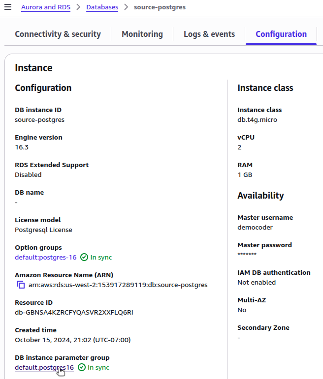
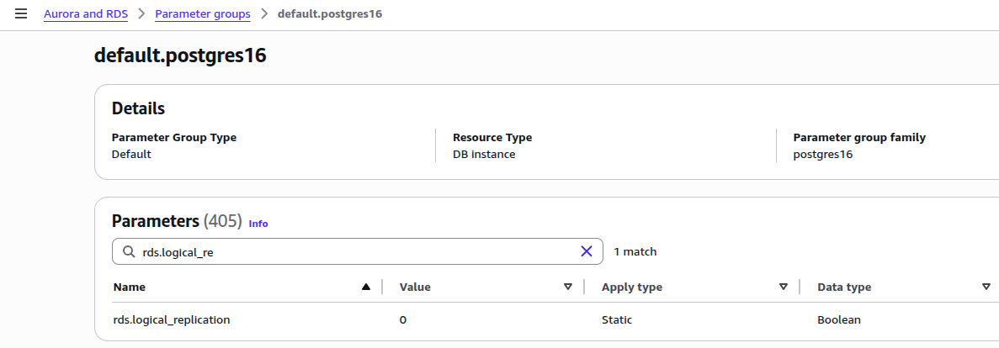
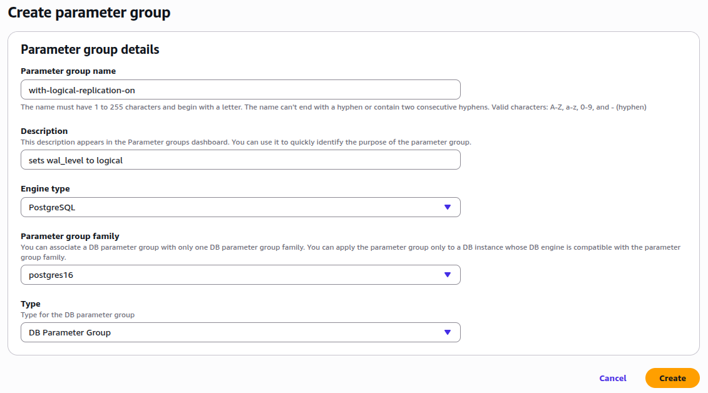
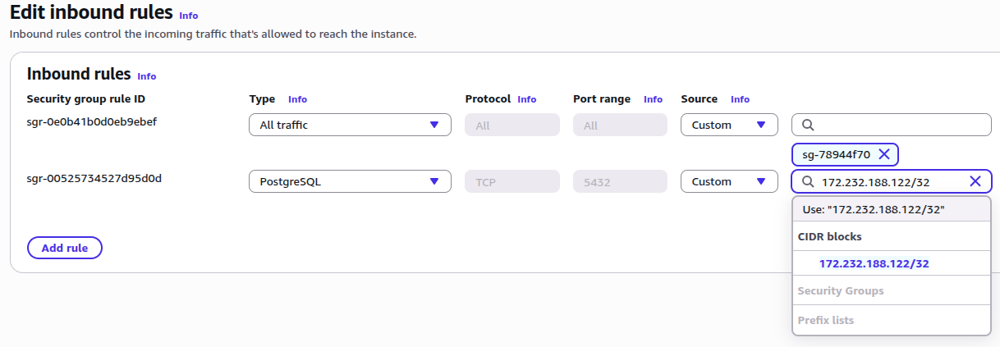

[Logical replication](https://www.postgresql.org/docs/current/logical-replication.html) continuously synchronizes database tables, allowing you to prepare the destination database in advance. This approach minimizes downtime when you switch application traffic and retire the source database.

This guide explains how to prepare an AWS RDS PostgreSQL database for logical replication to a [Linode Managed Database](https://www.linode.com/products/databases/). Follow this guide before returning to the [Logical Replication to a Linode Managed PostgreSQL Database](/docs/guides/logical-replication-to-a-linode-managed-postgresql-database/) guide to [create the subscription](https://www.postgresql.org/docs/current/sql-createsubscription.html) on Akamai Cloud.

Follow the steps in this guide to:

-   Configure your RDS instance to support logical replication.
-   Ensure secure network access from Linode.
-   Create a dedicated replication user.
-   Set up a publication for the tables you wish to replicate.

After completing these steps, return to [Logical Replication to a Linode Managed PostgreSQL Database](/docs/guides/logical-replication-to-a-linode-managed-postgresql-database/) to configure the subscriber and finalize the setup.

## Before You Begin

1.  Follow the [Logical Replication to a Linode Managed PostgreSQL Database](/docs/guides/logical-replication-to-a-linode-managed-postgresql-database/) guide up to the **Prepare the Source Database for Logical Replication** section to obtain the public IP address or CIDR range of your Linode Managed Database.

1.  Ensure that you have administrative access to your AWS account, including permissions to modify RDS instance settings and security groups.

1.  Install the AWS CLI on your local machine and configure it with a user or role that has the necessary privileges listed above.

### Placeholders and Examples

The following placeholders and example values are used in commands throughout this guide:

| Parameter | Placeholder | Example Value |
|------------|--------------|----------------|
| AWS RDS Instance ID |  | `source-postgres` |
| AWS Region |  | `us-west-2` |
| AWS Security Group ID |  | `sg-78944f70` |
| Destination IP Address |  | `172.232.188.122` |
| Source Hostname (RDS Endpoint) |  | `source-postgres.abc123.us-west-2.rds.amazonaws.com` |
| Source Port |  | `5432` |
| Source Username |  | `democoder` |
| Source Database |  | `postgres` |
| Source Password |  | `thisismysourcepassword` |
| Replication Username |  | `linode_replicator` |
| Replication Password |  | `thisismyreplicatorpassword` |
| Publication Name |  | `my_publication` |

Replace these placeholders with your own connection details when running commands in your environment.

Additionally, the examples used in this guide assume the source database contains three tables (`customers`, `products`, and `orders`) that you want to replicate to a Linode Managed Database.

## Configure RDS Parameter Group

To support logical replication, you must configure your RDS instance with the correct parameter settings. Review your RDS instance’s current parameter group settings to determine if changes are required:



1.  In the AWS Management Console, navigate to **RDS > Databases** and select your instance.

1.  Open the **Configuration** tab and select the associated **DB instance parameter group** (not to be confused with the **option group**):

    

1.  Filter the list of parameters to find the values for `rds.logical_replication`, `max_replication_slots`, and `max_wal_senders`:

    



1.  Run the following `aws` CLI command to obtain the name of the parameter group, replacing  (e.g., `source-postgres`) and  (e.g., `us-west-2`) with your own values:

    ```command
    aws rds describe-db-instances \
      --db-instance-identifier  \
      --region  \
      --query "DBInstances[0].DBParameterGroups[*].DBParameterGroupName"
    ```

    ```output
    [
      "default.postgres16"
    ]
    ```

1.  Use the `describe-db-parameters` subcommand to obtain the parameter values for a given parameter group (e.g., `default.postgres16`):

    ```command
    aws rds describe-db-parameters \
      --region  \
      --db-parameter-group-name default.postgres16 \
      --query "Parameters[?ParameterName=='rds.logical_replication' || ParameterName=='max_replication_slots' || ParameterName=='max_wal_senders'].[ParameterName, ParameterValue, ApplyType, Description]"
    ```

    ```output
    [
      [
        "max_replication_slots",
        "20",
        "static",
        "Sets the maximum number of replication slots that the server can support."
      ],
      [
        "max_wal_senders",
        "35",
        "static",
        "Sets the maximum number of simultaneously running WAL sender processes."
      ],
      [
        "rds.logical_replication",
        "0",
        "static",
        "Enables logical decoding."
      ]
    ]
    ```



In order for logical replication to succeed, these values should be as follows:

-   `max_replication_slots`: Greater than or equal to `1`
-   `max_wal_senders`: Greater than or equal to `max_replication_slots`, depending on expected replication concurrency
-   `rds.logical_replication`: `1` (which sets the PostgreSQL setting of `wal_level` to `logical`)

If these values are already set correctly, skip the remainder of this section and continue with **Configure Network Access**. Otherwise, you need to modify the parameter group using the instructions below.

### Create a Custom Parameter Group

The default parameter group cannot be modified. If your RDS instance is using the default parameter group, you must create a custom parameter group to make the necessary modifications.



1.  Navigate to **Parameter groups** and select **Create parameter group** to create a new custom parameter group.

1.  Adjust the following fields to create a parameter group that begins with values that match the default parameter group:

    -   **Parameter group name**: Specify a name (e.g., `with-logical-replication-on`).
    -   **Description**: Provide a description (e.g., `sets wal_level to logical`).
    -   **Engine type**: Choose **PostgreSQL**.
    -   **Parameter group family**: Choose based on the PostgreSQL version used by your RDS instance (e.g., **postgres16**).

1.  When done, click **Create**:

    

1.  On the details page for the newly created parameter group, click **Edit**.

1.  Search for each of the three parameters that may need modification and set their values as required:

    -   `max_replication_slots`: Greater than or equal to `1`
    -   `max_wal_senders`: Greater than or equal to `max_replication_slots`, depending on expected replication concurrency
    -   `rds.logical_replication`: `1` (which sets the PostgreSQL setting of `wal_level` to `logical`)

1.  When done, click **Save Changes**:

    

1.  Navigate to **Databases**, select your instance, and choose **Modify**.

1.  Under **Additional configuration**, set the **DB parameter group** to your newly created parameter group:

    

1.  Click **Continue**, select **Apply immediately** for the modification schedule, then click **Modify DB instance**.

1.  Reboot the RDS instance to apply the changes.


1.  Create a new parameter group based on the `postgres16` parameter group family:

    ```command
    aws rds create-db-parameter-group \
      --region  \
      --db-parameter-group-name with-logical-replication-on \
      --db-parameter-group-family postgres16 \
      --description "sets wal_level to logical"
    ```

    This creates a parameter group that begins with values that match the default parameter group:

    ```output
    {
      "DBParameterGroup": {
        "DBParameterGroupName": "with-logical-replication-on",
        "DBParameterGroupFamily": "postgres16",
        "Description": "sets wal_level to logical",
        ...
      }
    }
    ```

1.  Modify parameter values for a custom parameter group as follows:

    ```command
    aws rds modify-db-parameter-group \
      --region  \
      --db-parameter-group-name with-logical-replication-on \
      --parameters \
    "ParameterName=rds.logical_replication,ParameterValue=1,ApplyMethod=pending-reboot" \
    "ParameterName=max_replication_slots,ParameterValue=10,ApplyMethod=pending-reboot" \
    "ParameterName=max_wal_senders,ParameterValue=10,ApplyMethod=pending-reboot"
    ```

1.  Associate your RDS instance with the parameter group:

    ```command
    aws rds modify-db-instance \
      --region  \
      --db-instance-identifier  \
      --db-parameter-group-name with-logical-replication-on \
      --apply-immediately
    ```

1.  Reboot the RDS instance to apply the changes:

    ```command
    aws rds reboot-db-instance \
      --region  \
      --db-instance-identifier 
    ```



## Configure Network Access

Ensure that the RDS instance allows network access from the Linode Managed Database.



1.  Under **Connectivity & security** for your database instance, find and click on the security group associated with the instance.

1.  Examine the inbound rules for the security group. If an existing rule allows access from `0.0.0.0/0`, your Linode Managed Database should already have access. Otherwise, you must create one.

1.  Click **Edit inbound rules**, then click **Add rule**.

1.  Set the rule type to "PostgreSQL" (TCP protocol to port `5432`). For source, add the CIDR block of your Linode Managed Database.

    

1.  Click **Save rules**.


1.  Retrieve the name of the security group for your RDS instance:

    ```command
    aws rds describe-db-instances \
      --db-instance-identifier  \
      --region  \
      --query "DBInstances[0].{SecurityGroups:VpcSecurityGroups[*].VpcSecurityGroupId}"
    ```

    This value is used as  in the following command:

    ```output
    {
        "SecurityGroups": [
            "sg-78944f70"
        ]
    }
    ```

1.  Retrieve inbound rules for a security group:

    ```command
    aws ec2 describe-security-groups \
      --group-ids  \
      --region  \
      --query "SecurityGroups[0].IpPermissions"
    ```

    Examine the inbound rules for the security group:

    ```output
    [
      {
        "FromPort": 5432,
        "IpProtocol": "tcp",
        "IpRanges": [
          {
            "CidrIp": "..."
          },
          {
            "CidrIp": "..."
          }
        ],
        "Ipv6Ranges": [],
        "PrefixListIds": [],
        "ToPort": 5432,
        "UserIdGroupPairs": []
      },
      ...
    ]
    ```

    If an existing rule allows access from `0.0.0.0/0`, your Linode Managed Database should already have access. Otherwise, you must create one.

1.  Add a firewall rule allowing access from your Linode Managed Database. Replace  with the IP address from [Logical Replication to a Linode Managed PostgreSQL Database](/docs/guides/logical-replication-to-a-linode-managed-postgresql-database/) (e.g., `172.232.188.122`):

    ```command
    aws ec2 authorize-security-group-ingress \
      --group-id  \
      --region  \
      --protocol tcp \
      --port 5432 \
      --cidr /32
    ```



With network access configured, your Linode Managed Database can reach the RDS instance during the subscription creation step in [Logical Replication to a Linode Managed PostgreSQL Database](/docs/guides/logical-replication-to-a-linode-managed-postgresql-database/).

## Create a Replication User

While logical replication can technically be performed using the primary database user, it's best practice to create a dedicated replication user. This user should have the `rds_replication` privilege and `SELECT` access only to the tables being published.

Follow the steps below to create this limited-privileges user on your RDS instance.

1.  Before connecting to your source database, determine the RDS endpoint hostname:

    ```command
    aws rds describe-db-instances \
      --region  \
      --db-instance-identifier  \
      --query "DBInstances[0].Endpoint.Address" \
      --output text
    ```

    This value is used as  in the following command:

    ```output
    source-postgres.abc123.us-west-2.rds.amazonaws.com
    ```

1.  Connect to your source PostgreSQL instance using the `psql` client. Replace  (e.g., `source-postgres.abc123.us-west-2.rds.amazonaws.com`),  (e.g., `5432`),  (e.g., `democoder`), and  (e.g., `postgres`) with your own values. You can find the endpoint on the **Connectivity & security** tab of your RDS instance. The default database name for RDS PostgreSQL instances is `postgres`.

    ```command
    psql \
      -h  \
      -p  \
      -U  \
      -d 
    ```

    When prompted, enter your  (e.g., `thisismysourcepassword`).

1.  Run the following commands from the source `psql` prompt. Replace  (e.g., `linode_replicator`) and  (e.g., `thisismyreplicatorpassword`) with your own values. For simplicity, this example assumes a public schema and three sample tables (customers, products, and orders). Replace the table names with your actual schema as needed.

    ```command {title="Source psql Prompt"}
    CREATE ROLE  LOGIN PASSWORD '';
    GRANT rds_replication TO ;
    GRANT SELECT ON customers, products, orders TO ;
    ```

    ```output
    CREATE ROLE
    GRANT ROLE
    GRANT
    ```

    
    You can also grant privileges on *all* tables with the following command:

    ```command {title="Source psql Prompt"}
    GRANT SELECT ON ALL TABLES IN SCHEMA public TO ;
    ```

    ```output
    GRANT
    ```
    

The newly created user is referenced by the Linode Managed Database when creating the subscription in [Logical Replication to a Linode Managed PostgreSQL Database](/docs/guides/logical-replication-to-a-linode-managed-postgresql-database/).

## Create a Publication

A publication defines which tables and changes (e.g., `INSERT`, `UPDATE`, and `DELETE`) should be streamed to the subscriber. At least one publication is required for logical replication, and the subscriber must have matching tables with compatible schemas for replication to succeed.

1.  While still connected to your source database via the `psql` client, use the following command to create a publication. Replace  (e.g., `my_publication`) and the specific tables you want to replicate (e.g., `customers`, `products`, and `orders`):

    ```command {title="Source psql Prompt"}
    CREATE PUBLICATION  FOR TABLE customers, products, orders;
    ```

    ```output
    CREATE PUBLICATION
    ```

    
    You can also create a publication for *all* tables in the database:

    ```command {title="Source psql Prompt"}
    CREATE PUBLICATION  FOR ALL TABLES;
    ```
    

1.  Run the following command to view all existing publications:

    ```command {title="Source psql Prompt"}
    SELECT * FROM pg_publication_tables;
    ```

    ```output
        pubname     | schemaname | tablename |                       attnames
    ----------------+------------+-----------+-------------------------------------------------------
     my_publication | public     | customers | {customer_id,name,email,created_at}
     my_publication | public     | products  | {product_id,name,price,created_at}
     my_publication | public     | orders    | {order_id,customer_id,product_id,quantity,created_at}
    (3 rows)
    ```

1.  Type `\q` and press <kbd>Enter</kbd> to exit the source `psql` shell.

Your RDS source database is now ready for logical replication. Return to [Logical Replication to a Linode Managed PostgreSQL Database](/docs/guides/logical-replication-to-a-linode-managed-postgresql-database/) to configure the Linode Managed Database and create the subscription.