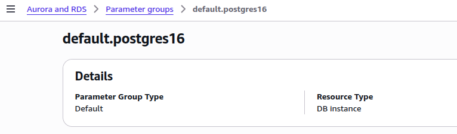
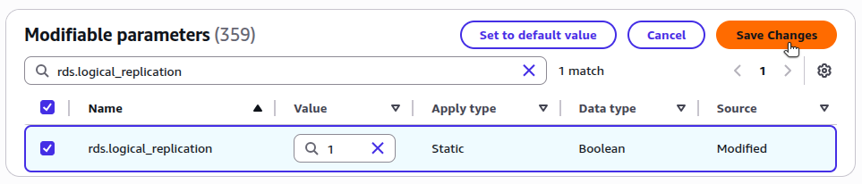
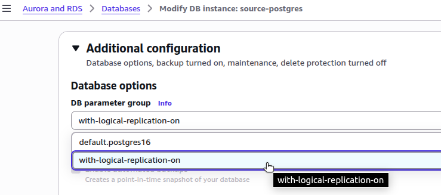

This guide explains how to prepare an AWS RDS PostgreSQL database for logical replication to a Linode Managed Database. If you're following the "Logical Replication to a Linode Managed PostgreSQL Database" guide, use this document to complete the AWS-side preparation before returning to create the subscription on Linode.

Following the steps in this guide will help you to:

1.  Configure your RDS instance to support logical replication.
1.  Ensure secure network access from Linode.
1.  Create a dedicated replication user.
1.  Set up a publication for the tables you wish to replicate.

After completing these steps, return to the main replication guide to configure the subscriber and finalize the setup.

## Prerequisites

You will need administrative access to your AWS account, including permissions to modify RDS instance settings and security groups. You’ll also need the AWS CLI installed and configured—with a user or role that has the necessary privileges.

In addition, you should have the IP address or CIDR range for the host machine of your Linode Managed Database so you can configure inbound access on the RDS instance.

## Modify the RDS Parameter Group

To support logical replication, you must configure your RDS instance with the correct parameter settings. Follow these steps:

### Step 1: Locate Your RDS Instance’s Parameter Group

In the AWS Management Console, go to **RDS > Databases**. Select your instance and look under the **Configuration** tab to find the associated DB instance parameter group (not to be confused with the "option group"). Click on the parameter group.


When using the `aws` CLI, obtain the name of the parameter group with the following command:

```command {title="Retrieve name of parameter group for RDS instance"}
aws rds describe-db-instances \
  --db-instance-identifier  \
  --region  \
  --query "DBInstances[0].DBParameterGroups[*].DBParameterGroupName"
```

```output
[
  "default.postgres16"
]
```

### Step 2: Review Current Parameter Settings

In the list of parameters, filter the parameters to find the values for `rds.logical_replication`, `max_replication_slots`, and `max_wal_senders`. For example:


The values should be:

-   `rds.logical_replication`: 1 (which will subsequently set the PostgreSQL setting of `wal_level` to `logical`).
-   `max_replication_slots`: Greater than or equal to 1
-   `max_wal_senders`: Greater than or equal to `max_replication_slots`, depending on expected replication concurrency

To determine the parameter values for a given parameter group, use the `describe-db-parameters` subcommand. For example:

```command {title="Obtain parameter values for a given parameter group"}
aws rds describe-db-parameters \
  --region  \
  --db-parameter-group-name  \
  --query "Parameters[?ParameterName=='rds.logical_replication' || ParameterName=='max_replication_slots' || ParameterName=='max_wal_senders'].[ParameterName, ParameterValue, ApplyType, Description]"
```

```output
[
  [
    "max_replication_slots",
    "20",
    "static",
    "Sets the maximum number of replication slots that the server can support."
  ],
  [
    "max_wal_senders",
    "35",
    "static",
    "Sets the maximum number of simultaneously running WAL sender processes."
  ],
  [
    "rds.logical_replication",
    "0",
    "static",
    "Enables logical decoding."
  ]
]
```

If these are already set correctly, you can skip ahead in this guide. Otherwise, you will need to modify the parameter group.

### Step 3: Determine If the Parameter Group Is Modifiable

Your RDS instance may be using the default parameter group. You can determine this under the **Details** for this parameter group to see if it is "Default" or "Custom".



The default parameter groups cannot be modified. If your RDS instance is using the default parameter group, you will need to create a custom parameter group to make the necessary modifications.

Create a new custom parameter group by navigating to **Parameter groups**. Click **Create parameter group**. Specify a name and description for the parameter group. Choose "PostgreSQL" for the engine type, then choose the appropriate parameter group family based on the version of PostgreSQL used by your RDS instance. Click **Create**.


This creates a parameter group that begins with values that match the default parameter group.

You can also create the parameter group with the CLI. For example:

```command {title="Create a new parameter group based on the postgres16 parameter group family"}
aws rds create-db-parameter-group \
  --region  \
  --db-parameter-group-name with-logical-replication-on \
  --db-parameter-group-family postgres16 \
  --description "sets wal_level to logical"
```

```output
{
  "DBParameterGroup": {
    "DBParameterGroupName": "with-logical-replication-on",
    "DBParameterGroupFamily": "postgres16",
    "Description": "sets wal_level to logical",
    ...
  }
}
```

On the details page for the newly created parameter group, click **Edit**. Find each of the three parameters that may need modification. Set the values as required. Click **Save Changes**.



With the CLI, you can set parameter values as follows:

```command {title="Modify parameter values for a custom parameter group"}
aws rds modify-db-parameter-group \
  --region  \
  --db-parameter-group-name with-logical-replication-on \
  --parameters \
"ParameterName=rds.logical_replication,ParameterValue=1,ApplyMethod=pending-reboot" \
"ParameterName=max_replication_slots,ParameterValue=10,ApplyMethod=pending-reboot" \
"ParameterName=max_wal_senders,ParameterValue=10,ApplyMethod=pending-reboot"
```

### Step 4: Associate the Parameter Group with Your RDS Instance

Navigate to **Databases**, select your instance, and choose **Modify**. Under **Additional configuration**, set the DB parameter group to your modified (or newly created) parameter group.



Click **Continue**. For the modification schedule, select **Apply immediately**, then click **Modify DB instance**.

With the AWS CLI, run the following command to associate your RDS instance with the parameter group:

```command {title="Modify parameter group for an RDS instance"}
aws rds modify-db-instance \
  --region  \
  --db-instance-identifier  \
  --db-parameter-group-name  \
  --apply-immediately
```

### Step 5: Reboot the RDS Instance

After applying the parameter group, reboot the database to apply the changes. For example

```command {title="Reboot RDS instance"}
aws rds reboot-db-instance \
  --region  \
  --db-instance-identifier 
```

## Configure Network Access

Before the Linode Managed Database can connect to your RDS instance, you must ensure that the RDS instance allows network access from the Linode database host.

Under **Connectivity & security** for your database instance, find and click on the security group associated with the instance.

To get the name of the security group with the AWS CLI, run the following command:

```command {title="Retrieve name of security group for RDS instance"}
aws rds describe-db-instances \
  --db-instance-identifier  \
  --region  \
  --query "DBInstances[0].{SecurityGroups:VpcSecurityGroups[*].VpcSecurityGroupId}"
```

```output
{
    "SecurityGroups": [
        "sg-78944f70"
    ]
}
```

Examine the inbound rules for the security group. With the CLI, use the following command:

```command {title="Retrieve inbound rules for a security group"}
aws ec2 describe-security-groups \
  --group-ids sg-78944f70 \
  --region  \
  --query "SecurityGroups[0].IpPermissions"
```

```output
[
  {
    "FromPort": 5432,
    "IpProtocol": "tcp",
    "IpRanges": [
      {
        "CidrIp": "..."
      },
      {
        "CidrIp": "..."
      }
    ],
    "Ipv6Ranges": [],
    "PrefixListIds": [],
    "ToPort": 5432,
    "UserIdGroupPairs": []
  },
  ...
]
```

If an existing rule already allows access from `0.0.0.0/0`, then your Linode Managed Database likely already has access. However, it’s considered a security best practice to scope access more narrowly when possible.

If no rule exists that would allow access by our Linode Managed Database, click **Edit inbound rules**. Then, click **Add rule**. Set the rule type to "PostgreSQL" (TCP protocol to port `5432`). For source, add the CIDR block of your Linode Managed Database host.


Click **Save rules**.

Using the AWS CLI, you would run the following command to add the inbound rule:

```command {title="Add a CIDR block to allow inbound PostgreSQL traffic"}
aws ec2 authorize-security-group-ingress \
  --group-id sg-78944f70 \
  --region  \
  --protocol tcp \
  --port 5432 \
  --cidr 172.232.188.122/32
```

With network access configured, your Linode Managed Database should be able to reach the RDS instance during the subscription creation step in the main guide.

## Create a Replication User

While logical replication can technically be performed using the master user, it's strongly recommended to create a dedicated user with the `REPLICATION` privilege and appropriate access to the tables being published. Follow these steps to create this limited-privileges user on your RDS instance.

Connect to your RDS PostgreSQL instance using the `psql` client. The default database name for RDS PostgreSQL instances is `postgres`.

```command
psql -h  -p  -U  -d postgres
```

Create a user, then grant it replication privileges. In RDS, this means attaching the `rds_replication` role. Then, grant SELECT privileges for the tables you plan to replicate. For example:

```command {title="Create user and grant privileges"}
CREATE ROLE linode_replicator LOGIN PASSWORD 'thisismyreplicatorpassword';
GRANT rds_replication TO linode_replicator;
GRANT SELECT ON customers, products, orders TO linode_replicator;
```

```output
CREATE ROLE
GRANT ROLE
GRANT
```

Replace the table names with your actual schema as needed. For simplicity, this example assumes a public schema and three tables typically found in an ecommerce database. Alternatively, you can grant privileges on all tables with the following command:

```command {title="Grant select privileges on all tables"}
GRANT SELECT ON ALL TABLES in SCHEMA public to linode_replicator;
```

The newly created user (for example: `linode_replicator`) will be referenced by the Linode Managed Database when creating the subscription.

## Create a Publication

A publication defines which tables and changes (inserts, updates, deletes) should be streamed to the subscriber. You'll need at least one publication for logical replication.

While still connected via the `psql` client, create a publication for specific tables. For example:

```command {title="PostgreSQL command to create a publication for specific tables"}
CREATE PUBLICATION my_publication FOR TABLE customers, products, orders;
```

Alternatively, you can create a publication for all current and future tables in the database:

```command {title="PostgreSQL command to create a publication for all tables"}
CREATE PUBLICATION my_publication FOR ALL TABLES;
```

The subscriber must have matching tables with compatible schemas for replication to succeed.

To view any created publications, run the following command:

```command {title="PostgreSQL command to see existing publications"}
SELECT * FROM pg_publication_tables;
```

```output
-[ RECORD 1 ]-----------------------------------------------
pubname    | my_publication
schemaname | public
tablename  | customers
attnames   | {id,name,email,created_at}
rowfilter  |
-[ RECORD 2 ]-----------------------------------------------
pubname    | my_publication
schemaname | public
tablename  | products
attnames   | {id,name,price,in_stock}
rowfilter  |
-[ RECORD 3 ]-----------------------------------------------
pubname    | my_publication
schemaname | public
tablename  | orders
attnames   | {id,customer_id,product_id,quantity,order_date}
rowfilter  |
```

Your source database is now ready for logical replication. Return to the main guide to configure the Linode Managed Database and create the subscription.

## Additional Resources

The resources below are provided to help you become familiar with logical replication with a PostgreSQL database when working with AWS RDS.

-   AWS:
  -   [Setting up PostgreSQL logical replication](https://docs.aws.amazon.com/AmazonRDS/latest/UserGuide/USER_MultiAZDBCluster_LogicalRepl.html#multi-az-db-clusters-logical-replication)
  -   [Parameter groups for Amazon RDS](https://docs.aws.amazon.com/AmazonRDS/latest/UserGuide/USER_WorkingWithParamGroups.html)
  -   [CLI documentation for AWS RDS](https://docs.aws.amazon.com/cli/latest/reference/rds/)
-   PostgreSQL:
  -   [Logical replication](https://www.postgresql.org/docs/current/logical-replication.html)
  -   [CREATE SUBSCRIPTION](https://www.postgresql.org/docs/current/sql-createsubscription.html)