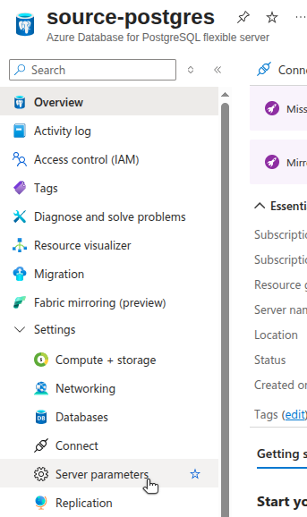
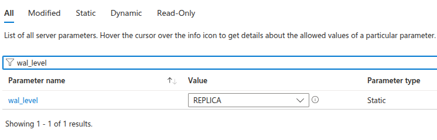
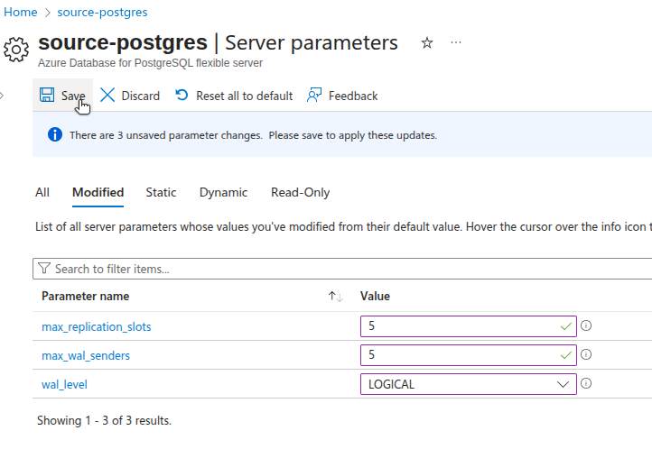
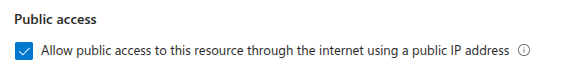
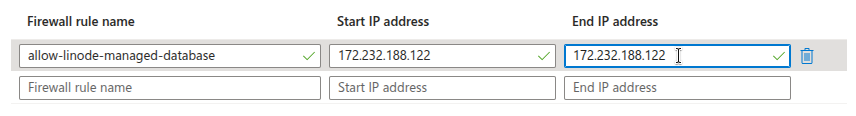

[Logical replication](https://www.postgresql.org/docs/current/logical-replication.html) continuously synchronizes database tables, allowing you to prepare the destination database in advance. This approach minimizes downtime when you switch application traffic and retire the source database.

This guide explains how to prepare an Azure Database for PostgreSQL for logical replication to a [Linode Managed Database](https://www.linode.com/products/databases/). Follow this guide before returning to the [Logical Replication to a Linode Managed PostgreSQL Database](/docs/guides/logical-replication-to-a-linode-managed-postgresql-database/) guide to [create the subscription](https://www.postgresql.org/docs/current/sql-createsubscription.html) on Akamai Cloud.

The steps presented in this guide cover:

-   Configuring your Azure Database instance to support logical replication.
-   Ensuring secure network access from Linode.
-   Creating a dedicated replication user.
-   Setting up a publication for the tables you wish to replicate.

After completing these steps, return to the main replication guide to configure the subscriber and finalize the setup.

## Before You Begin

1.  Follow the [Logical Replication to a Linode Managed PostgreSQL Database](/docs/guides/logical-replication-to-a-linode-managed-postgresql-database/) guide up to the **Prepare the Source Database for Logical Replication** section to obtain the public IP address or CIDR range of your Linode Managed Database host.

1.  Ensure your Azure account has permissions to modify PostgreSQL server parameters, networking settings, and firewall rules.

1.  Install and authenticate the [Azure CLI](https://learn.microsoft.com/en-us/cli/azure/install-azure-cli) on your local machine:

    ```command
    az login
    az account set --subscription 
    ```


Ensure you have an *Azure Database for PostgreSQL – Flexible Server* instance. Logical replication requires Flexible Server, as Single Server was retired in March 2025.


### Placeholders and Examples

The following placeholders and example values are used in commands throughout this guide:

| Parameter | Placeholder | Example Value |
|------------|--------------|----------------|
| Azure Server Name |  | `source-database` |
| Azure Resource Group |  | `pg-repl-rg` |
| Source Hostname or IP Address |  | `source-database.postgres.database.azure.com` |
| Source Port Number |  | `5432` |
| Source Database Name |  | `postgres` |
| Source Username |  | `azureadmin` |
| Source Password |  | `thisismysourcepassword` |
| Replication Username |  | `linode_replicator` |
| Replication Password |  | `thisismyreplicatorpassword` |
| Publication Name |  | `my_publication` |

Replace these placeholders with your own connection details when running commands in your environment.

Additionally, the examples used in this guide assume the source database contains three tables (`customers`, `products`, and `orders`) that you want to replicate to a Linode Managed Database.

## Configure Server Parameters

To support logical replication, you’ll need to adjust a few parameters on your Azure Database for PostgreSQL instance.



1.  In the Azure Portal, locate your database resource, then navigate to **Settings > Server parameters**:

    

1.  In the list of server parameters, use the search filter to find the values for `wal_level`, `max_replication_slots`, and `max_wal_senders`:

    

    The values should be:

    -   `wal_level`: `LOGICAL`
    -   `max_replication_slots`: Greater than or equal to 1
    -   `max_wal_senders`: Greater than or equal to `max_replication_slots`, depending on expected replication concurrency

1.  Adjust the values as needed, then click **Save**:

    

1.  When Azure notifies you that you need to restart the server for changes to take effect, click **Save and Restart**.



1.  Run the following `az` CLI command to list the relevant server parameters for the instance:

    ```command
    az postgres flexible-server parameter list \
      --server-name  \
      --resource-group  \
      --output json \
      --query "[?name=='wal_level' || name=='max_replication_slots' || name=='max_wal_senders'].{name:name, description:description, dataType:dataType, value:value}"
    ```

    ```output
    [
      {
        "dataType": "Integer",
        "description": "Specifies the maximum number of replication slots that the server can support.",
        "name": "max_replication_slots",
        "value": "10"
      },
      {
        "dataType": "Integer",
        "description": "Sets the maximum number of simultaneously running WAL sender processes.",
        "name": "max_wal_senders",
        "value": "10"
      },
      {
        "dataType": "Enumeration",
        "description": "It determines how much information is written to the WAL.",
        "name": "wal_level",
        "value": "REPLICA"
      }
    ]
    ```

    The values should be:

    -   `wal_level`: `LOGICAL`
    -   `max_replication_slots`: Greater than or equal to 1
    -   `max_wal_senders`: Greater than or equal to `max_replication_slots`, depending on expected replication concurrency

    To adjust the values with the Azure CLI, you need to run the `parameter set` command for each parameter.

1.  Use the following command to adjust the value of `wal_level` to `logical`:

    ```command {title="Modify server parameters to support logical replication"}
    az postgres flexible-server parameter set \
      --server-name  \
      --resource-group  \
      --name wal_level \
      --value logical
    ```

1.  Use the following command to adjust the value of `max_replication_slots` to `5`:

    ```command
    az postgres flexible-server parameter set \
      --server-name  \
      --resource-group  \
      --name max_replication_slots \
      --value 5
    ```

1.  Use the following command to adjust the value of `max_wal_senders` to `5`:

    ```command
    az postgres flexible-server parameter set \
      --server-name  \
      --resource-group  \
      --name max_wal_senders \
      --value 5
    ```

1.  After modifying these parameters, restart the database instance:

    ```command
    az postgres flexible-server restart \
      --name  \
      --resource-group 
    ```



## Configure Network Access

Before the Linode Managed Database can connect to your Azure Database instance, ensure that the instance allows network access from the Linode database host.

1.  Navigate to the **Settings > Networking** page for the instance. Make sure that the **Public access** option is checked.

    

1.  In the list of firewall rules, add a rule to allow access to your Linode Managed Database. Specify a name for the firewall rule. Enter the IP address of your Linode Managed Database host as both the **Start IP address** and the **End IP address**:

    

1.  Click **Save** at the top of the page.

With network access configured, your Linode Managed Database can reach the Azure Database instance during the subscription creation step in the main guide.

## Create a Replication User

The source database should have a dedicated replication user with the `REPLICATION` attribute and `SELECT` privileges to the tables to be replicated. While logical replication can be performed as administrator, it's a security best practice to create a dedicated user.

Follow the steps below to create this scope-limited user on your Azure Database instance.

1.  Connect to your instance using the `psql` client and the connection string information found on the **Settings > Connect** page, replacing any placeholders with your own values:

    ```command
    psql "host=.postgres.database.azure.com \
          port=5432 \
          dbname= \
          user= \
          password= \
          sslmode=require"
    ```

1.  After connecting successfully, create a user with replication privileges (e.g., `linode_replicator`), provide a password (e.g., `thisismyreplicatorpassword`), then grant SELECT privileges for the tables you plan to replicate. For simplicity, this example assumes a public schema and three tables typically found in an ecommerce database (e.g., `customers`, `products`, and `orders`). Replace the table names with your actual schema as needed:

    ```command {title="Source psql Prompt"}
    CREATE ROLE linode_replicator
           WITH REPLICATION
           LOGIN PASSWORD 'thisismyreplicatorpassword';
    GRANT SELECT ON customers, products, orders TO linode_replicator;
    ```

    ```output
    CREATE ROLE
    GRANT
    ```

    
    Alternatively, you can grant privileges on all tables with the following command:

    ```command {title="Source psql Prompt"}
    GRANT SELECT ON ALL TABLES in SCHEMA public to linode_replicator;
    ```
    

The newly created user is referenced by the Linode Managed Database when creating the subscription.

## Create a Publication

A publication defines which tables and changes (inserts, updates, deletes) should be streamed to the subscriber. You need at least one publication for logical replication.

1.  While still connected via the `psql` client, create a publication (e.g., `my_publication`) for specific tables (e.g., `customers` , `products`, and `orders`):

    ```command {title="Source psql Prompt"}
    CREATE PUBLICATION  FOR TABLE customers, products, orders;
    ```

    
    The subscriber must have matching tables with compatible schemas for replication to succeed. Alternatively, you can create a publication for all current and future tables in the database:

    ```command {title="Source psql Prompt"}
    CREATE PUBLICATION  FOR ALL TABLES;
    ```
    


1.  Run the following command to view any created publications:

    ```command {title="Source psql Prompt"}
    SELECT * FROM pg_publication_tables;
    ```

    ```output
    -[ RECORD 1 ]-----------------------------------------------
    pubname    | my_publication
    schemaname | public
    tablename  | customers
    attnames   | {id,name,email,created_at}
    rowfilter  |
    -[ RECORD 2 ]-----------------------------------------------
    pubname    | my_publication
    schemaname | public
    tablename  | products
    attnames   | {id,name,price,in_stock}
    rowfilter  |
    -[ RECORD 3 ]-----------------------------------------------
    pubname    | my_publication
    schemaname | public
    tablename  | orders
    attnames   | {id,customer_id,product_id,quantity,order_date}
    rowfilter  |
    ```

Your Azure source database is now ready for logical replication. Return to the main guide to configure the Linode Managed Database and create the subscription.