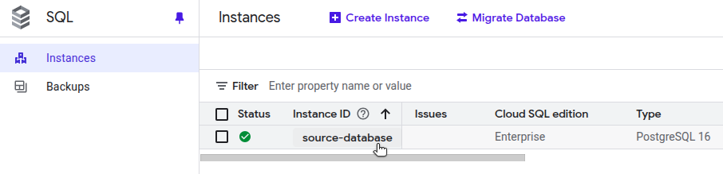
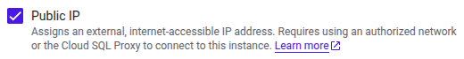

[Logical replication](https://www.postgresql.org/docs/current/logical-replication.html) continuously synchronizes database tables, allowing you to prepare the destination database in advance. This approach minimizes downtime when you switch application traffic and retire the source database.

This guide explains how to prepare a Google Cloud SQL for PostgreSQL for logical replication to a [Linode Managed Database](https://www.linode.com/products/databases/). Follow this guide before returning to the [Logical Replication to a Linode Managed PostgreSQL Database](/docs/guides/logical-replication-to-a-linode-managed-postgresql-database/) guide to [create the subscription](https://www.postgresql.org/docs/current/sql-createsubscription.html) on Akamai Cloud.

Follow the steps in this guide to:

-   Configure your Cloud SQL instance to support logical replication.
-   Ensure secure network access from Linode.
-   Create a dedicated replication user.
-   Set up a publication for the tables you wish to replicate.

After completing these steps, return to [Logical Replication to a Linode Managed PostgreSQL Database](/docs/guides/logical-replication-to-a-linode-managed-postgresql-database/) to configure the subscriber and finalize the setup.

## Before You Begin

1.  Follow the [Logical Replication to a Linode Managed PostgreSQL Database](/docs/guides/logical-replication-to-a-linode-managed-postgresql-database/) guide up to the **Prepare the Source Database for Logical Replication** section to obtain the public IP address or CIDR range of your Linode Managed Database.

1.  Ensure that you have administrative access to your GCP project, including permissions to modify Cloud SQL instance flags and authorized networks.

1.  Install and authenticate the Google Cloud CLI (`gcloud`) on your local machine.

### Placeholders and Examples

The following placeholders and example values are used in commands throughout this guide:

| Parameter | Placeholder | Example Value |
|------------|--------------|----------------|
| GCP Instance Name |  | `source-database` |
| Destination IP Address |  | `172.232.188.122` |
| Source IP Address |  | `35.227.90.130` |
| Source Port |  | `5432` |
| Source Username |  | `postgres` |
| Source Database |  | `postgres` |
| Source Password |  | `thisismysourcepassword` |
| Replication Username |  | `linode_replicator` |
| Replication Password |  | `thisismyreplicatorpassword` |
| Publication Name |  | `my_publication` |

Replace these placeholders with your own connection details when running commands in your environment.

Additionally, the examples used in this guide assume the source database contains three tables (`customers`, `products`, and `orders`) that you want to replicate to a Linode Managed Database.

## Configure Database Flags

Logical replication requires enabling specific PostgreSQL flags on your Cloud SQL for PostgreSQL instance. These flags can be configured using either the Google Cloud Console or the `gcloud` CLI.



1.  In the Google Cloud Console, navigate to **SQL** and select your PostgreSQL instance:

    

1.  On the instance page, click **Edit**.

1.  Locate the **Flags and parameters** section, then click **Add a database flag**.

1.  Add the following flags:

    -   `cloudsql.logical_decoding`: `On` (sets `wal_level` to `logical`)
    -   `max_replication_slots`: `10` or higher
    -   `max_wal_senders`: Greater than or equal to `max_replication_slots`, depending on expected replication concurrency

    

1.  Click **Save** at the bottom of the page.

1.  When prompted, click **Save and restart** to restart and apply the changes:

    



Run the following `gcloud` command to set Cloud SQL instance database flags from the CLI. Replace  with your Cloud SQL instance name (e.g., `source-database`)

```command
gcloud sql instances patch  \
  --database-flags=cloudsql.logical_decoding=on,max_replication_slots=10,max_wal_senders=10
```

```output
The following message will be used for the patch API method.

{
  "name": "source-database",
  "settings": {
    "databaseFlags": [
      {"name": "cloudsql.logical_decoding", "value": "off"},
      {"name": "max_replication_slots", "value": "10"},
      {"name": "max_wal_senders", "value": "10"}
    ]
  }
}

WARNING: This patch modifies database flag values, which may require your
instance to be restarted. Check the list of supported flags -
https://cloud.google.com/sql/docs/postgres/flags - to see if your
instance will be restarted when this patch is submitted.

Do you want to continue (Y/n)?
```

Confirm the request to restart the instance.



## Configure Network Access

Ensure that your Cloud SQL instance allows network access from the Linode Managed Database.



1.  In the Google Cloud Console, open your Cloud SQL instance.

1.  Navigate to the **Connections** page, then select the **Networking** tab.

1.  Ensure that the **Public IP** option is checked:

    

1.  In the list of Authorized networks, add the CIDR range of your Linode Managed Database:

    

1.  Click **Save** at the bottom of the page.


You can also configure authorized networks using the `gcloud` CLI. However, you can only specify a CIDR range (as a comma-separated list) and cannot assign a name for each network.

Add a firewall rule allowing access from your Linode Managed Database. Replace  with the IP address from [Logical Replication to a Linode Managed PostgreSQL Database](/docs/guides/logical-replication-to-a-linode-managed-postgresql-database/) (e.g., `172.232.188.122`):

```command
gcloud sql instances patch  \
  --authorized-networks="/32"
```


The `--authorized-networks` flag *replaces* any existing authorized networks on the instance. If other networks are already configured, you must include them in the comma-separated list, for example:

```command
gcloud sql instances patch  \
  --authorized-networks="172.232.188.122/32,172.232.189.35/32"
```




With network access configured, your Linode Managed Database can reach the Cloud SQL instance during the subscription creation step in [Logical Replication to a Linode Managed PostgreSQL Database](/docs/guides/logical-replication-to-a-linode-managed-postgresql-database/).

## Create a Replication User

While logical replication can technically be performed using the primary database user, it's best practice to create a dedicated replication user. This user should have the `REPLICATION` privilege and `SELECT` access only to the tables being published.

Follow the steps below to create this dedicated user on your Cloud SQL instance.

1.  Connect to your source PostgreSQL instance using the `psql` client. Replace  (e.g., `35.227.90.130`),  (e.g., `5432`),  (e.g., `postgres`), and  (e.g., `postgres`) with your own values. You can find the connection details under **Connections > Summary** in the Cloud SQL console.


    ```command
    psql \
      -h  \
      -p  \
      -U  \
      -d  \
      "sslmode=require"
    ```

    When prompted, enter your  (e.g., `thisismysourcepassword`).

1.  Run the following commands from the source `psql` prompt. Replace  (e.g., `linode_replicator`) and  (e.g., `thisismyreplicatorpassword`) with your own values. For simplicity, this example assumes a public schema and three sample tables (customers, products, and orders). Replace the table names with your actual schema as needed.

    ```command {title="Source psql Prompt"}
    CREATE ROLE 
           WITH REPLICATION
           LOGIN PASSWORD '';
    GRANT SELECT ON customers, products, orders TO ;
    ```

    ```output
    CREATE ROLE
    GRANT
    ```

    
    You can also grant privileges on *all* tables with the following command:

    ```command {title="Source psql Prompt"}
    GRANT SELECT ON ALL TABLES IN SCHEMA public TO ;
    ```

    ```output
    GRANT
    ```
    

The newly created user is referenced by the Linode Managed Database when creating the subscription in [Logical Replication to a Linode Managed PostgreSQL Database](/docs/guides/logical-replication-to-a-linode-managed-postgresql-database/).

## Create a Publication

A publication defines which tables and changes (e.g., `INSERT`, `UPDATE`, and `DELETE`) should be streamed to the subscriber. At least one publication is required for logical replication, and the subscriber must have matching tables with compatible schemas for replication to succeed.

1.  While still connected to your source database via the `psql` client, use the following command to create a publication. Replace  (e.g., `my_publication`) and the specific tables you want to replicate (e.g., `customers`, `products`, and `orders`):

    ```command {title="Source psql Prompt"}
    CREATE PUBLICATION  FOR TABLE customers, products, orders;
    ```

    ```output
    CREATE PUBLICATION
    ```

    
    You can also create a publication for *all* tables in the database:

    ```command {title="Source psql Prompt"}
    CREATE PUBLICATION  FOR ALL TABLES;
    ```
    

1.  Run the following command to view all existing publications:

    ```command {title="Source psql Prompt"}
    SELECT * FROM pg_publication_tables;
    ```

    ```output
    -[ RECORD 1 ]-----------------------------------------------
    pubname    | my_publication
    schemaname | public
    tablename  | customers
    attnames   | {id,name,email,created_at}
    rowfilter  |
    -[ RECORD 2 ]-----------------------------------------------
    pubname    | my_publication
    schemaname | public
    tablename  | products
    attnames   | {id,name,price,in_stock}
    rowfilter  |
    -[ RECORD 3 ]-----------------------------------------------
    pubname    | my_publication
    schemaname | public
    tablename  | orders
    attnames   | {id,customer_id,product_id,quantity,order_date}
    rowfilter  |
    ```

Your Google Cloud source database is now ready for logical replication. Return to [Logical Replication to a Linode Managed PostgreSQL Database](/docs/guides/logical-replication-to-a-linode-managed-postgresql-database/) to configure the Linode Managed Database and create the subscription.