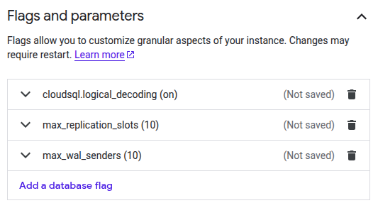
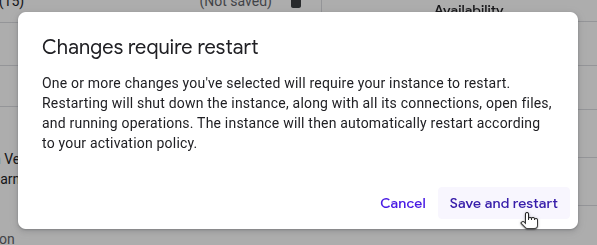
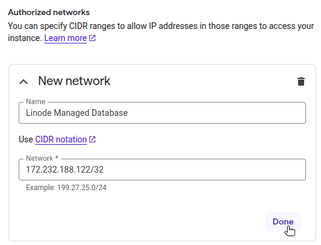

This guide explains how to prepare a PostgreSQL instance hosted on Google Cloud SQL (publisher) for logical replication to a Linode Managed Database (subscriber). If you're following the "Logical Replication to a Linode Managed PostgreSQL Database" guide, use this document to complete the GCP-side preparation before returning to create the subscription on Linode.

Following the steps in this guide will help you to:

1.  Configure your Cloud SQL instance to support logical replication.
1.  Ensure secure network access from Linode.
1.  Create a dedicated replication user.
1.  Set up a publication for the tables you wish to replicate.

After completing these steps, return to the main replication guide to configure the subscriber and finalize the setup.

## Prerequisites

This guide applies to **Cloud SQL for PostgreSQL**, Google's managed PostgreSQL offering.

In order to follow the steps in this guide, you need:

-   Administrative access to your GCP project, including permissions to modify Cloud SQL instance flags and authorized networks.
-   The Google Cloud CLI (`gcloud`) installed and authenticated.
-   The IP address or CIDR range for the Linode Managed Database's host, so you can configure inbound access on the Cloud SQL instance.

## Configure Database Flags

To support logical replication, you’ll need to adjust a few flags on your Cloud SQL PostgreSQL instance. These changes can be made from the Google Cloud Console or with `gcloud`.

Logical replication requires enabling specific PostgreSQL flags on your Cloud SQL for PostgreSQL instance. You can set these from the Google Cloud Console or using the gcloud CLI.



1.  In the Google Cloud Console, navigate to **SQL** and select your PostgreSQL instance.

    

1.  On the instance page, click **Edit**.

1.  Locate the **Flags and parameters** section, then click **Add a database flag**.

1.  Add the following flags:

    -   `cloudsql.logical_decoding`: `On` (sets `wal_level` to `logical`)
    -   `max_replication_slots`: `10` or higher
    -   `max_wal_senders`: Greater than or equal to `max_replication_slots`, depending on expected replication concurrency

    

1.  Click **Save** at the bottom of the page.

1.  When prompted, click **Save and restart** to restart and apply the changes.

    



To set CloudSQL instance database flags from the CLI, run the following command:

```command
gcloud sql instances patch  \
  --database-flags=cloudsql.logical_decoding=on,max_replication_slots=4,max_wal_senders=5
```

```output
The following message will be used for the patch API method.

{
  "name": "source-database",
  "settings": {
    "databaseFlags": [
      {"name": "cloudsql.logical_decoding", "value": "off"},
      {"name": "max_replication_slots", "value": "10"},
      {"name": "max_wal_senders", "value": "10"}
    ]
  }
}

WARNING: This patch modifies database flag values, which may require your
instance to be restarted. Check the list of supported flags -
https://cloud.google.com/sql/docs/postgres/flags - to see if your
instance will be restarted when this patch is submitted.

Do you want to continue (Y/n)?
```

Confirm the request to restart the instance.



## Configure Network Access

Before the Linode Managed Database can connect to your Cloud SQL instance, you must ensure that the instance allows network access from the Linode database host.



1.  In the Google Cloud Console, open your Cloud SQL instance.

1.  Navigate to the **Connections** page, then select the **Networking** tab.

1.  Ensure that the **Public IP** option is checked:

    

1.  In the list of Authorized networks, add the CIDR range of your Linode Managed Database host:

    

1.  Click **Save** at the bottom of the page.


You can also add authorized networks with the `gcloud` CLI, however, you are only able to set the CIDR range values (as a comma-separated list) and cannot specify a name for each network. For example:

```command
gcloud sql instances patch  \
  --authorized-networks="172.232.188.122/32"
```



With network access configured, your Linode Managed Database should be able to reach the Cloud SQL instance during the subscription creation step in the main guide.

## Create a Replication User

While logical replication can technically be performed using the primary database user, it's best practice to create a dedicated replication user. This user should have the `REPLICATION` privilege and `SELECT` access to the tables being published.

Follow the steps below to create this limited-privileges user on your Cloud SQL instance.

1.  Connect to your instance using the `psql` client and the connection details shown under **Connections > Summary** in the Google Cloud Console.

1.  Create a replication user and grant `SELECT` privileges for the tables you plan to replicate. Replace the table names with your actual schema as needed. For simplicity, this example assumes a public schema and three tables typically found in an ecommerce database:

    ```command
    CREATE ROLE linode_replicator
           WITH REPLICATION
           LOGIN PASSWORD 'thisismyreplicatorpassword';
    GRANT SELECT ON customers, products, orders TO linode_replicator;
    ```

    ```output
    CREATE ROLE
    GRANT
    ```

The newly created user (e.g., `linode_replicator`) is referenced by the Linode Managed Database when creating the subscription in the main replication guide.


Alternatively, you can grant privileges on all tables with the following command:

```command
GRANT SELECT ON ALL TABLES in SCHEMA public to linode_replicator;
```


## Create a Publication

A publication defines which tables and changes (e.g., `INSERT`, `UPDATE`, and `DELETE`) should be streamed to the subscriber. At least one publication is required for logical replication.

1.  While still connected to your Cloud SQL instance via `psql`, create a publication for the specific tables you want to replicate. For example:

    ```command
    CREATE PUBLICATION my_publication FOR TABLE customers, products, orders;
    ```

    
    Alternatively, you can create a publication for all current and future tables in the database:

    ```command
    CREATE PUBLICATION my_publication FOR ALL TABLES;
    ```
    

1.  The subscriber database already contains matching tables and compatible schemas. Replication will fail if table definitions differ between the publisher and subscriber.

1.  Run the following command to view all existing publications:

    ```command
    SELECT * FROM pg_publication_tables;
    ```

    ```output
    -[ RECORD 1 ]-----------------------------------------------
    pubname    | my_publication
    schemaname | public
    tablename  | customers
    attnames   | {id,name,email,created_at}
    rowfilter  |
    -[ RECORD 2 ]-----------------------------------------------
    pubname    | my_publication
    schemaname | public
    tablename  | products
    attnames   | {id,name,price,in_stock}
    rowfilter  |
    -[ RECORD 3 ]-----------------------------------------------
    pubname    | my_publication
    schemaname | public
    tablename  | orders
    attnames   | {id,customer_id,product_id,quantity,order_date}
    rowfilter  |
    ```

Your source database is now ready for logical replication. Return to the main guide to configure the Linode Managed Database and create the subscription.

## Additional Resources

The resources below are provided to help you become familiar with logical replication with a PostgreSQL database when working with Google Cloud SQL PostgreSQL.

-   Google Cloud SQL PostgreSQL:
  -   [Setting up PostgreSQL logical replication](https://cloud.google.com/sql/docs/postgres/replication/configure-logical-replication)
  -   [Documentation](https://cloud.google.com/sql/docs/postgres)
  -   [CLI documentation for gcloud sql](https://cloud.google.com/sdk/gcloud/reference/sql)
-   PostgreSQL:
  -   [Logical replication](https://www.postgresql.org/docs/current/logical-replication.html)
  -   [CREATE SUBSCRIPTION](https://www.postgresql.org/docs/current/sql-createsubscription.html)