In modern cloud computing, virtual machine (VM) migration is a process that enables organizations to transition workloads between cloud platforms to optimize costs, improve performance, or enhance flexibility. By migrating VMs, organizations can select the capabilities of various cloud providers that best satisfy their business needs.

This guide focuses on migrating an Azure Virtual Machine to Akamai Cloud using disk images and suggests how to plan, execute, and validate the migration.

## Prerequisites

To follow along in this walkthrough, you’ll need the following:

-   An [account with Akamai Cloud](https://www.linode.com/cfe)
-   A [Linode API token (personal access token)](/docs/products/platform/accounts/guides/manage-api-tokens/)
-   The [Linode CLI](/docs/products/tools/cli/guides/install/) installed and configured
-   An Azure account with sufficient permissions to work with Managed Disks and Storage Accounts.
-   The [Azure CLI](https://learn.microsoft.com/en-us/cli/azure/install-azure-cli) (`az`) installed and configured
-   [QEMU](https://www.qemu.org/) installed and configured

## Before You Begin

1.  If you do not already have a virtual machine to use, create a Compute Instance with at least 4 GB of memory. See our [Getting Started with Linode](/docs/products/platform/get-started/) and [Creating a Compute Instance](/docs/products/compute/compute-instances/guides/create/) guides.

1.  Follow our [Setting Up and Securing a Compute Instance](/docs/products/compute/compute-instances/guides/set-up-and-secure/) guide to update your system. You may also wish to set the timezone, configure your hostname, create a limited user account, and harden SSH access.


This guide is written for a non-root user. Commands that require elevated privileges are prefixed with `sudo`. If you’re not familiar with the `sudo` command, see the [Users and Groups](/docs/guides/linux-users-and-groups/) guide.


## Preparing Your Azure VM for Migration

Prepare your current Azure environment to ensure a smooth and efficient transition. As you assess your Azure VM requirements, familiarize yourself with any limitations that Akamai Cloud imposes on resources imported into its systems.


[Images imported into Akamai Cloud](https://techdocs.akamai.com/cloud-computing/docs/upload-an-image) must be smaller than 6 GB unzipped and 5 GB zipped. Larger images will be rejected and not imported.


### Assess Current Azure VM Requirements

Capture the current configuration of your Compute Engine VM so that you can select the appropriate [Akamai Cloud plan](https://www.linode.com/pricing/#compute-shared) to ensure post-migration performance.

From the **Resource Groups** page in the Azure Portal, identify the Resource Group that contains the VM you wish to migrate. Click the name of the Resource Group.

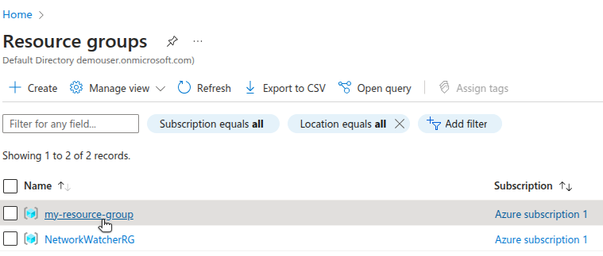

From the list of resources displayed, find your VM and click on it.

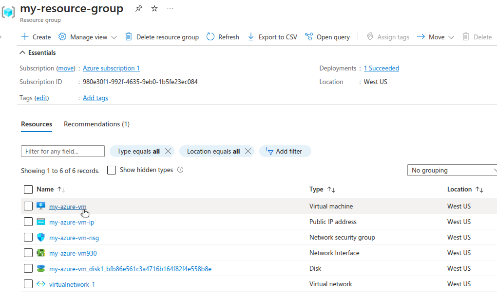

#### VM Size, CPU, and Memory Usage

In the **Essentials** section of your VM details, you’ll see the machine type and basic capabilities for this VM instance. In the following example, the machine type is `Standard B2s`, which has 2 vCPUs and 4 GiB of memory.

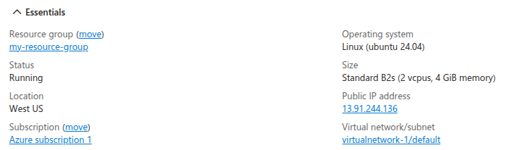

To obtain this information via the Azure CLI, run the following commands:

1.  List all the VMs in a Resource Group using the name of your specific Resource Group.

```command
az vm list --resource-group my-resource-group --output table
```

```output
Name         ResourceGroup      Location    Zones
-----------  -----------------  ----------  -------
my-azure-vm  my-resource-group  westus
```

1.  Get the VM size of your instance using the names of your Resource Group and VM.

```command
az vm show \
    --resource-group my-resource-group \
    --name my-azure-vm \
    --query "hardwareProfile.vmSize"
```

```output
"Standard_B2s"
```

1.  Show the details of a specific VM size configuration, supplying the location of your Resource Group and the VM size.

```command
az vm list-sizes --location westus --query "[?name=='Standard_B2s'\]"
```

```output
[
    {
        "maxDataDiskCount": 4,
        "memoryInMB": 4096,
        "name": "Standard_B2s",
        "numberOfCores": 2,
        "osDiskSizeInMB": 1047552,
        "resourceDiskSizeInMB": 8192
    }
]
```

#### Storage Usage

Return to the list of resources for your Resource Group. Find the disk associated with your VM and click on it.

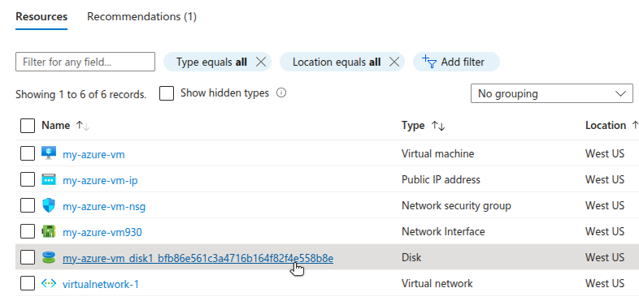

The **Properties** section of the disk details page shows the disk’s size and storage type.

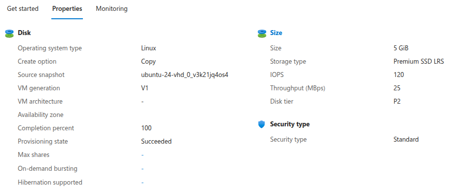

Alternatively, use `az` to retrieve the disk details for your VM:

```command
az vm show \
    --resource-group my-resource-group \
    --name my-azure-vm \
    --query "storageProfile.osDisk"
```

```output
{
    "caching": "ReadWrite",
    "createOption": "FromImage",
    "deleteOption": "Delete",
    "diffDiskSettings": null,
    "diskSizeGb": 5,
    "encryptionSettings": null,
    "image": null,
    "managedDisk": {
        "diskEncryptionSet": null,
        "id": "/subscriptions/980e30f1-992f-4635-9eb0-1b5fe23ec084/resourceGroups/my-resource-group/providers/Microsoft.Compute/disks/my-azure-vm_disk1_bfb86e561c3a4716b164f82f4e558b8e",
        "resourceGroup": "my-resource-group",
        "securityProfile": null,
        "storageAccountType": "Premium_LRS"
    },
    "name": "my-azure-vm_disk1_bfb86e561c3a4716b164f82f4e558b8e",
    "osType": "Linux",
    "vhd": null,
    "writeAcceleratorEnabled": null
}
```

The example Azure disk for this guide has a size of 5 GB.

#### IP Addresses

The external IP address (`13.91.244.136`) for the VM was shown in the **Essentials** section of the VM details page. To retrieve this information via the Azure CLI, run the following commands:

1.  Get the name of the network interface, supplying the names of the Resource Group and VM.

```command
az vm show \
    --resource-group my-resource-group \
    --name my-azure-vm \
    --query "networkProfile.networkInterfaces\[0\].id"
```

```output
"/subscriptions/980e30f1-992f-4635-9eb0-1b5fe23ec084/resourceGroups/my-resource-group/providers/Microsoft.Network/networkInterfaces/my-azure-vm930"
```


In Azure, a resource has an ID and a name. The ID has the form of a full path, such as the following:

```command
/subscriptions/980e30f1-992f-4635-9eb0-1b5fe23ec084/resourceGroups/my-resource-group/providers/Microsoft.Network/networkInterfaces/my-azure-vm930
```

The name of the resource can be inferred through the final part of the path in the ID. For the resource above, the name is `my-azure-vm930`.


1.  Use the resulting network interface name to get the name of the public IP address created by Azure.

```command
az network nic show \
    --name my-azure-vm930 \
    --resource-group my-resource-group \
    --query "ipConfigurations\[0\].publicIPAddress.id"
```

```output
"/subscriptions/980e30f1-992f-4635-9eb0-1b5fe23ec084/resourceGroups/my-resource-group/providers/Microsoft.Network/publicIPAddresses/my-azure-vm-ip"
```

1.  Use the resulting IP address name to retrieve the details for this resource, including the actual IP address.

```command
az network public-ip show \
    --name my-azure-vm-ip \
    --resource-group my-resource-group
    --query "ipAddress"
```

```output
"13.91.244.136"
```

#### Network Security Groups and Firewall Rules

To see network security group information from the Azure Portal, find and click on the network security group resource from the list of resources for your Resource Group.

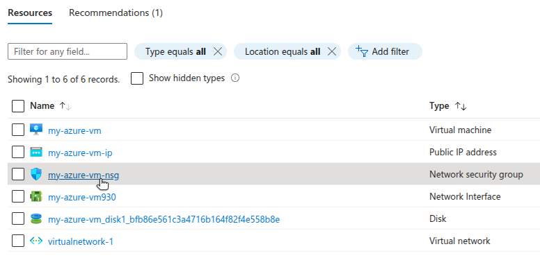

A list of inbound and outbound security rules for the network security group will be displayed.

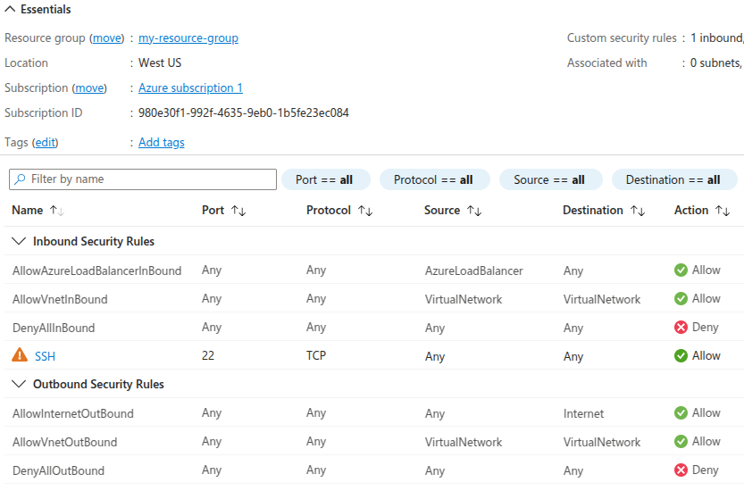

To find all the firewall rules with the Azure CLI, start with the network interface name obtained from your VM information. Then, run the following command to obtain the network security group name:

```command
az network nic show \
    --name my-azure-vm930 \
    --resource-group my-resource-group \
    --query "networkSecurityGroup.id"
```

```output
"/subscriptions/980e30f1-992f-4635-9eb0-1b5fe23ec084/resourceGroups/my-resource-group/providers/Microsoft.Network/networkSecurityGroups/my-azure-vm-nsg"
```

To get a detailed breakdown of the network security group’s configuration, including ingress and egress ports and firewall settings, run the following command:

```command
az network nsg show \
    --name my-azure-vm-nsg \
    --resource-group my-resource-group
```

```output
{
    "defaultSecurityRules": [
        {
            "access": "Allow",
            "description": "Allow inbound traffic from all VMs in VNET",
            ...
            "destinationPortRanges": [],
            "direction": "Inbound",
            ...
            "sourcePortRange": "*",
            "sourcePortRanges": [],
        },
        {
            "access": "Allow",
            "description": "Allow inbound traffic from azure load balancer",
            ...
            "destinationPortRange": "*",
            "destinationPortRanges": [],
            ...
            "sourcePortRange": "*",
            "sourcePortRanges": [],
        },
            ...
        ],
        ...
        "securityRules": [
        {
            "access": "Allow",
            ...
            "destinationPortRange": "22",
            "destinationPortRanges": [],
            "direction": "Inbound",
            ...
            "protocol": "TCP",
            ...
            "sourcePortRange": "*",
            "sourcePortRanges": [],
        }
    ],
    "type": "Microsoft.Network/networkSecurityGroups"
}
```

#### Back up Your Azure VM Disk (Optional)

Before starting your migration, consider backing up the Azure VM disk just in case a restoration is needed in the future. Return to the list of resources for the Resource Group and select the VM disk. On the disk details page, click **Create snapshot** and walk through the configuration options for the snapshot.

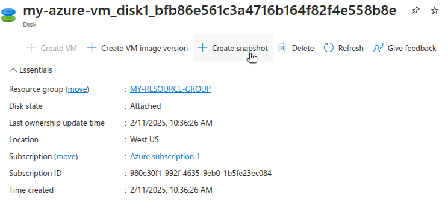

With `az`, the equivalent command for creating a snapshot looks like this:

```command
az snapshot create \
    --resource-group  \
    --name  \
    --source  \
    --location 
```

For example:

```command
az snapshot create \
    --resource-group my-resource-group \
    --name my-disk-snapshot \
    --source my-azure-vm_disk1_bfb86e561c3a4716b164f82f4e558b8e \
    -location westus
```

```output
{
    "creationData": {
        "createOption": "Copy",
        "sourceResourceId": "/subscriptions/980e30f1-992f-4635-9eb0-1b5fe23ec084/resourceGroups/my-resource-group/providers/Microsoft.Compute/disks/my-azure-vm_disk1_bfb86e561c3a4716b164f82f4e558b8e",
        "sourceUniqueId": "bfb86e56-1c3a-4716-b164-f82f4e558b8e"
    },
    "diskSizeBytes": 5368709120,
    "diskSizeGB": 5,
    ...
    "location": "westus",
    "name": "my-disk-snapshot",
    "networkAccessPolicy": "AllowAll",
    "osType": "Linux",
    "provisioningState": "Succeeded",
    ...
}
```

Your newly created snapshot can be found on the **Snapshots** page.

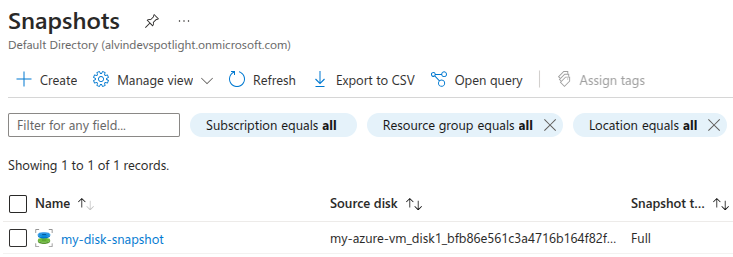

Alternatively, use the Azure CLI to list all snapshots for a resource group:

```command
az snapshot list --resource-group my-resource-group
```

```output
[
    {
        ...
        "diskSizeBytes": 5368709120,
        "diskSizeGB": 5,
        "location": "westus",
        "name": "my-disk-snapshot",
        "provisioningState": "Succeeded",
        "publicNetworkAccess": "Enabled",
        ...
    }
]
```

The [cost of Azure snapshots](https://azure.microsoft.com/en-us/pricing/details/managed-disks/#pricing) varies depending on redundancy options (local or zone).

## Migrating to Akamai Cloud

Using a disk image to migrate an Azure VM to Akamai Cloud involves exporting the VM disk from Azure, and then preparing and importing it when launching a new Linode Compute Instance.

### Export the Azure VM Disk

Before you can export your disk, you must first stop your VM. On the details page for your VM, click **Stop**.

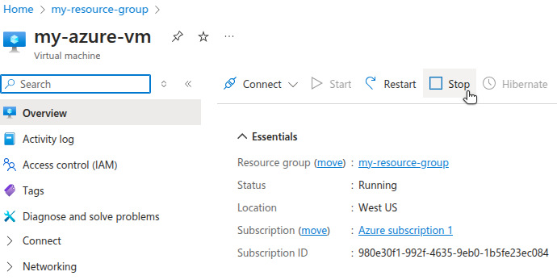

Next, navigate to the details for your Azure VM disk. Under **Settings**, click **Disk Export**.

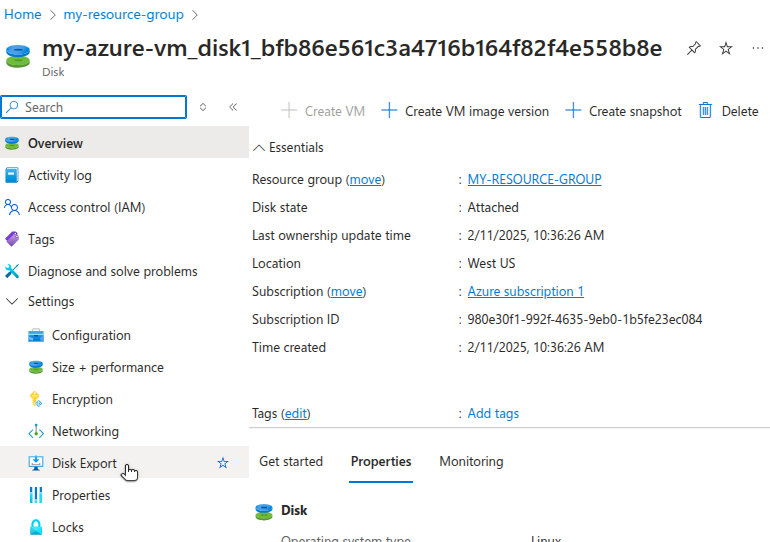

When exporting a disk, Azure provides a temporary link to download the disk directly as a virtual hard disk (VHD) file. Specify an expiration time for the link. Since you will use the link immediately, the expiration window can be small. Click **Generate URL**.

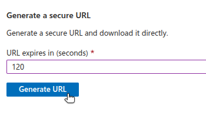

To generate the disk export URL from the command line, run the following command:

```command
az disk grant-access \
    --name my-azure-vm_disk1_bfb86e561c3a4716b164f82f4e558b8e \
    --resource-group my-resource-group \
    --duration-in-seconds 120
```

```output
{
    "accessSAS": "https://md-3rnqkqjjh5nk.z41.blob.storage.azure.net/5zfpv2fgr3wv/abcd?sv=2018-03-28\&sr=b\&si=8f527a7b-e94d-4e44-b6a9-313d2974197b\&sig=u0gKMJ%2BSlWEahBUoMg8%2Bppgi5bU65SotEaYD653YI0I%3D"
}
```

Then, use `wget` on your local machine to download and save the file using the provided URL.

```command
wget -O azure-download.vhd ""
```

An example response to the `wget` call looks like this:

```output
HTTP request sent, awaiting response... 200 OK
Length: 5368709632 (5.0G) [text/x-vhdl]
Saving to: 'azure-download.vhd'

azure-download.vhd
100%\[=====================================\>\]  5.00G  2.91MB/s    in 24m 45s

'azure-download.vhd' saved [5368709632/5368709632]
```

The total download time will depend on the disk size and your internet speeds.

### Import and Deploy VM Image on Akamai Cloud

To provision a Linode Compute Instance by importing an existing VM image, ensure the image is in the proper format and compressed with gzip.

#### Convert Disk Image to Raw Format

Linode does not support importing the VHD format, but instead requires a raw disk image format with a `.img` extension. To convert the VHD file from Azure to the raw format, use [`qemu-img convert`](https://qemu-project.gitlab.io/qemu/tools/qemu-img.html#cmdoption-qemu-img-arg-convert):

```command
qemu-img convert -f vpc -O raw azure-download.vhd azure-image.raw
```

The parameters used for the command are `-f`, which specifies the input format (`vpc` = Microsoft Virtual PC format), and `-O`, which specifies the desired output format (`raw`). This is followed by the name of the input file to convert and the name of the output file to create.

The resulting raw file should be nearly the same size as the original VHD file.

```command
stat -c "%s %n" -- azure-*
```

```output
5368430592 azure-image.raw
5368709632 azure-download.vhd
```

#### Prepare Image File for Import

Linode requires an image file to have a `.img` extension. The naming convention does not have a functional difference. Nonetheless, if your raw image file does not have this extension, rename the file accordingly.

```command
mv azure-image.raw azure-image.img
```

Compress the image using `gzip` to reduce its size:

```command
gzip azure-image.img
```

```command
du -BM azure-image.img.gz
```

```output
1737M azure-image.img.gz
```

#### Upload the Compressed File to Akamai Cloud

Use the Linode CLI to upload the compressed image file. Replace the .gz file with your specific file name. Specify the label, description, and region based on your use case.

```command
linode-cli image-upload \
    --label "azure-vm-migration" \
    --description "Azure VM Import" \
    --region "us-lax" \
    ./azure-image.img.gz
```

```output
┌-----------------------┬-----------┬----------------┐
│ label                 │ is_public │ status         │
├-----------------------┼-----------┼----------------┤
│ azure-vm-migration    │ False     │ pending_upload │
└-----------------------┴-----------┴----------------┘
```

The upload may take several minutes, depending on your image's size and internet speed.

#### Verify the Successful Image Upload

After the upload, ensure the image is successfully processed and available for use. Run the following command to list your private images:

```command
linode-cli images list --is_public false
```

```output
┌------------------┬-----------------------┬-----------┬--------┐
│ id               │ label                 │ status    │ size   │
├------------------┼-----------------------┼-----------┼--------┤
│ private/30228641 │ azure-vm-migration    │ available │ 5120   │
└------------------┴-----------------------┴-----------┴--------┘
```

Verify that the `status` of the image is `available`. If the `status` is `pending`, wait a few minutes and then check again.

You can also watch the progress of the image upload via the Linode Images dashboard:

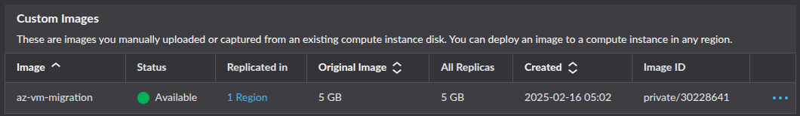

#### Launch a Linode Compute Instance from the Uploaded Image

Once the image is available, you can deploy it to a new Linode Compute instance. For this command, provide the ID of your uploaded image, which was displayed when running the previous command. In addition, provide the following:

-   `--label`: A unique label for your instance.
-   `--region`: The region for your instance.
-   `--type`: The size of the instance to deploy.
-   `--root_pass`: A unique, secure root password for your new instance.

The following example deploys a `g6-standard-2` Linode with 2 cores, 80 GB disk, and 4 GB RAM with a 4000 Mbps transfer rate. Recall that the original Azure VM instance for this migration is a `Standard B2s`, which has 2 CPUs and 4 GB RAM. Therefore, the `g6-standard-2` Linode instance is comparable.

See the [pricing page for Akamai Cloud](https://www.linode.com/pricing/#compute-shared) for details on different Linode types.

```command
linode-cli linodes create \
    --image  \
    --label "migrated-from-azure" \
    --region "us-lax" \
    --type "g6-standard-2" \
    --root_pass "
```

```output
┌-----------------------┬--------┬---------------┬--------------┐
│ label                 │ region │ type          │ status       │
├-----------------------┼--------┼---------------┼--------------┤
│ migrated-from-azure   │ us-lax │ g6-standard-2 │ provisioning │
└-----------------------┴--------┴---------------┴--------------┘
```

By default, Linode boots instances with its own kernel. However, you should use the kernel inside your image when booting it up. This can be done in the Linode dashboard. Navigate to your Linode Compute Instance. Click the **Configurations** tab at the bottom. Then, click **Edit**.

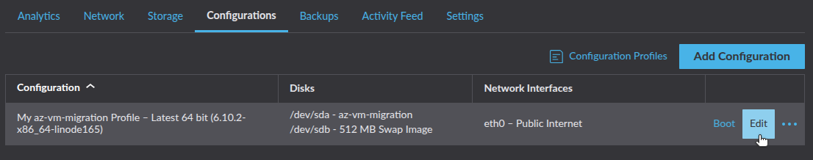

Under **Boot Settings**, select **Direct Disk** as the kernel.

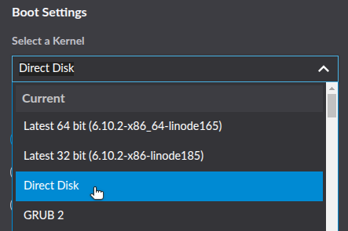

Click **Save Changes**. Then, **reboot** your Linode.

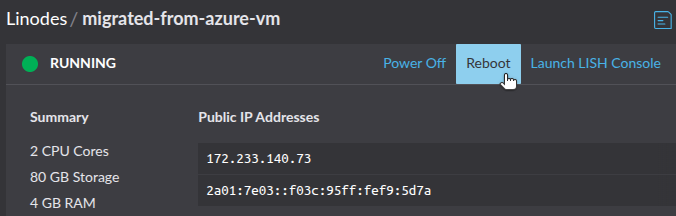

After several minutes, your Linode Compute Instance will be up and running based on the exported VM image from Azure.

### Configure and Validate the Linode Instance

By migrating via an image exported from your Azure VM disk, you ensure that the operating system and all installed software and services are on the newly provisioned Linode. This reduces the time needed to configure the Linode instance to closely match the environment of the original VM.

However, you must perform steps to configure networking to align with your needs. Recall the configurations from your original Azure VM:

-   [IP addresses](https://techdocs.akamai.com/cloud-computing/docs/managing-ip-addresses-on-a-compute-instance)
-   [Firewall rules](https://techdocs.akamai.com/cloud-computing/docs/getting-started-with-cloud-firewalls)
-   [Load balancing](https://techdocs.akamai.com/cloud-computing/docs/nodebalancer)
-   [DNS](https://techdocs.akamai.com/cloud-computing/docs/getting-started-with-dns-manager)

Linode does not have a direct equivalent to Azure network security groups. However, you can still implement a firewall with rules to control traffic. Options include:

-   [Linode Cloud Firewall](https://techdocs.akamai.com/cloud-computing/docs/cloud-firewall), for setting up inbound and outbound rules on Linode Compute Instances, either through the Linode API or the Linode CLI.
-   [`iptables`](/docs/guides/control-network-traffic-with-iptables/) or [`ufw`](/docs/guides/configure-firewall-with-ufw/), which run from within the Linode instance to manage the Linux kernel firewall (Netfilter).

Akamai Cloud provides [NodeBalancers](https://www.linode.com/products/nodebalancers/), which are equivalent to the [Azure Application Gateway](https://learn.microsoft.com/en-us/azure/application-gateway/overview). If you are migrating an AzureVM with an attached Application Gateway, you can implement a similar configuration for your Linode.

If you used Azure DNS to implement DNS rules to route traffic to your VM, then you will need to modify your DNS settings to ensure traffic routes to your new Linode instance. This may involve pointing nameservers to Akamai Cloud and creating DNS rules within the Akamai Cloud Manager.

After completing your configurations, test your Linode instance to verify that the migration was successful. Validation steps may include:

-   **Check Running Services**. Ensure that all critical services, such as web servers, databases, and application processes are running as expected and configured to start on boot.
-   **Test Application Functionality**. Access any applications on the new Linode through their web interface or API endpoints to confirm that they behave as expected, including core functionality and error handling.
-   **Inspect Resource Utilization**. Monitor CPU, memory, and disk usage on the Linode to ensure the system performs within acceptable thresholds post-migration.
-   **Validate DNS Configuration**. Ensure DNS changes (if made) are propagating correctly, pointing to your Linode instance, and resolving to the expected IP addresses.
-   **Check External Connectivity**. Verify that the instance can access any required external resources, such as third-party APIs, databases, or storage, and that outbound requests succeed.
-   **Review Logs**. Examine system and application logs for errors or warnings that might indicate migration-related issues.
-   **Backup and Snapshot Functionality**. Confirm that backups and snapshots can be created successfully on Linode to safeguard your data post migration.
-   **Verify Externally Attached Storage**: Ensure that any additional storage volumes, block devices, or network-attached storage are properly mounted and accessible. Check `/etc/fstab` entries and update disk mappings as needed.

## Additional Considerations

### Cost Management

Review the pricing for your current Azure VM instance ([compute](https://azure.microsoft.com/en-us/pricing/details/virtual-machines/windows/), [storage](https://azure.microsoft.com/en-ca/pricing/details/managed-disks/), and [bandwidth](https://azure.microsoft.com/en-us/pricing/details/bandwidth/)). Compare this with the [pricing plans for Akamai Cloud](https://www.linode.com/pricing/). Use [Akamai’s Cloud Computing Calculator](https://www.linode.com/cloud-computing-calculator/) to estimate potential costs.

### Data Consistency and Accuracy

Verify that the Linode migrated from the image export contains all necessary files, configurations, and application data. Double-check for corrupted or missing files during the image export and upload process. Verification steps may include:

-   **Generate and Compare File Checksums**: Use tools like `md5sum` to generate checksums of critical files or directories on both the source VM and the migrated Linode. Ensure the checksums match to confirm data integrity.
-   **Count Files and Directories**: Use `find` or `ls` commands to count the number of files and directories in key locations (e.g. `find /path -type f | wc -l`). Compare these counts between the source and destination to identify any discrepancies.
-   **Check Application Logs and Settings**: Compare configuration files, environment variables, and application logs between the source and the destination to confirm they are identical or appropriately modified for the new environment. Common locations to review may include:

    | Application           | Configuration           | Location                       |
    |-----------------------|-------------------------|--------------------------------|
    | **Apache Web Server** | Main                    | `/etc/apache2/apache2.conf`    |
    |                       | Virtual hosts           | `/etc/apache2/sites-available` |
    |                       |                         | `/etc/apache2/sites-enabled`   |
    | **NGINX Web Server**  | Main                    | `/etc/nginx/nginx.conf`        |
    |                       | Virtual hosts           | `/etc/nginx/sites-available`   |
    |                       |                         | `/etc/nginx/sites-enabled`     |
    | **Cron**              | Application             | `/etc/cron.d`                  |
    |                       | System-wide cron jobs   | `/etc/crontab`                 |
    |                       | User-specific cron jobs | `/var/spool/cron/crontabs`     |
    | **MySQL/MariaDB**     | Main                    | `/etc/mysql`                   |
    | **PostgreSQL**        | Main                    | `/etc/postgresql`              |
    | **SSH**               | Main                    | `/etc/ssh/sshd_config`         |
    | **Networking**        | Hostname                | `/etc/hostname`                |
    |                       | Hosts file              | `/etc/hosts`                   |
    | **Rsyslog**           | Main                    | `/etc/rsyslog.conf`            |

-   **Review Symbolic Links and Permissions**: Use CLI tools and commands to confirm that symbolic links and file permissions on the migrated Linode match those on the source VM. Examples include:

    | Description                                                                                                                                             | Command                                                                     |
    |---------------------------------------------------------------------------------------------------------------------------------------------------------|-----------------------------------------------------------------------------|
    | List all symbolic links in folder (recursive)                                                                                                           | `ls -Rla /path/to/folder \| grep "\->"`                                     |
    | Calculate md5 hash for all files in a folder, then sort by filename and write to file. Then, compare files from both VMs using `diff`.                  | `find /path/to/folder/ -type f -exec md5sum {} + \| sort -k 2 > hashes.txt` |
    | Write to file the folder contents (recursive) with permissions, owner name, and group name. Then, compare permissions files from both VMs using `diff`. | `tree /path/to/folder -fpuig > permissions.txt`                             |

After deploying your Linode, confirm that configurations (network settings, environment variables, and application dependencies) match the original VM to avoid runtime issues.

### Security and Access Controls

[Azure roles](https://learn.microsoft.com/en-us/azure/role-based-access-control/rbac-and-directory-admin-roles) govern instance access. Migrate these roles and permissions to Linode by setting up Linode API tokens and fine-tuning user permissions.

Use the Linode Cloud Firewall or existing system firewall on your instance to restrict access. Ensure SSH keys are properly configured, and disable root login if not required. Map Azure network security group policy rules to your firewall for consistent protection.

### Alternative Migration Options

This guide covered migrating a VM by exporting an image from the original Azure VM instance disk and importing that image to Akamai Cloud as the basis of a new Linode Compute Instance. When cloud provider restrictions or image size limits make this approach unavailable, consider other migration options, including:

-   **Rclone**: For example, provision a Linode Compute Instance with resource levels comparable to your original VM. Then, use [rclone](https://rclone.org/)—a command line utility for managing files in cloud storage—to move all data from your original VM to your new Linode. This can effectively move your workloads from your Azure VM to your Linode.

-   **IaC**: You can also leverage infrastructure-as-code (IaC) and configuration management tools to streamline your migration process. Tools like [Ansible](https://docs.ansible.com/ansible/latest/index.html), [Terraform](https://www.terraform.io/), [Chef](https://www.chef.io/products/chef-infra), and [Puppet](https://www.puppet.com/why-puppet/use-cases/continuous-configuration-automation) can help you automatically replicate server configurations, deploy applications, and ensure consistent settings across your source and destination VMs. By using these tools, you can create repeatable migration workflows that reduce manual intervention and minimize the risk of configuration errors during the transition.

-   **Containerization**: Another option is to containerize any workloads on your original VM. These containerized images can be run in the Akamai Cloud. For example, you can provision a [Linode Kubernetes Engine (LKE)](https://techdocs.akamai.com/cloud-computing/docs/linode-kubernetes-engine) cluster to host and run these containers, thereby removing the need for a VM.

## Resources

Azure:
-   [Azure CLI (`az`) Documentation](https://learn.microsoft.com/en-us/cli/azure/)
-   Downloading a VHD from Azure
    -   [Linux](https://learn.microsoft.com/en-us/azure/virtual-machines/linux/download-vhd)
    -   [Windows](https://learn.microsoft.com/en-us/azure/virtual-machines/windows/download-vhd?tabs=azure-portal)
-   [Troubleshooting backup failures on Azure virtual machines](https://learn.microsoft.com/en-us/azure/backup/backup-azure-vms-troubleshoot)

Akamai Cloud:
-   [Linode CLI and Object Storage](https://techdocs.akamai.com/cloud-computing/docs/using-the-linode-cli-with-object-storage)
-   [Uploading an image](https://techdocs.akamai.com/cloud-computing/docs/upload-an-image)
-   [Deploying an Image](https://techdocs.akamai.com/cloud-computing/docs/deploy-an-image-to-a-new-compute-instance)

Other helpful utilities:
-   [QEMU Disk Imaging Utility](https://www.qemu.org/download/)
-   [rclone](https://rclone.org/)
-   [Shrinking images on Linux](https://softwarebakery.com//shrinking-images-on-linux)