In modern cloud computing, virtual machine (VM) migration is a process that enables organizations to transition workloads between cloud platforms to optimize costs, improve performance, or enhance flexibility. By migrating VMs, organizations can select the capabilities of various cloud providers that best satisfy their business needs.

This guide focuses on migrating a VM from Azure Virtual Machine to Akamai Cloud using disk images and suggests how to plan, execute, and validate the migration.

## Before You Begin

1.  Log in to your [Akamai Cloud](https://www.linode.com/cfe) account to prepare the destination environment.

1.  Create a [Linode API token (personal access token)](/docs/products/platform/accounts/guides/manage-api-tokens/) so you can authenticate with the Linode CLI.

1.  Install and configure the [Linode CLI](/docs/products/tools/cli/guides/install/) on your local system.

1.  You must have access to an Azure account with sufficient permissions to work with Managed Disks and Storage Accounts.

1.  Install and configure the [Azure CLI](https://learn.microsoft.com/en-us/cli/azure/install-azure-cli) (`az`) to interact with your Azure Virtual Machine instances.

1.  Install [QEMU](https://www.qemu.org/) to convert the exported disk image into a format compatible with Akamai Cloud.


This guide is written for a non-root user. Commands that require elevated privileges are prefixed with `sudo`. If you’re not familiar with the `sudo` command, see the [Users and Groups](/docs/guides/linux-users-and-groups/) guide.


## Preparing Your Azure VM for Migration

Before migrating, review your Azure environment to ensure compatibility with Akamai Cloud. Note any instance-specific dependencies, such as storage size, image type, or hardware requirements, that may impact the transition.

Record the configuration details of your Azure VM to help choose an [Akamai Cloud plan](https://www.linode.com/pricing/#compute-shared) that matches your resource needs after migration.


[Images imported into Akamai Cloud](https://techdocs.akamai.com/cloud-computing/docs/upload-an-image) must be smaller than 6 GB unzipped or 5 GB zipped. Images exceeding the size limit are rejected during upload and not imported.


### Assess Current Azure VM Requirements

Assess your Azure Virtual Machine using either the Azure Portal or the Azure CLI. Use these methods to gather the CPU, memory, storage, networking, and firewall details needed for migration.



#### CPU and Memory

1.  In the Azure Portal, open the **Resource groups** page and select the group that contains the VM you want to migrate:

    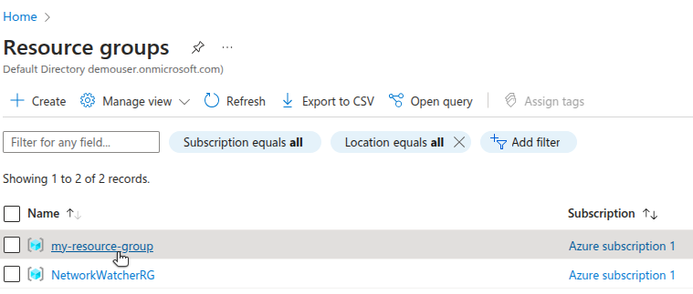

1.  From the list of resources in the group, locate and select the VM you intend to migrate:

    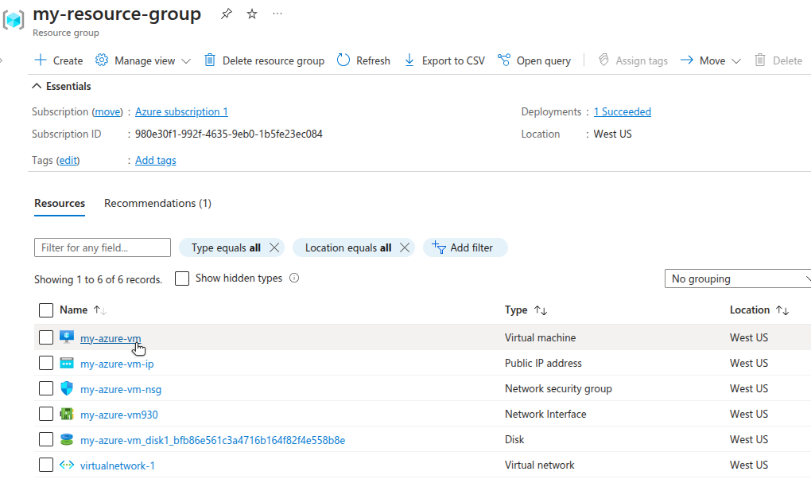

1.  On the **VM details** page, expand the **Essentials** section to view your VM's **Size** and specifications (e.g. `Standard B2s (2 vcpus, 4 GiB memory)`):

    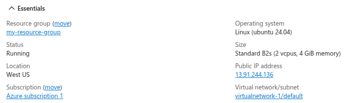

#### Storage

4.  Return to the list of resources for your Resource Group and select the disk associated with your VM:

    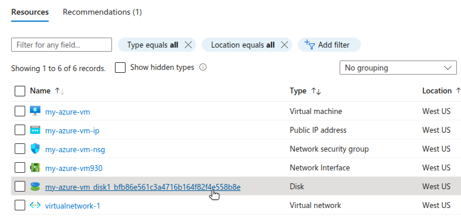

1.  The **Properties** section of the disk details page shows the disk’s size and storage type:

    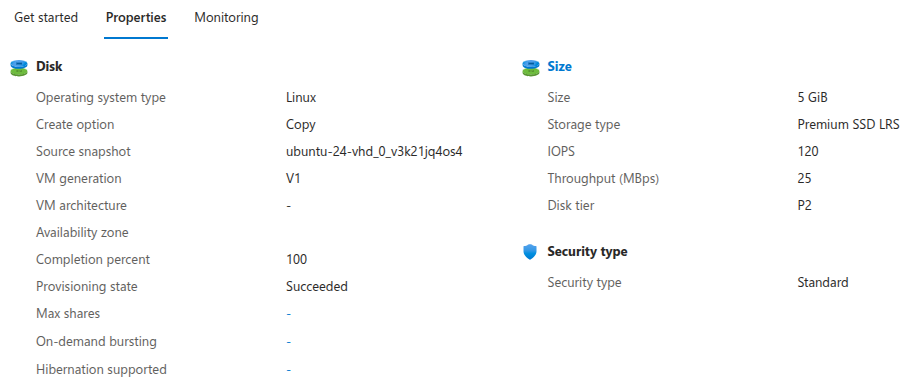

    The example Azure disk for this guide has a size of 5 GB.

#### IP Addresses

6.  The **Essentials** section of the VM details page displays the external IP address for the VM (e.g. `13.91.244.136`).

#### Network Security Groups and Firewall Rules

7.  Return to the list of resources for your Resource Group and select the network security group resource:

    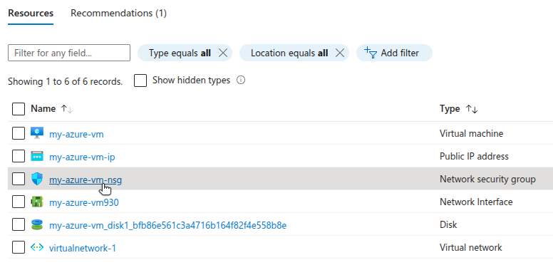

1.  A list of inbound and outbound security rules for the network security group is displayed:

    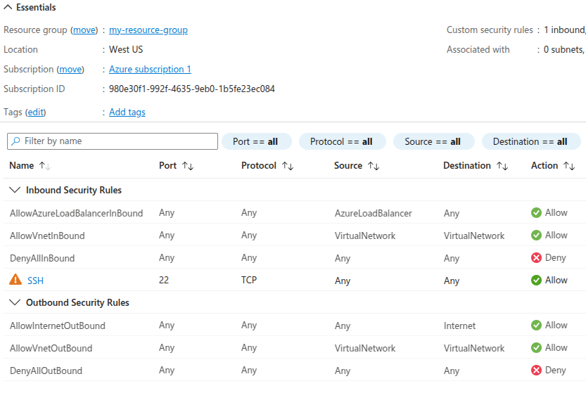


#### CPU and Memory

1.  Use the Azure CLI (`az`) to list all the VMs in a Resource Group, replacing  with your actual Resource Group name (e.g. `my-resource-group`):

    ```command
    az vm list --resource-group  --output table
    ```

    ```output
    Name         ResourceGroup      Location    Zones
    -----------  -----------------  ----------  -------
    my-azure-vm  my-resource-group  westus
    ```

1.  Retrieve the VM size by specifying the  and  (e.g. `my-azure-vm`):

    ```command
    az vm show \
        --resource-group  \
        --name  \
        --query "hardwareProfile.vmSize"
    ```

    ```output
    "Standard_B2s"
    ```

1.  Show the specifications for a VM size by replacing  (e.g. `westus`) and  (e.g. `Standard_B2s`) with the location of your Resource Group and your VM size:

    ```command
    az vm list-sizes --location  --query "[?name=='']"
    ```

    ```output
    [
        {
            "maxDataDiskCount": 4,
            "memoryInMB": 4096,
            "name": "Standard_B2s",
            "numberOfCores": 2,
            "osDiskSizeInMB": 1047552,
            "resourceDiskSizeInMB": 8192
        }
    ]
    ```

#### Storage

4.  Retrieve the disk details for your VM, replacing  and :

    ```command
    az vm show \
        --resource-group  \
        --name  \
        --query "storageProfile.osDisk"
    ```

    ```output
    {
        "caching": "ReadWrite",
        "createOption": "FromImage",
        "deleteOption": "Delete",
        "diffDiskSettings": null,
        "diskSizeGb": 5,
        "encryptionSettings": null,
        "image": null,
        "managedDisk": {
            "diskEncryptionSet": null,
            "id": "/subscriptions/980e30f1-992f-4635-9eb0-1b5fe23ec084/resourceGroups/my-resource-group/providers/Microsoft.Compute/disks/my-azure-vm_disk1_bfb86e561c3a4716b164f82f4e558b8e",
            "resourceGroup": "my-resource-group",
            "securityProfile": null,
            "storageAccountType": "Premium_LRS"
        },
        "name": "my-azure-vm_disk1_bfb86e561c3a4716b164f82f4e558b8e",
        "osType": "Linux",
        "vhd": null,
        "writeAcceleratorEnabled": null
    }
    ```

    The example Azure disk for this guide has a size of 5 GB.

#### IP Addresses

5.  Retrieve the name of the network interface, replacing  and :

    ```command
    az vm show \
        --resource-group  \
        --name my-azure-vm \
        --query "networkProfile.networkInterfaces\[0\].id"
    ```

    In Azure, resources such as network interfaces have both an ID and a name. The ID has the form of a full path, for example:

    ```output
    "/subscriptions/980e30f1-992f-4635-9eb0-1b5fe23ec084/resourceGroups/my-resource-group/providers/Microsoft.Network/networkInterfaces/my-azure-vm930"
    ```

    The name of the network interface can be inferred through the final part of the path (e.g. `my-azure-vm930`).

1.  Use the resulting  to get the name of the public IP address created by Azure:

    ```command
    az network nic show \
        --name  \
        --resource-group  \
        --query "ipConfigurations\[0\].publicIPAddress.id"
    ```

    ```output
    "/subscriptions/980e30f1-992f-4635-9eb0-1b5fe23ec084/resourceGroups/my-resource-group/providers/Microsoft.Network/publicIPAddresses/my-azure-vm-ip"
    ```

1.  Use the resulting  to retrieve the details for this resource, including the actual IP address.

    ```command
    az network public-ip show \
        --name  \
        --resource-group 
        --query "ipAddress"
    ```

    ```output
    "13.91.244.136"
    ```

#### Network Security Groups and Firewall Rules

8.  Use the  and the  obtained from your VM information to obtain the network security group name:

    ```command
    az network nic show \
        --name  \
        --resource-group  \
        --query "networkSecurityGroup.id"
    ```

    ```output
    "/subscriptions/980e30f1-992f-4635-9eb0-1b5fe23ec084/resourceGroups/my-resource-group/providers/Microsoft.Network/networkSecurityGroups/my-azure-vm-nsg"
    ```

    The network security group name can be inferred through the final part of the path (e.g. `my-azure-vm-nsg`).

1.  Replace  in the following command for a detailed breakdown of the network security group’s configuration, including ingress/egress ports and firewall settings:

    ```command
    az network nsg show \
        --name  \
        --resource-group 
    ```

    ```output
    {
        "defaultSecurityRules": [
            {
                "access": "Allow",
                "description": "Allow inbound traffic from all VMs in VNET",
                ...
                "destinationPortRanges": [],
                "direction": "Inbound",
                ...
                "sourcePortRange": "*",
                "sourcePortRanges": [],
            },
            {
                "access": "Allow",
                "description": "Allow inbound traffic from azure load balancer",
                ...
                "destinationPortRange": "*",
                "destinationPortRanges": [],
                ...
                "sourcePortRange": "*",
                "sourcePortRanges": [],
            },
                ...
            ],
            ...
            "securityRules": [
            {
                "access": "Allow",
                ...
                "destinationPortRange": "22",
                "destinationPortRanges": [],
                "direction": "Inbound",
                ...
                "protocol": "TCP",
                ...
                "sourcePortRange": "*",
                "sourcePortRanges": [],
            }
        ],
        "type": "Microsoft.Network/networkSecurityGroups"
    }
    ```



#### Back up Your Azure VM Disk (Optional)

Before starting your migration, consider backing up the Azure VM disk in case a restoration is needed in the future.



1.  In the Azure Portal, return to the list of resources for the Resource Group and select the disk associated with your VM.

1.  On the disk details page, click **Create snapshot** and go through the configuration options for the snapshot.

    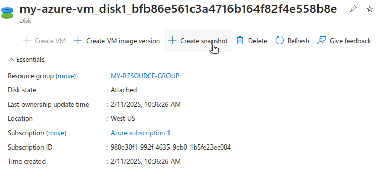

1.  Your newly created snapshot can be found on the **Snapshots** page:

    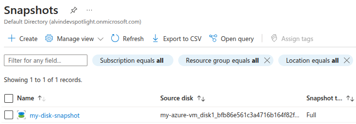


1.  Use the following `az` command to create a snapshot, replacing  with a name of your choosing (e.g. `my-disk-snapshot`):

    ```command
    az snapshot create \
        --resource-group  \
        --name  \
        --source  \
        --location 
    ```

    For example:

    ```command
    az snapshot create \
        --resource-group my-resource-group \
        --name my-disk-snapshot \
        --source my-azure-vm_disk1_bfb86e561c3a4716b164f82f4e558b8e \
        -location westus
    ```

    ```output
    {
        "creationData": {
            "createOption": "Copy",
            "sourceResourceId": "/subscriptions/980e30f1-992f-4635-9eb0-1b5fe23ec084/resourceGroups/my-resource-group/providers/Microsoft.Compute/disks/my-azure-vm_disk1_bfb86e561c3a4716b164f82f4e558b8e",
            "sourceUniqueId": "bfb86e56-1c3a-4716-b164-f82f4e558b8e"
        },
        "diskSizeBytes": 5368709120,
        "diskSizeGB": 5,
        ...
        "location": "westus",
        "name": "my-disk-snapshot",
        "networkAccessPolicy": "AllowAll",
        "osType": "Linux",
        "provisioningState": "Succeeded",
        ...
    }
    ```

1.  List all snapshots for a given resource group:

    ```command
    az snapshot list --resource-group my-resource-group
    ```

    ```output
    [
        {
            ...
            "diskSizeBytes": 5368709120,
            "diskSizeGB": 5,
            "location": "westus",
            "name": "my-disk-snapshot",
            "provisioningState": "Succeeded",
            "publicNetworkAccess": "Enabled",
            ...
        }
    ]
    ```




The [cost of Azure snapshots](https://azure.microsoft.com/en-us/pricing/details/managed-disks/#pricing) varies depending on redundancy options (local or zone).


## Migrating to Akamai Cloud

Migrating an Azure VM to Akamai Cloud involves the following steps:

-   Export the managed disk from your Azure VM.
-   Convert the disk image to raw format and prepare it for import.
-   Upload the compressed image to Akamai Cloud.
-   Launch a new Linode Compute Instance from the uploaded image.
-   Verify and configure the new instance.

### Export the Azure VM Disk

Before exporting the disk, you must first stop the virtual machine.

1.  In the Azure Portal, navigate to your VM's detail page and click **Stop**:

    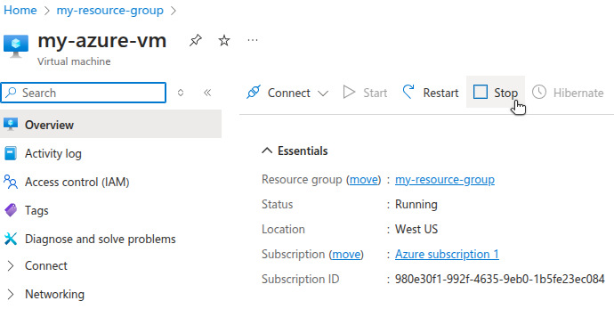

1.  Next, go to the **Disks** section for the Azure VM, select the OS disk, and click **Disk Export** under **Settings**:

    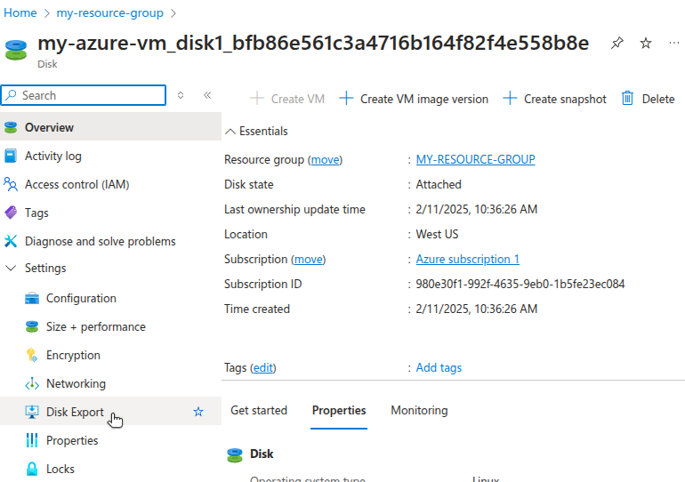

1.  Azure generates a temporary URL to download the disk as a Virtual Hard Disk (VHD) file. Specify an expiration time for the link then click **Generate URL**:

    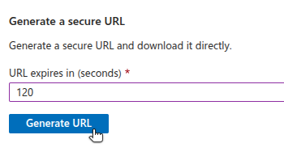

1.  To generate the disk export URL from the Azure CLI, run the following command:

    ```command
    az disk grant-access \
        --name my-azure-vm_disk1_bfb86e561c3a4716b164f82f4e558b8e \
        --resource-group my-resource-group \
        --duration-in-seconds 120
    ```

    ```output
    {
        "accessSAS": "https://md-3rnqkqjjh5nk.z41.blob.storage.azure.net/5zfpv2fgr3wv/abcd?sv=2018-03-28&sr=b&si=8f527a7b-e94d-4e44-b6a9-313d2974197b&sig=u0gKMJ%2BSlWEahBUoMg8%2Bppgi5bU65SotEaYD653YI0I%3D"
    }
    ```

1.  Use `wget` and the  to download and save the file to your local machine:

    ```command
    wget -O azure-download.vhd ""
    ```

    ```output
    HTTP request sent, awaiting response... 200 OK
    Length: 5368709632 (5.0G) [text/x-vhdl]
    Saving to: 'azure-download.vhd'

    azure-download.vhd
    100%[=====================================>]  5.00G  2.91MB/s    in 24m 45s

    'azure-download.vhd' saved [5368709632/5368709632]
    ```

    The download depends on your internet connection and the size of the exported disk image.

### Import and Deploy VM Image on Akamai Cloud

To provision a Linode using an existing VM image, the image must be in raw format (`.img`) and compressed using `gzip`.

#### Convert Disk Image to Raw Format

Linode does not support the VHD format used by Azure. Before importing your VM image, you must convert the `.vhd` file to a raw disk image with an `.img` extension.

1.  Perform the conversion using [`qemu-img convert`](https://qemu-project.gitlab.io/qemu/tools/qemu-img.html#cmdoption-qemu-img-arg-convert):

    ```command
    qemu-img convert -f vpc -O raw azure-download.vhd azure-image.raw
    ```

    In this command, `-f` specifies the input format (`vpc`), and `-O` specifies the output format (`raw`). These are followed by the input filename and the desired output filename.

1.  The resulting raw file should be nearly the same size as the original VHD file. Confirm this with the following command:

    ```command
    stat -c "%s %n" -- azure-*
    ```

    ```output
    5368430592 azure-image.raw
    5368709632 azure-download.vhd
    ```

#### Prepare Image File for Import

Linode requires image files to use the `.img` extension. If your raw image file does not already have this extension, rename it accordingly.

1.  Rename the file to use the `.img` extension:

    ```command
    mv azure-image.raw azure-image.img
    ```

1.  Compress the image using `gzip` to reduce its size:

    ```command
    gzip azure-image.img
    ```

1.  Confirm the compressed image was created and check its size:

    ```command
    du -BM azure-image.img.gz
    ```

    ```output
    1737M azure-image.img.gz
    ```

#### Upload the Compressed File to Akamai Cloud

Use the Linode CLI to upload your compressed image file. Replace the filename with your specific `.gz` image, and specify the label, description, and region based on your use case.

```command
linode-cli image-upload \
    --label "azure-vm-migration" \
    --description "Azure VM Import" \
    --region "us-lax" \
    ./azure-image.img.gz
```

```output
┌-----------------------┬-----------┬----------------┐
│ label                 │ is_public │ status         │
├-----------------------┼-----------┼----------------┤
│ azure-vm-migration    │ False     │ pending_upload │
└-----------------------┴-----------┴----------------┘
```

The upload process may take several minutes depending on the size of your image and network speed.

#### Verify the Successful Image Upload

After uploading the image, verify that is was processed and is available for use. Run the following command to list your private images:

```command
linode-cli images list --is_public false
```

```output
┌------------------┬-----------------------┬-----------┬--------┐
│ id               │ label                 │ status    │ size   │
├------------------┼-----------------------┼-----------┼--------┤
│ private/30228641 │ azure-vm-migration    │ available │ 5120   │
└------------------┴-----------------------┴-----------┴--------┘
```

Check that the `status` is `available`. If the `status` is `pending`, wait a few minutes and try again.

You can also monitor the upload status from the **Images** section of the Akamai Cloud Manager:

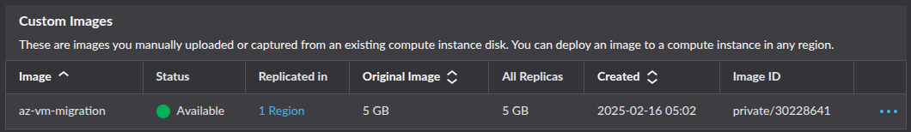

#### Launch a Linode Compute Instance from the Uploaded Image

Once your image is available, you can deploy it to a new Linode instance. For this command, provide the ID of your uploaded image (shown in the previous step). Also include the following values:

-   `--label`: A unique label for the instance.
-   `--region`: The preferred deployment region.
-   `--type`: The type of instance to deploy.
-   `--root_pass`: A secure root password for SSH access.

This example deploys a `g6-standard-2` Linode with 2 vCPUs, 80 GB storage, 4 GB RAM, and a 4,000 Mbps transfer rate. This is a comparable configuration to the original Azure `Standard B2s` VM, which also features 2 vCPUs and 4 GB RAM.


See the [Akamai Cloud pricing page](https://www.linode.com/pricing/#compute-shared) for more details on available instance types and their associated costs.


```command
linode-cli linodes create \
    --image  \
    --label "migrated-from-azure" \
    --region "us-lax" \
    --type "g6-standard-2" \
    --root_pass ""
```

```output
┌-----------------------┬--------┬---------------┬--------------┐
│ label                 │ region │ type          │ status       │
├-----------------------┼--------┼---------------┼--------------┤
│ migrated-from-azure   │ us-lax │ g6-standard-2 │ provisioning │
└-----------------------┴--------┴---------------┴--------------┘
```

By default, Linode boots instances using its own kernel. To instead boot from the kernel embedded in your imported image:

1.  Open the Akamai Cloud Control Center and choose **Linodes** under **Compute** in the left-hand pane.

1.  Select your Linode instance.

1.  Open the **Configurations** tab at the bottom, then select **Edit**.

    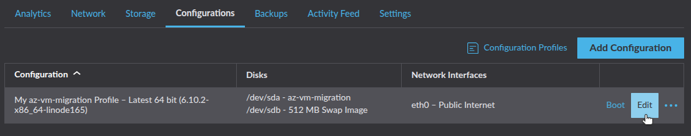

1.  Under **Boot Settings**, select **Direct Disk** as the kernel option.

    

1.  Click **Save Changes**, then **Reboot** your Linode.

    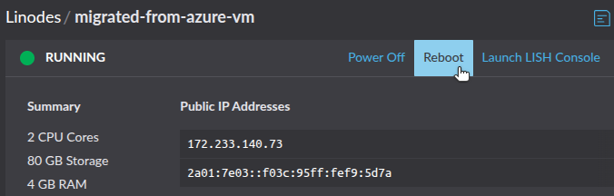

After several minutes, your Linode instance should be running using the image exported from your Azure VM.

### Configure and Validate the Linode Instance

Migrating using a disk image exported from your Azure VM ensures that the operating system and all installed software and services are preserved on the newly provisioned Linode. This reduces the time needed to reconfigure the Linode instance to match the original VM.

However, you must still configure the Linode's networking to align with your workload. Refer to the configuration details from your original Azure VM and apply them to your Linode as appropriate:

-   [IP Addresses](https://techdocs.akamai.com/cloud-computing/docs/managing-ip-addresses-on-a-compute-instance)
-   [Firewall Rules](https://techdocs.akamai.com/cloud-computing/docs/getting-started-with-cloud-firewalls)
-   [Load Balancing](https://techdocs.akamai.com/cloud-computing/docs/nodebalancer)
-   [DNS](https://techdocs.akamai.com/cloud-computing/docs/getting-started-with-dns-manager)

Linode does not have a direct equivalent to Azure Network Security Groups. However, you can still implement a firewall with rules to control traffic. Options include:

-   [Akamai Cloud Firewall](https://techdocs.akamai.com/cloud-computing/docs/cloud-firewall) to set up inbound and outbound rules through the Akamai Cloud Manager, the Linode CLI, or API.
-   [`iptables`](/docs/guides/control-network-traffic-with-iptables/) or [`ufw`](/docs/guides/configure-firewall-with-ufw/) to manage the Linux kernel firewall (Netfilter).

To replicate [Azure Application Gateway](https://learn.microsoft.com/en-us/azure/application-gateway/overview), use Akamai Cloud's [NodeBalancers](https://www.linode.com/products/nodebalancers/) to distribute traffic across multiple Linode instances.

If you used Azure DNS to route traffic to your Azure VM, you need to update your DNS records to route traffic to your new Linode instance instead. This may involve pointing your domain nameservers to Akamai Cloud and creating DNS rules within the Akamai Cloud Manager.

After completing your configurations, test your Linode instance to verify that the migration was successful. Validation steps may include:

-   **Check Running Services**: Confirm that all critical services (e.g. web servers, databases, and application processes) are running as expected and configured to start on boot.
-   **Test Application Functionality**: Access your applications through their web interface or API endpoints to confirm that they behave as expected, including core functionality and error handling.
-   **Inspect Resource Utilization**: Monitor the Linode's CPU, memory, and disk usage to ensure the system performs within acceptable thresholds post-migration.
-   **Validate DNS Configuration**: Ensure that any DNS changes are propagating correctly, pointing to your Linode instance, and resolving to the expected IP addresses.
-   **Check External Connectivity**: Verify that the Linode can access any required external resources (e.g. third-party APIs, databases, or storage) and that outbound requests succeed.
-   **Review Logs**: Examine system and application logs for errors or warnings that might indicate migration-related issues.
-   **Backup and Snapshot Functionality**: To safeguard your data post migration, confirm that backups and snapshots can be created successfully.
-   **Verify Externally Attached Storage**: Ensure that any additional storage volumes, block devices, or network-attached storage are properly mounted and accessible. Check `/etc/fstab` entries and update disk mappings as needed.

## Additional Considerations

### Cost Management

Review the pricing for your current Azure VM instance, including [compute](https://azure.microsoft.com/en-us/pricing/details/virtual-machines/windows/), [storage](https://azure.microsoft.com/en-ca/pricing/details/managed-disks/), and [bandwidth](https://azure.microsoft.com/en-us/pricing/details/bandwidth/). Compare those costs with the [Akamai Cloud pricing plans](https://www.linode.com/pricing/) using [Akamai’s Cloud Computing Calculator](https://www.linode.com/cloud-computing-calculator/) to estimate your usage.

### Data Consistency and Accuracy

After importing your image and launching your Linode, verify that all expected files, configurations, and application data are intact. Verification steps may include:

-   **Generate and Compare File Checksums**: Use tools like `md5sum` to generate checksums of both the source VM and your Linode. Ensure the checksums match to confirm data integrity.
-   **Count Files and Directories**: Use commands like `find` or `ls` to count the number of files and directories in key locations (e.g. `find /path -type f | wc -l`). Compare these counts between the source VM and your Linode to identify any discrepancies.
-   **Check Application Logs and Settings**: Compare configuration files, environment variables, and application logs between the source and your Linode to confirm they are identical (or appropriately modified for the new environment). Common locations to review may include:

    | Application           | Configuration             | Location                       |
    |-----------------------|---------------------------|--------------------------------|
    | **Apache Web Server** | Main                      | `/etc/apache2/apache2.conf`    |
    |                       | Virtual hosts             | `/etc/apache2/sites-available` |
    |                       |                           | `/etc/apache2/sites-enabled`   |
    | **NGINX Web Server**  | Main                      | `/etc/nginx/nginx.conf`        |
    |                       | Virtual hosts             | `/etc/nginx/sites-available`   |
    |                       |                           | `/etc/nginx/sites-enabled`     |
    | **Cron**              | Application               | `/etc/cron.d`                  |
    |                       | System-wide `cron` jobs   | `/etc/crontab`                 |
    |                       | User-specific `cron` jobs | `/var/spool/cron/crontabs`     |
    | **MySQL/MariaDB**     | Main                      | `/etc/mysql`                   |
    | **PostgreSQL**        | Main                      | `/etc/postgresql`              |
    | **SSH**               | Main                      | `/etc/ssh/sshd_config`         |
    | **Networking**        | Hostname                  | `/etc/hostname`                |
    |                       | Hosts file                | `/etc/hosts`                   |
    | **Rsyslog**           | Main                      | `/etc/rsyslog.conf`            |

-   **Review Symbolic Links and Permissions**: Use CLI tools and commands to confirm that symbolic links and file permissions on your Linode match those on the source VM. Examples include:

    | Description                                                                                                                                             | Command                                                                     |
    |---------------------------------------------------------------------------------------------------------------------------------------------------------|-----------------------------------------------------------------------------|
    | List all symbolic links in folder (recursive).                                                                                                          | `ls -Rla /path/to/folder \| grep "\->"`                                     |
    | Calculate md5 hash for all files in a folder, then sort by filename and write to file. Then, compare files from both VMs using `diff`.                  | `find /path/to/folder/ -type f -exec md5sum {} + \| sort -k 2 > hashes.txt` |
    | Write to file the folder contents (recursive) with permissions, owner name, and group name. Then, compare permissions files from both VMs using `diff`. | `tree /path/to/folder -fpuig > permissions.txt`                             |

After deploying your Linode, confirm that the configurations (network settings, environment variables, and application dependencies) match the source VM to avoid runtime issues.

### Security and Access Controls

[Azure roles](https://learn.microsoft.com/en-us/azure/role-based-access-control/rbac-and-directory-admin-roles) govern instance access. To migrate these roles and permissions to Akamai Cloud:

-   Create Linode API tokens and fine-tune user permissions.
-   Reproduce Azure network security group policy rules in the Linode Cloud Firewall or existing system firewall.
-   Properly configure SSH keys and disable root login if not required.

### Alternative Migration Options

If exporting a disk image is not viable due to provider restrictions or image size constraints, consider these alternative migration options:

-   **Data-only Transfer**: Provision a Linode with resource levels comparable to your source VM, then use [rclone](https://rclone.org/) to move all data from your source VM to your new Linode.
-   **Infrastructure-as-Code (IaC)**: Replicate your source VM on Linode using tools like [Ansible](https://docs.ansible.com/ansible/latest/index.html), [Terraform](https://www.terraform.io/), [Chef](https://www.chef.io/products/chef-infra), and [Puppet](https://www.puppet.com/why-puppet/use-cases/continuous-configuration-automation). These tools can help replicate server configurations, deploy applications, and ensure consistency.
-   **Containerization**: Containerize workloads and deploy them to a [Linode Kubernetes Engine (LKE)](https://techdocs.akamai.com/cloud-computing/docs/linode-kubernetes-engine) cluster, eliminating the need to migrate the VM entirely.

## Resources

Azure:
-   [Azure CLI (`az`) Documentation](https://learn.microsoft.com/en-us/cli/azure/)
-   Downloading a VHD from Azure
    -   [Linux](https://learn.microsoft.com/en-us/azure/virtual-machines/linux/download-vhd)
    -   [Windows](https://learn.microsoft.com/en-us/azure/virtual-machines/windows/download-vhd?tabs=azure-portal)
-   [Troubleshooting backup failures on Azure virtual machines](https://learn.microsoft.com/en-us/azure/backup/backup-azure-vms-troubleshoot)

Akamai Cloud:
-   [Linode CLI and Object Storage](https://techdocs.akamai.com/cloud-computing/docs/using-the-linode-cli-with-object-storage)
-   [Uploading an image](https://techdocs.akamai.com/cloud-computing/docs/upload-an-image)
-   [Deploying an Image](https://techdocs.akamai.com/cloud-computing/docs/deploy-an-image-to-a-new-compute-instance)

Other helpful utilities:
-   [QEMU Disk Imaging Utility](https://www.qemu.org/download/)
-   [rclone](https://rclone.org/)
-   [Shrinking images on Linux](https://softwarebakery.com//shrinking-images-on-linux)