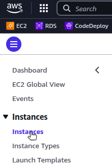
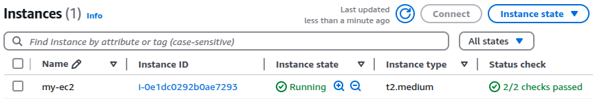
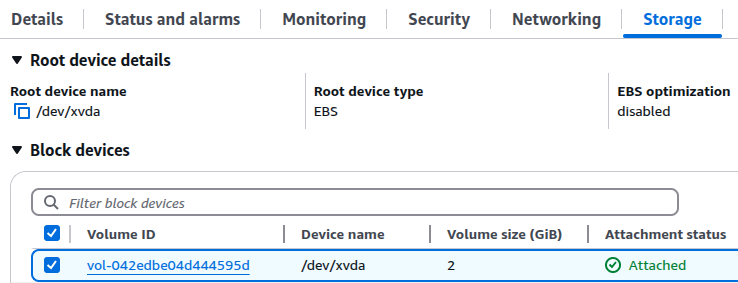
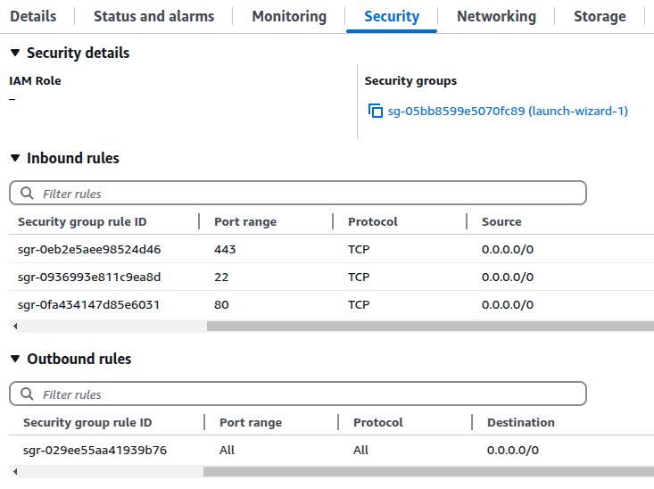
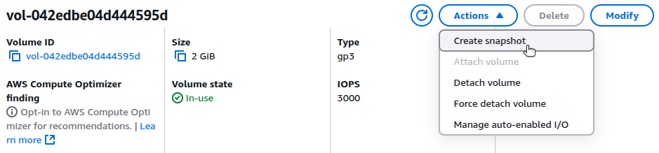
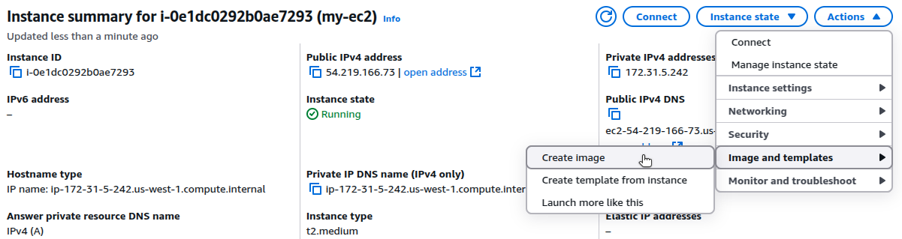
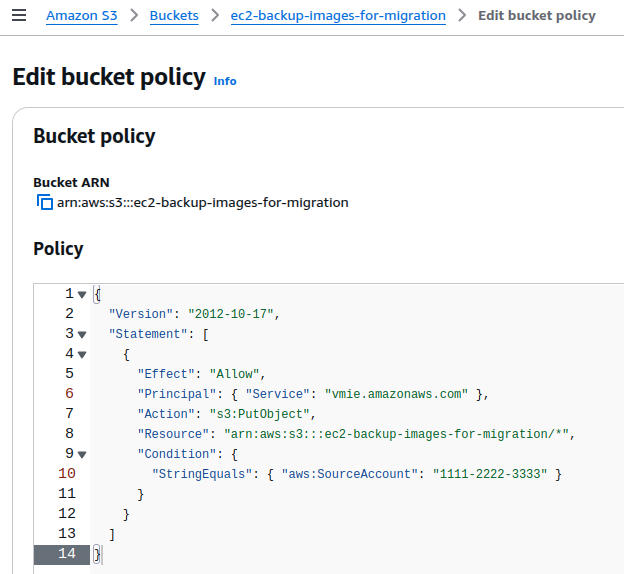
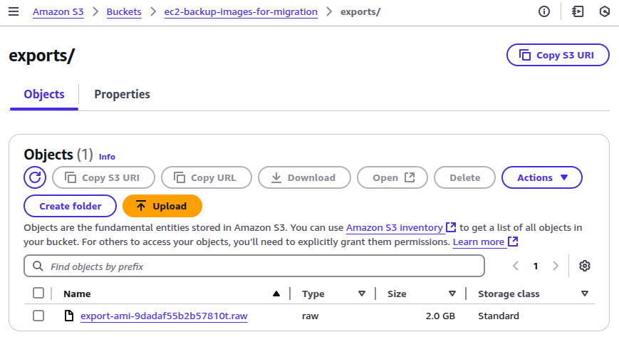
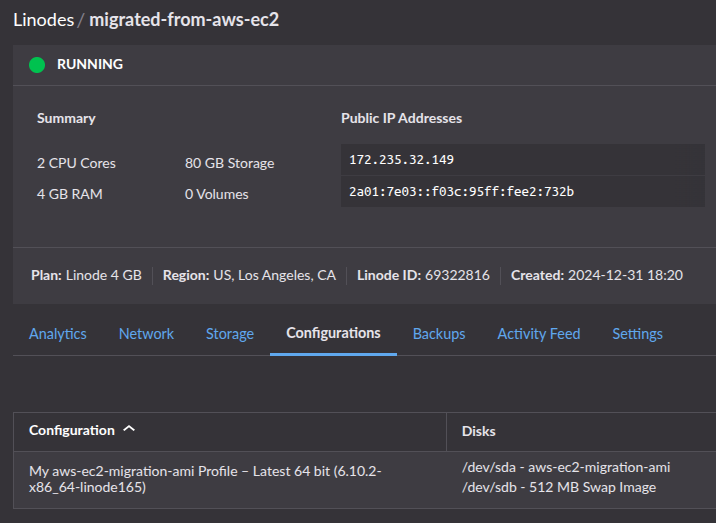

In modern cloud computing, virtual machine (VM) migration is a process that enables organizations to transition workloads between cloud platforms to optimize costs, improve performance, or enhance flexibility. By migrating VMs, organizations can select the capabilities of various cloud providers that best satisfy their business needs.

This guide focuses on migrating a VM from Amazon Web Services (AWS) Elastic Compute Cloud (EC2) to Akamai Cloud using disk images suggests how to plan, execute, and validate the migration.

## Before You Begin

1.  Log in to your [Akamai Cloud](https://www.linode.com/cfe) account to prepare the destination environment.

1.  Create a [Linode API token (personal access token)](/docs/products/platform/accounts/guides/manage-api-tokens/) so you can authenticate with the Linode CLI.

1.  Install and configure the [Linode CLI](/docs/products/tools/cli/guides/install/) on your local system.

1.  You must also have access to an AWS account with sufficient permissions to manage EC2 instances, including the ability to create and export AMIs.

1.  Install and configure the [AWS CLI](https://aws.amazon.com/cli/) to interact with your EC2 instances.

1.  Install [`jq`](https://jqlang.github.io/jq/download/), a lightweight tool used to parse JSON output from the CLIs.


This guide is written for a non-root user. Commands that require elevated privileges are prefixed with `sudo`. If you’re not familiar with the `sudo` command, see the [Users and Groups](/docs/guides/linux-users-and-groups/) guide.


## Preparing Your AWS EC2 Environment for Migration

Before migrating, review your AWS EC2 instance configuration to ensure compatibility with Akamai Cloud. Note any instance-specific dependencies, such as storage size, image type, or hardware requirements, that may impact the transition.

Record the configuration details of your EC2 instance to help choose an [Akamai Cloud plan](https://www.linode.com/pricing/#compute-shared) that matches your resource needs after migration.


[Images imported into Akamai Cloud](https://techdocs.akamai.com/cloud-computing/docs/upload-an-image) must be smaller than 6 GB unzipped or 5 GB zipped. Images exceeding the size limit are rejected during upload and not imported.


### Assess Current EC2 Instance Specifications

Assess your EC2 instance using either the AWS Console or the AWS CLI. Use these methods to gather the CPU, memory, storage, networking, and firewall details needed for migration.



#### CPU and Memory

1.  In the AWS Console, open the **EC2** service and navigate to the **Instances** page:

    

1.  Locate the EC2 instance you intend to migrate:

    

    Note the **Instance ID** (e.g. `i-0e1dc0292b0ae7293`) and the **Instance type** (e.g. `t2.medium`).

#### Storage

3.  Navigate to the **Storage** tab for your EC2 instance:

    

1.  Select the listed volume to view your instance's attached storage volume type and size:

    

    In this example, the attached storage volume is the `gp3` type with a size of 2 GB.

#### IP Addresses

5.  Your instance's public and private IP addresses are listed on the instance summary page:

    

#### Security Groups and Firewall Rules

6.  Navigate to the **Security** tab of your EC2 instance to view it's associated security groups and firewall rules:

    


#### CPU and Memory

1.  Use the AWS CLI (`aws`) to retrieve the CPU and memory specifications of your EC2 instance, replacing  with your actual instance type (e.g. `t2.medium`):

    ```command
    aws ec2 describe-instance-types --instance-types= \
        | jq '.InstanceTypes[0] | {VCpuInfo, MemoryInfo}'
    ```

    ```output
    {
      "VCpuInfo": {
        "DefaultVCpus": 2,
        "DefaultCores": 2,
        "DefaultThreadsPerCore": 1
      },
      "MemoryInfo": {
        "SizeInMiB": 4096
      }
    }
    ```

#### Storage

2.  Retrieve volume size and type for your EC2 instance, replacing  with your actual instance ID (e.g. `i-0e1dc0292b0ae7293`):

    ```command
    aws ec2 describe-volumes \
        --filters "Name=attachment.instance-id,Values=" \
        | jq '.Volumes[0] | {Size, VolumeType}'
    ```

    ```output
    {
      "Size": 2,
      "VolumeType": "gp3"
    }
    ```

#### IP Addresses

3.  Retrieve the public and private IP addresses of your EC2 instance, replacing  as needed:

    ```command
    aws ec2 describe-instances
        --instance-ids  \
        | jq \
          '.Reservations[0].Instances[0] | {PublicIpAddress,PrivateIpAddress}'
    ```

    ```output
    {
      "PublicIpAddress": "54.219.166.73",
      "PrivateIpAddress": "172.31.5.242"
    }
    ```

#### Security Groups and Firewall Rules

4.  List the security groups associated with your EC2 instance, replace :

    ```command
    aws ec2 describe-instances \
        --instance-ids  \
        | jq '.Reservations[0].Instances[0].SecurityGroups'
    ```

    ```output
    [
      {
        "GroupName": "default",
        "GroupId": "sg-05bb8599e5070fc89"
      }
    ]
    ```

1.  List the rule IDs in the security group by replacing  with your `GroupId` from the previous output (e.g. `sg-05bb8599e5070fc89`):

    ```command
    aws ec2 describe-security-group-rules \
        --filters "Name=group-id,Values=" \
        | jq '.SecurityGroupRules[] | {SecurityGroupRuleId, IsEgress, IpProtocol, FromPort, ToPort, CidrIpv4}'
    ```

    ```output
    {
        "SecurityGroupRules": [
            {
                "SecurityGroupRuleId": "sgr-0eb2e5aee98524d46",
                "GroupId": "sg-05bb8599e5070fc89",
                "GroupOwnerId": "153917289119",
                "IsEgress": false,
                "IpProtocol": "tcp",
                "FromPort": 443,
                "ToPort": 443,
                "CidrIpv4": "0.0.0.0/0",
                "Tags": []
            },
            {
                "SecurityGroupRuleId": "sgr-0936993e811c9ea8d",
                "GroupId": "sg-05bb8599e5070fc89",
                "GroupOwnerId": "153917289119",
                "IsEgress": false,
                "IpProtocol": "tcp",
                "FromPort": 22,
                "ToPort": 22,
                "CidrIpv4": "0.0.0.0/0",
                "Tags": []
            },
            {
                "SecurityGroupRuleId": "sgr-0fa434147d85e6031",
                "GroupId": "sg-05bb8599e5070fc89",
                "GroupOwnerId": "153917289119",
                "IsEgress": false,
                "IpProtocol": "tcp",
                "FromPort": 80,
                "ToPort": 80,
                "CidrIpv4": "0.0.0.0/0",
                "Tags": []
            },
            {
                "SecurityGroupRuleId": "sgr-029ee55aa41939b76",
                "GroupId": "sg-05bb8599e5070fc89",
                "GroupOwnerId": "153917289119",
                "IsEgress": true,
                "IpProtocol": "-1",
                "FromPort": -1,
                "ToPort": -1,
                "CidrIpv4": "0.0.0.0/0",
                "Tags": []
            }
        ]
    }
    ```




Determine if your EC2 instance is associated with any load balancer, custom DNS records, or other networking components. Record this information, as it may affect how you provision your Linode instance and configure its networking resources.


### Back up Your Data on AWS EC2

Creating a comprehensive backup of your EC2 instance ensures you can restore your environment in case of unexpected issues during the migration. With a backup in place, migrating to Akamai Cloud becomes safer and more predictable.

AWS provides two approaches to create a backup of your EC2 instance:

-   **Create a Snapshot**: A snapshot captures a point-in-time copy of your attached EBS volume:

    1.  In the AWS Console, navigate to the details page for your EBS volume.

    1.  Select the volume attached to your EC2 instance.

    1.  Click **Actions** then choose **Create Snapshot**.

    

-   **Create an Amazon Machine Image (AMI)**: An AMI includes the full state of your EC2 instance, including the OS, applications, and configuration. You can import this image to Akamai Cloud when migrating a VM, which is the approach this guide demonstrates.


Backups on AWS may incur costs. Refer to [Amazon EC2 pricing](https://aws.amazon.com/ec2/pricing/on-demand/) for more information.


## Migrating to Akamai Cloud

Migrating an AWS EC2 instance to Akamai Cloud involves the following steps:

-   Export the instance image by creating an Amazon Machine Image (AMI).
-   Set up the necessary permissions and export the AMI to an S3 bucket.
-   Download the image file from S3 and prepare it for import.
-   Upload the compressed image to Akamai Cloud.
-   Launch a new Linode Compute Instance from the uploaded image.
-   Verify and configure the new instance.

### Export Your AWS EC2 Environment

#### Create an AMI

To begin the migration process, create an Amazon Machine Image (AMI) that captures your EC2 instance's disk and configuration.

1.  From the EC2 instance summary page in the AWS Management Console, navigate to **Instance state > Image and templates > Create image**:

    

1.  Provide a name and optional description for your image, then click **Create image**:

You can also perform this action using the AWS CLI:

1.  Run the following command to create an AMI:

    ```command
    aws ec2 create-image \
        --instance-id i-0e1dc0292b0ae7293 \
        --name "ec2-pre-migration-image" \
        --description "EC2 instance prior to Linode migration" \
        --no-reboot
    ```

    The `--no-reboot` flag is optional and prevents the instance from restarting during the image creation process. Omit this flag if you prefer a clean shutdown to ensure disk consistency.

    The output includes the ID of the newly created image:

    ```output
    {
        "ImageId": "ami-0b5823d737dcd831a"
    }
    ```

1.  Use the `describe-images` command to list existing images and monitor image creation status:

    ```command
    aws ec2 describe-images --owner self
    ```

    Look for the `State` field, which should change from `pending` to `available`:

    ```output
    {
        "Images": [
            {
                ...
                "ImageId": "ami-0b5823d737dcd831a",
                "ImageType": "machine",
                "Public": false,
                "PlatformDetails": "Linux/UNIX",
                "UsageOperation": "RunInstances",
                "State": "available",
                "BlockDeviceMappings": [
                    {
                        "DeviceName": "/dev/xvda",
                        "Ebs": {
                            "DeleteOnTermination": true,
                            "Iops": 3000,
                            "SnapshotId": "snap-0cfa25763b370690d",
                            "VolumeSize": 2,
                            "VolumeType": "gp3",
                            "Throughput": 125,
                            "Encrypted": false
                        }
                    }
                ],
                "Description": "EC2 instance prior to Linode migration",
                "EnaSupport": true,
                "Hypervisor": "xen",
                "Name": "ec2-pre-migration-image",
                "RootDeviceName": "/dev/xvda",
                "RootDeviceType": "ebs",
                ...
                "SourceInstanceId": "i-0e1dc0292b0ae7293"
            }
        ]
    }
    ```

#### Create S3 Bucket

Once the AMI is available, you can export it as a virtual machine image. The [`export-image`](https://docs.aws.amazon.com/cli/latest/reference/ec2/export-image.html) command supports the following disk formats:

-   **RAW** (`.img`): The required format for Akamai Cloud.
-   **VMDK**: The required format for VMWare.
-   **VHD**: The required format for Hyper-V.

The exported image must be stored in an Amazon S3 bucket. Before you can export it, you must create an S3 bucket:

```command
aws s3 mb s3://ec2-backup-images-for-migration
```

```output
make_bucket: ec2-backup-images-for-migration
```


Creating a new S3 bucket may incur additional AWS charges. Refer to the [Amazon S3 pricing page](https://aws.amazon.com/s3/pricing/) for details.


#### Set up Permissions for Exporting AMI to S3

To allow the EC2 service to export your AMI to an S3 bucket, you must first grant the appropriate permissions.

1.  Paste the following policy into the **Permissions > Bucket Policy** section of your S3 bucket in the AWS Console, replacing  and  with the appropriate values:

    ```file {title="bucket-policy.json"}
    {
      "Version": "2012-10-17",
      "Statement": [
        {
          "Effect": "Allow",
          "Principal": { "Service": "vmie.amazonaws.com" },
          "Action": "s3:PutObject",
          "Resource": "arn:aws:s3:::/*",
          "Condition": {
            "StringEquals": { "aws:SourceAccount": "" }
          }
        }
      ]
    }
    ```

    

1.  AWS [requires the `vmimport` role](https://docs.aws.amazon.com/vm-import/latest/userguide/required-permissions.html) to export AMIs. If this role does not exist in your account, you must create it manually. Create a trust policy JSON file (e.g. `trust-policy.json`):

    ```command
    nano trust-policy.json
    ```

    Give the file the following contents:

    ```file
    {
        "Version": "2012-10-17",
        "Statement": [
            {
                "Effect": "Allow",
                "Principal": { "Service": "vmie.amazonaws.com" },
                "Action": "sts:AssumeRole",
                "Condition": {
                    "StringEquals":{
                        "sts:Externalid": "vmimport"
                    }
                }
            }
        ]
    }
    ```

    When done, press <kbd>CTRL</kbd>+<kbd>X</kbd>, followed by <kbd>Y</kbd> then <kbd>Enter</kbd> to save the file and exit `nano`.

1.  Assuming the file is saved in your current user's home directory, run the following command to create the `vmimport` role:

    ```command
    aws iam create-role \
        --role-name vmimport \
        --assume-role-policy-document file:///home/user/trust-policy.json
    ```

1.  Create a permissions policy file (e.g. `permissions-policy.json`):

    ```command
    nano permissions-policy.json
    ```

    Give the file the following contents, replacing  with the appropriate value:

    ```file {title="permissions-policy.json"}
    {
      "Version": "2012-10-17",
      "Statement": [
        {
          "Effect": "Allow",
          "Action": [
            "s3:GetBucketLocation",
            "s3:GetObject",
            "s3:PutObject"
          ],
          "Resource": "arn:aws:s3:::/*"
        },
        {
          "Effect": "Allow",
          "Action": [
            "ec2:CancelConversionTask",
            "ec2:CancelExportTask",
            "ec2:CreateImage",
            "ec2:CreateInstanceExportTask",
            "ec2:CreateTags",
            "ec2:Describe*",
            "ec2:ExportImage",
            "ec2:ImportInstance",
            "ec2:ImportVolume",
            "ec2:StartInstances",
            "ec2:StopInstances",
            "ec2:TerminateInstances",
            "ec2:ImportImage",
            "ec2:ImportSnapshot",
            "ec2:ModifySnapshotAttribute",
            "ec2:CopySnapshot",
            "ec2:RegisterImage",
            "ec2:CancelImportTask"
          ],
          "Resource": "*"
        }
      ]
    }
    ```

    When done, press <kbd>CTRL</kbd>+<kbd>X</kbd>, followed by <kbd>Y</kbd> then <kbd>Enter</kbd> to save the file and exit `nano`.

1.  Attach this policy to the newly created `vmimport` role:

    ```command
    aws iam put-role-policy \
      --role-name vmimport \
      --policy-name vmimport-permissions \
      --policy-document file:///home/user/permissions-policy.json
    ```

#### Export AMI to S3

1.  Export your AMI as a RAW disk image to your S3 bucket, replacing  and  with your actual values:

    ```command
    aws ec2 export-image \
        --image-id  \
        --disk-image-format RAW \
        --s3-export-location \
          S3Bucket=,S3Prefix=exports/
    ```

    ```output
    {
        "DiskImageFormat": "RAW",
        "ExportImageTaskId": "export-ami-9dadaf55b2b57810t",
        "ImageId": "ami-0b5823d737dcd831a",
        "Progress": "0",
        "S3ExportLocation": {
            "S3Bucket": "ec2-backup-images-for-migration",
            "S3Prefix": "exports"
        },
        "Status": "active",
        "StatusMessage": "validating"
    }
    ```

1.  The export process may take several minutes or more. Run the following command to check the status, replacing  with the result of the previous command (e.g. `export-ami-9dadaf55b2b57810t`):

    ```command
    aws ec2 describe-export-tasks \
        --export-task-ids 
    ```

    ```output
    {
        "ExportTasks": [
            {
                "ExportTaskId": "export-ami-9dadaf55b2b57810t",
                "ExportToS3Task": {
                    "DiskImageFormat": "RAW",
                    "S3Bucket": "ec2-backup-images-for-migration"
                },
                "InstanceExportDetails": {},
                "State": "active"
            }
        ]
    }
    ```

When the `State` value changes to `completed`, the disk image is ready for download from your S3 bucket.



#### Download Image File from S3

1.  Download the exported `.raw` disk image from your S3 bucket to your local machine. You can do this using either the AWS Console or the following AWS CLI command:

    ```command
    aws s3 cp s3:///exports/ ./
    ```

1.  After the download completes, verify the presence and size of the image file:

    ```command
    ls -h *.raw
    ```

    ```output
    -rw-rw-r-- 2.0G export-ami-9dadaf55b2b57810t.raw
    ```

### Import and Deploy VM Image on Akamai Cloud

To provision a Linode by importing an existing VM image, ensure the image is in the proper format and compressed with `gzip`.

#### Prepare Image File for Import

The export task from AWS above creates a disk image with the `.raw` file extension. Linode requires an image file with an `.img` extension.

1.  Rename the file to use the `.img` extension:

    ```command
    mv export-ami-9dadaf55b2b57810t.raw export-ami-9dadaf55b2b57810t.img
    ```

1.  Compress the image using `gzip` to reduce its size:

    ```command
    gzip export-ami-9dadaf55b2b57810t.img
    ```

1.  Confirm the compressed image was created and check its size:

    ```command
    du -BM export-ami-9dadaf55b2b57810t.img.gz
    ```

    ```output
    422M	export-ami-9dadaf55b2b57810t.img.gz
    ```

#### Upload the Compressed File to Akamai Cloud

Use the Linode CLI to upload your compressed image file. Replace the filename with your specific `.gz` image, and specify the label, description, and region based on your use case.

```command
linode-cli image-upload \
    --label "aws-ec2-migration-ami" \
    --description "AWS EC2 Import" \
    --region "us-lax" \
    ./export-ami-9dadaf55b2b57810t.img.gz
```

```output
┌-----------------------┬-----------┬----------------┐
│ label                 │ is_public │ status         │
├-----------------------┼-----------┼----------------┤
│ aws-ec2-migration-ami │ False     │ pending_upload │
└-----------------------┴-----------┴----------------┘
```

The upload process may take several minutes depending on the size of your image and network speed.

#### Verify the Successful Image Upload

After uploading the image, verify that it was processed and is available for use. Run the following command to list your private images:

```command
linode-cli images list --is_public false
```

```output
┌------------------┬-----------------------┬-----------┬--------┐
│ id               │ label                 │ status    │ size   │
├------------------┼-----------------------┼-----------┼--------┤
│ private/29293519 │ aws-ec2-migration-ami │ available │ 2048   │
└------------------┴-----------------------┴-----------┴--------┘
```

Check that the `status` is `available`. If the `status` is `pending`, wait a few minutes and try again.

#### Launch a Linode Compute Instance from the Uploaded Image

Once your image is available, you can deploy it to a new Linode instance. For this command, provide the ID of your uploaded image (shown in the previous step). Also include the following values:

-   `--label`: A unique label for the instance.
-   `--region`: The preferred deployment region.
-   `--type`: The type of instance to deploy.
-   `--root_pass`: A secure root password for SSH access.

This example deploys a `g6-standard-2` Linode, which provides 2 vCPUs, 80 GB storage, 4 GB RAM, and a 4,000 Mbps transfer rate. This is a comparable configuration to the original AWS EC2 `t2.medium` instance, which also features two vCPUs and 4 GB RAM.


See the [Akamai Cloud pricing page](https://www.linode.com/pricing/#compute-shared) for more details on available instance types and their associated costs.


```command
linode-cli linodes create \
    --image  \
    --label "migrated-from-aws-ec2" \
    --region "us-lax" \
    --type "g6-standard-2" \
    --root_pass ""
```

```output
┌-----------------------┬--------┬---------------┬--------------┐
│ label                 │ region │ type          │ status       │
├-----------------------┼--------┼---------------┼--------------┤
│ migrated-from-aws-ec2 │ us-lax │ g6-standard-2 │ provisioning │
└-----------------------┴--------┴---------------┴--------------┘
```

After several minutes, your Linode instance should be running using the image exported from your AWS EC2 instance.



### Configure and Validate the Linode Instance

Migrating using an AMI that captures your EC2 instance and volumes ensures that the operating system and all installed software and services are preserved on the newly provisioned Linode. This reduces the time needed to reconfigure the Linode instance to match the original VM.

However, you must still configure the Linode's networking to align with your workload. Refer to the configuration details of your original EC2 instance and apply them to your Linode as appropriate:

-   [IP Addresses](https://techdocs.akamai.com/cloud-computing/docs/managing-ip-addresses-on-a-compute-instance)
-   [Firewall Rules](https://techdocs.akamai.com/cloud-computing/docs/getting-started-with-cloud-firewalls)
-   [Load Balancing](https://techdocs.akamai.com/cloud-computing/docs/nodebalancer)
-   [DNS](https://techdocs.akamai.com/cloud-computing/docs/getting-started-with-dns-manager)

Linode does not have a direct equivalent to AWS security groups. However, you can still implement a firewall with rules to control traffic. Options include:

-   [Akamai Cloud Firewall](https://techdocs.akamai.com/cloud-computing/docs/cloud-firewall) to set up inbound and outbound rules through the Akamai Cloud Manager, the Linode CLI, or API.
-   [`iptables`](/docs/guides/control-network-traffic-with-iptables/) or [`ufw`](/docs/guides/configure-firewall-with-ufw/) to manage the Linux kernel firewall (Netfilter).

To replicate the functionality of AWS Application Load Balancers (ALB), use Akamai Cloud's [NodeBalancers](https://www.linode.com/products/nodebalancers/) to distribute traffic across multiple Linode instances.

If you used AWS Route 53 to route traffic to your EC2 instance, you need to update your DNS records to route traffic to your new Linode instance instead. This may involve pointing your domain's nameservers to Akamai Cloud and creating DNS rules within the Akamai Cloud Manager.

After completing your configurations, test your Linode instance to ensure that the migration was successful. Validation steps may include:

-   **Check Running Services**: Confirm that all critical services (e.g. web servers, databases, and application processes) are running as expected and configured to start on boot.
-   **Test Application Functionality**: Access your applications through their web interface or API endpoints to confirm that they behave as expected, including core functionality and error handling.
-   **Inspect Resource Utilization**: Monitor the Linode's CPU, memory, and disk usage to ensure the system performs within acceptable thresholds post-migration.
-   **Validate DNS Configuration**: Ensure that any DNS changes are propagating correctly, pointing to your Linode instance, and resolving to the expected IP addresses.
-   **Check External Connectivity**: Verify that the Linode can access any required external resources (e.g. third-party APIs, databases, or storage) and that outbound requests succeed.
-   **Review Logs**: Examine system and application logs for errors or warnings that might indicate migration-related issues.
-   **Backup and Snapshot Functionality**: To safeguard your data post migration, confirm that backups and snapshots can be created successfully.
-   **Verify Externally Attached Storage**: Ensure that any additional storage volumes, block devices, or network-attached storage are properly mounted and accessible. Check `/etc/fstab` entries and update disk mappings as needed.

## Additional Considerations

### Cost Management

Review the pricing for your current AWS EC2 instance, including [compute](https://aws.amazon.com/ec2/pricing/on-demand/#On-Demand_Pricing), [storage](https://aws.amazon.com/ebs/pricing/), and [bandwidth](https://aws.amazon.com/ec2/pricing/on-demand/#Data_Transfer). Compare those costs with the [Akamai Cloud pricing plans](https://www.linode.com/pricing/) using [Akamai’s Cloud Computing Calculator](https://www.linode.com/cloud-computing-calculator/) to estimate your usage.

### Data Consistency and Accuracy

After importing your image and launching your Linode, verify that all expected files, configurations, and application data are intact. Verification steps may include:

-   **Generate and Compare File Checksums**: Use tools like `md5sum` to generate checksums of both the source VM and your Linode. Ensure the checksums match to confirm data integrity.
-   **Count Files and Directories**: Use commands like `find` or `ls` to count the number of files and directories in key locations (e.g. `find /path -type f | wc -l`). Compare these counts between the source VM and your Linode to identify any discrepancies.
-   **Check Application Logs and Settings**: Compare configuration files, environment variables, and application logs between the source VM and your Linode to confirm they are identical (or appropriately modified for the new environment). Common locations to review may include:

    | Application           | Configuration             | Location                       |
    |-----------------------|---------------------------|--------------------------------|
    | **Apache Web Server** | Main                      | `/etc/apache2/apache2.conf`    |
    |                       | Virtual hosts             | `/etc/apache2/sites-available` |
    |                       |                           | `/etc/apache2/sites-enabled`   |
    | **NGINX Web Server**  | Main                      | `/etc/nginx/nginx.conf`        |
    |                       | Virtual hosts             | `/etc/nginx/sites-available`   |
    |                       |                           | `/etc/nginx/sites-enabled`     |
    | **Cron**              | Application               | `/etc/cron.d`                  |
    |                       | System-wide `cron` jobs   | `/etc/crontab`                 |
    |                       | User-specific `cron` jobs | `/var/spool/cron/crontabs`     |
    | **MySQL/MariaDB**     | Main                      | `/etc/mysql`                   |
    | **PostgreSQL**        | Main                      | `/etc/postgresql`              |
    | **SSH**               | Main                      | `/etc/ssh/sshd_config`         |
    | **Networking**        | Hostname                  | `/etc/hostname`                |
    |                       | Hosts file                | `/etc/hosts`                   |
    | **Rsyslog**           | Main                      | `/etc/rsyslog.conf`            |

-   **Review Symbolic Links and Permissions**: Use CLI tools and commands to confirm that symbolic links and file permissions on your Linode match those on the source VM. Examples include:

    | Description                                                                                                                                             | Command                                                                     |
    |---------------------------------------------------------------------------------------------------------------------------------------------------------|-----------------------------------------------------------------------------|
    | List all symbolic links in folder (recursive).                                                                                                          | `ls -Rla /path/to/folder \| grep "->"`                                      |
    | Calculate md5 hash for all files in a folder, then sort by filename and write to file. Then compare files from both VMs using `diff`.                  | `find /path/to/folder/ -type f -exec md5sum {} + \| sort -k 2 > hashes.txt` |
    | Write to file the folder contents (recursive) with permissions, owner name, and group name. Then compare permissions files from both VMs using `diff`. | `tree /path/to/folder -fpuig > permissions.txt`                             |

After deploying your Linode, confirm that the configuration (network settings, environment variables, and application dependencies) matches the source VM to avoid runtime issues.

### Security and Access Controls

AWS IAM roles govern instance access. To migrate these roles and permissions to Akamai Cloud:

-   Create Linode API tokens and fine-tune user permissions.
-   Reproduce AWS security group policy rules in the Linode Cloud Firewall or existing system firewall.
-   Properly configure SSH keys and disable root login if not required.

### Alternative Migration Options

If exporting a disk image is not viable due to provider restrictions or image size constraints, consider these alternative migration options:

-   **Data-only Transfer**: Provision a Linode with resource levels comparable to your source VM, then use [rclone](https://rclone.org/) to move all data from your original VM to your new Linode.
-   **Infrastructure-as-Code (IaC)**: Replicate your source VM on Linode using tools like [Ansible](https://docs.ansible.com/ansible/latest/index.html), [Terraform](https://www.terraform.io/), [Chef](https://www.chef.io/products/chef-infra), and [Puppet](https://www.puppet.com/why-puppet/use-cases/continuous-configuration-automation). These tools can help replicate server configurations, deploy applications, and ensure consistency.
-   **Containerization**: Containerize workloads and deploy them to a [Linode Kubernetes Engine (LKE)](https://techdocs.akamai.com/cloud-computing/docs/linode-kubernetes-engine) cluster, eliminating the need to migrate the VM entirely.

## Resources

AWS:
-   [EC2 export-image documentation](https://docs.aws.amazon.com/cli/latest/reference/ec2/export-image.html)

Akamai Cloud:
-   [Linode CLI and Object Storage](https://techdocs.akamai.com/cloud-computing/docs/using-the-linode-cli-with-object-storage)
-   [Uploading an image](https://techdocs.akamai.com/cloud-computing/docs/upload-an-image)
-   [Deploying an Image](https://techdocs.akamai.com/cloud-computing/docs/deploy-an-image-to-a-new-compute-instance)

Other:
-   [QEMU Disk Imaging Utility](https://www.qemu.org/download/)
-   [rclone](https://rclone.org/)