In modern cloud computing, virtual machine (VM) migration is a process that enables organizations to transition workloads across cloud platforms to optimize costs, improve performance, or enhance flexibility. By migrating VMs, organizations can pick and choose the capabilities of various cloud providers that best satisfy their business needs.

This guide focuses on using a disk image to transfer a VM from AWS EC2 to Akamai Cloud, suggesting how to plan, execute, and validate a migration.

## Prerequisites

To follow along in this walkthrough, you’ll need the following:

-   An [account with Akamai Cloud](https://www.linode.com/cfe)
-   A [Linode API token (personal access token)](/docs/products/platform/accounts/guides/manage-api-tokens/)
-   The [Linode CLI](/docs/products/tools/cli/guides/install/) installed and configured
-   Access to your AWS account with sufficient permissions to work with EC2 instances
-   The [AWS CLI](https://aws.amazon.com/cli/) installed and configured
-   [jq](https://jqlang.github.io/jq/download/) installed and configured

## Before You Begin

1.  If you do not already have a virtual machine to use, create a Compute Instance with at least 4 GB of memory. See our [Getting Started with Linode](/docs/products/platform/get-started/) and [Creating a Compute Instance](/docs/products/compute/compute-instances/guides/create/) guides.

1.  Follow our [Setting Up and Securing a Compute Instance](/docs/products/compute/compute-instances/guides/set-up-and-secure/) guide to update your system. You may also wish to set the timezone, configure your hostname, create a limited user account, and harden SSH access.


This guide is written for a non-root user. Commands that require elevated privileges are prefixed with `sudo`. If you’re not familiar with the `sudo` command, see the [Users and Groups](/docs/guides/linux-users-and-groups/) guide.


## Preparing Your AWS EC2 Environment for Migration

Prepare your current AWS EC2 environment to ensure a smooth and efficient transition. As you assess your EC2 instance requirements, familiarize yourself with any limitations that Akamai Cloud imposes on resources imported into its systems.


Important note: [Images imported into Akamai Cloud](https://techdocs.akamai.com/cloud-computing/docs/upload-an-image) must be smaller than 6 GB unzipped and 5 GB zipped. Larger images will be rejected and not imported.


### Assess Current EC2 Instance Requirements

Capture the current configuration of your EC2 instance so that you can select the appropriate [Akamai Cloud plan](https://www.linode.com/pricing/#compute-shared) to ensure post-migration performance. In the AWS Console, navigate to the **Instances** page of the **EC2** service.

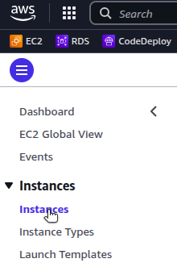

Find the EC2 instance you want to migrate. Note the instance ID and the instance type.

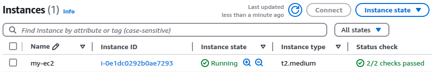

In the example above, the instance ID is i-0e1dc0292b0ae7293 and the instance type is t2.medium.

#### CPU and Memory Usage

To determine the CPU and memory usage of your EC2 instance, run the following command with the AWS CLI, inserting the appropriate instance type:

```command
aws ec2 describe-instance-types \--instance-types=t2.medium \
    | jq '.InstanceTypes[0] | {VCpuInfo, MemoryInfo}'
```

```output
{
  "VCpuInfo": {
    "DefaultVCpus": 2,
    "DefaultCores": 2,
    "DefaultThreadsPerCore": 1
  },
  "MemoryInfo": {
    "SizeInMiB": 4096
  }
}
```

#### Storage Usage

Navigate to the **Storage** tab for your EC2 instance.

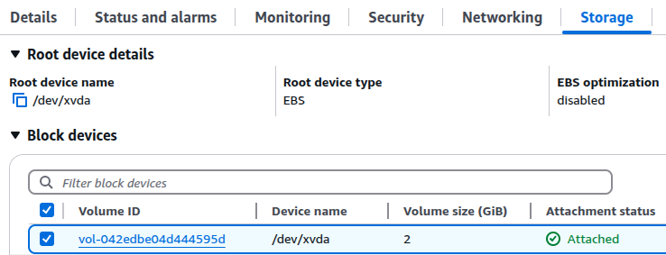

Click the listed volume to view additional details about storage.

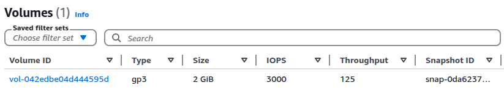

In the above example, the storage volume attached to the EC2 instance is type gp3, with a size of 2 GiB.

You can also obtain this information by running the following command, inserting the instance ID for your specific EC2 instance:

```command
aws ec2 describe-volumes \
    --filters "Name=attachment.instance-id,Values=i-0e1dc0292b0ae7293" \
    | jq '.Volumes[0] | {Size, VolumeType}'
```

```output
{
  "Size": 2,
  "VolumeType": "gp3"
}
```

#### IP Addresses

On the instance summary page for your EC2, you can find your instance's public and private IP addresses.

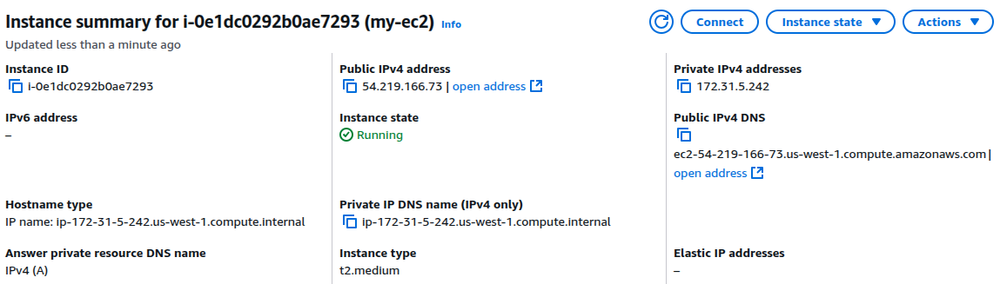

You can also retrieve this information from the command line:

```command
aws ec2 describe-instances
    --instance-ids i-0e1dc0292b0ae7293 \
    | jq \
      '.Reservations[0].Instances[0] | {PublicIpAddress,PrivateIpAddress}'
```

```output
{
  "PublicIpAddress": "54.219.166.73",
  "PrivateIpAddress": "172.31.5.242"
}
```

#### Security Groups and Firewall Rules

Navigate to the **Security** tab for information about associated security groups and firewall rules.

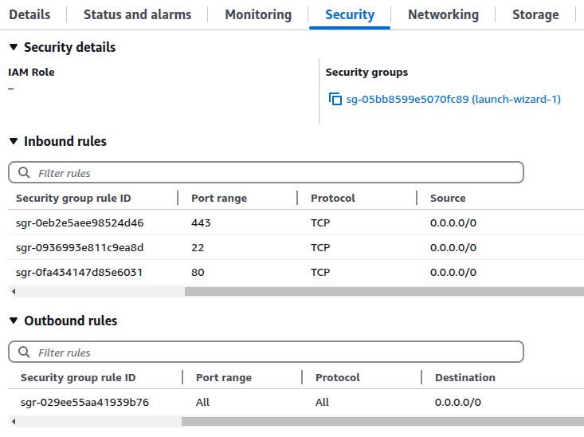

At the command line, you can use the security group rule IDs to obtain the detailed firewall rule information. For example:

```command
aws ec2 describe-security-group-rules \
  --security-group-rule-ids \
    sgr-0eb2e5aee98524d46 \
    sgr-0936993e811c9ea8d \
    sgr-0fa434147d85e6031 \
    sgr-029ee55aa41939b76
```

```output
{
    "SecurityGroupRules": [
        {
            "SecurityGroupRuleId": "sgr-0eb2e5aee98524d46",
            "GroupId": "sg-05bb8599e5070fc89",
            "GroupOwnerId": "153917289119",
            "IsEgress": false,
            "IpProtocol": "tcp",
            "FromPort": 443,
            "ToPort": 443,
            "CidrIpv4": "0.0.0.0/0",
            "Tags": []
        },
        {
            "SecurityGroupRuleId": "sgr-0936993e811c9ea8d",
            "GroupId": "sg-05bb8599e5070fc89",
            "GroupOwnerId": "153917289119",
            "IsEgress": false,
            "IpProtocol": "tcp",
            "FromPort": 22,
            "ToPort": 22,
            "CidrIpv4": "0.0.0.0/0",
            "Tags": []
        },
        {
            "SecurityGroupRuleId": "sgr-0fa434147d85e6031",
            "GroupId": "sg-05bb8599e5070fc89",
            "GroupOwnerId": "153917289119",
            "IsEgress": false,
            "IpProtocol": "tcp",
            "FromPort": 80,
            "ToPort": 80,
            "CidrIpv4": "0.0.0.0/0",
            "Tags": []
        },
        {
            "SecurityGroupRuleId": "sgr-029ee55aa41939b76",
            "GroupId": "sg-05bb8599e5070fc89",
            "GroupOwnerId": "153917289119",
            "IsEgress": true,
            "IpProtocol": "-1",
            "FromPort": -1,
            "ToPort": -1,
            "CidrIpv4": "0.0.0.0/0",
            "Tags": []
        }
    ]
}
```

#### Other Networking-Related Configurations

Determine if your EC2 instance has any associated load balancer resources or custom DNS configurations. Capture this information, as it may affect how you provision your Linode instance and configure its networking resources.

### Back up Your Data on AWS EC2

Creating a comprehensive backup of your EC2 instance ensures you can restore your environment in case of unexpected issues during the migration. By assessing your instance requirements and creating backups, migrating existing VMs to Akamai Cloud can proceed with minimal risk.

AWS provides two approaches to creating a backup:

1.   **Create a snapshot**: A snapshot captures a point-in-time copy of your data. Within the AWS Console, navigate to the details page for your EBS volume. Click **Actions**, then select **Create Snapshot**.

    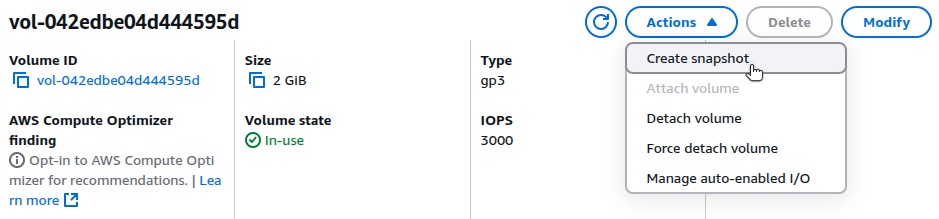

1.   **Create an Amazon Machine Image (AMI):** An AMI provides a full backup of your EC2 instance, including its OS, applications, and configuration. You can also import this image to Akamai Cloud when migrating a VM, which is the approach this guide demonstrates.


Backups on AWS may incur costs. See Amazon for pricing information on backing up your data.


## Migrating to Akamai Cloud

Migrating from AWS EC2 to Akamai Cloud primarily involves capturing and exporting the instance image from AWS, then importing it when deploying a new Linode instance.

### Export Your AWS EC2 Environment

#### Create AMI

Create an AMI to export your EC2 instance as a transferable, virtual machine image. From the EC2 instance summary page, click **Instance state > Image and templates > Create image**.

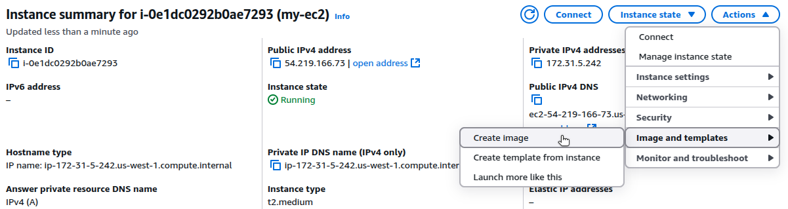

Provide a name and description for your image. Then, click **Create image**.

To create an AMI from the command line, run the following command:

```command
aws ec2 create-image \
    --instance-id i-0e1dc0292b0ae7293 \
    --name "ec2-pre-migration-image" \
    --description "EC2 instance prior to Linode migration" \
    --no-reboot
```

```output
{
    "ImageId": "ami-0b5823d737dcd831a"
}
```

The `--no-reboot` flag is optional and ensures the instance does not reboot during the image creation process. If you prefer a clean shutdown, then remove this flag. The output of the command is the ID of the newly created image.

To list existing images and monitor image creation status, use the `describe-images` command:

```command
aws ec2 describe-images --owner self
```

```output
{
    "Images": [
        {
            ...
            "ImageId": "ami-0b5823d737dcd831a",
            "ImageType": "machine",
            "Public": false,
            "PlatformDetails": "Linux/UNIX",
            "UsageOperation": "RunInstances",
            "State": "available",
            "BlockDeviceMappings": [
                {
                    "DeviceName": "/dev/xvda",
                    "Ebs": {
                        "DeleteOnTermination": true,
                        "Iops": 3000,
                        "SnapshotId": "snap-0cfa25763b370690d",
                        "VolumeSize": 2,
                        "VolumeType": "gp3",
                        "Throughput": 125,
                        "Encrypted": false
                    }
                }
            ],
            "Description": "EC2 instance prior to Linode migration",
            "EnaSupport": true,
            "Hypervisor": "xen",
            "Name": "ec2-pre-migration-image",
            "RootDeviceName": "/dev/xvda",
            "RootDeviceType": "ebs",
            ...
            "SourceInstanceId": "i-0e1dc0292b0ae7293"
        }
    ]
}
```

The `State` of the image will transition from `pending` to `available`.

#### Create S3 Bucket

Once the AMI is available, export it as a virtual machine image. The [`export-image`](https://docs.aws.amazon.com/cli/latest/reference/ec2/export-image.html) command from AWS supports the following disk formats:

-   RAW (`.img`): The required format for Linode
-   VMDK: The required format for VMWare
-   VHD: The required format for Hyper-V

The image will be exported to AWS S3. Before you can export it, create an S3 bucket to store it.

```command
aws s3 mb s3://ec2-backup-images-for-migration
```

```output
make_bucket: ec2-backup-images-for-migration
```


If you don’t already have an S3 bucket for storing your backup, new or additional S3 buckets may incur costs from AWS. See Amazon for S3 pricing information.


#### Set up Permissions for Exporting AMI to S3

Grant permissions for the AWS EC2 service to export to the S3 bucket. Add the following policy to the newly created bucket:

```file
{
  "Version": "2012-10-17",
  "Statement": [
    {
      "Effect": "Allow",
      "Principal": { "Service": "vmie.amazonaws.com" },
      "Action": "s3:PutObject",
      "Resource": "arn:aws:s3:::/*",
      "Condition": {
        "StringEquals": { "aws:SourceAccount": "" }
      }
    }
  ]
}
```

Replace  and  with the appropriate values.

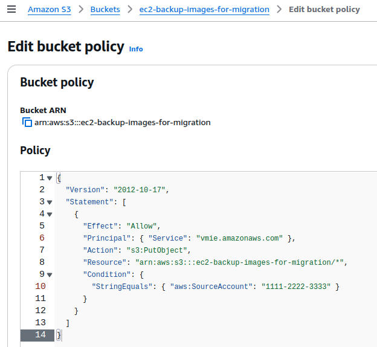

AWS [requires the `vmimport` role](https://docs.aws.amazon.com/vm-import/latest/userguide/required-permissions.html) to export AMIs. If this role is missing, then create it manually. To create this role, first create a trust policy JSON file (named `trust-policy.json`) with the following content:

```file
{
    "Version": "2012-10-17",
    "Statement": [
        {
            "Effect": "Allow",
            "Principal": { "Service": "vmie.amazonaws.com" },
            "Action": "sts:AssumeRole",
            "Condition": {
                "StringEquals":{
                    "sts:Externalid": "vmimport"
                }
            }
        }
    ]
}
```

Assuming the file is saved in `/home/user` folder, run the following command to create the role:

```command
aws iam create-role \
    --role-name vmimport \
    --assume-role-policy-document file:///home/user/trust-policy.json
```

Next, create a permissions policy (in a file named `permissions-policy.json`) with the following contents:

```command
{
  "Version": "2012-10-17",
  "Statement": [
    {
      "Effect": "Allow",
      "Action": [
        "s3:GetBucketLocation",
        "s3:GetObject",
        "s3:PutObject"
      ],
      "Resource": "arn:aws:s3:::/*"
    },
    {
      "Effect": "Allow",
      "Action": [
        "ec2:CancelConversionTask",
        "ec2:CancelExportTask",
        "ec2:CreateImage",
        "ec2:CreateInstanceExportTask",
        "ec2:CreateTags",
        "ec2:Describe*",
        "ec2:ExportImage",
        "ec2:ImportInstance",
        "ec2:ImportVolume",
        "ec2:StartInstances",
        "ec2:StopInstances",
        "ec2:TerminateInstances",
        "ec2:ImportImage",
        "ec2:ImportSnapshot",
        "ec2:ModifySnapshotAttribute",
        "ec2:CopySnapshot",
        "ec2:RegisterImage",
        "ec2:CancelImportTask"
      ],
      "Resource": "*"
    }
  ]
}
```

Replace  with the appropriate value.

Attach this policy to the newly created `vmimport` role by running the following command:

```command
aws iam put-role-policy \
  --role-name vmimport \
  --policy-name vmimport-permissions \
  --policy-document file:///home/user/permissions-policy.json
```

#### Export AMI to S3

Run the following command to export the AMI as a RAW disk image to your S3 bucket, making sure to insert your specific AMI ID and S3 bucket name:

```command
aws ec2 export-image \
    --image-id  \
    --disk-image-format RAW \
    --s3-export-location \
      S3Bucket=,S3Prefix=exports/
```

```output
{
    "DiskImageFormat": "RAW",
    "ExportImageTaskId": "export-ami-9dadaf55b2b57810t",
    "ImageId": "ami-0b5823d737dcd831a",
    "Progress": "0",
    "S3ExportLocation": {
        "S3Bucket": "ec2-backup-images-for-migration",
        "S3Prefix": "exports"
    },
    "Status": "active",
    "StatusMessage": "validating"
}
```

Exporting the image may take several minutes or more. To check on the status, run the following command, inserting the `ExportImageTaskId` from the result of the previous command:

```command
aws ec2 describe-export-tasks \
    --export-task-ids export-ami-9dadaf55b2b57810t
```

```output
{
    "ExportTasks": [
        {
            "ExportTaskId": "export-ami-9dadaf55b2b57810t",
            "ExportToS3Task": {
                "DiskImageFormat": "RAW",
                "S3Bucket": "ec2-backup-images-for-migration"
            },
            "InstanceExportDetails": {},
            "State": "active"
        }
    ]
}
```

When the `State` value changes to `completed`, the image is ready for download from the S3 bucket.

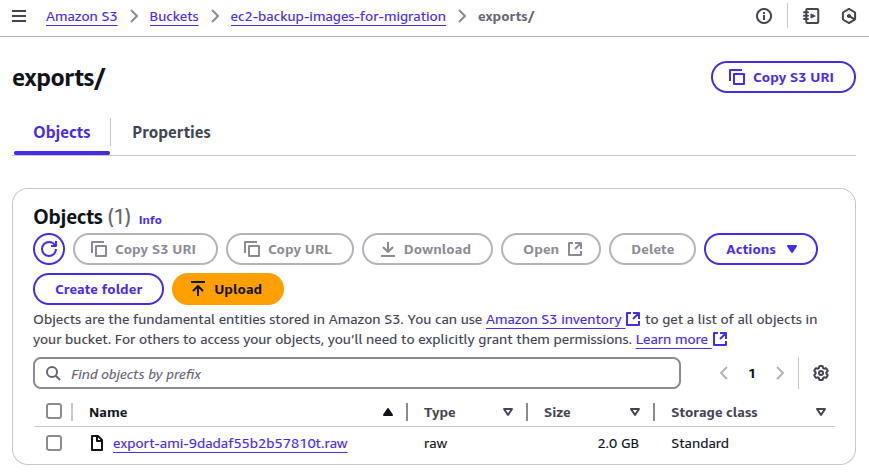

#### Download Image File from S3

Download the generated .raw file from S3 to your local machine. This can be done through the AWS Console or by running the following command:

```command
aws s3 cp s3:///exports/ ./
```

```command
ls -h *.raw
```

```output
-rw-rw-r-- 2.0G export-ami-9dadaf55b2b57810t.raw
```

### Import and Deploy VM Image on Akamai Cloud

To provision a Linode Compute Instance by importing an existing VM image, ensure the image is in the proper format and compressed with `gzip`.

#### Prepare Image File for Import

The export task from AWS above produces an image with the `.raw` file extension. Linode expects an image file with an `.img` extension. To convert the file type, rename the file to use the `.img` extension, and it will be ready for import.

```command
mv export-ami-9dadaf55b2b57810t.raw export-ami-9dadaf55b2b57810t.img
```

Compress the image using `gzip` to reduce its size:

```command
gzip export-ami-9dadaf55b2b57810t.img
```

```command
ls -h *.gz
```

```output
-rw-rw-r-- 422M export-ami-9dadaf55b2b57810t.img.gz
```

#### Upload Compressed File to Akamai Cloud

You can use the Linode CLI to upload the compressed image file. Replace the `.gz` file with your specific file name. Specify the label, description, and region based on your specific use case.

```command
linode-cli image-upload \
    --label "aws-ec2-migration-ami" \
    --description "AWS EC2 Import" \
    --region "us-lax" \
    ./export-ami-9dadaf55b2b57810t.img.gz
```

```output
┌-----------------------┬-----------┬----------------┐
│ label                 │ is_public │ status         │
├-----------------------┼-----------┼----------------┤
│ aws-ec2-migration-ami │ False     │ pending_upload │
└-----------------------┴-----------┴----------------┘
```

The upload may take several minutes, depending on the size of your image and your internet speed.

#### Verify the Successful Image Upload

After the upload, ensure the image is successfully processed and available for use. Run the following command to list your private images:

```command
linode-cli images list --is_public false
```

```output
┌------------------┬-----------------------┬-----------┬--------┐
│ id               │ label                 │ status    │ size   │
├------------------┼-----------------------┼-----------┼--------┤
│ private/29293519 │ aws-ec2-migration-ami │ available │ 2048   │
└------------------┴-----------------------┴-----------┴--------┘
```

Verify that the `status` of the image is `available`. If the `status` is `pending`, wait a few minutes and then check again.

#### Launch a Linode Compute Instance from the Uploaded Image

Once the image is available, you can deploy it to a new Linode Compute instance. For this command, provide the ID of your uploaded image, which was displayed when running the previous command. In addition, provide the following:

-   `--label`: A unique label for your instance.
-   `--region`: The region for your instance.
-   `--type`: The size of the instance to deploy.
-   `--root_pass`: A unique, secure root password for your new instance.

The following example deploys a `g6-standard-2` Linode, which has two cores, 80 GB disk, and 4 GB RAM with a 4000 Mbps transfer rate. Recall that the original AWS EC2 instance for this migration is a `t2.medium`, which has two vCPUs and 4 GiB RAM. Therefore, the `g6-standard-2` Linode instance is comparable.

See the [pricing page for Akamai Cloud](https://www.linode.com/pricing/#compute-shared) for details on different Linode types.

```command
linode-cli linodes create \
    --image  \
    --label "migrated-from-aws-ec2" \
    --region "us-lax" \
    --type "g6-standard-2" \
    --root_pass ""
```

```output
┌-----------------------┬--------┬---------------┬--------------┐
│ label                 │ region │ type          │ status       │
├-----------------------┼--------┼---------------┼--------------┤
│ migrated-from-aws-ec2 │ us-lax │ g6-standard-2 │ provisioning │
└-----------------------┴--------┴---------------┴--------------┘
```

After several minutes, your Linode Compute Instance will be up and running, based on the exported VM image from your original cloud provider.

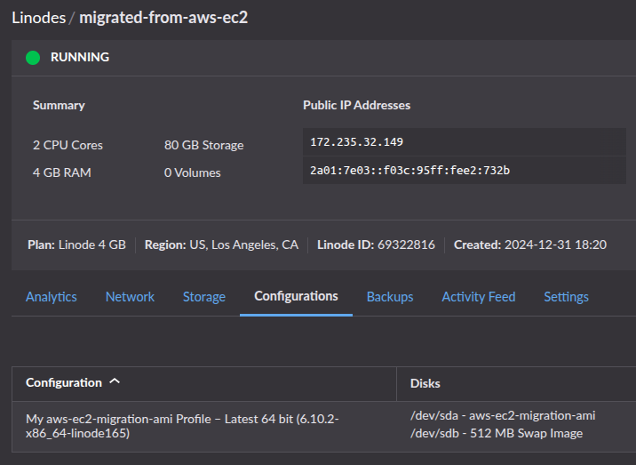

### Configure and Validate the Linode Instance

By performing a migration with an AMI that captures your EC2 instance and volume in full, you ensure that the operating system and all installed software and services exist on the newly provisioned Linode. This reduces the amount of time needed to configure the Linode instance to closely match the environment of the original VM.

However, you must perform steps to configure networking to align with your needs. Recall the configurations from your original EC2 instance. As applicable, port these configurations to your Linode environment:

-   [IP Addresses](https://techdocs.akamai.com/cloud-computing/docs/managing-ip-addresses-on-a-compute-instance)
-   [Firewall Rules](https://techdocs.akamai.com/cloud-computing/docs/getting-started-with-cloud-firewalls)
-   [Load Balancing](https://techdocs.akamai.com/cloud-computing/docs/nodebalancer)
-   [DNS](https://techdocs.akamai.com/cloud-computing/docs/getting-started-with-dns-manager)

Linode does not have a direct equivalent to AWS security groups. However, you can still implement a firewall with rules to control traffic. Options include:

-   [Akamai Cloud Firewall](https://techdocs.akamai.com/cloud-computing/docs/cloud-firewall), for setting up inbound and outbound rules on Linode Compute Instances, either through the Linode API or the Linode CLI.
-   [`iptables`](/docs/guides/control-network-traffic-with-iptables/) or [`ufw`](/docs/guides/configure-firewall-with-ufw/), which run from within the Linode instance to manage the Linux kernel firewall (Netfilter).

Akamai Cloud provides [NodeBalancers](https://www.linode.com/products/nodebalancers/), which are equivalent to AWS Application Load Balancers (ALB). If you are migrating an EC2 instance with an ALB attached, you can implement a similar configuration for your Linode.

If you used AWS Route53 to implement DNS rules to route traffic to your EC2 instance, then you will need to modify your DNS settings to ensure traffic routes to your new Linode instance. This may involve pointing nameservers to Akamai Cloud and creating DNS rules within the Akamai Cloud Manager.

After completing your configurations, test your Linode instance to verify that the migration was successful. Validation steps may include:

-   **Check Running Services**. Ensure that all critical services, such as web servers, databases, and application processes are running as expected and configured to start on boot.
-   **Test Application Functionality**. Access any applications on the new Linode through their web interface or API endpoints to confirm that they behave as expected, including core functionality and error handling.
-   **Inspect Resource Utilization**. Monitor CPU, memory, and disk usage on the Linode to ensure the system performs within acceptable thresholds post-migration.
-   **Validate DNS Configuration**. Ensure DNS changes (if made) are propagating correctly, pointing to your Linode instance, and resolving to the expected IP addresses.
-   **Check External Connectivity**. Verify that the instance can access any required external resources, such as third-party APIs, databases, or storage, and that outbound requests succeed.
-   **Review Logs**. Examine system and application logs for errors or warnings that might indicate migration-related issues.
-   **Backup and Snapshot Functionality**. Confirm that backups and snapshots can be created successfully on Linode to safeguard your data post migration.
-   **Verify Externally Attached Storage**: Ensure that any additional storage volumes, block devices, or network-attached storage are properly mounted and accessible. Check `/etc/fstab` entries and update disk mappings as needed.

## Additional Considerations

### Cost Management

Review the pricing for your current AWS EC2 instance ([compute](https://aws.amazon.com/ec2/pricing/on-demand/#On-Demand_Pricing), [storage](https://aws.amazon.com/ebs/pricing/), and [bandwidth](https://aws.amazon.com/ec2/pricing/on-demand/#Data_Transfer)). Compare this with the [pricing plans for Akamai Cloud](https://www.linode.com/pricing/). Use [Akamai’s Cloud Computing Calculator](https://www.linode.com/cloud-computing-calculator/) to estimate potential costs.

### Data Consistency and Accuracy

Verify that the Linode migrated from the image export contains all necessary files, configurations, and application data. Double check for corrupted or missing files during the image export and upload process. Verification steps may include:

* **Generate and Compare File Checksums**: Use tools like `md5sum` to generate checksums of critical files or directories on both the source VM and the migrated Linode. Ensure the checksums match to confirm data integrity.
* **Count Files and Directories**: Use `find` or `ls` commands to count the number of files and directories in key locations (e.g. `find /path -type f | wc -l`). Compare these counts between the source and destination to identify any discrepancies.
* **Check Application Logs and Settings**: Compare configuration files, environment variables, and application logs between the source and the destination to confirm they are identical or appropriately modified for the new environment. Common locations to review may include:

    | Application           | Configuration           | Location                       |
    |-----------------------|-------------------------|--------------------------------|
    | **Apache Web Server** | Main                    | `/etc/apache2/apache2.conf`    |
    |                       | Virtual hosts           | `/etc/apache2/sites-available` |
    |                       |                         | `/etc/apache2/sites-enabled`   |
    | **NGINX Web Server**  | Main                    | `/etc/nginx/nginx.conf`        |
    |                       | Virtual hosts           | `/etc/nginx/sites-available`   |
    |                       |                         | `/etc/nginx/sites-enabled`     |
    | **Cron**              | Application             | `/etc/cron.d`                  |
    |                       | System-wide cron jobs   | `/etc/crontab`                 |
    |                       | User-specific cron jobs | `/var/spool/cron/crontabs`     |
    | **MySQL/MariaDB**     | Main                    | `/etc/mysql`                   |
    | **PostgreSQL**        | Main                    | `/etc/postgresql`              |
    | **SSH**               | Main                    | `/etc/ssh/sshd_config`         |
    | **Networking**        | Hostname                | `/etc/hostname`                |
    |                       | Hosts file              | `/etc/hosts`                   |
    | **Rsyslog**           | Main                    | `/etc/rsyslog.conf`            |

-   **Review Symbolic Links and Permissions**: Use CLI tools and commands to confirm that symbolic links and file permissions on the migrated Linode match those on the source VM. Examples include:

    | Description                                                                                                                                             | Command                                                                     |
    |---------------------------------------------------------------------------------------------------------------------------------------------------------|-----------------------------------------------------------------------------|
    | List all symbolic links in folder (recursive)                                                                                                           | `ls -Rla /path/to/folder \| grep "->"`                                      |
    | Calculate md5 hash for all files in a folder, then sort by filename and write to file. Then, compare files from both VMs using `diff`.                  | `find /path/to/folder/ -type f -exec md5sum {} + \| sort -k 2 > hashes.txt` |
    | Write to file the folder contents (recursive) with permissions, owner name, and group name. Then, compare permissions files from both VMs using `diff`. | `tree /path/to/folder -fpuig > permissions.txt`                             |

After deploying your Linode, confirm that configurations (network settings, environment variables, and application dependencies) match the original VM to avoid runtime issues.

### Security and Access Controls

AWS IAM roles govern instance access. Migrate these roles and permissions to Linode by setting up Linode API tokens and fine-tuning user permissions.

Use the Linode Cloud Firewall or existing system firewall on your instance to restrict access. Ensure SSH keys are properly configured, and disable root login if not required. Map AWS security group policy rules to your firewall for consistent protection.

### Alternative Migration Options

This guide covered migrating a VM by creating a disk image of the original AWS EC2 instance and importing that image to Akamai Cloud as the basis of a new Linode Compute Instance. When cloud provider restrictions or image size limits make this approach unavailable, consider other migration options, including:

-   **Rclone**: For example, provision a Linode Compute Instance with resource levels comparable to your original VM. Then, use [rclone](https://rclone.org/)—a command line utility for managing files in cloud storage—to move all data from your original VM to your new Linode. This can effectively move your workloads from your AWS VM to your Linode.

-   **IaC**: You can also leverage infrastructure-as-code (IaC) and configuration management tools to streamline your migration process. Tools like [Ansible](https://docs.ansible.com/ansible/latest/index.html), [Terraform](https://www.terraform.io/), [Chef](https://www.chef.io/products/chef-infra), and [Puppet](https://www.puppet.com/why-puppet/use-cases/continuous-configuration-automation) can help you automatically replicate server configurations, deploy applications, and ensure consistent settings across your source and destination VMs. By using these tools, you can create repeatable migration workflows that reduce manual intervention and minimize the risk of configuration errors during the transition.

-   **Containerization**: Another option is to containerize any workloads on your original VM. These containerized images can be run in the Akamai Cloud. For example, you can provision a [Linode Kubernetes Engine (LKE)](https://techdocs.akamai.com/cloud-computing/docs/linode-kubernetes-engine) cluster to host and run these containers, thereby removing the need for a VM.

## Resources

AWS:
-   [EC2 export-image documentation](https://docs.aws.amazon.com/cli/latest/reference/ec2/export-image.html)

Akamai Cloud:
-   [Linode CLI and Object Storage](https://techdocs.akamai.com/cloud-computing/docs/using-the-linode-cli-with-object-storage)
-   [Uploading an image](https://techdocs.akamai.com/cloud-computing/docs/upload-an-image)
-   [Deploying an Image](https://techdocs.akamai.com/cloud-computing/docs/deploy-an-image-to-a-new-compute-instance)

Other:
-   [QEMU Disk Imaging Utility](https://www.qemu.org/download/)
-   [rclone](https://rclone.org/)