In modern cloud computing, virtual machine (VM) migration is a process that enables organizations to transition workloads between cloud platforms to optimize costs, improve performance, or enhance flexibility. By migrating VMs, organizations can select the capabilities of various cloud providers that best satisfy their business needs.

This guide focuses on migrating a VM from Google Cloud Platform (GCP) to Akamai Cloud using disk images suggests how to plan, execute, and validate the migration.

## Before You Begin

1.  Log in to your [Akamai Cloud](https://www.linode.com/cfe) account to prepare the destination environment.

1.  Create a [Linode API token (personal access token)](/docs/products/platform/accounts/guides/manage-api-tokens/) so you can authenticate with the Linode CLI.

1.  Install and configure the [Linode CLI](/docs/products/tools/cli/guides/install/) on your local system.

1.  You must also have access to a GCP account with sufficient permissions to work with Disks, Storage, and Build Jobs.

1.  Install and configure the [GCP CLI](https://cloud.google.com/sdk/docs/install-sdk) (`gcloud`) to interact with your GCP VM instances.

1.  Install [QEMU](https://www.qemu.org/) to convert the exported disk image into a format compatible with Akamai Cloud.


This guide is written for a non-root user. Commands that require elevated privileges are prefixed with `sudo`. If you’re not familiar with the `sudo` command, see the [Users and Groups](/docs/guides/linux-users-and-groups/) guide.


## Preparing Your Compute Engine Image for Migration

Before migrating, review your GCP environment to ensure compatibility with Akamai Cloud. Note any instance-specific dependencies, such as storage size, image type, or hardware requirements, that may impact the transition.

Record the configuration details of your Compute Engine VM to help choose an [Akamai Cloud plan](https://www.linode.com/pricing/#compute-shared) that matches your resource needs after migration.


[Images imported into Akamai Cloud](https://techdocs.akamai.com/cloud-computing/docs/upload-an-image) must be smaller than 6 GB unzipped or 5 GB zipped. Images exceeding the size limit are rejected during upload and not imported.


### Assess Current Compute Engine Requirements

Assess your Compute Engine VM using either the GCP Console or the gcloud CLI. Use these methods to gather the CPU, memory, storage, networking, and firewall details needed for migration.



#### Machine Type, CPU, and Memory

1.  In the GCP Console, navigate to **Compute Engine > VM instances**:

    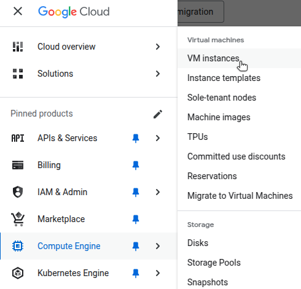

1.  Select the instance you intend to migrate to view its details:

    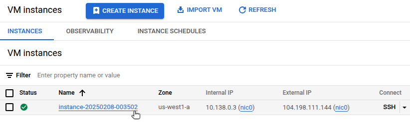

    Note the **Name** (e.g. `instance-20250208-003502`) and **Zone** (e.g. `us-west1-a`).

1.  In the **Machine Configuration** section of the **Details** page, review the **Machine type** (e.g. `e2-medium`):

    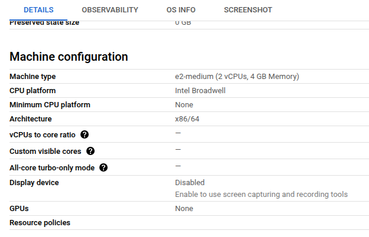

    For this guide, the example Compute Instance VM has 2 CPUs and 4GB of memory.

#### Storage

4.  Scroll to the **Storage > Boot disk** section to view the type and size of the storage disk associated with your VM:

    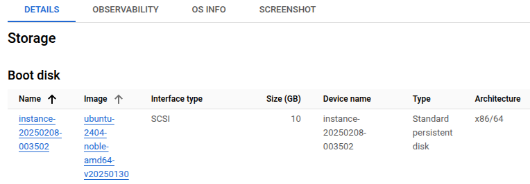

#### IP Addresses

5.  IP addresses are listed in the **Network Interfaces** section of the instance **Details** page:

    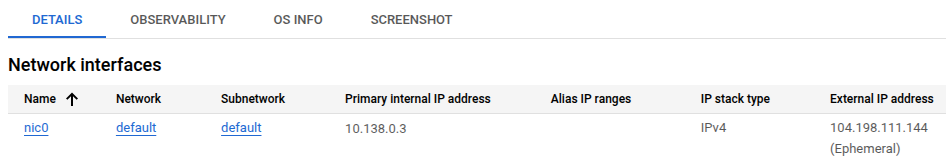

#### Security Groups and Firewall Rules

6.  In the **Network Interfaces** section, select the network name to view its associated firewall rules and other network settings:

    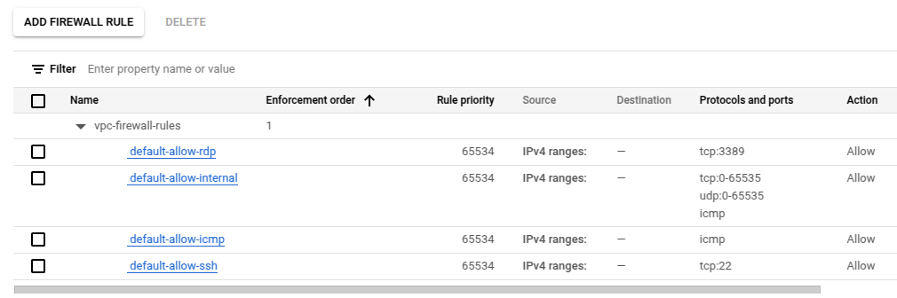


#### Machine Type

1.  List all projects in your account:

    ```command
    gcloud projects list
    ```

    ```output
    PROJECT_ID                  NAME             PROJECT_NUMBER
    gcp-vm-migration            GCP VM Migration 123456789012
    another-project-id          Another Project  987654321098
    ```

1.  Set your desired  to the active project in `gcloud` (e.g. `gcp-vm-migration`):

    ```command
    gcloud config set project 
    ```

    ```output
    Updated property [core/project].
    ```

1.  List all VM instances in the selected project:

    ```command
    gcloud compute instances list
    ```

    ```output
    NAME                      ZONE           MACHINE_TYPE  PREEMPTIBLE  INTERNAL_IP  EXTERNAL_IP     STATUS
    instance-20250208-003502  us-west1-a     e2-medium     false        10.138.0.3    104.198.111.144  RUNNING
    ```

1.  Describe your instance to return its full machine type URL, replacing  (e.g. `instance-20250208-003502`) and  (e.g. `us-west1-a`):

    ```command
    gcloud compute instances describe  \
        --zone= \
        --format="value(machineType)"
    ```

    The  is the final part of the resulting URL (e.g. `e2-medium`):

    ```output
    https://www.googleapis.com/compute/v1/projects/gcp-vm-migration-450215/zones/us-west1-a/machineTypes/e2-medium
    ```

#### CPU and Memory

5.  Use the CLI to determine the CPU and memory configurations for this Compute Engine  (e.g. `e2-medium`):

    ```command
    gcloud compute machine-types \
        describe  \
        --zone=us- \
        --format="table(name, guestCpus, memoryMb)"
    ```

    ```output
    NAME       GUEST_CPUS  MEMORY_MB
    e2-medium  2           4096
    ```

    For this guide, the example Compute Instance VM has 2 CPUs and 4GB of memory.

#### IP Addresses

6.  Run the following `gcloud` command to find the internal and external IP address of the running instance:

    ```command
    gcloud compute instances list \
        --filter="name=" \
        --format=\ "table(name, networkInterfaces[0].accessConfigs[0].natIP, networkInterfaces[0].networkIP)"
    ```

    ```output
    NAME                      NAT_IP           NETWORK_IP
    instance-20250208-003502  104.198.111.144  10.138.0.3
    ```

####  Security Groups and Firewall Rules

7.  Run the following `gcloud` command to find all the firewall rules for a VM:

    ```command
    gcloud compute firewall-rules list --filter="network:default"
    ```

    ```output
    NAME                    DIRECTION  PRIORITY   ALLOW
    default-allow-icmp      INGRESS    65534      icmp
    default-allow-internal  INGRESS    65534      tcp:0-65535,udp:0-65535,icmp
    default-allow-rdp       INGRESS    65534      tcp:3389
    default-allow-ssh       INGRESS    65534      tcp:22
    ```



#### Optional: Back up Your Compute Engine Disk

Before starting your migration, consider backing up the Compute Engine disk in case a restoration is needed in the future.



1.  In the **Storage** section of your Compute Instance **Details** page, select the disk associated with the VM you wish to export:

    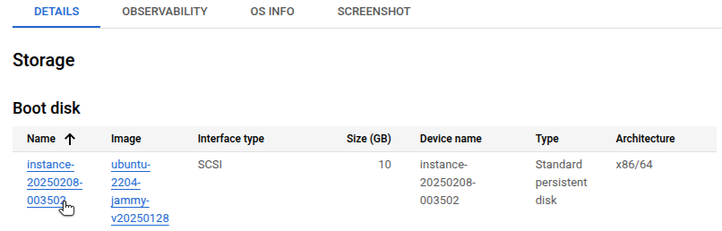

1.  Select **Create Snapshot**:

    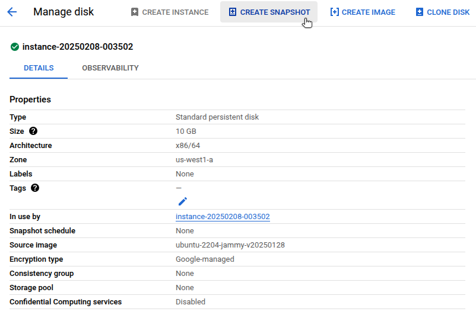


1.  Retrieve a list of available s:

    ```command
    gcloud compute snapshot-locations list
    ```

    You can choose either a regional location (e.g. `us-west-1`) or a multi-regional location (e.g. `us`):

    ```output
    NAME
    asia
    asia-east1
    europe
    europe-west1
    us
    us-central1
    us-west1
    ```

1.  Run the following `gcloud` command to create a backup of your GCP Compute Instance, replacing  with a name of your choosing (e.g. `my-vm-snapshot`):

    ```command
    gcloud compute snapshots \
        create  \
        --source-disk= \
        --source-disk-zone= \
        --storage-location=
    ```

    For Example:

    ```command
    gcloud compute snapshots \
        create my-vm-snapshot \
        --source-disk=instance-20250208-003502 \
        --source-disk-zone=us-west1-a \
        --storage-location=us-west1
    ```

    ```output
    Creating gce snapshot my-vm-snapshot...done.
    ```


## Migrating to Akamai Cloud

Migrating a Google Compute Engine VM to Akamai Cloud involves the following steps:

-   Export the VM disk image from your Compute Engine instance.
-   Resize and prepare the image file for import.
-   Upload the compressed image to Akamai Cloud.
-   Launch a new Linode Compute Instance from the uploaded image.
-   Verify and configure the new instance.

### Export Your Compute Engine VM Disk Image

Export your VM to a Machine Image using either the Google Cloud Console or the `gCloud` CLI:


1.  In the Google Cloud Console, navigate to **Compute Engine > Images**:

    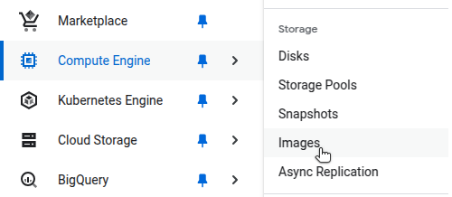

1.  Click **Create Image** at the top of the page. On the next screen, enter a name for the image, then your VM's disk as the **Source disk**:

    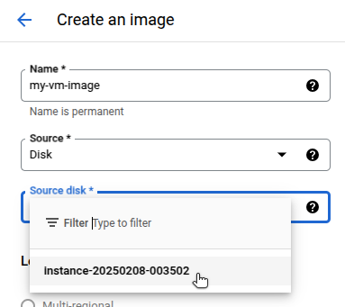

1.  Set any required location and encryption options, then click **Create**.


1.  Run the following `gCloud` CLI command to create an image, replacing  (e.g. `my-vm-image`),  (e.g. `instance-20250208-003502`),  (e.g. `us-west1-a`),  (e.g. `us-west1`), and  (e.g. `vm-migration-450215`) with your own values:

    ```command
    gcloud compute images create  \
        --source-disk= \
        --source-disk-zone= \
        --storage-location= \
        --project=
    ```

    ```output
    Created [https://www.googleapis.com/compute/v1/projects/gcp-vm-migration-450215/global/images/my-vm-image\].
    NAME         PROJECT                  FAMILY  DEPRECATED  STATUS
    my-vm-image  gcp-vm-migration-450215                      READY
    ```

1.  Confirm the image was created:

    ```command
    gcloud compute images list --filter="name="
    ```

    ```output
    NAME         PROJECT                  FAMILY  DEPRECATED  STATUS
    my-vm-image  gcp-vm-migration-450215                      READY
    ```



The following steps (exporting and downloading the image) require the `gcloud` CLI, as these operations are not available through the Google Cloud Console:

1.  Create a Cloud Storage bucket to store the exported image. Google has restrictions on which Cloud Storage bucket locations can export images, so be sure to choose from the [list of supported regions](https://cloud.google.com/build/docs/locations#restricted_regions_for_some_projects):

    ```command
    gcloud storage buckets create gs:// --location=
    ```

1.  Export the image to the bucket in `RAW` format, which is compatible with importing to Akamai Cloud:

    ```command
    gcloud compute images export \
        --destination-uri=gs:/// \
        --image= \
        --export-format=RAW \
        --project=
    ```

    ```output
    Created [https://cloudbuild.googleapis.com/v1/projects/gcp-vm-migration-450215/builds/b6d6fbf5-bc51-4228-9ca5-c1b988477fe4\].
    Logs are available at [https://console.cloud.google.com/cloud-build/builds/b6d6fbf5-bc51-4228-9ca5-c1b988477fe4?project=133697932277\].
    [image-export]: 2025-02-08T15:39:47Z Fetching image "my-vm-image" from project "gcp-vm-migration-450215".
    [image-export-ext]: 2025-02-08T15:39:48Z Validating workflow
    [image-export-ext]: 2025-02-08T15:39:48Z Validating step "setup-disks"
    [image-export-ext]: 2025-02-08T15:39:48Z Validating step "export-disk"
    [image-export-ext.export-disk]: 2025-02-08T15:39:48Z Validating step "setup-disks"
    [image-export-ext.export-disk]: 2025-02-08T15:39:48Z Validating step "run-export-disk"
    ...
    [image-export-ext]: 2025-02-08T15:39:50Z Uploading sources
    [image-export-ext]: 2025-02-08T15:39:50Z Running workflow
    [image-export-ext]: 2025-02-08T15:39:50Z Running step "setup-disks" (CreateDisks)
    ...
    [image-export-ext]: 2025-02-08T15:42:30Z Step "export-disk" (IncludeWorkflow) successfully finished.
    [image-export-ext]: 2025-02-08T15:42:30Z Running step "delete-disks" (DeleteResources)
    [image-export-ext.delete-disks]: 2025-02-08T15:42:30Z DeleteResources: Deleting disk "disk-image-export-ext".
    [image-export-ext]: 2025-02-08T15:42:30Z Step "delete-disks" (DeleteResources) successfully finished.
    [image-export-ext]: 2025-02-08T15:42:30Z Serial-output value -> source-size-gb:10
    [image-export-ext]: 2025-02-08T15:42:30Z Serial-output value -> target-size-gb:10
    [image-export-ext]: 2025-02-08T15:42:30Z Workflow "image-export-ext" cleaning up (this may take up to 2 minutes).
    [image-export-ext]: 2025-02-08T15:42:30Z Workflow "image-export-ext" finished cleanup.
    ```

1.  Verify the file was exported, replacing  with your actual bucket name (e.g. `migration-vm-images`):

    ```command
    gcloud storage ls gs://
    ```

    ```output
    gs://migration-vm-images/my-vm-image
    ```

1.  Download the file to your local machine:

    ```command
    gsutil cp gs:/// .
    ```

    ```output
    Copying gs://migration-vm-images/my-vm-image...
    | [1 files][ 10.0 GiB/ 10.0 GiB]   22.8 MiB/s
    Operation completed over 1 objects/10.0 GiB.
    ```

### Resize Disk Image

GCP persistent disks have a minimum size of 10 GB, so the exported image may be larger than actually necessary.

To import a VM image into Akamai Cloud, it must be smaller than 6 GB unzipped or 5 GB zipped. If your actual disk usage is below those limits, you can reduce the image size by deallocating unused disk space and truncating the disk size.

Shrinking the disk image size involves using [GParted](https://gparted.org/), [`fdisk`](https://tldp.org/HOWTO/Partition/fdisk_partitioning.html), and [`qemu-img`](https://qemu-project.gitlab.io/qemu/tools/qemu-img.html) on your local machine.

1.  Check the current size of the disk image file in megabytes:

    ```command
    du -BM 
    ```

    ```output
    10241M	my-vm-image
    ```

1.  GParted works on block devices, not raw image files, so you must create a [loopback device](https://wiki.osdev.org/Loopback_Device) for your image. Enable loopback support:

    ```command
    sudo modprobe loop
    ```

1.  Create a loopback device and return its path:

    ```command
    sudo losetup -f
    ```

    ```output
    /dev/loop48
    ```

1.  Associate the device with the disk image:

    ```command
    sudo losetup /dev/loop48 
    ```

1.  Load the image partitions:

    ```command
    sudo partprobe /dev/loop48
    ```

1.  Backup the GUID Partition Table (GPT):

    ```command
    sudo sgdisk -b gpt-backup.bin 
    ```

1.  Open GParted on the device:

    ```command
    sudo gparted /dev/loop48
    ```

1.  In GParted, select the unused space in the file system partition:

    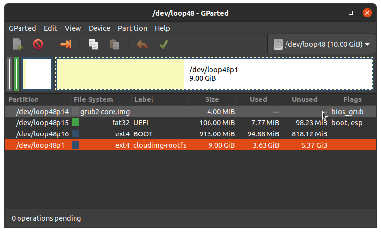

1.  Open the **Partition** file menu entry, then select **Resize/Move**:

    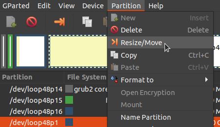

1.  Shrink the partition to eliminate most of the unused space:

    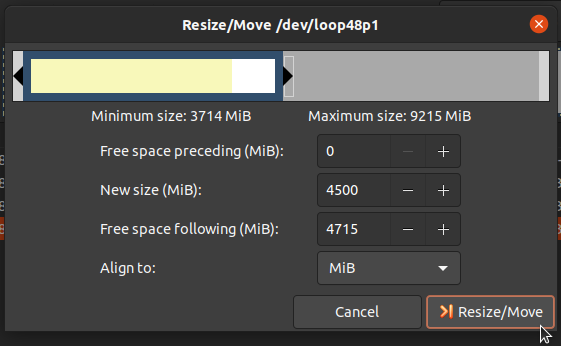

1.  Select **Resize/Move**, and then click the green checkmark to apply this change.

    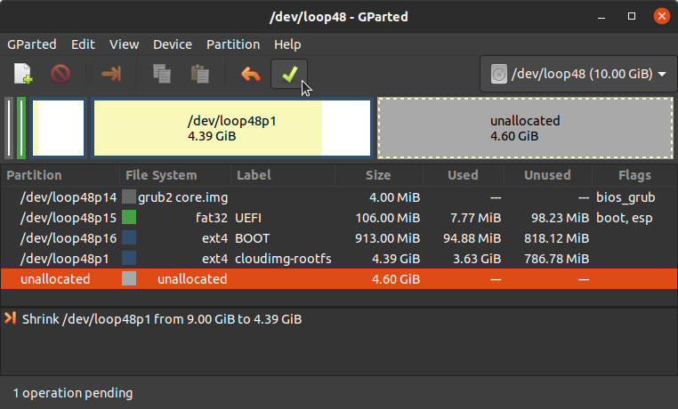

    When done, close GParted.

1.  Use `sgdisk` to shrink the partition table to match the last used partition:

    ```command
    sudo sgdisk --set-alternative-lba 
    ```

1.  Use [`qemu-img`](https://qemu-project.gitlab.io/qemu/tools/qemu-img.html) to shrink the disk image file, leaving some additional buffer space. For example, if your disk image is approximately 5.5 GB, shrink the image file to 5.8 GB:

    ```command
    qemu-img resize -f raw --shrink  5.8G
    ```

1.  Use [`gdisk`](https://linux.die.net/man/8/gdisk) to recreate the partition table headers using:

    ```command
    sudo gdisk 
    ```

    Within `gdisk`, enter the following commands:

    -   `x`: Switch to expert mode.
    -   `e`: Relocate backup GPT to end of disk.
    -   `w`: Write the new GPT to disk and exit.
    -   `Y`: Confirm write when prompted.

    ```output
    ...
    Command (? for help): x

    Expert command (? for help): e
    Relocating backup data structures to the end of the disk

    Expert command (? for help): w

    Final checks complete. About to write GPT data. THIS WILL OVERWRITE EXISTING PARTITIONS!!

    Do you want to proceed? (Y/N): Y
    OK; writing new GUID partition table (GPT) to my-vm-image.
    Warning: The kernel is still using the old partition table.
    The new table will be used at the next reboot or after you run partprobe(8) or kpartx(8)
    The operation has completed successfully.
    ```

1.  Confirm that the resulting disk image file is now within the size constraints for import into Akamai Cloud:

    ```command
    du -BM 
    ```

    ```output
    5940M	my-vm-image
    ```

1.  Detach the loopback device:

    ```command
    sudo losetup -d /dev/loop48
    ```


For a deeper dive into this image-shrinking technique, see [Shrinking images on Linux](https://softwarebakery.com/shrinking-images-on-linux).


### Import and Deploy VM Image on Akamai Cloud

To provision a Linode by importing an existing VM image, ensure the image is in the proper format and compressed with `gzip`.

#### Prepare Image File for Import

Linode requires image files to use the `.img` extension. If your exported image file does not already have this extension, rename it accordingly.

1.  Rename the file to use the `.img` extension:

    ```command
    mv my-vm-image my-vm-image.img
    ```

1.  Compress the image using `gzip` to reduce its size:

    ```command
    gzip my-vm-image.img
    ```

1.  Confirm the compressed image was created and check its size:

    ```command
    du -BM my-vm-image.img.gz
    ```

    ```output
    1060M	my-vm-image.img.gz
    ```

#### Upload the Compressed File to Akamai Cloud

Use the Linode CLI to upload your compressed image file. Replace the filename with your specific `.gz` image, and specify the label, description, and region based on your use case.

```command
linode-cli image-upload \
    --label "gcp-vm-migration" \
    --description "GCP VM Import" \
    --region "us-lax" \
    ./my-vm-image.img.gz
```

```output
┌-----------------------┬-----------┬----------------┐
│ label                 │ is_public │ status         │
├-----------------------┼-----------┼----------------┤
│ gcp-vm-migration      │ False     │ pending_upload │
└-----------------------┴-----------┴----------------┘
```

The upload process may take several minutes depending on the size of your image and network speed.

#### Verify the Successful Image Upload

After uploading the image, verify that is was processed and is available for use. Run the following command to list your private images:

```command
linode-cli images list --is_public false
```

```output
┌------------------┬-----------------------┬-----------┬--------┐
│ id               │ label                 │ status    │ size   │
├------------------┼-----------------------┼-----------┼--------┤
│ private/30127625 │ gcp-vm-migration      │ available │ 5940   │
└------------------┴-----------------------┴-----------┴--------┘
```

Check that the `status` is `available`. If the `status` is `pending`, wait a few minutes and try again.

You can also monitor the upload status from the **Images** section of the Akamai Cloud Manager:

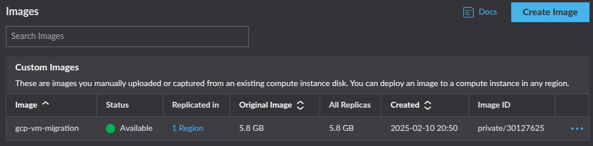

#### Launch a Linode Compute Instance from the Uploaded Image

Once your image is available, you can deploy it to a new Linode instance. For this command, provide the ID of your uploaded image (shown in the previous step). Also include the following values:

-   `--label`: A unique label for the instance.
-   `--region`: The preferred deployment region.
-   `--type`: The type of instance to deploy.
-   `--root_pass`: A secure root password for SSH access.

This example deploys a `g6-standard-2` Linode with 2 vCPUs, 80 GB storage, 4 GB RAM, and a 4000 Mbps transfer rate. This is a comparable configuration to the original GCP `e2-medium` VM instance, which also features 2 vCPUs and 4 GB RAM. See the [Akamai Cloud pricing page](https://www.linode.com/pricing/#compute-shared) for more details on available instance types and their associated costs.

```command
linode-cli linodes create \
    --image  \
    --label "migrated-from-gcp" \
    --region "us-lax" \
    --type "g6-standard-2" \
    --root_pass ""
```

```output
┌-----------------------┬--------┬---------------┬--------------┐
│ label                 │ region │ type          │ status       │
├-----------------------┼--------┼---------------┼--------------┤
│ migrated-from-gcp     │ us-lax │ g6-standard-2 │ provisioning │
└-----------------------┴--------┴---------------┴--------------┘
```

By default, Linode boots instances using its own kernel. To instead boot from the kernel embedded in your imported image:

1.  Navigate to your Linode under **Compute > Linodes** in the Akamai Cloud Manager.

1.  Select your Linode instance.

1.  Open the **Configurations** tab at the bottom, then click **Edit**.

    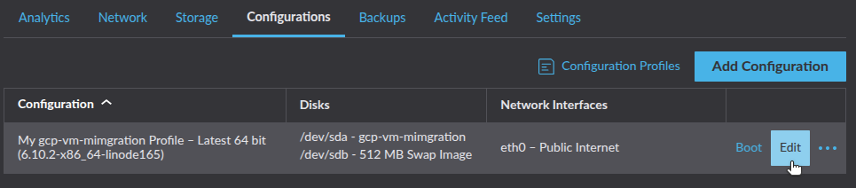

1.  Under **Boot Settings**, select **Direct Disk** as the kernel option.

    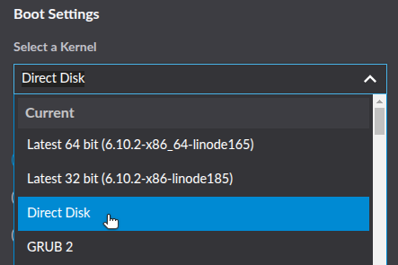

1.  Click **Save Changes**, then **Reboot** your Linode.

    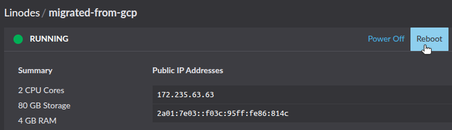

After several minutes, your Linode instance should be running using the image exported from your GCP VM.

### Configure and Validate the Linode Instance

Migrating using a disk image exported from your GCP VM and disk ensures that the operating system and all installed software and services are preserved on the newly provisioned Linode. This reduces the time needed to reconfigure the Linode instance to closely match the original VM.

However, you must still configure the Linode's networking to align with your workload. Refer to the configuration details from your original GCP Compute Engine VM and apply them to your Linode as appropriate:

-   [IP Addresses](https://techdocs.akamai.com/cloud-computing/docs/managing-ip-addresses-on-a-compute-instance)
-   [Firewall Rules](https://techdocs.akamai.com/cloud-computing/docs/getting-started-with-cloud-firewalls)
-   [Load Balancing](https://techdocs.akamai.com/cloud-computing/docs/nodebalancer)
-   [DNS](https://techdocs.akamai.com/cloud-computing/docs/getting-started-with-dns-manager)

Linode does not have a direct equivalent to GCP security groups. However, you can still implement a firewall with rules to control traffic. Options include:

-   [Linode Cloud Firewall](https://techdocs.akamai.com/cloud-computing/docs/cloud-firewall) to set up inbound and outbound rules through the Akamai Cloud Manager, the Linode CLI, or API.
-   [`iptables`](/docs/guides/control-network-traffic-with-iptables/) or [`ufw`](/docs/guides/configure-firewall-with-ufw/) to manage the Linux kernel firewall (Netfilter).

To replicate GCP’s HTTPS LoadBalancers, use Akamai Cloud's [NodeBalancers](https://www.linode.com/products/nodebalancers/) to distribute traffic across multiple Linode instances.

If you used Cloud DNS to route traffic to your GCP VM, you need to update your DNS records to route traffic to your new Linode instance instead. This may involve pointing your domain nameservers to Akamai Cloud and creating DNS rules within the Akamai Cloud Manager.

After completing your configurations, test your Linode instance to verify that the migration was successful. Validation steps may include:

-   **Check Running Services**: Confirm that all critical services (e.g. web servers, databases, and application processes) are running as expected and configured to start on boot.
-   **Test Application Functionality**: Access your applications through their web interface or API endpoints to confirm that they behave as expected, including core functionality and error handling.
-   **Inspect Resource Utilization**: Monitor the Linode's CPU, memory, and disk usage to ensure the system performs within acceptable thresholds post-migration.
-   **Validate DNS Configuration**: Ensure that any DNS changes are propagating correctly, pointing to your Linode instance, and resolving to the expected IP addresses.
-   **Check External Connectivity**: Verify that the Linode can access any required external resources (e.g. third-party APIs, databases, or storage) and that outbound requests succeed.
-   **Review Logs**: Examine system and application logs for errors or warnings that might indicate migration-related issues.
-   **Backup and Snapshot Functionality**: To safeguard your data post-migration, confirm that backups and snapshots can be created successfully.
-   **Verify Externally Attached Storage**: Ensure that any additional storage volumes, block devices, or network-attached storage are properly mounted and accessible. Check `/etc/fstab` entries and update disk mappings as needed.

## Additional Considerations

### Cost Management

Review the pricing for your current GCP Compute Engine VM instance including [compute](https://cloud.google.com/compute/vm-instance-pricing?hl=en), [storage](https://cloud.google.com/compute/disks-image-pricing?hl=en#tg1-t0), and [bandwidth](https://cloud.google.com/vpc/network-pricing?hl=en). Compare those costs with the [Akamai Cloud pricing plans](https://www.linode.com/pricing/) using [Akamai’s Cloud Computing Calculator](https://www.linode.com/cloud-computing-calculator/) to estimate your usage.

### Data Consistency and Accuracy

After importing your image and launching your Linode, verify that all expected files, configurations, and application data are intact. Verification steps may include:

-   **Generate and Compare File Checksums**: Use tools like `md5sum` to generate checksums of both the source VM and your Linode. Ensure the checksums match to confirm data integrity.
-   **Count Files and Directories**: Use commands like `find` or `ls` to count the number of files and directories in key locations (e.g. `find /path -type f | wc -l`). Compare these counts between the source VM and your Linode to identify any discrepancies.
-   **Check Application Logs and Settings**: Compare configuration files, environment variables, and application logs between the source VM and your Linode to confirm they are identical (or appropriately modified for the new environment). Common locations to review may include:

    | Application           | Configuration             | Location                       |
    |-----------------------|---------------------------|--------------------------------|
    | **Apache Web Server** | Main                      | `/etc/apache2/apache2.conf`    |
    |                       | Virtual hosts             | `/etc/apache2/sites-available` |
    |                       |                           | `/etc/apache2/sites-enabled`   |
    | **NGINX Web Server**  | Main                      | `/etc/nginx/nginx.conf`        |
    |                       | Virtual hosts             | `/etc/nginx/sites-available`   |
    |                       |                           | `/etc/nginx/sites-enabled`     |
    | **Cron**              | Application               | `/etc/cron.d`                  |
    |                       | System-wide `cron` jobs   | `/etc/crontab`                 |
    |                       | User-specific `cron` jobs | `/var/spool/cron/crontabs`     |
    | **MySQL/MariaDB**     | Main                      | `/etc/mysql`                   |
    | **PostgreSQL**        | Main                      | `/etc/postgresql`              |
    | **SSH**               | Main                      | `/etc/ssh/sshd_config`         |
    | **Networking**        | Hostname                  | `/etc/hostname`                |
    |                       | Hosts file                | `/etc/hosts`                   |
    | **Rsyslog**           | Main                      | `/etc/rsyslog.conf`            |

-   **Review Symbolic Links and Permissions**: Use CLI tools and commands to confirm that symbolic links and file permissions on your Linode match those on the source VM. Examples include:

    | Description                                                                                                                                             | Command                                                                    |
    |---------------------------------------------------------------------------------------------------------------------------------------------------------|----------------------------------------------------------------------------|
    | List all symbolic links in folder (recursive).                                                                                                          | `ls -Rla /path/to/folder | grep "\->"`                                     |
    | Calculate md5 hash for all files in a folder, then sort by filename and write to file. Then, compare files from both VMs using `diff`.                  | `find /path/to/folder/ -type f -exec md5sum {} + | sort -k 2 > hashes.txt` |
    | Write to file the folder contents (recursive) with permissions, owner name, and group name. Then, compare permissions files from both VMs using `diff`. | `tree /path/to/folder -fpuig > permissions.txt`                            |

After deploying your Linode, confirm that configurations (network settings, environment variables, and application dependencies) match the source VM to avoid runtime issues.

### Security and Access Controls

GCP IAM roles govern instance access. To migrate these roles and permissions to Akamai Cloud:

-   Create Linode API tokens and fine-tune user permissions.
-   Reproduce GCP security group policy rules on the Linode Cloud Firewall or existing system firewall.
-   Properly configure SSH keys and disable root login if not required.

### Alternative Migration Options

If exporting a disk image is not viable due to provider restrictions or image size limits, consider these alternative migration options:

-   **Data-only Transfer**: Provision a Linode with resource levels comparable to your source VM, then use [rclone](https://rclone.org/) to move all data from your source VM to your new Linode.
-   **Infrastructure-as-Code (Ia)**: Replicate your source VM on Akamai Cloud using tools like [Ansible](https://docs.ansible.com/ansible/latest/index.html), [Terraform](https://www.terraform.io/), [Chef](https://www.chef.io/products/chef-infra), and [Puppet](https://www.puppet.com/why-puppet/use-cases/continuous-configuration-automation). These tools can help replicate server configurations, deploy applications, and ensure consistency.
-   **Containerization**: Containerize workloads and deploy them to a [Linode Kubernetes Engine (LKE)](https://techdocs.akamai.com/cloud-computing/docs/linode-kubernetes-engine) cluster, eliminating the need to migrate the VM entirely.

## Resources

GCP:
-   [GCP CLI Documentation](https://cloud.google.com/sdk/docs)
-   [GCP Export Custom Image](https://cloud.google.com/compute/docs/images/export-image)
-   [VM Migration Guide](https://cloud.google.com/migrate/virtual-machines/docs/5.0/reference/rest/v1)
-   [Regions with Build Capabilities](https://cloud.google.com/build/docs/locations#restricted_regions_for_some_projects)
-   [Troubleshooting VM Export and Import](https://cloud.google.com/compute/docs/troubleshooting/troubleshooting-import-export-images)

Akamai Cloud:
-   [Linode CLI and Object Storage](https://techdocs.akamai.com/cloud-computing/docs/using-the-linode-cli-with-object-storage)
-   [Uploading an image](https://techdocs.akamai.com/cloud-computing/docs/upload-an-image)
-   [Deploying an Image](https://techdocs.akamai.com/cloud-computing/docs/deploy-an-image-to-a-new-compute-instance)

Other:
-   [QEMU Disk Imaging Utility](https://www.qemu.org/download/)
-   [rclone](https://rclone.org/)
-   [Shrinking images on Linux](https://softwarebakery.com//shrinking-images-on-linux)