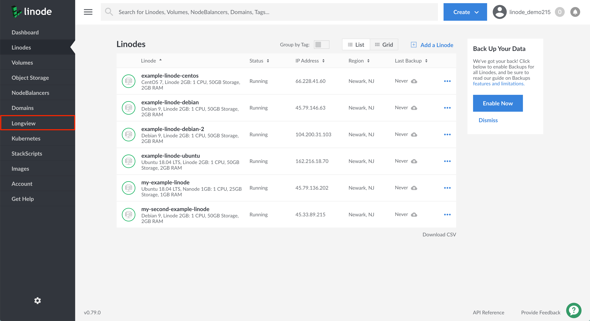

Longview is free for all customers for up to ten clients. You also have the option to purchase **Longview Pro** which includes additional analytics for an added cost. Longview's free version updates every 5 minutes and provides twelve hours of data history. Longview Pro gives you data resolution at 60 second intervals, and you can view a complete history of your Linode’s data instead of only the previous 12 hours.

There are four different Longview Pro plan tiers you can choose from. Each plan varies in the amount of clients that will be monitored by Longview.

## Pricing

| Plan | Clients | Price |
| ---------- | ----------- | ---------- |
| Longview Free | 10 | FREE |
| Longview Pro 3 Pack | 3 | $0.03/hr ($20/mo) |
| Longview Pro 10 Pack | 10 | $0.06/hr ($40/mo) |
| Longview Pro 40 Pack | 40 | $0.15/hr ($100/mo) |
| Longview Pro 100 Pack | 100 | $0.30/hr($200/mo) |

## Viewing and Updating Your Longview Plan


Currently, it is not possible to have both *Longview Free* and *Longview Pro* clients. If you have active Longview clients under the Longview Free plan tier, when you switch to a Longview Pro plan, all of your currently active clients will be counted towards your new Longview Pro plan's client count.


To change your plan level or to view all available Longview Pro plans, follow these steps:

1. Log into the [Linode Cloud Manager](https://cloud.linode.com/dashboard) and click on the **Longview** link in the sidebar.

    

1. Viewing the Longview Clients listing page, click on the **Plan Details** tab.

    

1. On the Longview Plan Details page, you can view all available Longview plans and verify the plan you are currently subscribed to.

     

1. If you would like to change your current plan, select your preferred plan and click on the **Change Plan** button. You will see the page update to denote your current Longview plan.

    
If you change your plan, your Linode's data will temporarily be in a transitional state. Any irregularities in your Linode's displayed Longview data will clear up shortly.
    