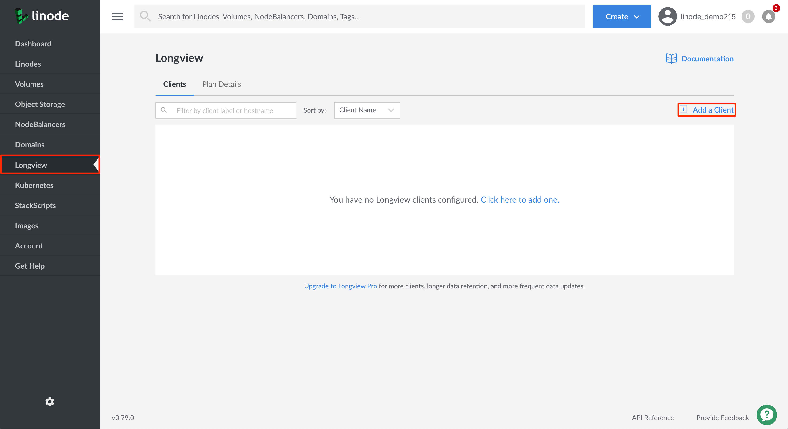
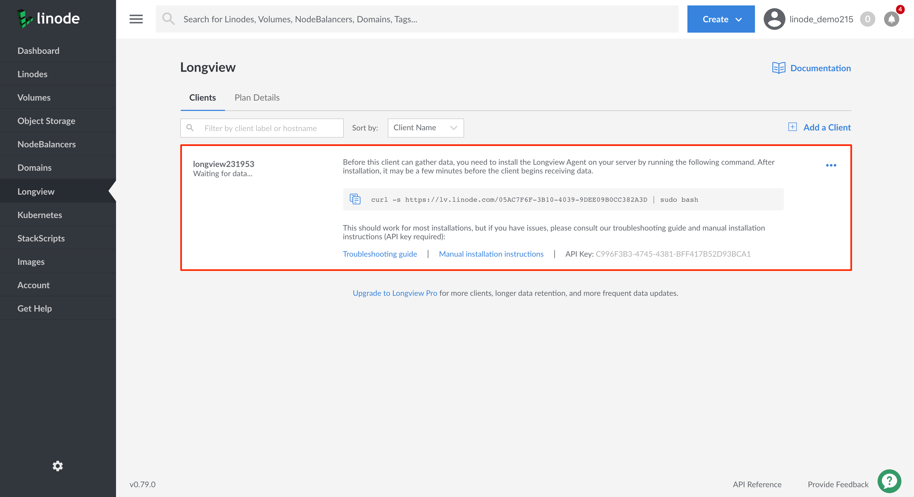
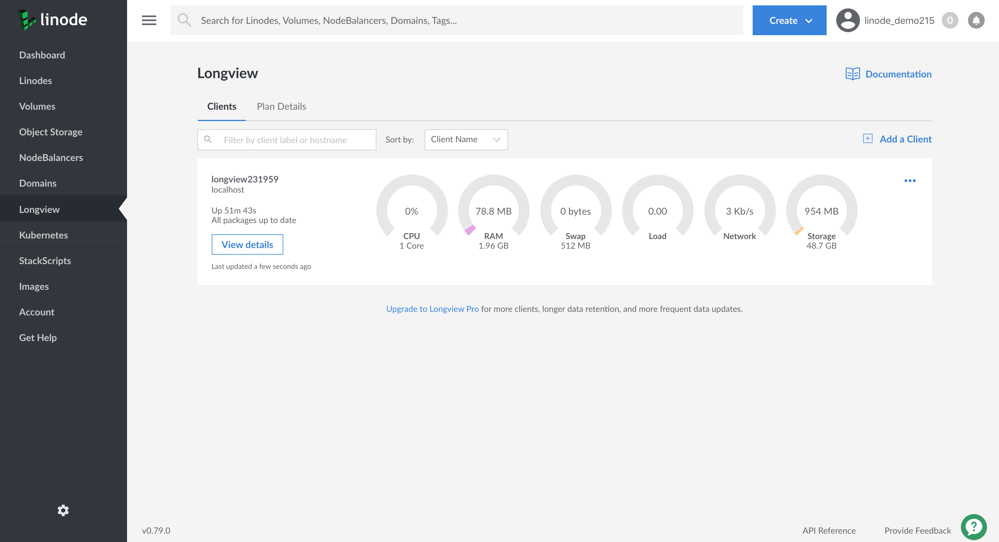
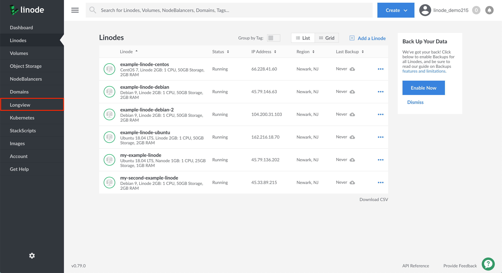
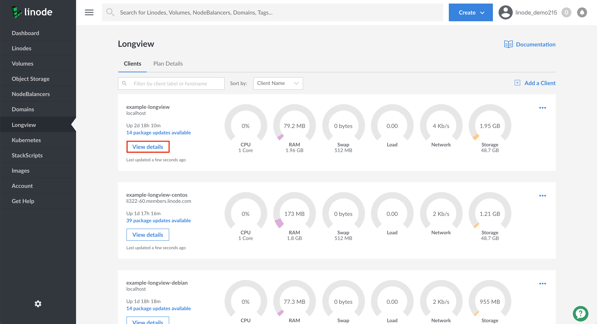
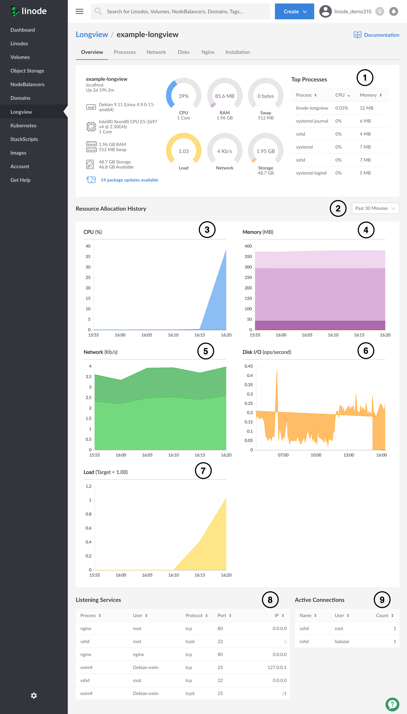
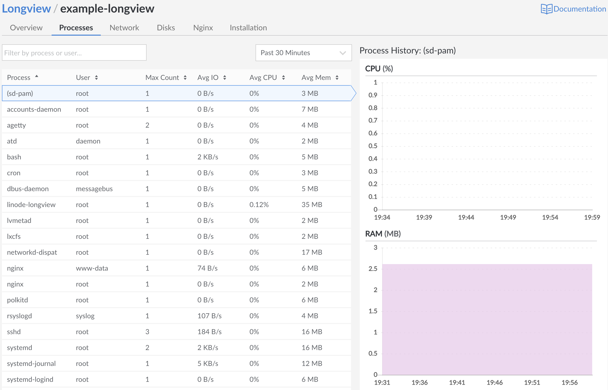
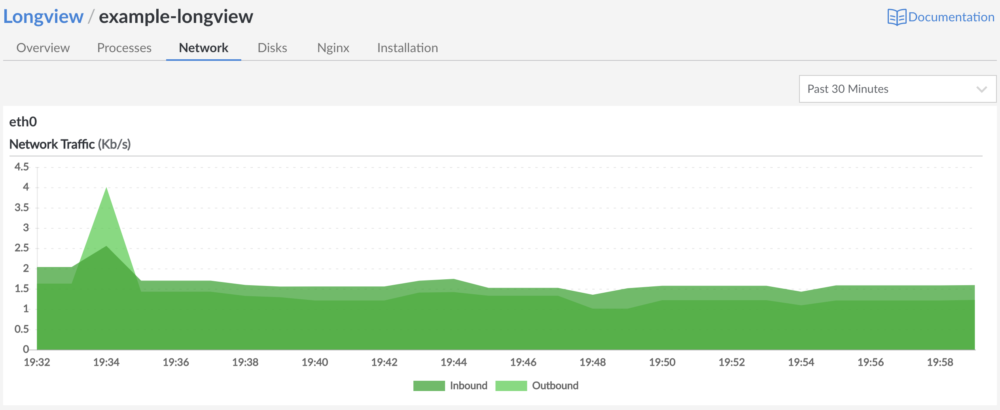
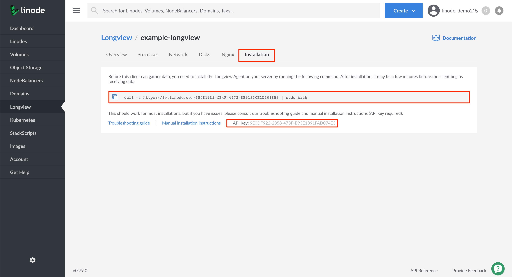
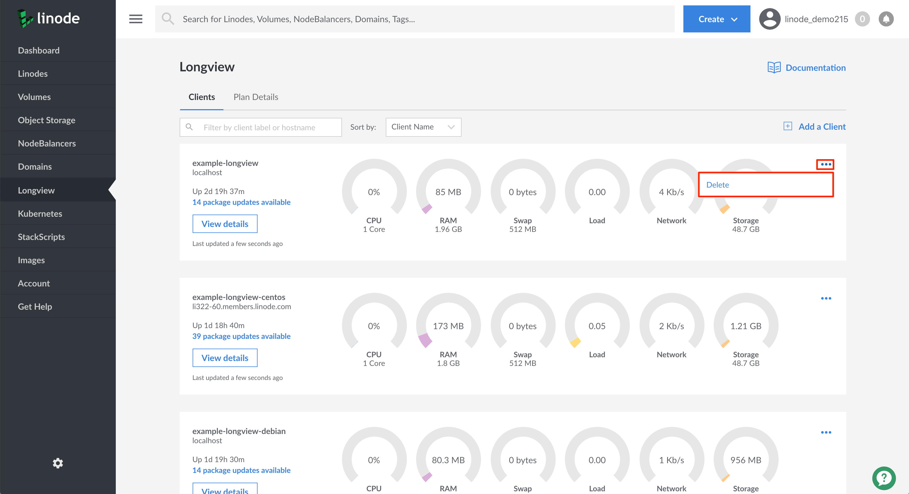

Longview is Linode’s system data graphing service. It tracks metrics for CPU, memory, and network bandwidth, both aggregate and per-process, and it provides real-time graphs that can help expose performance problems.

The Longview client is [open source](https://github.com/linode/longview) and provides an agent that can be installed on any Linux distribution–including systems not hosted by Linode. However, Linode only offers technical support for **CentOS**, **Debian**, and **Ubuntu**.

## In this Guide:

This guide provides an overview of Linode Longview. You will learn how to:

* [Install the Longview Client](#install-linode-longview)
* [Access and view your Longview Client's data and graphs](#longview-s-data-explained)
* [Uninstall the Longview Client](#uninstall-the-longview-client)

## Before you Begin

* In order to monitor and visualize a Linode's system statistics, you will need to install the Longview agent on your Linode. Have your [Linode's IP address](/docs/quick-answers/linode-platform/find-your-linodes-ip-address/) available in order to SSH into the machine and install the Longview agent.

## Install Linode Longview

In this section, you will create a Longview Client instance in the Linode Cloud Manager and then install the Longview agent on an existing Linode. These steps will enable you to gather and visualize important system statistics for the corresponding Linode.

### Add the Longview Client

1. Log into the [Linode Cloud Manager](https://cloud.linode.com/dashboard) and click on the **Longview** link in the sidebar.

1. Viewing the Longview Clients page, click on the **Add a Client** link on the top right-hand corner of the page. This will create a Longview Client instance.

      

1. An entry will appear displaying your Longview Client instance along with its auto-generated label, its current status, installation instructions, and API key. Its status will display as *Waiting for data*, since you have not yet installed the Longview agent on a running Linode.

    
The displayed `curl` command will be used in the [next section](#install-the-longview-agent) to install the Longview agent on the desired Linode. The long string appended to the url `https://lv.linode.com/` is your Longview Client instance's GUID (globally unique identifier).
    

      

### Install the Longview Agent

1. Install the Longview agent on the Linode whose system you'd like to monitor and visualize. Open a terminal on your local computer and log into your Linode over SSH. Replace the IP address with your own [Linode's IP address](/docs/quick-answers/linode-platform/find-your-linodes-ip-address/).

        ssh user@192.0.2.0

1. Change to the `root` user.

        su - root

1. Using your system's package manager update your Linux distribution's packages. See our [Getting Started](/docs/getting-started/#install-software-updates) guide for details on updating your Linode distribution's software.

1. Switch back to the Linode Cloud Manager in your browser, copy the Longview Client instance's `curl` command, and paste it into your Terminal window. Press **Enter** to execute the command. The installation will take a few minutes to complete.

    
Ensure you replace the example `curl` command below with your own Longview Client instance's GUID.
    

        curl -s https://lv.linode.com/05AC7F6F-3B10-4039-9DEE09B0CC382A3D | sudo bash

1. Once the installation is complete, verify that the Longview agent is running:

        sudo systemctl status longview

    You should see a similar output:

    > **CentOS**:
    >
       
    ● longview.service - SYSV: Longview statistics gathering
      Loaded: loaded (/etc/rc.d/init.d/longview; bad; vendor preset: disabled)
      Active: active (running) since Tue 2019-12-10 22:35:11 UTC; 40s ago
        Docs: man:systemd-sysv-generator(8)
      CGroup: /system.slice/longview.service
              └─12202 linode-longview

Dec 10 22:35:11 li322-60.members.linode.com systemd[1]: Starting SYSV: Longview statistics gathering...
Dec 10 22:35:11 li322-60.members.linode.com longview[12198]: Starting longview: [  OK  ]
Dec 10 22:35:11 li322-60.members.linode.com systemd[1]: Started SYSV: Longview statistics gathering.


    > **Debian or Ubuntu**:
    >
    >  
● longview.service - LSB: Longview Monitoring Agent
   Loaded: loaded (/etc/init.d/longview; generated; vendor preset: enabled)
   Active: active (running) since Mon 2019-12-09 21:55:39 UTC; 2s ago
     Docs: man:systemd-sysv-generator(8)
  Process: 2997 ExecStart=/etc/init.d/longview start (code=exited, status=0/SUCCESS)
    Tasks: 1 (limit: 4915)
   CGroup: /system.slice/longview.service
           └─3001 linode-longview
       

    If the Longview agent is not running, start it with the following command:

        sudo systemctl start longview

    Your output should resemble the example output above.

1. Switch back to the Linode Cloud Manager's Longview Clients page in your browser and observe your Longview client's quick view metrics and graph.

    
  It can take several minutes for data to load and display in the Cloud Manager but once it does, you’ll see the graphs and charts populating with your Linode’s metrics.
    

    

### Manually Install the Longview Agent with yum or apt

It’s also possible to manually install Longview for CentOS, Debian, and Ubuntu. You should only need to manually install it if the instructions in the previous section failed.

1. Before completing the steps below, ensure you have [added a Longview Client instance](#add-the-longview-client) using the Cloud Manager.

1.  Add a configuration file to store the repository information for the Longview agent:

    > **CentOS**:
    >
>    Using the text editor of your choice, like [nano](https://www.linode.com/docs/quick-answers/linux/use-nano-to-edit-files-in-linux/), create a `.repo` file and copy the contents of the example file below. Replace `REV` in the repository URL with your CentOS version (e.g., 7). If unsure, you can find your CentOS version number with `cat /etc/redhat-release`.
>    
[longview]
name=Longview Repo
baseurl=https://yum-longview.linode.com/centos/REV/noarch/
enabled=1
gpgcheck=1


    > **Debian or Ubuntu**:
    >
    > Find the codename of the distribution running on your Linode.
    >
    >     root@localhost:~# lsb_release -sc
    >     stretch
    > Using the text editor of your choice, like [nano](https://www.linode.com/docs/quick-answers/linux/use-nano-to-edit-files-in-linux/), create a custom sources file that includes Longview's Debian repository and the Debian distribution codename. In the command below, replace *stretch* with the output of the previous step.
    > 
deb http://apt-longview.linode.com/ stretch main


1.  Download the repository's GPG key and import or move it to the correct location:

    > **Centos**:
    >
    >     sudo curl -O https://yum-longview.linode.com/linode.key
    >     sudo rpm --import linode.key

    > **Debian or Ubuntu**:
    >
    >     sudo curl -O https://apt-longview.linode.com/linode.gpg
    >     sudo mv linode.gpg /etc/apt/trusted.gpg.d/linode.gpg

1.  Create a directory for the API key:

        sudo mkdir /etc/linode/

1.  Copy the API key from the **Installation** tab of your Longview client's [detailed view](#access-your-longview-client-s-detailed-view) in the Linode Cloud Manager. Put the key into a file, replacing the key in the command below with your own.

        echo '266096EE-CDBA-0EBB-23D067749E27B9ED' | sudo tee /etc/linode/longview.key

1.  Install Longview:

    > **CentOS**:
    >
    >     sudo yum install linode-longview

    > **Debian or Ubuntu**:
    >
    >     sudo apt-get update
    >     sudo apt-get install linode-longview

1. Once the installation is complete, verify that the Longview agent is running:

        sudo systemctl status longview

    You should see a similar output:

    > **CentOS**:
    >
    > 
● longview.service - SYSV: Longview statistics gathering
   Loaded: loaded (/etc/rc.d/init.d/longview; bad; vendor preset: disabled)
   Active: active (running) since Tue 2019-12-10 22:35:11 UTC; 40s ago
     Docs: man:systemd-sysv-generator(8)
   CGroup: /system.slice/longview.service
           └─12202 linode-longview

Dec 10 22:35:11 li322-60.members.linode.com systemd[1]: Starting SYSV: Longview statistics gathering...
Dec 10 22:35:11 li322-60.members.linode.com longview[12198]: Starting longview: [  OK  ]
Dec 10 22:35:11 li322-60.members.linode.com systemd[1]: Started SYSV: Longview statistics gathering.
    

    > **Debian or Ubuntu**:
    >
    >  
● longview.service - LSB: Longview Monitoring Agent
   Loaded: loaded (/etc/init.d/longview; generated; vendor preset: enabled)
   Active: active (running) since Mon 2019-12-09 21:55:39 UTC; 2s ago
     Docs: man:systemd-sysv-generator(8)
  Process: 2997 ExecStart=/etc/init.d/longview start (code=exited, status=0/SUCCESS)
    Tasks: 1 (limit: 4915)
   CGroup: /system.slice/longview.service
           └─3001 linode-longview
      

    If the Longview client is not running, start it with the following command:

        sudo systemctl start longview

    Your output should resemble the example output above.

1. Switch back to the Linode Cloud Manager's Longview Clients page in your browser and observe your Longview client's quick view metrics and graph.

    
  It can take several minutes for data to load and display in the Cloud Manager but once it does, you’ll see the graphs and charts populating with your Linode’s metrics.
    

    

## Longview's Data Explained

This section will provide an overview of the data and graphs available to you in the [Longview Client's detailed view](#access-your-longview-client-s-detailed-view).

### Access your Longview Client's Detailed View

1. To view a Longview Client's detailed graphs and metrics, log into the [Linode Cloud Manager](https://cloud.linode.com/dashboard) and click on the **Longview** link in the sidebar.

    

1. Viewing the Longview Clients listing page, click on the **View Details** button corresponding to the client whose Linode's system statistics you'd like to view.

    

1. You will be brought to your Longview client's **Overview** tab where you can view all the data and graphs corresponding to your Linode.

    To learn more about the data available in a Longview Client's Overview page, see the [Overview](#overview) section.

1. From here you can click on any of your Longview Client instance's tabs to view more related information.

    
If your Linode has NGINX, Apache, or MySQL installed you will see a corresponding tab appear containing related system data.
    

### Overview

The Overview tab shows all of your system’s most important statistics in one place. In the **Resource Allocation History** section, you can hover your cursor over any of your graphs to view details about specific data points.

  

1. Basic information about the system, including the operating system name and version, processor speed, uptime, and available updates. This area also includes your system's top active processes.
1. The time resolution for the graphs displayed in the Resource Allocation History section.
1. Percentage of CPU time spent in wait (on disk), in user space, and in kernel space.
1. Total amount of RAM being used, as well as the amount of memory in cache, in buffers, and in swap.
1. Amount of network data that has been transferred to and from your system.
1. Disk I/O. This is the amount of data being read from, or written to, the system’s disk storage.
1. Average CPU load.
1. Listening network services along with their related process, owner, protocol, port, and IP.
1. A list of current active connections to the Linode.

### Processes
The Processes tab will list all running processes currently on your Linode, along with additional statistics including the UID of the user that has ownership of the process, the Max Count of duplicate processes, average I/O per process, average CPU percentage used per process, and average memory consumption per process. Additionally, at the top left of the page, you'll see a search bar you can use to filter the chart by the name of the process or the user that owns it.

You'll also see a number of graphs which display a history of resource consumption for the selected individual process. Historical values located on your graphs include CPU usage, RAM, the "count" of duplicate processes that are or were opened, and disk I/O. Additionally, the length of time you're observing with these graphs can be set in the dropdown menu found at the top right of the page and vary depending on your version of Longview.

To change which process your charts are currently observing, click on any process that's listed in the chart.

### Network

The network tab gives you access to charts you can use to sort traffic analytics by network interface available on your Linode. To see a wider range of data than the default of 30 minutes, select the dropdown menu to the top right of the page and select a range of your choice.


The information gained from the network tab can only go as far back as the date that Longview was added.


### Disks

The disks tab includes information on disk I/O, disk space usage, and [inode](https://en.wikipedia.org/wiki/Inode) usage over time. To see a wider range of data than the default of 30 minutes, select the dropdown menu to the top right of the page and select a range of your choice.


Longview does not gather data on swap disks.


### NGINX, Apache, and MySQL(Optional)
Longview also includes support for both NGINX and Apache webservers, as well as the MySQL database. When Longview detects that either is running on your Linode, the tabs will appear within the Longview section of your Cloud Manager. For more information on these optional tabs and for troubleshooting steps, see our guides for, [Longview for Nginx](/docs/platform/longview/longview-app-for-nginx/),  [Longview for Apache](/docs/platform/longview/longview-app-for-apache/), and [Longview for MySQL](/docs/platform/longview/longview-app-for-mysql/) .

### Installation

The Installation tab provides quick instructions on how to install the Longview agent on your Linode and also displays the Longview client instance's API key.

  

## Uninstall the Longview Client

1.  Log into the [Linode Cloud Manager](https://cloud.linode.com/dashboard) and click on the **Longview** link in the sidebar.

      

2.  Click the **ellipsis** button corresponding to the Longview Client instance you'd like to remove and select **delete**.

      

4.  Next, remove the Longview agent from the operating system you want to stop monitoring. SSH into your Linode.

        ssh user@192.0.2.0

5.  Remove the `linode-longview` package with the command appropriate for your Linux distribution.

    > **CentOS**:
    >
    >     sudo yum remove linode-longview

    > **Debian or Ubuntu**:
    >
    >     sudo apt-get remove linode-longview

    > **Other Distributions**:
    >
    >     sudo rm -rf /opt/linode/longview

## Next Steps

- [See our Longview Pricing and Plans Guide](/docs/platform/longview/pricing/)
- [Set up Longview for NGINX](/docs/platform/longview/longview-app-for-nginx/)
- [Set up Longview for Apache](/docs/platform/longview/longview-app-for-apache/)
- [Set up Longview for MySQL](/docs/platform/longview/longview-app-for-mysql/)
- [Troubleshoot Linode Longview](/docs/platform/longview/troubleshooting-linode-longview/)
