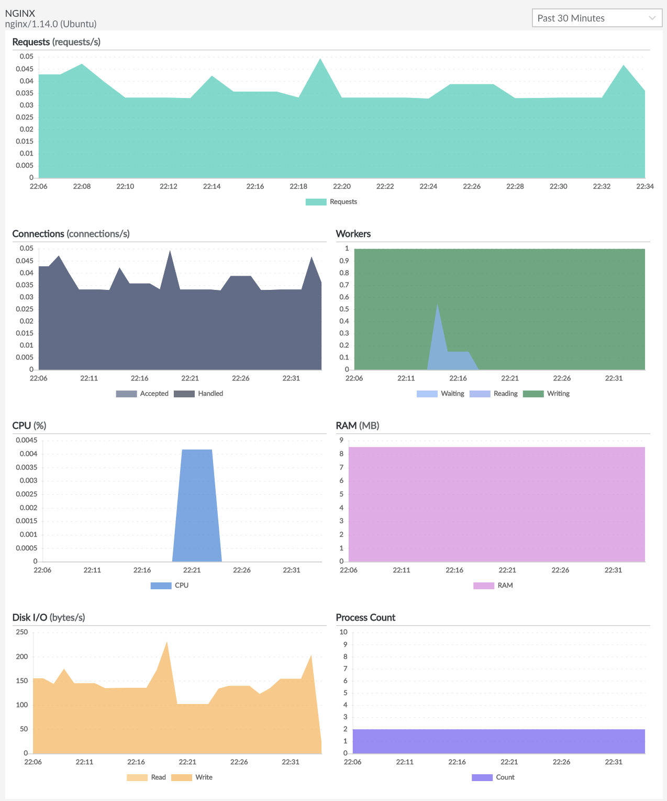

Longview for NGINX is a Longview App. The Longview NGINX tab appears in the Linode Cloud Manager when Longview detects that you have NGINX installed on your Linode. With the Longview NGINX App, you'll be able to view statistics for NGINX on your Linode. It can help you keep track of NGINX's settings, workers and requests, system resource consumption, and other information.

## In this Guide

This guide discusses Linode Longview for NGINX. The guide covers the following topics:

- [Configuring Linode Longview for NGINX](#debian-and-ubuntu-automatic-configuration).
- [Interacting with the NGINX data provided by Longview in the Linode Cloud Manager](#viewing-statistics).
- [Troubleshooting Linode Longview for NGINX](#troubleshooting).

## Before you Begin

In order to use the Longview App for Apache, ensure you have completed the following things:

-  A Linode with [NGINX installed and running](/docs/web-servers/nginx/).
-  Create a [Longview client](/docs/platform/longview/what-is-longview/#install-linode-longview) instance using the Cloud Manager.
-  Install the [Longview Agent](/docs/platform/longview/what-is-longview/#install-the-longview-agent) on your Linode.

### Debian and Ubuntu Automatic Configuration

If NGINX is installed and running when you install the Longview client, the NGINX App should enable and configure itself automatically.

If you already have Longview installed, you may find that NGINX is not automatically detected by Longview on initial setup. If this is the case, you can run Longview through its automatic configuration sequence again. Depending on how [NGINX's status module](http://nginx.org/en/docs/http/ngx_http_stub_status_module.html) is configured, it will either find everything it needs to get the NGINX App started, or it will pop up a request to make some additional configurations. Your existing Longview data will stay safe during the automatic configuration process.

1. [SSH into your Linode](/docs/getting-started/#connect-to-your-linode-via-ssh) whose system you are monitoring with Longview.

1.  Ensure that NGINX is running:

        sudo systemctl status NGINX

2.  Run the automatic Longview configuration command on your Linode:

        dpkg-reconfigure -phigh linode-longview

3.  For most people, this will prompt a popup asking whether you would like Longview to attempt an automatic configuration of the NGINX status module.

    

    
It's also possible that Longview will be able to locate the status page on its own. In that case, you won't get the popup, and you can go directly to Step 5.


4.  This popup occurs when Longview can't locate the NGINX status page. In turn, this could indicate that the status page is in an unusual and unspecified location, or that the status module isn't enabled, or that NGINX itself is misconfigured. Select one of the options:

    -   **\<No\>**: the Longview tool will quit, and you can do a [manual configuration](#manual-configuration-all-distributions), which is safer if you have a delicate NGINX setup.
    -   **\<Yes\>**: the Longview tool will attempt to enable the status module, set the status page location in a new vhost configuration file, and restart NGINX. This option is easier, but has the potential to disrupt your current NGINX configuration. If you choose yes, and the configuration is successful, you should see output similar to the following:

        
[ ok ] Stopping Longview Agent: longview.
Checking Nginx configuration...
Restarting nginx: nginx.
Finished configuring nginx, writing new configuration to /etc/linode/longview.d/Nginx.conf
[ ok ] Starting Longview Agent: longview.
update-rc.d: using dependency based boot sequencing
        

        
The automatic configuration sets the status page location to `http://127.0.0.2/nginx_status`.
        

        Refresh Longview in the Cloud Manager to verify that the NGINX tab is now present and collecting data for your Longview client instance.

        If instead you received a failure message similar to the output example, you will need to double-check your NGINX installation, and then do a [manual configuration](#manual-configuration-all-distributions). You can also visit the [Troubleshooting](#troubleshooting) section at the end of this article.

        
[FAIL] Reloading web server config: nginx failed!
        

### Manual Configuration (All Distributions)

To enable the NGINX Longview app manually:

1. [SSH into your Linode](/docs/getting-started/#connect-to-your-linode-via-ssh) whose system you are monitoring with Longview.

1.  Add the following lines to your NGINX configuration to enable the status module and set the location of the status page. The lines should be placed within your main configuration file's `http` block (`/etc/nginx/nginx.conf`) or in a separate [site configuration file](/docs/web-servers/nginx/slightly-more-advanced-configurations-for-nginx/#host-multiple-websites).

    
server {
    listen 127.0.0.1:80;
    server_name 127.0.0.1;
    location /nginx_status {
        stub_status on;
        allow 127.0.0.1;
        deny all;
    }
}



2.  Restart NGINX:

        sudo systemctl restart nginx

3.  Edit `/etc/linode/longview.d/Nginx.conf` to look like the following:

    
location http://127.0.0.1/nginx_status



4.  Restart Longview:

        sudo systemctl restart longview

5.  Refresh Longview in the Cloud Manager to verify that the NGINX tab is now present and collecting data for your Longview client instance.

You should now be able to see Longview data for NGINX. If that's not the case, proceed to the [Troubleshooting](#troubleshooting) section at the end of this article.

## Viewing Statistics

To see the output for the Longview Nginx App:

1.  Log in to the [Linode Cloud Manager](https://cloud.linode.com/).
1.  Click on the **Longview** link in the sidebar.
1.  Select the Longview client instance whose NGINX data you'd like to view.
1.  Select the **Nginx** tab.

    

    You'll see the current version of NGINX listed on the upper left-hand side of the page.

    Mouse over a data point to see the exact numbers for that time. With [Longview Pro](/docs/platform/longview/pricing/), you can view older time periods for your data. The next sections cover the Longview Nginx App in detail.

### Requests

The **Requests** graph shows the total number of requests NGINX handled at the selected time. This is every HTTP and HTTPS request to your Linode.

### Connections

The **Connections** graph shows the amount of data that NGINX accepted and handled via web requests at the time selected.

### Workers

The **Workers** graph shows all of the NGINX workers at the selected time. The workers are broken down by state:

-   Waiting
-   Reading
-   Writing

### CPU

The **CPU** graph shows the percentage of your Linode's CPU being used by NGINX at the selected time. If you want to see the total CPU use instead, check the [Overview tab](/docs/platform/longview/what-is-longview/#overview).

### RAM

The **RAM** graph shows the amount of RAM or memory being used by NGINX at the selected time. If you want to see your Linode's total memory use instead, check the [Overview tab](/docs/platform/longview/what-is-longview/#overview).

### Disk IO

The **Disk IO** graph shows the amount of input to and output from the disk caused by NGINX at the selected time. To see the total IO instead, visit the [Disks tab](/docs/platform/longview/what-is-longview/#disks).

### Process Count

The **Process Count** graph shows the total number of processes on your Linode spawned by NGINX at the selected time. If you want to see more details, and how this stacks up against the total number of processes on your Linode, see the [Processes tab](/docs/platform/longview/what-is-longview/#processes).

## Troubleshooting

If you don't see Longview data for Nginx, you'll instead get an error on the page and instructions on how to fix it. As a general tip, you can check the `/var/log/linode/longview.log` file for errors as well.

### Unable to Access Server Status Page for NGINX

The error will state `Unable to access server status page (http://example.com/example) for Nginx: <error>`. This error occurs when NGINX's status setting is disabled or has been changed from the default location.

 
This error occurs when Longview attempts to check the status page `location` listed in `/etc/linode/longview.d/Nginx.conf`, or the default page at `http://127.0.0.1/nginx_status`, but receives a non-200 HTTP response code. Basically, it means that the status page Longview is checking doesn't exist.


To fix this, follow these steps:

1.  Make sure NGINX is running:

        sudo systemctl restart nginx

2.  Check the status page location, and make sure it's available over Port 80. The default location Longview checks is `http://127.0.0.1/nginx_status` on localhost, but NGINX doesn't typically have a status page location set up by default. In the NGINX configuration file (typically `/etc/nginx/nginx.conf`) or in a [separate site configuration file](/docs/web-servers/nginx/slightly-more-advanced-configurations-for-nginx/#host-multiple-websites), this is designated with the lines in the example file below. If your configuration file does not contain these lines, add them to the file within the `http` block. For more details, see the [Manual Configuration](/docs/platform/longview/longview-app-for-nginx/#manual-configuration-all-distributions) section of this guide.

    
server {
    listen 127.0.0.1:80;
    server_name 127.0.0.1;
    location /nginx_status {
        stub_status on;
        allow 127.0.0.1;
        deny all;
    }
}



3.  Longview is designed to check the default location automatically. If you use the default location shown above, you should be done. Refresh Longview in the Cloud Manager to verify that the NGINX tab is now present and collecting data for your Longview client instance.

4.  If you're not using the default location, you need to create a new file, `/etc/linode/longview.d/Nginx.conf`, and set the `location` variable to match what you set in the NGINX configuration file:

    
location http://127.0.0.1/url-goes-here



5.  Restart Longview:

        sudo systemctl restart nginx

6.  Refresh Longview in the Cloud Manager to verify that the NGINX tab is now present and collecting data for your Longview client instance.

 
If you originally compiled NGINX without the status module, you will need to recompile it with `--with-http_stub_status_module` and all your other settings. Then go back and try to enable the Longview Nginx App.


### The NGINX Status Page Doesn't Look Right

The error will state `The Nginx status page doesn't look right. Check <http://example.com/example> and investigate any redirects for misconfiguration.` This error occurs when Longview is able to reach the status page, but doesn't receive the expected content.

 
This error occurs when Longview attempts to check the status page, and receives a 200 HTTP response code, but can't scrape the expected status content from the page. That is, the page exists on your Linode, but it doesn't have the right content. If, for example, Longview was to check your website's home page, you would get this error.


To resolve this issue, follow these steps:

1.  Visit the URL shown in the error. See if it directs or redirects you to a page that isn't the NGINX status page.
2.  Update your NGINX and Longview settings so that they specify the same status page location:

    -   The **server_name** and **location** lines in your NGINX configuration file. See the [Manual Configuration](#manual-configuration-all-distributions) section for more details.
    -   The **location** line in `/etc/linode/longview.d/Nginx.conf`

    If the location line isn't set in `/etc/linode/longview.d/Nginx.conf`, Longview will check the default location of `http://127.0.0.1/nginx_status` on localhost.

3.  Make sure there aren't any NGINX redirects or other settings that are affecting this page.
4.  Restart Longview:

        sudo systemctl restart longview

5.  Refresh Longview in the Cloud Manager to verify that the NGINX tab is now present and collecting data for your Longview client instance.

### NGINX Tab is Missing

If the Longview Nginx tab is missing entirely, this indicates that NGINX is either not installed, or has stopped. If you restart NGINX, you will be able to see the tab again and view all of your old data.
