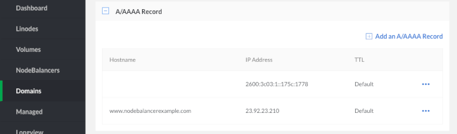
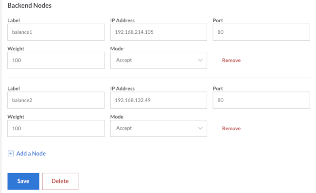

Nearly all applications that are built using Linodes can benefit from load balancing, and load balancing itself is the key to expanding an application to larger numbers of users. Linode provides NodeBalancers, which can ease the deployment and administration of a load balancer.

This guide provides a high-level overview setting up a NodeBalancer, but it's outside this page's scope to explain each application a NodeBalancer could balance. For more information on various applications that might be useful behind NodeBalancer, see the rest of [Linode Guides & Tutorials on NodeBalancers](/docs/platform/nodebalancer/).

## Configuring a NodeBalancer



### A Note about Virtual Hosts

You might not see the web application that you expect when you go directly to the NodeBalancer's IP address. This is due to virtual hosts, and is not an issue unique to NodeBalancers. In the default configurations of many web servers, an application might only be configured to respond for certain hostnames. This can impact testing NodeBalancers as well as the behavior of their health checks.

It is important to configure the "default" virtual host in your web server to point at something useful. The NodeBalancer will pass the Host header from a browser untouched, so virtual hosts will work entirely normally once you are pointing a domain at the NodeBalancer. It is only mentioned here because testing NodeBalancers can demonstrate quirks in a web server's configuration, particularly when browsing by the NodeBalancer's IP address.


Health checks are transmitted with a Host header (in HTTP/1.0 mode).


## Putting the NodeBalancer in Charge

Your NodeBalancer is now working and is able to pass traffic to your web application. It is important to note at this point that configuring the NodeBalancer has not impacted your application's normal operations at all -- you can test the NodeBalancer without your users ever knowing.

Once you are satisfied that NodeBalancer is working normally, you can switch your web application's traffic over to it through DNS.

1.  On the NodeBalancer's overview, you can see its IP address. Take note of the IP address, to use in the A record for your domain.

1.  Edit or create an A record for your website's domain name, pointing to your NodeBalancer's IP address.

    

1.  Also add an AAAA record for the IPv6 address.

Once the DNS changes propagate, traffic will begin flowing through the NodeBalancer. At this point, you will want to wait up to 24 hours for all caches to catch up to the NodeBalancer before proceeding.

## Additional Backends and Features

On another Linode, make an exact copy of your current web server. The [Linode Backups](/docs/platform/disk-images/linode-backup-service/) service can be instrumental for doing so, as a snapshot can be restored to any other Linode. Once you have another backend ready, simply repeat step four of [Configuring a NodeBalancer](/docs/platform/nodebalancer/getting-started-with-nodebalancers/#configuring-a-nodebalancer) to add it to the NodeBalancer configuration.

Once the configuration is sent to the backend, users will be balanced over the two Linodes and each will be monitored for health. This configuration is easy to work with, as upgrades can be rolled out to each backend without disrupting service and backend Linodes can be taken in and out of rotation at will.

This is just the beginning; NodeBalancers are extremely flexible and cater to a lot of needs. From here, the API can be used to add many backends. Multiple ports on one backend can be balanced for complex setups. Additionally, new tools like *memcached* can be introduced to the application to allow session stickiness to become irrelevant.

## Limitations

Nodebalancers have a maximum connection limit of 10,000 concurrent connections.
