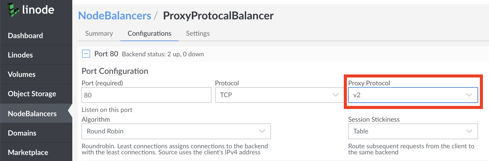

When a Linode NodeBalancer passes a request from a client to a backend Node, information regarding the original client is not included by default. While this is fine for many environments, your applications may require original client information such as IP address or port. For these cases, Linode NodeBalancers support **Proxy Protocol** for TCP connections so that you can pass client information to backend Nodes.

## What is Proxy Protocol

Proxy Protocol is an internet protocol for various high availability and load balancing solutions to carry information about a client directly to backend servers.

When selecting **TCP** as your NodeBalancer protocol, you can enable **Proxy Protocol** to add a header containing client information to backend Nodes.


[Backend Nodes](#configure-backend-node-proxy-protocol) must also have Proxy Protocol enabled on supported applications to receive the client information header.


Currently, there are two available versions of Proxy Protocol, **v1** and **v2**:

- **v1**: Proxy Protocol v1 adds a human readable string to all requests, similar to the following:

    
PROXY TCP4 192.0.2.0 203.0.113.0 56147 80
    

    The syntax for this output is as follows:

      PROXY, PROTOCOL, CLIENT_IP, NODEBALANCER_IP, CLIENT ORIGIN PORT, NODEBALANCER PORT

- **v2**: Proxy Protocol v2 adds a more efficient binary data header to all requests, similar to the following:

  
\r\n\r\n\x00\r\nQUIT\n!\x11\x00\x0c\xach\x11\x05\xcf\xc0D8\xfe\x1e\x04\xd2
  

More information on **v1** and **v2** is available in the [Proxy Protocol Specification](http://www.haproxy.org/download/1.8/doc/proxy-protocol.txt).

## Configure NodeBalancer Proxy Protocol

To enable Proxy Protocol for your Linode NodeBalancer:

1.  Visit the NodeBalancers page in the Linode [Cloud Manager](http://cloud.linode.com).

1.  Select the desired NodeBalancer, or [Create and Configure a New One](/docs/platform/nodebalancer/nodebalancer-reference-guide/#adding-a-nodebalancer) using TCP mode.

1.  Select the **Configurations** tab for your NodeBalancer followed by the desired configuration.

1.  Ensure that the **Protocol** option is set to **TCP** to access the **Proxy Protocol** dropdown menu. Select the desired Proxy Protocol version.

    

1.  Click the **Save** button on the bottom of the page to Save your changes.

## Configure Backend Node Proxy Protocol

Once Proxy Protocol is configured for your NodeBalancer, ensure that it is also enabled for the receiving software on your backend Nodes. You can find a list of compatible software in the [Proxy Protocol documentation](https://www.haproxy.com/blog/haproxy/proxy-protocol/).

Here are links to guidance for enabling Proxy Protocol for common software:

-   [NGINX](https://docs.nginx.com/nginx/admin-guide/load-balancer/using-proxy-protocol/)
-   [Apache](https://httpd.apache.org/docs/2.4/mod/mod_remoteip.html)
-   [MySQL/MariaDB](https://mariadb.com/kb/en/proxy-protocol-support/)
