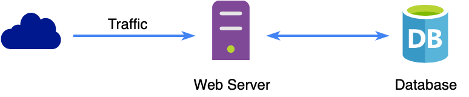
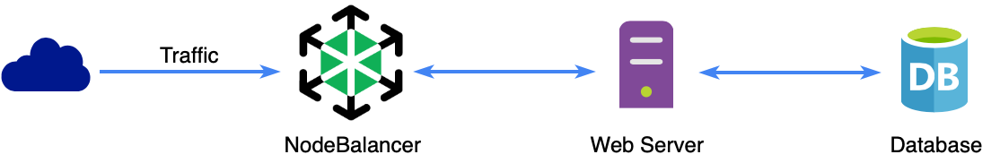

Load balancing allows you to distribute incoming network traffic across multiple servers so that no one server takes on all the demand. This allows high traffic sites and applications to field a large number of users without performance degradation. It also allows you to scale a site or application by adding more servers as your need grows, or remove them if your need diminishes.

Linode offers load balancers as a service (LBaaS) called NodeBalancers. NodeBalancers are built for high availability and designed to be maintenance free after initial configuration.

This guide provides a high-level overview of NodeBalancers. To set-up a NodeBalancer, see the [Getting Started with NodeBalancers](/docs/platform/nodebalancer/getting-started-with-nodebalancers) guide.

## Overview

A NodeBalancer is assigned its own public IP address where it will listen for incoming connections. Then, using configurable rules, it routes the connection to one backend node (out of one or more). A NodeBalancer allows the incoming traffic load to your application to be spread over any number of Linodes.

### A Non-Load Balanced Configuration

In a standard non-load balanced configuration, traffic comes into a server directly. The application or site might be connected to a database or other services, but the server takes care of all traffic. If the traffic becomes unmanageable, load times may become long and the site may even go down. Additionally, any modifications that require updating DNS will inflict downtime for the user.

### A Simple Load Balanced Configuration

When using a load balancer, like a NodeBalancer, traffic comes to the site through the load balancer first. It's then managed before reaching the Linode. In addition to balancing traffic load, NodeBalancers also offer features like [SSL termination](https://en.wikipedia.org/wiki/TLS_termination_proxy). NodeBalancers alleviate this burden from the server allowing them to be faster at other tasks, like serving pages. Therefore, even with only one server on the backend, having a NodeBalancer in front of your server can be an advantage.

### A Highly Available Load Balanced Configuration

The optimal solution for a highly available site or application is to have multiple Linodes behind a NodeBalancer. Now when traffic comes into the NodeBalancer it can be routed to any one of the Linodes available.

- [Health checks](/docs/platform/nodebalancer/nodebalancer-reference-guide/#health-checks) are performed to make sure that requests are only routed to healthy Linodes.
- Backend Linodes can be added or removed to the configuration seamlessly, without end users noticing any downtime.
- Configuration be added to ensure the same client requests are routed to the same backend Linode, this is called [sticky sessions](/docs/platform/nodebalancer/nodebalancer-reference-guide/#session-stickiness).

## Limitations

- Nodebalancers have a maximum connection limit of 10,000 concurrent connections.

## Next Steps

For more on NodeBalancers see the [Getting Started with NodeBalancers](/docs/platform/nodebalancer/getting-started-with-nodebalancers/) guide and the [NodeBalancer Reference](/docs/platform/nodebalancer/nodebalancer-reference-guide/) guide.
